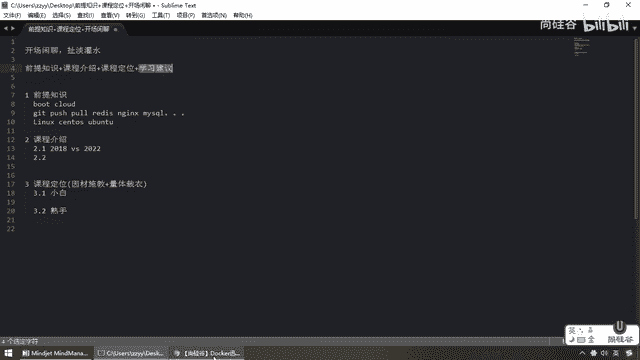

# 尚硅谷Docker实战教程（docker教程天花板） P1 - 01_教程简介 - 尚硅谷 - BV1gr4y1U7CY

各位同学，各位网友，ladies and 乡亲们，大家好，我是上规股中央老师江湖ID，阳哥，很高兴也很荣幸，本次有机会为大家带来一门新课，Docker与威服务实战2022新版，那么熟知阳哥风格的。

都会晓得，我第一讲都要通过聊天的形式给大家说一下前沿介绍和我们的开篇闲聊，那么主要是向大家介绍一下Docker这门课程你所要具备的前提知识，以及我们的大肝，以及给大家一些中肯的学习建议，好。

那么大家请看一下我们的大肝名字，叫什么Docker与什么，威服务，好，那么自然而然，希望你能看到这门课程的时候，对于Boot，那么也就是我们的Sprint Cloud等等，对吧。

你已经熟悉并安装调试配通过，那么假设我现在写一个Git push，Pool，对吧，Redis，Nginx，Mycircle，对于这些内容你也是如数加真，那么基于Linux下面的。

比方说SantaEras虚拟机这些概念，比方说Ubuntu这样的Linux你也已经知道，那么看到这儿的同学，我默认这些你应该知其然了，OK，我们默认你懂了，我也就不再赘述，OK，这是我们的前提知识要求。

毕竟是到我们后面高阶部分知识相关的学习。

那么接下来我们来看一下，如果是资深股份的话，可以看到，应该了解到这门课，我们上规股官方在2018年的时候就有我给大家讲解了Docker的什么篇，基础篇，这是快速上升，那没想到四年以后Docker。

K8s，云原生等等，越来越火爆，那几乎是目前的主流，单下要求的最需要的技术，大家必须要更加进一步深度的学习，那么与之两门课程相关对比，我们的新版和18版有什么区别呢，那么大家请看。

对于我们2022版基础篇和什么高级篇，上下两级两块构成，所以说之前有的22版都有，之前没有的新版更有，那么对于我们已经有的内容做了更加细致深度的讲解，对于没有的，也带大家进行了提高篇的阐述和说明。

希望大家能够跟着阳哥把2022全部走下来，可以这么讲，也希望大家不管你是零基础还是用过Docker的。

直接可以从2022版开始学习。

OK，那么在这我们对于2018和我们的2022版做一个详尽的说明，好，那么接下来也给我们的股份和我们其他的同学做一个中肯的学习建议，注意，基础非常重要。

我们现在学习Docker更多的是为了成为一个目前最主流的原生基础平台下面的加碼架构师。

或者是高级开发工程师等等，那么大家都清楚，目前一切在云端，万物皆容器是目前的主流环境了，所以说希望大家能够学完我的Docker以后，可以继续去学习雷凤阳老师的K8S，那么熟悉我们两个的都清楚。

比如说凤阳老师的Spring Boot，完了以后一定要继续学习中央老师的Spring Cloud，这两块请大家务必给我拿下，那么好，完成这个以后，我们大家就应该明白我们第二个作用也属于我们的K8S。

打一个基础。

好，那么第三个我们来看看我们的大杆，那么对于我们的基础片，大家请看，写的很清晰，定位是谁，如果你是零基础，那么希望大家不要跳过，从头学到尾，OK，好，那么接下来我们梳理一下我们的大杆。

那么对于我们的基础片，主要是Docker的简介，它是什么，能干什么，它解决了哪些痛点，怎么出来的，然后相应的安装，对于操作Docker的传用命令以及进项，主要是讲解联合文件系统，好。

那么完了以后大家都清楚，目前你绝对不可能是自己一个人干，一定要进行什么，你进行什么，你进行的交货，那么对于远程扩，我们以阿里云，对于公司自己内部的，我们要学会搭建私有的Docker Hub，在你们公司。

那么一组，一层，或者一内，一外，一丝，一公，那么都需要大家能够进行学会的构建，完了以后，对于容器卷，那么你如何实现宿主机和我们容器实力相关数据的交互。

那么最终我们在Docker上要学习安装我们常用的中间键，MyCircle，Ratis，Nginx，一切放到容器里面，这些常规安装给大家进行介绍，那么除此之外，还给大家准备了什么，高阶片。

那么通过我们大产的调研，单说Docker这个范围以内，一般有，如果你们公司业务不复杂，也不用立刻去上K8S，那么Docker是百分百需要的，所以说大家留言，那么这块高级片给大家说明什么呢。

第一个Docker的什么，复杂安装，比如说之前的这些常规安装，那么可能都是基于单机版的一个容器实力，那么要是多了呢，走起来，比如说MyCircle集群，在Docker上跑一下主动复制，最经典的一组一层。

那么接下来，比如说阿里腾讯的大产高阶设计案例题，1到3一条数据请你构建一个数据缓存，直白了，肯定是让你构建分布式缓存，那么用Redis单机肯定不行，那么分布式百分之百要牵扯到多组多重，好，这是第一个。

如何搭一个三组三层，那么再来如何扩容，如何缩容，如何再把它容器化，这个给大家进行了详细的案例说明，那么接下来结合我们的大杆主题Docker与微服务，那么自然而然，兄弟们，Spring Boot。

Spring Cloud开发出来的Java代码，最终要打包物属层镜像，发布到容器上面，那么结合我们DockerFi，怎么来进行本地镜像的构建，如何进行发布，发布到哪。

那么是不是我们的阿里云或者是本公司的私有库啊，好，那么完活以后，随着我们Docker的容器越来越多，你如何编排，如何管理，如何进行网络的规划和设计，那么在这块给大家讲解的集群环境下面。

Docker网络模块，桥接还是主机等等，那么如何通过Compose来进行我们容器化的，一键上线，暗部编排，一键发布，一键部署，这是也是什么，非常有用的技术，那么最终如果你的Docker优惠服务上线以后。

百分之百牵扯到我们的什么，容器的监控和统计，数据的图形化展现，所以说我们的轻量级工具Portana运运而生，那么当然你们公司比较猛，那么Cadevisor，InflexDB和Grafa。

CIG这样的重量级监控，你也可以给它部署过来，那么自然而然可以帮助大家获得更多生产力的提升。

好，那么这个就是我们大竿相关，给大家做一个简单的介绍，那么最后多说一句，课程定位由于部分同学已经懂Docker了，那么所以说我们这儿因材施教，量体才一，我们呢，一条命令来说一下。

假设我现在写Docker run-d-p8080，那么再8080，他们看它，你们对于这条命令，这个探索你都明白是什么。

那么希望各位同学。

我就不再浪费你的时间，你直接可以从高阶篇开始学习。

OK，如果上面写的命令你不熟悉，那么希望各位同学不要跳过，扎好马步一步一步的从小白到熟手，OK，好，那么所以说希望大家能够跟着阳哥顺顺利利的把这门课打通宽，毕竟读万卷书不如行万里路。

行万里路不如明师指路，那么期待大家也欢迎大家来到上硅谷，接受我们老师的关注，我们在硅谷等着大家，OK，好，那么接下来呢，我们将从基础片给大家介绍一下Docker。

再次感谢大家对上硅谷的关注。

