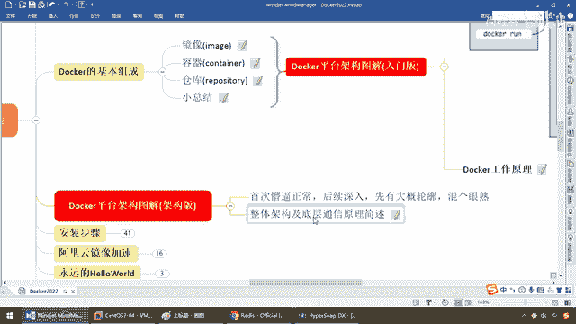
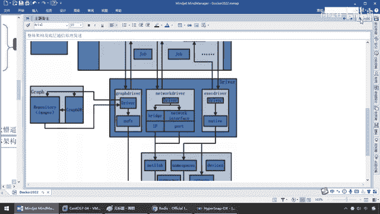
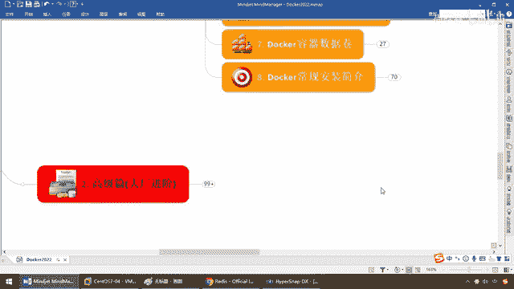
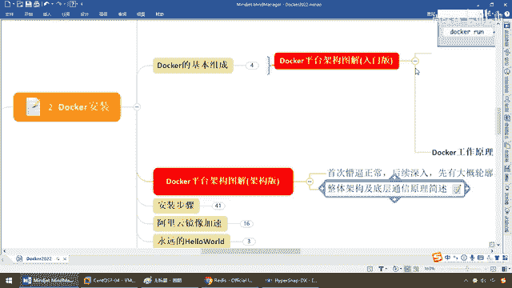

# 尚硅谷Docker实战教程（docker教程天花板） P10 - 10_docker平台架构图解 - 尚硅谷 - BV1gr4y1U7CY

好，同学们，我们继续上一讲完成了Docker平台架构的入门级别，以及三要素配合的一个图解和Docker的粗浅的工作原理，那么接下来我们深一步，那么各位可能零基础的小白稍微会痛苦一点。

那么在这块可能你会吃点苦头，别着急，我不得不按照教学诚善起下，毕竟这是什么一篇，零基小白，我们讲这个是为了给后面的大场片来做一个铺垫，那么来，大家看一眼，你该不会认为这个就是Docker。

你会觉得它很简单，对吧，你会觉得，无非就是三个元素，就这么点东西，难着呢，放心，杨哥要是研究的东西如果真是和我以前讲的一样，那我是丢不起这个人的，那么接下来，楼也，架构吧。

那么Docker它到底有什么构成，长什么样，所以说，来，首次听，你可能是懵逼的，各位小白，别着急，一步步来，我会深度的讲解多次，后续我们再深入，先有个大概轮廓，先混个眼熟，那么现在这个架构图。

更近一步的话，我们需要对Docker的整体架构和底层通信原理。

来给大家做一个简单的介绍，首先Docker是一个CS模式的架构，后端是一个松散的偶合架构，注意，什么鬼，这么多模块，各司其职，有点像我们的Spring，全家桶一样，有什么Spring VC构成。

有什么Warp，Spring Batch，等等等等，各种构成，那么所以说，在这块复习一下，读一遍，Docker是一个CS的结构，后台守护进程，然后连接上来，那么连接上来以后。

我们发布了Docker的客服端命令，操纵Docker的，后台守护进程，Docker引擎去干，那么他干了些什么事，有哪些呢，来，首先第一步，用户用Docker的客户端，就是命令含窗口。

与Docker后台守护进程建立通信，索克通信，并发送请求给后者，比如说，就是前面的什么，Docker Build本地的这些东西，构建成一个进线，拉从远程库拉个进线，或者运行一个，容器实力，那么所以说呢。

过来吧，第一步，大家请看啊，别着急，那么不烦，可以先看一下，这个是Docker的整体架构图，那么等着我一点点给大家介绍，第一遍听不懂，没关系，先混个眼熟，那么来，Docker Client，对吧。

Docker的命令含，那么连上了我们Docker的引擎，这个就是Docker的什么，服务层，那么通过服务器上的路由转发，处理拦截了以后，进来，那么OK，第二步，Docker的后台，守护进程和。

Docker架构中的主体部分，也就是中间这大坨，真真真正的Server和引擎，干活的，那么首先提供，Docker Server的功能使其接受，它的命令，OK，你连上来了，你输入了某个命令。

你需要我做什么呀，然后，比如说，我现在需要你Docker引擎要执行Docker内部的一系列工作，最简单，请按照，Redis的竞相，给我run一个，Docker的Redis容器实列，金鱼背上。

来个Redis的集装箱，走起来，点菜，老板，那么这个时候，Docker引擎执行Docker内部的一系列工作，每一项工作都以一个Job的形式，存在，那么这个是什么意思呢，到这，请大家看，这块是不是我们。

Docker的远程仓库，那么我就要看了，Docker的一切运行，都是依赖于净相，由净相run起来，我们的容器实列，每一个都是一份工作，假设这个Job是干嘛，run一个Redis实列，这个是个Nginx。

这个是个MangoDB，这个是个Rabbit Mkill，这个是个Electric Search，等等等等，那么这些，比如说是静默的，你开启动着就行，别关，而这些还会继续深度的，和其他业务发生交互。

那么我们继续往下走，那么大家请看，我们一个一个的，起来的这个实力，在Docker的引擎内部就成为一个个的Job，好吧，那么完活以后，打开看，那么这个时候，我们来看，Job运行的过程当中。

是刚才我们所说的，需要容器的净相，我们去远程库下载，如果本地有，直接用净相，本地没有，再从远处拉到本地，来进行容器，每一个容器，就是一个Job，好，那么下面，请看，需要为Docker创建什么。

网络环境的时候，通过网络管理区去驱动，Network，驱动，创建，并配置Docker的容器网络环境，因为Docker几乎也是一个什么，迷你缩小版的Linux，内核具备root文件，那么这个时候。

请大家看，那么你Docker，你现在是以一条金鱼背上，拖着一堆，容器实力，拖着一堆，集装器啊，那么可能这条，金鱼拖了，三个，可是金鱼和金鱼之间，我们可以多个Docker，容器引擎，来进行通信啊，所以说。

他现在需要什么啊，网络驱动，哎，为什么要讲这块到，高级部分的时候。

我们到后面，会给大家讲，K8S的一些理念，Docker file，微服务的实战，Docker网络，那么，剧透一下，比如说Docker的有Bridge，网桥，Host，主机，模块，那么这些就牵扯到了。

Docker，多个容器的，服务，容器编排，所以说，他到底整个生命周期。

怎么跑下来的，你需要，有一个详细的了解，那么大家请看，在这块，我们呢，这个是一个什么，图形，曲线，网格的意思，那么在这块网络，连通了以后，那么一样，我们的每一个仓库以镜像，就像这样，他这。

Docker底部，也有一个小内部的，数据库，存着我们的一个个的镜像，抓过来用，然后，各种网络，你看有网桥，有Network，暴露出对外的IP和，端口，后面我们会讲，Docker的网络，甚至是。

网桥的端口映射和管理，那么这个时候，相当于我们第五步，要告诉我们，驱动哪个网络跟对外，发布通信，第一个，，一个Docker上面有多个集装箱，自己内部通信，第二个，多个Docker上面。

比如说五六条金鱼上面，每条，金鱼上面又跑着五个容器实列，那么这样的复杂管理，是需要有，网络通信的，OK，那么好，接下来，我们呢，再来看，那么，当需要限制Docker容器，执行最后用的操作，那要通过。

我们Docker的执行驱动，执行器，有点像我们在这块的，我们以前的Java的什么，Java C是编辑命令，Java是运行命令，好，该停的停，该走的走，该起的起，该上的上，那么，完成我们。

对应Docker容器的处理，那么，通过这些以后，大家请看，通过它，镜下连接，才能操纵，按照我们的，远程或本地一个镜下，生成的容器实例，通过，网条暴露出IP和端口，连接出去，才操纵一个一个的。

Docker容器，那么，来，最底层，这儿有个，root，fs，那么是根的文件系统，那么这是一种以层级概念划分，后面我们讲容器券的时候，会和大家说，那么，底层就是我们所说的，微小版，迷你版的。

Linux root文件，好，那么从上到下，我们现在呢，就对Docker，它的从连到最底层，所以说，最终，你要想操作的是一个容器实例，而容器实例，还就是，我们前面所说的，相当于，这一小块，就是。

我们的root层，而这个，容器实例，就是我们的，Redis，所以说，Docker，它为什么这么快，只加载了这么小点，我们干这么多事，其实啊，通过，可爱户端，后台，守护进程，引擎，调动，网络沟通。

端口IP映射，多元暴露，网桥连接，设备管理，域名空间，管理等等，最终，就是操作，基于一个，迷你版Linux的一个，Docker容器实例，OK，好，那么同学们，这边，不要求大家懂，但是在脑海里面。

你要明白，一个Docker命令，从发送到最后能操纵，它中间经过了哪些模块，好，那么在这个，后续的话，我们到高级片还会，反复的刷回来，和大家介绍，那么在这，要求大家，干嘛，先有个轮廓，混个眼熟。

这个就是我们的架构吧，所以说呢，我会带着大家，从零基础，到熟手、高手，一步步熟悉我们的Docker，好，那么理论，终于高于段落，这些，整明白有个底子以后。

下面我们来进行Docker的安装。

