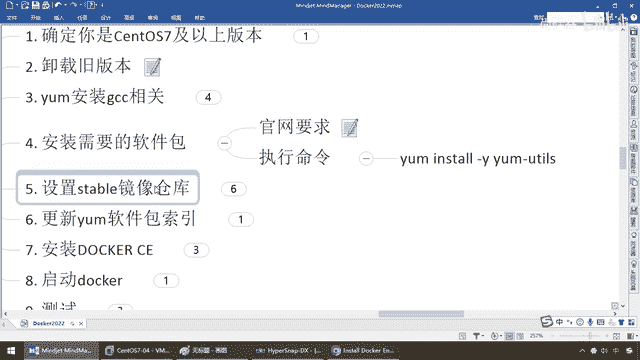

# 尚硅谷Docker实战教程（docker教程天花板） P11 - 11_centos7上安装docker - 尚硅谷 - BV1gr4y1U7CY

好，同学们，通过前面的理论知识介绍，我们暂告一段落，明白了Docker是什么，能干嘛，以及它的三要素、静下、容器和仓库，那么对于平台架构图的了解，混了个眼熟，后续我们到高阶片的时候。

依旧会折返回来给大家一一对照，那么目前我们完成了理论知识的介绍，将会带着大家在SantaHouse 7下面来进行我们Docker容器的安装配置，好了，那么接下来在学习方法上也会对各位同学做一个引导。

那么现在阳格整理好了脑图、步骤和笔记，那么假设有一天没有这些东西呢，你就按照官网你能不能装起来呢，那么走，来看一下我们能够拿到的材料是什么，官网是唯一权威的，也不用买什么书，那么来吧。

下面我们要解决的问题是SantaHouse 7安装Docker，那么好，安装文带的地址就这个，那阳格哪来的，你Bird塞给你，那假设下次没有阳格了，谁给我这个东东呢，所以说走，官网看一眼，来，同学们。

这是我们Docker。comDocker的官网，那么大家看一下啊，那么大致呢，滤一遍有多少多少的用户，对吧，成千上百万的用户都已经装了Docker了，那么直接告诉你，开发者喜欢Docker。

商业上业务上信任Docker，说的广告很牛逼，对吧，安全构建，广阔的分享和轻量级的快速启动，那么所以说Docker的三大特色，构建、分享和运行，OK，那么说白了，就是构建成你的程序，构建成我们的镜像。

分享出去以后，大家通过同一块镜像能够运行各种各样的容器实力，保证我们平滑千疑，版本一致，好，那么接下来，即将他说了，开发者，那不用多说，同学们请看上面的标题，这是Docker的各种产品，我们是什么。

开发者，那么一样，请大家看，一定是Dockers，OK，好了，那么接下来我们要干什么呢，是要开始玩Hello World吗，还是手工安装，或者是什么各种语言的版本指导，不废话，那么现在我们什么都没了。

那么是不是首先要点击下载和安装啊，那么好了，我们点击我们的手动安装，这个，那么来，同学们，但是在开始之前，我们这个导向，你要是有兴趣也可以读一下，那么至少Docker告诉你。

苹果上、Windows上、Linux上都可以，好，我们过来，在这儿了以后，大家可以看得出，我们这是Docker的多面工具，由于我们在Linux上面干活，骗命令，所以说我们选择我们的Docker引擎。

那么大家请看，安装，就告诉你平台的要求以及它的支持程度，那么对于我们的服务器上，那么提供了哪一些SentOS，对吧，那么大家请看，那么U盘图啊，SentOS啊，Debian啊等等等等啊，各种都支持。

我们在学Java虚拟机的时候，我们的Linux操作系统就是SentOS 7，那么完成这个以后，大家请看一下我们安装的前置支持的要求，那么来，同学们，我们用的系统是什么，SentOS。

所以说这个安装地址是怎么来的，那么就来自于这儿。

OK，这个呢，通过我们的官网的学习，那么大家其实没有阳格，其实这块你可以挑战一下自己，可以按一下我的视频暂停，你试试，现在没有阳格了，我就告诉你这么一个Docker的文档安装地址。

你能不能按照我们的官网要求，一步步给它安装成功，那你说阳格，英文看不懂，那么这块的话，弟兄们，点一下中文，OK，好，那么兄弟们，我们可以试试啊，屏幕前的你呢，可以尝试一下，暂停，要不自己动手试试，OK。

好，那么，错了，反正有阳格。

那么来，接下来同学们，我们呢，开工，按照我们的官网的步骤和要求一步步来，那么首先安装步骤，从安装到卸载，总共给大家整理了十步，那么第一步，要确定你是SantaCity7，及以上版本。

我们强调过了操作系统要支持，内核要达标，那么CATETC的Red Hat Release，我们是7，足够，那么你可以验验，第二个，如果你之前装过，假设你现在想版本升级更新，那么可以先卸载旧版本。

那么这个卸载旧版本，那么请看，地址也来自于这，哪来的？，uninstalled versions，那么来，同学们，那阳格，你这个东西讲的对不对？，你哪来的？，那么同学们请看，是不是也是来自于我们官网的。

详细的说明和笔记啊，那么也记，如果你以前装过Docker了，你现在要系统重装，直接，那么由于我默认，你就是root用户权限了，你自己本机玩嘛，所以说呢，这个呢，直接执行，一次搞定，好，那么当然现在各位。

请你们本子上肯定应该是空的，没有装过Docker。

不存在这一步，但是我们依旧罗列，那么为了保证，在线安装，手动调试，Docker顺利，我们需要一些，软件的环境，比如说我们的GCC等等等等，那么所以说，首先我们先按照第三步，YAM安装GCC相关配置。

这个就不解释了，说过了，那么各种Linux，几乎是一些基础的构建包了，那么首先要保证你能上外网，OK，那么这个时候，你连接，那么你的，Sentel S7 Linux扫描系统，是跟外网连接上，可以上网。

那么从网络上，通过YAM来获得安装，那么好，第一步，我们先安装GCC，那么在这和大家说一下，因为阳哥在备课之前，怕这个网络特别慢，所以说就已经提前装好了，你看我装的特别快，我只是为了给大家演示。

一步步的操作命令，但是你如果是，首次安装，你可能会稍微有点慢，所以说最好家里的网速是OK的，好，那么我们首先，安装GCC，OK，搞定，那么接下来，安装GCC的，另外一个C3G2，这么一条命令，那么来。

大家看，搞定，那么接下来，完了以后，我们安装需要的软件包，那么大家看一下，在这块，安装的方法，他说了，你能够安装，Docker的引擎，有不同的方法，主要依赖于以下这三种，那么第一个，干嘛。

Docker Repository，安装我们的Docker仓库，那么Setup Repository，我们一般，你看，Most user，大多数，对吧，所以说我们也选第一种方法，也是最正确，最中规中矩。

那么当然你也可以，下载，RPM的package，手动安装，那么最终，你可以开用什么，脚本安装，那么这个呢，比较，小众，对吧，那么，Most users，OK，那么所以说呢，咱们呢，中规中矩。

保证软件平台，安全稳定，后续利于我们的学习，和我们工作的展开，那么首先，他给你说，在你安装Docker引擎之前，第一次在一台新机上的话，你需要安装Docker Repository，Docker引擎库。

那么之后，你才能安装和更新，从这个库里面，那么好吧，那么来吧，来，首先，用Yamu，YouTube，工具类的package，那么这个里面呢，有包含提供了，Yamu的配置管理的一个工具类，那么来。

安装一个什么，A，N等，B，所以说他占了两条命令，两个操作，一个是来进行，软件包的安装，另外一个是设置，Sable，镜像仓库，OK，那么这些均来自于管管，那么，Sable，镜像仓库，OK，好。

那么所以说，这条命令，官网，我的截图，哪来的，给大家说的清清楚楚，明明白白，那么所以说第一条命令，我们先安装Yamu，YouTube，那么根据官网的要求，我们呢，执行命令，来，那么同学们，单贴。

那么OK，完成，那么接下来，那么按照，啊 阳哥，你那还需要你讲，会了，直接弄到这，好，这个Optional是个可选项，你可选，可不可做，可不做，可选，可不选，那么接下来，那，这一波，安装完成了。

刚才之前这条命令，And，后面这条，是不是就装一个，Sable，稳定库，那么大家请看，他添加的库，是不是download，docker。com，Linux等等等等，那么是不是直接，粘贴这条命令就OK呢。

理论上是这样的，但是，这就是为什么，想进步，叫有人带，跟对人，才能做对事，你照着官网，理论上，百分之百正确，但是只要你执行这条命令，后面你可能就不顺利，真的是闻者善心，听者流泪，为什么呀，那阳哥。

你不是要按照官网学吗。

我都听你的，怎么还被你带到坑里面，那么接下来，请答，留言。

问题就出在这，设置，Sable，镜像仓库，不是我要求的，理论上是他，执行这条命令，O了，但有个问题，这个，Docker。com，它是国外的，有点像现在我们去连我们的GitHub。

中国大陆去连国外的服务器，非常非常的恶心，非常非常的慢，不是说你错，而是什么，从中国大陆过去的请求，如果你抓了这条命令，非常容易超时，所以说，我试过，我呢，干了一件事呢，就按照，按照我们的。

官网上的这个命令去执行，那么按照官网的要求，张过来一执行，经常报14和12，不是TCP IP，从这就是连接超时，你这个时候，到时候你要去远程库，去下载那些Docker的镜像，经常会挂，基本上不能干。

所以说，千万千万，不要执行这条命令，那么怎么办呢，一般国内，阿里云，腾讯，华为云，网易云，给大家做了点活雷锋吧，我们这呢，就用阿里云的，就告诉你，我们要执行这个，一个稳定的仓库。

因为Docker它也要去取，我就不再从国外的这个，是吧，仓库上去取，download，Docker点看不上去取，我是中国大陆的用户，那么我就去阿里云上面去取，这样呢，我们呢，离我们呢，就快一点点，OK。

好，这个card要注意，那么接下来，我们设置我们的稳定仓库，就它，OK，搞定，那么我们自己的这个，一张贴，相当快，因为我们，都是在中国嘛，好了，那么第五步，完成，那么接下来，这一步更新亚姆软件的，包。

做一个索引，因为后续我们都要通过很多亚姆软件，来安装，和演示我们的教学demo，这一步，官网上呢，它没有，那么这个是一个Linux的基础知识，亚姆命令的，那么，阳哥个人建议，你执行一次。

相当于重建一下你的亚姆，下载的索引，以后，你亚姆安装稍微会快一些，你看，元素据缓存已建立，以后的话呢，安装呢，就非常的快捷一些，因为，哎呀，毕竟Linux去连这个网去下载，或多或少，有时候，哎呀。

一个镜像拖不下来也挺烦躁的，那么希望大家呢，舒心快一些，好，那么接下来呢，上面，打通了，开始安装Docker的引擎，到这一步，才是真正真正的开始安装，Docker，前面只是有，具备。

配置好了安装Docker的，前提条件和软件要求，那么安装你看，最新版的Docker引擎和容器，那么，下一步安装，那么这个时候，直接就执行这个命令，你粘官网的也行，那么，你，粘贴，阳哥的也行，那么基本上。

都是按照这个官网要求，一步一步的，给你粘贴下来，那么，好了，那么这个时候同学们，一直行，巴拉巴拉，OK，都是最新版，那么我们呢，安装成功，再次强调，因为阳哥呢是早就用过，Docker，这个安装过。

所以说呢，你看我安装比较快，但是如果你是，首次安装，零基础开始安装的话，会比较慢一些，请稍微有点耐心，再次强调，一定要保证自己。

网速健康。

OK，好，那么到第七步这，我们的Docker呢，安装完成，那么按照我们的官网，怎么着，我们呢，直接开始呢，干嘛，启动Docker，那阳哥你干嘛跳过第二步了，它是什么，可选的这么一个，那么这一步。

可做可不做，所以说呢，我们呢，就把它跳过，跟我们关系不大，那国内去测呢，也比较慢，OK，那么好，我们直接跳到我们的第三步，第四步，那么来，这个时候，我们呢，是不是就要。

把我们的Docker给启动起来。

就跟我们启动一个防火墙，一个后台进程一样，那么，C-CTL，Start，Docker，那么OK，这个时候兄弟们，来，没有消息，就是好消息，No News is Good News。

说明我们的Docker引擎，成功启动，OK，那么最经典的，那么PSR，GUN，EF 树线，Grip，那么这个时候，键盘乱了，好，那么大家请看，我们Docker，成功启动，OK，那么好，启动完成以后。

我们接下来，干嘛。

是不是要运行一下，我们的Docker，杨哥是不是说过，去哪下，配置安装完成以后，第五步，我们要写Demo，入门的第一式，是不是永远的Hello World，你看，全世界的技术，几乎都这样，大家思想。

已经固定了，所以说你这个Docker，如果能够运行Hello World成功，那么说明你，安装配置成功。

那么来，那么当然，Docker，Version，我们也可以直接执行一下，这个命令，跟我们的JavaGunVersion一样，那么这个时候，那么本次安装的，那么这个时候的话，我们大家请看，我们前调过。

是不是Docker的Clarity端，OK，Docker的什么，Server端，那么大家请看，两个版本是不是一样啊，那么，硬站结合我们前面的理论知识，大家不要觉得这些，很无聊，那么大家请看。

这是不是有客服端，这是不是有后台守护进程，那么结合我们Docker安装，请大家看，这是不是有客服端，这块是不是有Server端，后台守护进程，那么到这，如果你能够，启动Docker成功。

并用DockerVersion，打出下面这些内容，代表你本机安装成功，好，那么当然，如果这些环境都成立，我们是不是要，第八步启动完成Docker结束，我们下面，第九步，那么这个时候。

我们DockerVersion，那么好，那么刚才呢，我们也已经看到了，对吧，好了，那么完了以后，按照我们的笔记，也就对应着着我们的官网，来执行我们的RunHelloWorld，那么好，在执行之前。

我们先来看一下，你看，Unable to find image，什么意思啊，镜像HelloWorld，你看这有个冒号，Latest，最新的locally，本地没有办法找到。

我们的HelloWorld这个镜像，我们强调过了，原来也说过，Docker它要Run，Run什么，这个镜像，现在我们这个镜像是谁，HelloWorld，那么明确的告诉你了，怎么着，本地是不是找不到啊。

那么按照我们前面，学过的理论，Docker后台的，进程，要执行一个镜像，如果本地有，直接转化成容器实力运行，如果本地没有这个镜像干嘛，去远程库，去拉到本地，在本地有了以后，再继续形成我们的。

运行的容器实力，那么好，同学们请看，这块，很明显的告诉你，本地呢，不能找到这个，那么，我们呢Pool，那么这个时候是不是，从我们的远程库，给它拉下来，那么好了，那么这个时候，我们下载了一个。

最新的镜像HelloWorld，那么HelloFromDocker，这个消息能够，在你的安装界面上出现的话，代表工作正常，好，那么搁到这，Docker呢告诉你呢，我们呢，如果能打出这段话。

看到HelloWorld，DockerFromDocker，代表本机安装成功，至此我们Docker的安装，OK，好，那么兄弟们，理论结合前面的实际，实际再回到理论，一步步的反复对照，大家呢。

慢慢的从小白，小白到高手，那么最后，我们呢，看一下卸载，当然你现在别手欠去卸啊，我们正要开工呢，我们只是告诉大家，那么打完一套，那么下面呢，我们可以翻到最后，我们在这块呢，就有一个。

uninstallDocker引擎，那么怎么玩，大家请看，第一个，刚才启动Docker用Start，那么现在停止Docker，那么是不是用Stop，完了以后的话呢，停掉我们的Docker后台进程服务。

移除我们Docker的，你看这些OK吧，然后删掉Docker的，本地的什么VR，我们学过Linux什么，是不是安装配置文件，各种第三方库包等等，那么所以说，这个卸载1 2 3，就这么几条命令，那么好。

那么同学们到这，就是我们在Sentence 7下面，安装Docker的全部步骤，请各位同学们，做一下这个家庭作业，务必今天保证全部安装成功。

好。

