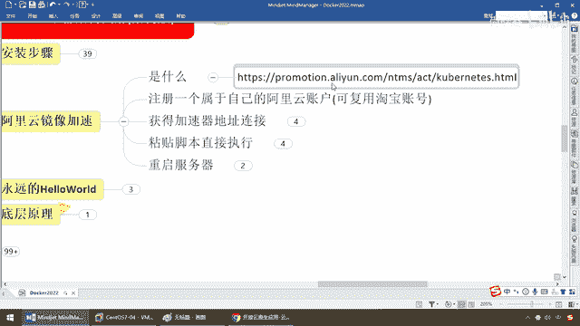
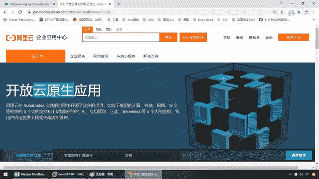
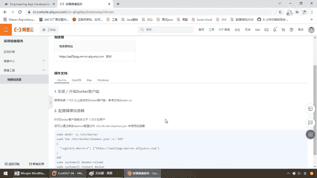
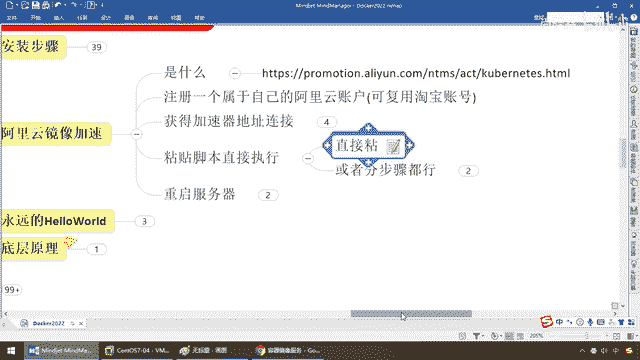

# 尚硅谷Docker实战教程（docker教程天花板） P12 - 12_镜像加速器配置 - 尚硅谷 - BV1gr4y1U7CY

好，同学们，下面给大家接着介绍一个非常重要的知识点，阿里云静像加速器，那么由于我们访问国外的网站比较慢，通过上面的安装，我们Docker在本地能够成功的运行并跑动起来，那么为了后续拉静像运行容器。

更加的方便，快速，所以说我们这儿必须给它配置一个加速静像器，那么也就是我们的阿里云静像器，当然啊，本次讲解以阿里云为例，还有腕翼云、华为云等等，那么目前用的比较快的比较多的阿里云还是不错。

那么在这儿我们有必要给大家说一下，那么阿里呢，他呢，做了这个开发者大会，包括现在他主推他比较挣钱的产品就是阿里云，那么这个时候他希望能够让所有的淘宝支付宝的用户，尤其是开发者的话。

统统围在他的阿里云下面，那么帮他推广，那么来做这个生态圈的共生共融。

所以说呢，在这块，他以前是叫开发者，阿里开发者，但是到后面他主推的是什么，云原生和我们的各种容器服务，最终大家看是不是就变K8S了，所以说呢，在这块啊，他想达到的目的，紧紧的紧追亚马逊云。

全面在中国落地生根阿里云，那么所以说，在这块，我和雷方阳老师的分工，我Docker，他K8S，那么所以说这两个都是互为机角的，那么希望大家呢，先学好我们的Docker，再去玩后面的K8S。

否则云原生那些东西你可能听起来也模模糊糊，好，那么同学们不多说，开工。

那么现在我们呢，就要注册一个属于自己的阿里云帐户，可附用什么，淘宝的，支付宝的，只要是阿里系的都行，那么这个呢，就是他的阿里云企业应用中心的一个开发者账户，那么来，登录。

随便你只要是阿里系认可的账户密码，那么假设啊，我就用我淘宝的账户，那么登录，好，那么登录成功以后，那么同学们，我们呢，可以看到，在这块啊，那么他要一个安全验证，我都懒得理他了，这个不是我的开发账号。

我们这是随便附用的一个，那么等他呢，启动，这个时候，他会跳转到我们的首页，那么这个时候，大家请看刚才的登录页面，变成了什么，扣我们指纸台，那么点进去，那么在这块，那么这个是他的菜单，点一下，哇，兄弟们。

请看一下，阿里云强不强大，弹性计算，存储，数据库，安全，人工智能，他真的就是一种什么，作为一个互联网时代的基础云架构，那么他现在野心很大，能力很强，那么阿里云呢，几乎想南扩，B端，C端。

甚至未来的IoT人工智能，互联网等等的全部一套，互联网底层的基础架构都可以，直接跑到阿里云上面，也许啊，再过一段时间，可能我们，假设有一天啊，你就不会再教同学们安装什么虚拟机什么的，连上外网。

一年百十来块钱，大家团购的话，通通买阿里云，连上去，你也不用再去学什么，很无聊的这个虚拟机的安装啊，配置，搞的这个环境啊，天天是错乱，对吧，干点活吧，至少一半的时间被这些环境配置给难为死，那么，当然。

你懂了就不用花钱，不懂的话，买阿里云呗，一年少则几千，多则几万，那么就看公司愿不愿意给你掏这笔钱了，对吧，好，那么这儿呢，不多说，那么展开这儿以后，菜单，打开，产品与服务，那么谈星云计算，ECS。

RDS等等等等，不废话，那么我们呢，后续有机会再给大家介绍，那么现在，选到我们的谈星计算，找找找找找，这儿有个叫，容器竞相服务，点进去，好了，那么大家请看，我们呢，杨个人当然呢，现在呢，我呢。

只是运用一个什么，可以说是免费的，全线有限的个人版，这也是阿里云让你试试，那么如果企业急的话，交钱，不多废话，所以说，阿里呢，免费呢，让你习惯了以后，慢慢的让企业掏钱，其实这个呢，也算是，也可以吧。

那么省略了大家这些，环境上的一些配置，那么好，我们在这儿，选择竞相工具，然后在这儿选择一个东西叫，竞相加速器，需要把这个地址配进我们，Docker容器里面，从此以后，我们的拉竞相，发布等等，速度才够快。

包括后面啊，我们呢，竞相呢，也会发不到，阿里云，所以说在这块，我们有必要，针对于自己，每一位开发者都要拥有一个自己，唯一的一个，加速器地址，那么大家请看，AA25，这个呢，就是我们的加速器地址。

那么再次强调，这是阳哥的，你别到时候粘错了，你别照着笔记粘了以后，粘成，懂了吧，那么那是我的，那么在这儿，复制了，好，然后呢，粘到我们Docker的配置文件里面，就行了，那么当然，我们接下来呢，要看。

我们在这块呢，就获得了。

每一步啊，那么这个时候呢，就给同学们呢，也刚才，也说过，获得我们的加速器地址，那么别忘了，我们现在，要粘贴脚本，来进行执行，什么意思呢，到这步以后，我们现在用的系统，是谁，Sentel OS。

你不要粘错了，我们现在呢，有他这儿提供的这四个UBAN图，Sentel OS，苹果，Windows，那么现在，我们点击，Sentel OS，其实这四个都一样，没怎么太大变化，那么首先，他告诉你。

首先我们的Docker，要1。10以上，那么我们呢，是最新安装的百分之百符合，刚刚完成了上一步的Docker安装，下面，配置进向加速器，那么在这个版本的前提下，他的意思说，修改Demo配置文件。

ETC目录下面，Docker目录下面，要做一个Docker后台的节程串，来使用加速器，那么命令呢，就这一圈，基本上就是第一步，我们拆解啊，就是MakeDIR建一个ETC的目录下面。

又有一个Docker这么一个目录，那么大家呢，请看一眼，搭PWD，ETC，Docker，因为这个命令很简单吧，十个人都会吧，那么第二步，TE，这一波呢，可能有些同学会有点蒙蔽，那么这个呢是。

Linux的一种，需要脚本，很简单，他的意思呢，就说EoF End of file，这个作为文件的结尾，你看，这个往右边，是不是追加，这边是要反写回，他的意思就是说，要把这个JSON串。

这个作为文件的这个整体，OK，那么这个就是文件的末尾，End of file，那么这个JSON串，反写回去，ETCDocker目录下面的demo。json里面，OK，那么写完以后，干嘛，后台的。

DemoDocker程序重启一下，再重新启动Docker，那么就完成了我们加速器的配置，OK，那么每一步，给大家进行分解和讲解，那么在这呢，我用两种，第一种呢，不用说了，直接粘，很简单，第一步。

那么MakeGamP，符合目录的串件，ETC下面串件，Docker这个，不废话，那么下面直接就是粘，这段啊，你看，TEE，等等等等的，OK，没问题吧，这段粘过来，来，同学们，Hello Yeah。

一回车，他就告诉你，来吧，哥们，你呢，就已经在这个路径下面，也粘贴了这个，干嘛，demo。json这个串，OK，那么第三步，那么同学们，我们应该干什么呀，那么是不是按照他所说的，重新启动。

我们的Docker，因为你改了配置文件嘛，那么这个时候，好，那么接下来，我们再进行我们Docker的，重启，那么激活我们的配置文件，并重启我们的Docker，那么好，Docker，那么比如说Run。

那么Hello，Word，老规矩，如果说能打印出这段消息，证明我们的Hello Word运行成功，我们的Docker改了配置文件，激活了配置文件以后，配置了我们的镜像加速器。

也成功运行。

这个。