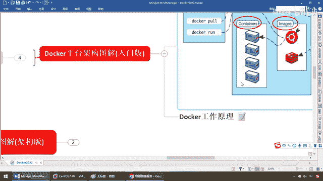

# 尚硅谷Docker实战教程（docker教程天花板） P13 - 13_helloworld分析介绍3要素配合 - 尚硅谷 - BV1gr4y1U7CY

好，同学们，你个人账号下面的阿里云进线加速器配置完成，那么从此以后，你的Docker下载安装各种进线，拉取各种版本的软件的话，应该速度上是OK的，那么这块请大家务必严格配置成功。

那么到后面各种要发布到阿里云，还要和他交互，包括到我们高级部分，Compress的容器编排等等，如果你没有一个良好的加速器的配置，你这个经常做的做的都有超时，很烦躁，这个时候的话，希望大家引起重视。

好的开始是成功的全部，不是一半，好，那么同学们，接下来我们继续说一下我们的Hello World，哎呀，这有什么好说的，不就是一个Docker Run，一个Hello World的进线吗，这个进线。

那么运行了以后的效果就打出这么一段话，OK，那么结合我们之前讲的进线容器仓库，我们再对Hello World做一个简单的分析，那么启动后台Docker容器，那么我们也测试成功过，巴拉巴拉这些不废话。

那么在这我们也看到，本地没有Hello World这个进线的话，它首先会去下载Hello World的进线，并在容器内运行，OK，那么提示到输出以后，Hello World就会自动的停止运行。

相当于我们的Java程序，Simple Outer Println，打了个Hello Java，Hello World一样，那么容器实力自动终止，相当于这个对象GC把它回收掉。

那么Docker也把它干掉了，OK，它打完了它也就结束了，相当于说这个容器箱子在金鱼背上Docker上面过了一下，演示了以后也就卸载了，那么好，这个RUN它到底干了些什么呢。

那么在这命令后续别着急同学们，这个下一章我们就会讲Docker进线的容器的日常的常用命令，很多的，那么但是现在先见几个简单的，我们总要在讲述过程当中，给大家介绍几个没见过的东西。

那么Docker Run它干了一些什么呢，我们来，首先一开始Docker在本机当中寻找某个名字的进线，然后看看本机是否有该进线，那么大家请看我们在这原来说过，如果本机有了就从本机直接运行，对吧。

如果本机没有还记不记得，它说unable不能在本地的话，发现的Hello World的进线只能去远处拉，对吧，刚才那段那么大家也看到过，所以说它这就看本机是否有，如果有以该进线为模板伸长，容器实力运行。

如果没有呢，不好意思去Docker Hub上面去查找该进线，那么当然我们现在给它配了以后，我们可以是不是通过阿里云去国内的网站上，进线上去找，那么Hub上能不能找到，找得到，OK，找到就下载。

拉到本地再以该进线为模板，完成上面的运行，所以说run它要去运行这个容器实力，它会干两步，第一个先在本地找进线能不能找到，找到直接运行，找不到再去远程库上去拉一个进线，那么再拉到本地以后再运行。

所以说如果说你本机没有，那么我就去Hub上去找，如果Hub上找到拉下来直接运行，那么Hub上也找不到呢，返回失败错误查不到该进线，OK，那么这个就是我们的run它所完成的动作。

那么我们的Hello World，至此我们就会明白上面我们的入门讲解的这张图，清晰的给大家说明白，本地有进线直接运行，本地没进线先去远程库拉，拉得到拉到本地再运行，拉不到报进线找不到的错。

这个就是我们通过Hello World，明白了Docker的三要素，以及他们三者之间所打的配合。

