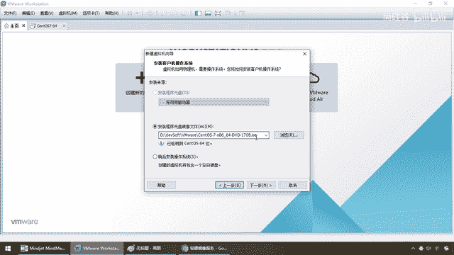
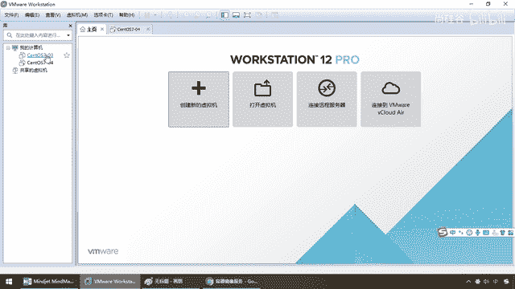
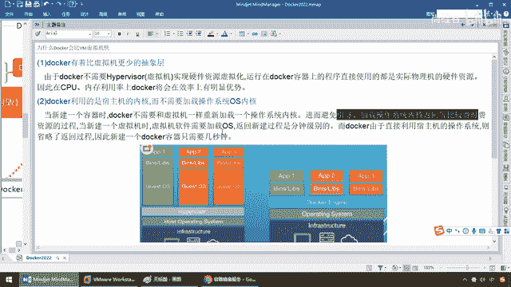
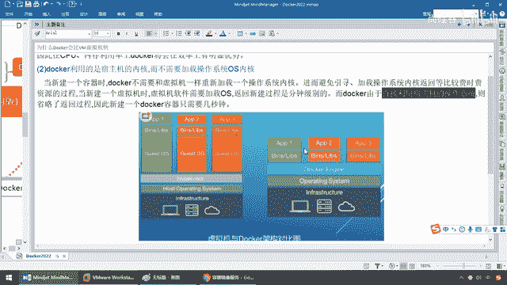

# 尚硅谷Docker实战教程（docker教程天花板） P14 - 14_为什么Docker会比VM虚拟机快 - 尚硅谷 - BV1gr4y1U7CY

好，各位同学，我们继续，那么讲到这儿，第一天的从理论到配置到安装接近尾声，那么我们来做一下我们的小总结，最后结合我们之前讲解过的内容，来对我们Docker它运行的底层原理再做最后一次的分析。

那么大家请看为什么Docker会比加瓦虚拟机要快，那么来，同学们，两者对比，还记不记得之前我们看过这张图，一个大，一个小，一个慢，一个快，一个复杂，一个简单，那么说白了，Docker是比传统的容器。

传统的这种虚拟机是有极大的优势的，那么好，前面完了以后，我们再深层次的来解释一下Docker为什么会比虚拟机快，那么来，同学们，两大原因，第一个，Docker有着比虚拟机更少的抽象残。

也就是说我们先说虚拟机，我们这要加载创建一个新的虚拟机，那么前面反复多次的强调过，这一个SO镜像文件，那是包含了软件、硬件甚至包括打印机驱动，它用得到的用不到的，这个反正是带环境给你安装，我全给你。

那当然，又大又全，自然体重就比较多，我想出行要不车，你给我一辆汽车就行了，没想到，哥们，你开了一辆火车，是，是挺牛逼，但是运作起来当然慢了，城市里面你要是跑一个火车，那是不是一定是菜刀砍电线。

一路霹雳火花带闪电。

对吧，那么这个时候我们来看，Docker它不需要像虚拟机那样，实现硬件层面的资源虚拟化，我不用，运行在Docker容器上的程序，直接使用的都是实际无理机的硬件配置，那么相当于我可以复用。

因此在CPU内存利用上面，Docker效率上有明显的优势，OK，好，那么第二个原因呢，Docker利用的是宿主机的内核，还记不记得我们原来说过，它偷机打滑可以复用啊，那张图对吧。

不需要加载整个操作系统的内核，那么当我们新建一个容器的时候，Docker Run，OK，不需要和虚拟机一样，重新加载一个操作系统内核，那么假设我们现在在虚拟机上面，我现在想运行。

这个Sentire S7上面安装过的一个Redis，那我是不是要先启动它，那么我为了启动一个Redis。

先要先启动一个整个虚拟机Sentire S7，那么这个时候就会导致，我需要加载虚拟机，但是Docker不需要，那么它呢，不用重新加载一个操作系统的，这样一个重量级的内核，从而避免了系统级别的什么引导啊。

寻值啊加载啊操作系统内核返回啊，它比较费时费资源的一个过程，当我们新建一个虚拟机的时候，这个虚拟机是要返回加载OS的。

那么它的返回过程，我们都说过，一个虚拟机实力启动。

5分钟都是快的，对吧，那么Docker呢，直接利用宿主机的操作系统，省略这一大堆加载和返回的过程，因此新建一个Docker的容器，算不着秒级别的，好，那么下面我们来对比，左边是我们的虚拟机。

两个都是硬件，假设都是同样的台笔记本，这样有一个主机的操作系统，对吧，Win10，这样也有个主机的操作系统，比方说，我们是Win10也好，或者是苹果也罢，都一样，这下面这两层一样。

上面这个Hyperversion这么一个接口，就是一个虚拟化的软件，你可以把它当做这个VMware，那么它在上面，那么来，这个可能是一个SentaiOS7，这个可能是个U版图。

这个可能是个Linux红帽，每一个操作系统，都要全部的重量级的加载，各种的什么网络配置等等等等，那么在这个上面，加载这些第三方的Lib这些库，然后再加载各种运用，那么所以说，相当于一个虚拟机。

它绝对可以带环境安装，它把整个系统给你搬过来了，但是，Docker，不用，我现在，直接利用宿主机的操作系统，我就很轻量，我这儿就做了一层容器虚拟化，屏蔽，那么这个时候，你们就跑到Docker上。

Docker相当于，我就在Windows上面，装了一个软件，这个软件里面，又运行着另外一些软件。

容器里面，就可以运行我们的Redis，MangoDB，Nginx，所以说，在这块我们可以获得，对于Docker容器而言，从操作系统这个维度，它和宿主机共享，虚拟机WinMware而言，宿主机。

在上面再运行一个虚拟机，哇，太重，那么存储的大小，镜像比较小，而它的镜像，这个ISO文件，非常庞大，我们的Sentos机，少说都是4。8G，那么运行性，几乎没有什么额外损失，而这个，不用多说了，兄弟们。

还记不记得以前我们做过，开了六个实验，只要16G以下的，内存的同学们的机器，根本跑不起来，那么移植性，清核性，部署速度等等，那么秒级，十秒钟以下等等，甚至是分钟级的，OK，那么这个。

就可以得到我们Docker，它为什么会比，加码虚拟机要快。