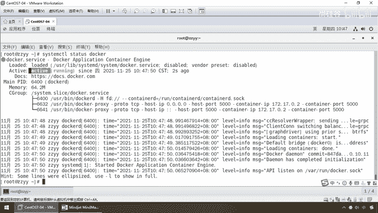
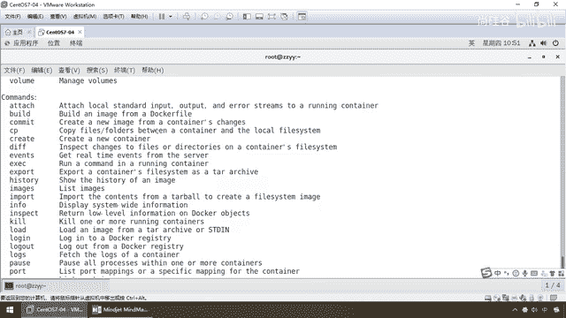
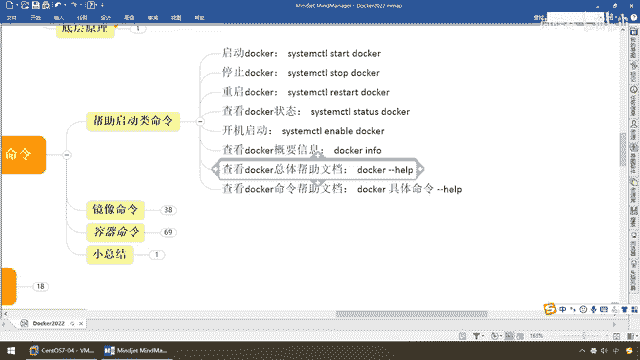

# 尚硅谷Docker实战教程（docker教程天花板） P15 - 15_帮助启动类命令 - 尚硅谷 - BV1gr4y1U7CY

好 同学们 我们继续通过上一讲，我们给大家完成了Docker的安装，并配置了阿里云的镜像加速器，你个人的阿里云开发账号自己注册一个，那么疫情期间，隔离教学我们只能上网课，我没有办法督促大家。

但是脑涂发给大家，你也知道阳格的风格，管身又管痒 管杀又管埋，你就是照着脑涂粘，你也应该做成功了 对吧，这些所有的命令和笔记，那么所以说同学们不许偷懒，本机一定要把Docker安装配置成功。

脑涂都发给你们了，所以说希望各位同学一定要动手，你光看阳格敲 看我做是没有用的，你也知道阳格学习三板斧，理论 时操 小总结 对吧，那么所以说先讲理论，你不要觉得理论啰嗦 烦。

面试的时候是需要跟面试官聊聊的，比如说什么是容器，什么是虚拟机 谈谈你的理解，你别上来，不会有哪个面试官来考你一大堆操作，你天天学一堆正确的操作 没用，那么操作进去干活用的，面试就是这些理论都重要。

理论 时操 小总结，好 那么同学们 接下来，我们进入我们的第三章，Docker的产用操作命令，主要分为三类，搬注启动类，静像类 容器类，那么昨天讲过Docker三要素，静像 容器和仓库。

仓库嘛好说 无非就是什么，把我们的静像放到仓库上面，那么对于我们本地而言，就像我们刚刚装完了Linux，是不是要学那些什么VI，各种LS RM Q 各种命令，常用的命令和API，对Linux进行操作。

那么Docker也是一样，你要操作Docker容器，操纵Docker引擎，操纵Docker静像，就需要一些交互命令，那么我将它分为三类，那么这是日常工作中，常见常用的命令，基本上我在个人使用课文当中。

也足够了，那么如果有超过的，那么大家呢再可以去查文档，好 我们先来第一类，帮助启动类命令，那么不用多说，这个一定是最简单的一组，那么大家先给大家10秒钟，我先暂停录屏，先看一下，我觉得一看你就能秒懂。

同学们，Low-in 启动 停止 重启，都一样吧，学过Linux是不是跟那个防火墙，是一回事啊 对吧，以前我们叫Stop Firewall，停止防火墙，这个叫什么，Stop Docker。

那么好 同学们，那么现在，System CTL stop，Docker 还有，敲错一个，来 弟兄们，请看，那么这个时候，我们呢，停止了我们的Docker，那么这个时候，大家来看一下。

这个Docker的什么，状态，好，System CTL status，Docker，那么大家请看，它是什么，Inactive，死了，非活动状态，OK，那么来吧，System CTL，那么这个时候。

Start，Docker，好，没有任何消息，这个时候再来看看它的状态，那么请看，这个时候就是激活状态。

并且已经正在运行啊，OK，那么我认为啊，兄弟们，这些我就不再废话了，这几个命令，一看就会了 对吧，重启我就不再演示了，节约时间，Go，那么下面再看这个，开机启动，那么大家都明白。

就像我们的Windows一样，我们希望有些软件是，随机启动的，那么它这个意思就是，如果你的Docker，没有配置这个，那么你每次使用Docker，需要手动开启，Start，Docker。

那么如果配置这个以后，你Linux服务器，只要一启动，你的Docker也随机启动，OK，就这么一个简单的小动作，好，过，那么第三一个小组，Docker info，查看Docker的概要信息。

那么大家请看，Docker info，那么这个呢，就是你Docker安装成功以后，就会有，它跟那个Vision一样，如果你打开这个，也能弹射出来，对应的启动命令，对应的演示说明，说明你Docker。

运行成功，安装成功，那么Client端，Server端，什么样的版本呢，它具有哪一些动动，那么也给你做一个，概要的说明，好，这个过，那么接下来，这两个重要，我们大家呢，对比之来学，同学们。

我请问大家一个问题，如果你在用Linux的时候，对于某些命令，你不熟悉，你会怎么查看，我们大家都明白，在Linux的世界里面，有问题问男人，那么这个时候，弟兄们，是不是学过这个Mem命令，对吧。

它就是一个常用命令的，帮助手册，类似于一本新华字典，那么Docker也一样，只不过它叫Docker Help，那么这个Help呢，来兄弟们，下面这个叫什么，Command，那么这个就是我们今天。

所要给大家讲解的，重点内容，那么就是，操纵Docker跟Docker，配合工作干活的常用API，和日常的命令，那么，对于某些命令，假设你不熟悉，你不会用呢，你只是记得了这个命令，某些参数，配置。

选项也记不住呢，没关系，用Docker Help，它会告诉你，某个命令，按照某种公式，来套，来用，常用的选项，命令，甚至是什么，传递的参数，分别是什么意思，都会在这，给你做一个，一一介绍，好。

那么这个呢，就是类似于我们的，Linux的Mem命令，那么这个，和这个有什么区别呢，大家请看，这个是我，意思就是全部，能理解了吧，那么现在，不好意思啊，我用不了那么多，比方说，哇，眼睛看花了。

你给我这么多命令，我们现在呢，只想看其中的一个，是什么意思，比如说，CP就是没学过，Copy，总该了解吧，拷贝文件，或者是文件夹，在容器，和本地文件系统之间，OK，你看，阳哥还没学呢，还没教呢。

但是现在各位同学，你们是不是可以自学啊，哎，我希望有一天就是，没有阳哥了，你们大家也，依旧能够优秀，也依旧能够什么，自学成才，正所谓，死了我周屠夫，不用吃带毛猪，地球缺了谁都赚，OK，那么。

反复的给大家强调，自学能力的重要，好，那么假设有一天上硅谷，没有出某个技术的视频，那怎么着，不学了，还是非要等着上硅谷，出视频才学，没必要，搬住命令，谷歌，百度，走起来，官网。

走起来。

自学，自学，自学，好，同学们继续，那么下面，我们来看，Docker，Copy，Gun Gun，Help，来兄弟们，他会告诉你，如果没有这个命令参数，只有Help，是全部命令，那么现在，你没学过。

现场教学，Copy，Option，选项，你看这是容器，原地址，目的地址，或者是，怎么个用，原地址，容器的目的地址，那么告诉你，这个命令是干什么，那么他的选项，A，L，那么大家，Low in，这些的时候。

是不是就，针对于我们，自学过程当中，是最好的帮助和参考手册，OK，那么再来，那么Copy你没用过，Run这个命令，大家，Hello World用过了吧，看上没有，那么对于某一个具体的命令，他的选项。

进项，Command命令，然后AX参数，那么跑一个，是吧，Run命令一个，新建的一个容器实例，那么这些选项干嘛，你加了A，分别代表是些什么意思，C和D分别代表是什么意思，等等等等，那么常用参数。

我就不在这儿，啰嗦，那么大家需要的时候，就可以来进行自行查阅，自学更新，自己的知识，好，那么第一组，帮助系统类。

去给大家介绍到这儿。

