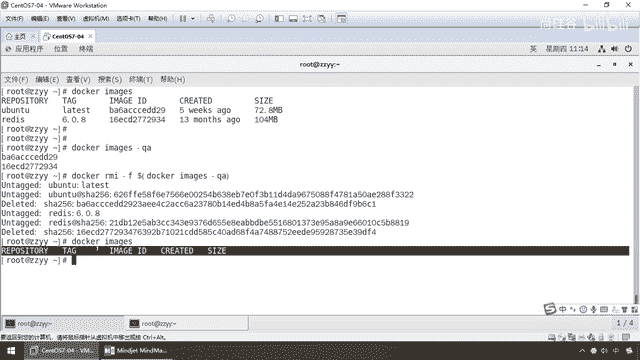

# 尚硅谷Docker实战教程（docker教程天花板） P16 - 16_镜像命令 - 尚硅谷 - BV1gr4y1U7CY

好，同学们，我们继续完成了第一组命令以后，帮助启动类，现在马上进入我们的第二组，静向命令。，那么在开始这一组之前，不凡我们最后再来看一次这张图，一脉戒，容器和仓库。，那么现在主要介绍这两个命令常用的。

仓库后面我们回头说，他有一套命令。，那么现在大家请看，一脉戒复习，静向类模板，一份静向可以多个容器实力，对吧？，他是容器实力的源代码，那么由静向来生成容器实力。，好，那么现在。

所以说多克静向是一切的根源，源头，那么来吧，兄弟们，第一组，Docker images，啥意思？，列出本地主机上的静向，那么好，各位同学，我们来露眼啊，Docker images，大家请看。

我现在有没有？，没有一个，那么昨天我们演示了Hello World那个静向，我已经把它删掉了，这儿今天从零开始给大家进行教学。，那么所以说大家请看，我装完Docker以后。

我现在本机有没有对应的可运行的静向？没有，空的，但是却露出了一个表头，有什么？，reports，仓库，tag，image id，静向id，讲就是还没开启，你也知道，你们觉得静向id就跟数据库的主件一样。

会不会重复？，第二个创建的时间，size这个静向文件的大小，好，那不凡我们来看一下，在这块来，弟兄们，Docker images就是罗列出本地的静向，对吧？，有没有点像我们ls-l。

罗列出单切目录下的所有目录，没问题吧？那么这个时候我们罗列以后，表头分别是什么意思？，那么大家请看，这个表示静向的仓库园，这个表示静向的标签，什么？版本号，我再补充一点，这个是静向id。

这个是静向创建的时间，这个是静向的大小。，注意，同一个仓库园和有多个tag，杨哥听不懂，说人话，那么大家告诉我，我们现在假设有一个静向叫MyCircle，可以吧？

。

如果你不写，它就是最新版latest，如果我现在不想要最新版，我想装的是MyCircle5。6，我想装的是MyCircle5。7，那么这个tag就是代表什么？，版本号，能跟上，那么假设他们cat。

MyCircle，Hello World也好，对于任何一个静向都这样，你tag没有具体说明，我们默认就是最新。，如果你具体说明了，OK，那么你下载，你安装的就是一个代版本号的静向。好。

那么下面我们现在对于同一个仓库园，MyCircle可以有多个标签版本号，，MyCircle5。6，MyCircle5。7，MyCircle8。0，那么代表这个仓库园的什么？不同个版本。

所以我们一般都会使用，仓库加tag标签版本号来定义不同的静向。，如果你不指定，那么这个时候假设我们用了一个静向叫Uban图，那么Dorka默认家使用什么？Uban图latest静向，最新版，就这么简单。

，OK，好，那么同学们大家来看一眼，那么现在，-a列出本地所有静向，含历史静向层，后面我们讲容器卷的时候我们再聊，就是静向它是有层层堆叠的。，OK，好，qa之前是什么？静向id，常用的就这两个参数。

那么前面也说过，如果你对某一个命令还继续感兴趣，可以用-help，那么下面请看，我们连着一块讲，，Search，这是叫什么？pro，la某个静向，这个叫什么？查某个静向，那么结合这个表头。

那阳哥你现在光秃秃的什么也没有啊，那么这个时候同学们请看，现在这两个命令一块敲，Search，pro，那么这个时候Dorka，Search，比方说Hello World。

我现在就通过我们的阿里云的静向加速器去我们的hub上面去查找，，有没有Hello World这个静向，这个时候大家请看，所谓的Search，就是我搜索，搜寻某个静向是否在远程仓库，那么大家看有没有。

Hello World，一个例子经典的对吧，点这个Stars什么意思啊，点赞速，Official，官方认证，所以说得到了我们的第二个命令，那么Search。

也就是说如果我远程库有Hello World这个静向，那么结合前面我们所讲的，，大家看对照的，从理论到命令，现在我本地光秃秃的对吧，什么都没有吧。

那么我可以用Search去看看远程库有没有Hello World这个静向，有了怎么着，直接把它拉过来到本地，那么好，现在各位同学，我们来看一眼，我们的Search，过来这看hub，Dorka。

那么当然我们配了阿里云加速器对吧，其实是从阿里云那块拿了，那么他的命令，Search，Option，静向名字，那么大家请看，，在这块也有一堆表头，那么那么Description等等。

那么假设刚才我们查了外的，那么现在我Dorka，Search，我们常用的Redis，那么这个时候同学们请看，我们在这就是Hello World，我们在这是不是有我们的Redis，那么一样。

那么这个是什么意思呢，那么Description描述说明Stars，点赞速，Official是否官方认证，OK，那这个叫Automatic，，那么这个是什么，是否是自动构建编译的，没问题。

那么在这一般我们选什么，头一个即可，那么下面我们再来看一下，在这个Search完了以后，我们来演示一下，他常用的命令，那么来同学们，现在假设我要下载一个Redis的静向。

我先去远程去Search去查一下，有没有，有，可是查过来了以后发现我的妈呀，这么多，我下哪一个，那么大家请看，，而且非但如此，这个叫Redis，怎么前面还有些钱，注意，不要怕，这个相当于什么。

我们家里面的package，包明，有不同的作者，不同的组织提交上来以后，他叫比如说什么，Live 006，这么一个Redis，这个叫Redis Labs，什么Redis，那么各个不同的组织。

不同的账户提交到的，那么这个时候一般我们选第一个，是吧，官方认证过的，也是最靠谱，最好用的，OK，那么好，这个呢，，这是第一个，第二个问题，假设你觉得这个search命令罗列的太多了，那么同学们。

load一眼，我们这可以加，杠杠limit，有点类似于MyCircle里面的分页，那么就只罗列出多少多少个静向，默认是几个，25个，从我的使用角度而言，你没必要了解25个，哎呀，排名。

点赞数排名最多的前5个足够了，那么大家请看，按照公式，那么就是杠杠，注意，Docker里面有些命令是两杠，有些命令是三杠，，有些命令是一个杠，那么这个时候请同学们一定要注意区分，那么杠杠limit5。

radius，同学们load眼，这个时候得到什么，是不是只显示用的最多的，点赞数最多的默认，前5条命令足够了，一般咱们就是用第一个就行，好，那么这个就是我们的什么，search命令，好，那么下面同学们。

我们继续，以MyCircle完成，search完成，那么现在search到的东东，说明什么，是不是要拉到本体，，那么同学们请看一眼，此时我们就可以下载镜像，那么好，我们用Docker Pro拉，OK。

那么弟兄们，这个Pro我们前面学Git，GitHub，Git1的时候是不是讲过，所以说你看这些命令就是什么，天下思想一堆钞，你叫Git，叫GitPro，我叫Docker，叫Docker Pro。

都这么回事，那么好，兄弟们，这个命令就叫什么，下载某个镜像，那么注意，，他有两套写法，第一种叫Docker Pro镜像名字，然后什么，冒号，tag，我们前面强调过这个tag叫什么。

是不是就像我们的镜像的标签版本号，注意，同一个仓库员可以有多个版本号，写了具体是多少就是多少，有就给你下载，没有就说明你错误下载不到，如果没有写，那抱歉，那么就只下载最新的，那么所以说写了，。

具体版本号是多少就是多少，比如让你写个MyCircle冒号5。6，那么说明我要从网站上拉到本地的镜像是MyCircle5。6这个版本，写了5。7，那么就拉出来的就是5。7这个版本。

那么如果没有写就是最新的，相当于你什么都不加Docker Pro镜像名字，没有后面的这个动作，默认Docker就给你加一个latest最新的，这个可以不写，听懂了吗，那么好，同学们，大家请看。

我们现在呢，不妨拉一个，，那么最经典的，大家请看，你MyCircle，杨格赵本地什么都没有，只有个表头，仓库，标签，镜像ID等等，好了，那么现在刚才的复习下命令，search，Hello World。

兄弟们现在有没有Hello World这个镜像，有，有的话可不可以拉到本地，完全可以，那么所以说这个时候我就pro一拉，大家请看，使用默认的标签latest world，，我这是不是屁股后面什么都没写。

那么所以说你什么都没写，代表就是下latest最新版，OK，那么好，等它慢慢的下载到本地，我先暂停下录屏，，这门大家请看，现在是不是已经拉到我们的本地了，那么Docker。

那么现在你MyCircle复习，，大家看一眼，那么现在是不是，search，查，有没有，第二个拉，第三个本地镜像，现在有没有了，Hello World，OK，那么标签是多少，最新的，那么大家请看。

你MyCircleID是多少，是它创建的时间，多大，13。3kb，OK，那么这个呢，就是我们相关的一个命令，那么Docker，那么再来一个pro，Ubuntu，，来，兄弟们，大家请看，大家捞一眼。

下载完成，那么每位同学的机器和网络，由于你们在家的网络不一样，有时候的话，下载会可能慢一点，稍微耐心等它一下，那么再来看，，Docker images，那么请看，此时是不是代表我本地已经有了两个镜像。

一个叫Ubuntu，一个叫Hello World。。

OK，那么所以说这个情况下，我刚才的下载后面呢，都没有加版本号，那么一样，假设我们现在再下载一个，那么Redis 6。0。8，，哎，注意，我现在可是加了这个tag标签，相当于是这个tag标签版本号。

那么大家看一下，它又会有什么样的表现，，来，当然啊，这个Redis可能大一些，下的慢一点，我们边剪边等它下载，那么回到我们的脑图，那么这大家呢，应该可以看的明白，，Emigy，Search。

还有我们的Pro这三个命令，分别是什么意思，好，那么来，我这呢，给它下载着，我们重新开启一个命令，哎，，运气不错，也下载完成了，那么现在Docker，Emigy，大家请看。

现在我这个Redis下载下来后，版本号是多少，6。0。8，哎，那么当然如果你现在Redis，你觉得6。0。8不够你用，，你像下6。2，那么就直接写个6。2，写多少就是多少，不写就是最新版，好。

那么结合前面，那么大家请看，，我们呢，在Option这还有一个小选项参数，反过来给大家介绍，那么大家请看，我们这Docker，Emigy这些表头啊，什么都说过了，那么这个时候，那么大家请看，Emigy。

，-a，什么意思啊，这就是我们曾经目前所拥有的全部镜像，a就是我，有点类似ls-ai了，这个意思，听懂了吧，好，那么只不过以前是Linux命令，现在换成Docker命令，，那么来了，别忘了。

后续我们比较重要的，干嘛，我们要运行这个镜像，每个镜像它的名字，可能有时候会很长，你不方便，但是主件id，镜像id是绝对唯一啊，那么所以说这个时候我们可以-a，然后呢，-q换成这个，什么，什么概念。

是纸给你展现镜像id主件，OK，那么好，两个命令可不可以合起来用呢，-qa没有任何问题，那么就是，，展现所有镜像的，Emigyid，那么我也把它称为什么，主件id，当然这个呢看你，好。

那么明白这三个命令的意思以后，我们演示完成，接下来再看，Docker，System，DF，，你看跟Linux差不多，我们在Linux的时候说过一头问题，就是你Linux上面装了很多软件，装了很多文件。

怎么查看Linux的硬盘的空间，DF-h，对吧，Disk3-hhuman，用人类看得懂的方式来查看，那么大家请看，我现在还有63个G可以用等等，那么现在我Linux的负载量是多少，那么一样。

你Docker上是一条金鱼，金鱼背上要装很多很多很多的集装箱，那么现在它的耗损度是多少，装了多少了，那么这个是多少，那么这个是多少，那么这个是多少，那么这个是多少，那么这个是多少，那么这个是多少。

那么这个是多少，那么这个是多少，那么这个是多少，那么这个是多少，那么这个是多少，大家请看Docker System DF查看镜像容器数据卷，杨哥什么是数据卷，别着急，我们今天下午会讲到甭管。

那么也就是说看看现在盘点一下这条金鱼有多累，盘点一下夹底，它装了多少东西了，那么这个时候同学们请看Docker System DF，好，来吧，那么Docker System DF，来兄弟们。

马上它就会给你出了一个统计信息，那么来，，告诉你，你看我们这块镜像有多少，容器有多少，本地卷构建的缓存分别分别是多少，那么来，还没出来，再稍等它一会儿，兄弟们可以看得出。

我们现在Docker images，那么大家请看，怎么着，我这儿是不是现在有三个镜像，OK，那么来，type总数活动端中的大小，那么以及它对应的可生作性等等，好，那么同学们请看，，镜像有多少个。

容器有多少个，本地卷多少个，构建的缓存等等等等，占用了多少个，好，那么这样和大家说一下，你肯定会跟我不一样，因为杨哥是之前讲课的时候，这些镜像都溜过一些容器实列，这个数字你不用管，那么目前可以看得出。

我们来盘点我们的夹点，这条金鱼背上装了一些哪些东西，对吧，那么曾经运行过多少个容器实列，都给你一一道来，展现的一清二楚，那么这个就是来查看镜像容器所占的空间，那么来，兄弟们，，RMI。

某个XXX镜像名字的ID，用这个公设，什么意思啊，RM，我就是没剪，大家清楚，什么东西，删除，好了，那么现在，Docker，，RMI，Docker，RMI，RM，删除命令，RMI就是一脉机的意思，听到。

那么现在大家请看，我就是没再展开，Docker，RMI，那么这个时候，大家请看，你呢，可以加仓库的名字，叫Hello World，OK，也就是我这个名字，，因为名字不会重复嘛，没问题吧，这是一种想法。

第二种，加这个EmigID也可以，因为EmigID更加是唯一的一回车，，他跟你说什么，故意的，来，大家看一下，这个其实也不是错，反映成Demo，Docker的引擎告诉你，conflet，什么意思，冲错。

不能够删除这个东东，必须什么，前置删除，以迈解这个镜像，他被之前的某个容器，你看，Bi-stop的某个容器在使用着呢，OK，我们在用过，那么好，底层有些东西还没解除，那我不，我就要删，那么同学们，请看。

干F，那么干F什么意思，是不是Focus，，没问题吧，那么现在他让我加的Must be focused，那么所以说，同学们，这个时候一回车，大家请看一下，Hello World的，删掉了这么一个东东。

OK，那么大家请看，F，E，B，5，D，9，F，E，A，6，A，5，OK，A，6，A，5，原来是取他的前几位，那么所以说这个，你不要觉得说，这个位数很短，，实际而言，他是很长的，好，那么这多说一嘴。

那么来，同学们，我们再来看看，怎么着，Hello World是不是就删掉了，普通删除，这就是RMI加镜像ID，前置删除再加个F，那么来我们来看看，删除镜像演示的吧，那么来，弟兄们，删除什么。

刚才单个干F镜像ID或镜像名字，删除几个，多个，那么RMI干F镜像名一标签号，镜像名二标签号，，什么意思呢，就说如果说我Docker，RMI干三干F，假设我现在删U版图，那么弟兄们，你晓得的。

我这个是不是加这个这么一个，就加一个删一个，那么假设，我现在呢，要删别的，那么一一葫芦画瓢，那么现在这个后面你填了几个仓库名字，或者说填了几个你卖几个ID，我就删几个，这么说，能跟上，当然我教你。

我就不演示了，你可千万不要到你们公司以后一开心，来，各位老师，，老员工，我看你们工作太紧张了，我给大家逗个乐，我一高兴就把你们公司这个镜像全部删了个干干净净，那弟兄们，你晓得的，说吧，你想怎么个死法。

选一个，OK，好，那么这个呢，说白了，假设加了A，B，C，那么我们呢，就是删三个，好，那么这个呢，是我们的第二个命令，删除多个，这叫什么，删除全部，来，兄弟们，Docker也支持参数的续传，，那么来。

我们前面学过，大家请看，假设我们把命令组合使用，那么在这Docker一脉子，干Q干A，就是A是所有，Q只是只有一脉子ID，，大家请看，现在是不是有两个EmigID，那么相当于说，我可以用这个命令。

作为第一个，得到了两个EmigID，那么把这两个EmigID再传递给这个ArmorI删除镜像这个命令，前置删除到哪来引用，那么类似于是不是我们的Mysc的DeleteFrom某张表，对吧。

那么YIIDIN这么说，能跟上，那么你能跟上，，那么这样的话，你晓得的，只要给你ID也是一口气全部删干净，OK，好，那么同学们，这个呢，大家呢，也可以给大家做一个演示，注意啊，我们教学环境。

让各位的讲课，你可以这么干，你上你们公司上生产环境，千万不要这么干，干了以后的话，那基本上商户到坐牢了，好吧，好，那么同学们，Loy，这个时候我也回车，大家请看。

是不是就把我们本地的U版图和Radis这个环境给删的干干净净了，那么此时兄弟们再一看，怎么着，，是不是又恢复成以前这样，我们本地境下已经是什么，统统没有了，好，弟兄们，这个就是我们的删除。

那么在那说一个面试题，谈谈Docker的虚悬境下是什么，好，有知道这道题的答案的吗，见过吗，所以说，如果你去面试的时候，基本上日常操作就是会什么Docker、Image、Search、Pro。

这个叫干活，但是面试的关键是什么。。

那么在这种面试关会考你的是这个和这个，好，这位求职者，如果我Docker上已经有很多个镜像很多个容器了，我怎么查看，那么如果你能说出Docker System DF，如果现在我再加深问你。

因为现在他不是要一种学会一堆正确操作命令的人，这个太简单了，关键上要看看你的技术深度，对吧，我们现在都会有点点内卷，那么这个就是我们最近碰到的面试题，好，谈谈虚悬境下，，你看名字取得很怪力，对吧。

那么什么意思呢，意思就是，仓库名标签名都是NAND的境下，俗称虚悬境下DON'T LISTEN TO IMMAGE，我靠，阳哥，无头冤案，什么鬼，也就是说现在一说，我们现在大家请看。

我们这是不是有仓库和标签，Ubuntu版本，Redis版本，名花有主，有名有姓，而他这个虚悬境下就变成这样，那也有个Image ID，，也有大小，但是什么鬼都没有，那么这种境下建议删除，没什么用。

有时候Docker在构建的时候会出现一些问题，那么这种一定要小心，那么他就是仓库名和标签都是NAND这种情况，这道面试题问过，请大家务必了解一下，那么当然，阳哥，这个怎么玩呢，后续到高级片。

我们Docker file的时候，再给大家来进行相关的构建，查看和试试，，再次强调，这个虚悬境下就是仓库名标签都是NAND，把它删掉，工作中没什么太大用，这只是面试上提一嘴，那么我们大家来看一下。

对于我们常见的境下命令，也就这几个，也给大家进行了实际的操作和演示，那么思考，兄弟们Docker铺，有铺我们也学过Git，会不会有Push，有拉，该不该有推，那么我们强调过Docker三要素，境下。

容器，仓库，那么假设我们本机用Docker，，用Java变了微服务构建成一个我们本地的境下供其他人使用，那这个时候我们是不是也可以用Docker的Push，把它推送到我们远方的仓库里面。

比如说后面的是吗，我们就会看到本地境下发不到阿里云，本地境下发不到自己公司的私有库，这两张非常重要，所以说这些都是什么，万丈高楼平地起，一切承担靠地基，那么同学们先把这些基础命令给我演化，。

到后面你才可以行云流水，孕址如飞，好，那么同学们肯定的告诉大家，会有后面这些命令，那么我们一块一块的敲，OK，那么来同学们，，产用的境下命令就给大家介绍到这。

。

