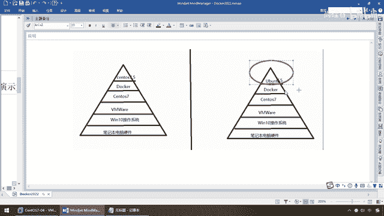
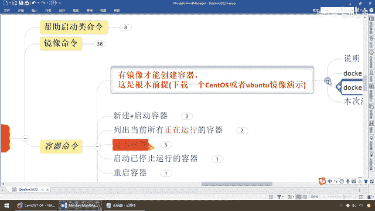

# 尚硅谷Docker实战教程（docker教程天花板） P17 - 17_ubuntu容器说明 - 尚硅谷 - BV1gr4y1U7CY

来同学们我们继续上一讲，我们给大家介绍了镜像命令，那么现在我们Docker的本地就拥有了，我们从远程仓库拉到本地的各种镜像，那么前面强调过镜像是模板，容器才是真正干活的实力对象，实力容器。

那么由镜像生成容器实力，一个一个的集装箱配合Docker来进行工作，来完成我们的容器虚拟化，那么下面我们就要介绍一下容器相关的命令，这个非常重要，请同学们务必把今天所讲的传用命令全部拿下，那么来。

那么有镜像才能创建容器对吧，镜像是模板，容器是落地的实力，这是根本前提，我们现在要演示呢，本次案例呢，我们下载一个Santa Racer或者是U版图镜像来给大家做演示。

那么这款提前复习反复的折合前面的理论，Darloin，Docker必须部署在什么Linux内核的系统上，OK，你要想部署Docker就必须安装一个虚拟Linux环境，所以说Docker它能跑的话。

它天生也自带着一个什么迷你微小版的Linux内核环境，那么在这块我们呢，演示Santa Racer和U版图，那么在这要说一下啊，以前讲的时候呢，有些同学们懵逼了，那什么意思呢，大家请看这个图啊。

我先把它遮一下，我以前是这么干笔记本电脑硬件对吧，就是我们的设备，然后呢上面我装了Windows 10套系统，然后装了个Windows V2虚拟机，虚拟机上面我们装了一个什么，带环境安装的ISO文件。

Santa Racer 7 64位的，然后在这个上面，我Santa Racer 7上面，我装了个Docker，然后我用Docker呢，再模拟一个Santa Racer 7。5，另外一个就是相当于说。

之前讲的时候有些同学就懵逼了，他说，那个他因为大部分都是小白嘛，第一次学理解啊，他说怎么你要在Santa Racer 7上面，又有Docker，Docker里面又有Santa Racer 7。

那直接在这用不就完了吗，这搞得我很尴尬，听懂了吧，所以说为了避免大家种误会，那么前面刚才大家看了，Docker一定是基于Linux内核的，所以说本次啊，我们的案例和演示啊，为了怕大家造成这样的误会。

我直接用Ubuntu，明白了吧，意思就是说，我Santa Racer 7上面，是模拟了我们的Linux操作系统，你就把它当做这个是阿里云，我在上面装了个Docker。

Docker上面我要模拟一个容器实例，另外一套Linux系统叫Ubuntu 5，OK，Ubuntu这么一个操作系统，明白了吧，当然这个版本号具体你不要管啊，那么这儿就是无疑的区别。

大家不要混淆了。

那么所以说现在我们以Ubuntu来进行讲解，好，那么大家请看，那么刚好我本地也有一个Ubuntu一个镜像，另外一个呢，实事求是说也希望大家用Ubuntu，为什么，Santa Racer太大了。

Santa Racer呢，200M，Ubuntu呢才73M左右啊，这个更快一点，好，那么同学们，所以说呢，你要当然你非你能够理解上面这张图，你不会混淆，你想用Santa Racer去做可以。

该拉哪个拉哪个，前面讲过了，写了就是具体的版本，没写就是最新版，OK，那麽这一拉，不废话，那麽下面我们本次用UBUNTU来给大家说明。

好了，那么下面我们来看看容器命令，新建加什么，第一个。