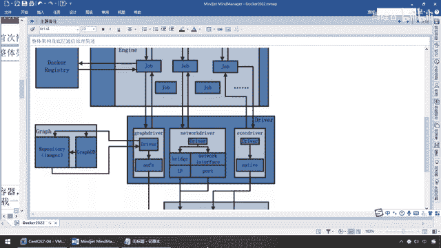

# 尚硅谷Docker实战教程（docker教程天花板） P18 - 18_容器命令A - 尚硅谷 - BV1gr4y1U7CY

好同学们我们继续那儿，确定好前因了以后，我们本次的演示呢，用U班图来给大家说明，那么这样的话呢，我们用Docker小巧，快捷迅猛的模拟出，另外一个U班图的操作系统，那么结合之前我们的了解。

如果我们只有虚拟机，假设我现在想安装部署，另外一套操作系统，那么创建虚拟机，不废话，这要加一个U班图，那么这个是非常重量级，非常笨重的一个操作，那么恐怕你每个小半天时间，各种网络配置，各种驱动程序。

各种价包的下载一堆，那么现在我们就可以看到，我们本次呢，直接呢，已经呢，在这儿，下载好了我们一个U班图的，一个最小的镜像，多少兆，才73兆币，那么现在就会变成，我们用Docker。

就可以类似于像传统的虚拟机一样，来模拟我们的U班图操作系统，好那么下面，有了镜像以后，我们大家来看一下，第一组，新建并启动一个容器，那么这个呢，我们也强调过也讲解过，来Docker什么，RUN，说过了。

在家瓦里面，类对象用关键字，NEW来生成一个实例对象，在Docker里面，我们用RUN关键字，来按照镜像，来生成一个一个的容器实例，基于背上的集装箱，那么来他的公式，Docker RUN，参数。

镜像名称，命令，以及其他的，参数选项，那么到这，我们首先，要来给大家说一个重要的，叫启动交互式容器，也即前台命令行，这什么意思呢，别着急，这块是这本集知识的重点，请大家务必听，那么可能需要后面反复。

大家呢，才会整明白，但是呢，第一次先跟着我，硬着头皮听起来，那么先来看看RUN后面一个选项，你该不会认为，Docker RUN，Hello Word，就完了吧，那么这，RUN一个镜像，好说。

那么他中间有带着一些，复杂的参数，甚至一些端口的映射，这些是些什么，那么为什么我叫，启动交互式容器呢，那么大家呢，跟着来，先看第一个，选项，那么来，同学们，我们这些选项呢，他主要。

加载一个或者是两个警号，那么，他有很多具体的命令，你可以查HELP，那么工作单中，我给大家用了这几个，好，我们先讲上半连，再说下半连，你先混个眼熟，后续我们慢慢展开，来，第一个叫什么。

GUN GUN NAME，等于容器的新名字，就是为容器指定一个名称，哎，那么前面呢，大家都清楚啊，我们在这个Docker，他要运行了以后，按照我们的这个进线，他会生成RUN了以后，会新建一个容器实例。

那么每一个容器实例的名字，如果你不给他指定的话，他会用系统，随机分配的一个名字，OK，那么这个时候，那么GUN GUN NAME的意思就是说，我这个进线，启动了以后，我要给他命个名字，比如说叫ABCD。

都没有任何问题，这个是你自己定，第二个，这个叫GUN D，什么，后台运行容器，并返回容器ID，也即启动守护式容器，叫什么，后台运行，哎，怎么这，你不是叫交互是吗，别着急，混个眼熟，那么同学们。

GUN D我们下次讲，现在是我们的重点，交互式容器，就是前台有伪装端，等待交互，就等待着用户，输入命令，来，他主要有两个参数配合用，叫GUN I和GUN T，这个I是以交互模式，运行容器。

通常与T同时使用，为这个T呢，是为容器重新分配一个什么，为输入终端，通常与I一起使用。

直白的说了，那么现在，那么假设你要运行一个，进线变成容器实力，RUN，以前就是直接加一个进线，你卖几就行了，那么现在GUN IT，代表，你启动以后，我要有，对你有进一步的命令输入请求。

需要你返回给我一个终端，我需要输入命令，来操纵你这个容器实力。

OK，那么这个GUN IT，大家再请回到，GUN I什么意思，交互模式，运行容器，通常与T，这个T分配一个什么，就是，TTY，同学们知道吧，就是Linux那个终端输入命令，他们两个经常板定在一块用，好。

那么，这个是我们现在要给大家着重介绍的，至于说后面这个启动，后台的，我们后面聊，那么现在，这是第二组，第三组他常用的option，还有个大P，和什么，小P，这个叫，端口映射，好，那么这个时候。

那么请同学们先辛苦一点，复习一个复杂的知识，来平台架构图，别着急，本次简介会反复反复的来回摩擦你们，来回虐你们，让你们彻底明白，走起，弟兄们，有没有看到这有个叫，IP端口，这是他的网络驱动，啥意思呢。

那么我们前面说过了。

到看了很强大，他可以模拟，那么现在我们假设这个刀刊里面，我，以前要使用是，单独安装一个他们开头，现在别了，我们全部上容器，那么现在刀刊容器里面，我这个里面就会有一个，我自己模拟出来的什么，他们开头。

或者redis等等等等，各种软件，好，那么现在，我们呢，要来反问里面的软件，那么现在不好意思，外面就像是类似有了一个网关一样，我们是不是要找到我们的多卡，然后由多卡再去找，先找到这条金鱼。

再找金鱼背上的具体的集专箱，某一个容器实列，那么现在大家找合的方法，那么就是这个端口映射，那么我们在这块了以后，对应着我们这有两个参数，一个叫小P，那么就是指定端口映射，那么大家请看，干小P 8080。

或者映射到80，大P叫随机端口，那么这个时候就是系统分配，多少是多少，一般我们用小P，什么意思呢，意思就是说，如果我们在这，我们现在呢，要去反问redis，不好意思，以前redis是单独贩。

我们直接反问6379就行了，但是现在呢，redis在docker内部，我要反问redis，那必须要先反问docker，那么docker怎么知道，你要反问是哪一个呢，那么这个时候就会形成，我们的端口映射。

那么这个端口映射，意思就是说，如果我写的是干小P 80，或者是6379冒号6379，那么意思就是说，在这块，我外面就会反问docker的6379端口，那么docker里面又会去找。

我容器6379暴露出来的redis服务器，所以说呢，到后面，我们呢，也会经常看到，左边，这个就是我们是吧，宿主机暴露的端口，而这个6379，那么就是docker，他反问redis提供的暴露的端口。

那么两者要有一个映射，那么如果你写小P，那么就是你人自己指定，如果你写大P，那么就是你系统随机分配，好，那么在这块，有一组两组三组，别着急，那么现在等我们讲到后面他们看的时候，再和大家说，但是现在呢。

先跟大家说一下，这个最重要的选项，这个是你肯定要掌握的，所以说干脆第一次，让大家看个明白，那么接下来，我们呢，就来试试什么叫启动交互式容器，注意等待着前台命令函输入，那么来同学们，我们现在呢。

low眼啊，那么docker images，那大家请看，U版图我们现在呢，在我们的刀卡上面，想运行一个U版图的linux操作系统，那么怎么运行呢，按照我们的公式啊，刀卡，软，U版图，是这样吗，不是的。

不是不可及啊，这样的不凡，我们先看一下，大家看，什么鬼都没有，那么注意，你U版图启动以后，你这个linux，作为一个服务器启动以后。

你一般而言告诉我。

我们怎么操作虚拟机的这个3ds，是不是要给你一个打开终端，要有一个命令函，来进行更进一步深度的交互，来操控它啊，所以说，如果你在线启动hello world那样的话，它不大好使，那么所以说。

按照我们的公式，那么兄弟们，入案，注意，干什么，IT，那么在这，意思就是说，我要运行的某一个镜像，需要这个镜像成功启动以后，有点类似于，反过来，给我弹出来一个终端，你先别急着走，等待着主人。

我需要向你输入更多的操作命令，我们俩需要有交互的，OK，那么所以说，这个IT的意思，那么就是，interactive交互，T就是TTY，什么意思啊，终端的意思，OK，那么所以说在这，那么这个I。

就是我们的，interactive，OK，有一个交互，这个T，那么这个时候就是什么，TTY，伪终端，相当于说，模拟呢，你要给我留一个终端，出来，我要需要继续对你输入命令，好，那么这。

如果你用Sentai OS，那么这就写个Sentai OS，如果你这像我一样，用Ubuntu，BUN，TU，那么大家再看，我的标签是多少，latest，最新的，那么可以不写，假设你的版本也跟我不一样。

比方你说Ubuntu 18。0。，或者9。3，或者什么，随便啊，是多少就是多少，那么来，搁到这了以后，别忘记，Ubuntu是作为操作系统，它需要有一种东西，叫什么，线，来跟你进行什么，交互命令的接口。

所以说，我们在后面，要加两个东西，第一个，那么就告诉你，我们呢，用Bash，OK，或者我们一般上用，Bing，Bash，这两个，都可以，那么大家请看啊，此时我现在一回车，同学们请看，这个时候。

root这个命令，说明我还在我的，Linux的CenterOS这，而当我用了这个命令以后，大家请看，他这是不是给我返回了一个，容器实例id，说明我以Ubuntu，这个作为一个进行案。

现在本地运行起来的一个，微小版的，自带Ubuntu内核的Linux操作系统，那么在容器上成功跑通，来，同学们请看一眼，Docker一卖几，大家看CenterOS我以前做的，对吧，我两种都给大家罗列。

多少兆，200兆比较大，那么这个时候大家请看，run-it，我们这换成Ubuntu，Bing Bash，那么这个时候，得到，大家请看，ps-ef，是不是最经典的Linux命令，那么大家，肉眼。

ps-ef，我们呢，也可以在Ubuntu这个里，现在相当于说，我在通过Docker，去操作另外一套作作系统，叫Ubuntu，那么你的Linux这些命令在这，几乎常用的，都可以用，你看像什么，LS等等。

OK，那么好，我们来解释一下，在这些东西，会有一些什么，那么来，成功了以后，那么这，我们来是以什么，交互模式，其中一个容器，在容器内执行，Bing Bash命令，好，那么大家请看，Gan I。

是交互式操作，Gan T是终端，那么这个CenterOS，或者我们的Ubuntu，就是我们的镜像，这个放在镜像后面是命令，这里我们希望有个交互式的效，因此用的是这么一个东东，那么如果要退出终端。

直接输入命令，EXIT，OK，那么相当于说，我现在呢，要操作Ubuntu，这个Linux系统，人家，RUN了以后，给我返回了，这么一个容器实力，并且，带着这么一个，需要脚本的命令终端，来给你交货。

那么现在主人，你要对Ubuntu，这个操作系统，进行什么样的操作，随便你，劈哩啪啦，打各种Linux命令，只要是合法，它具备的，都可以成功运行，OK，好，那么这个，就是我们，RUN命令，常见常用的一个。

启动交互式，注意，你看，前台没有退出，等待，给你返回了一个终端，给你，这个终端就叫命令函，听懂了吧，那么等待，等待着你，输入命令，好，那么现在相当于说，我进入到了这个，Ubuntu，容器实力内部。

相当于跑到这个集装箱里面，开始干活了，好，那么接下来，看第二个，列出单前，所有正在运行的容器，那么第二组命令叫，DOCORPS，OK，那么来，同学们，现在呢，我们另起一个终端，因为现在这个里面。

是在Ubuntu里面了，好，我们现在在外面来看DOCOR，那么，DOCORPS，大家请看，怎么着，是不是在两分，你看UP说明什么，这个时候，两分钟前，UP说明什么，启动成功过一个容器实力，那么来。

同学们，请看这，DOCORPS，罗列出所有正在运行的什么，容器实力，那么在这我们可以看到，e-mine件，镜像叫什么，Ubuntu，那么这个时候，你看，这个叫container ID。

之前我们是不是叫镜像ID，现在这个是叫什么，容器ID，那么说明我通过，Ubuntu这个e-mine件，获得，现在说NEO传的对象，获得了一个容器实力，它的ID就是这个，那么请看，大家尾号是ADBB。

那么这个时候请看，大家看尾号ADBB，明白，所以说，我们现在看到的，就是它，那么，它的命令是，beam bash，创建时间两分钟前，状态，成功启动，已经运行了两分钟，对外有没有暴露端口，没有。

因为Ubuntu不需要暴露端口，对吧，注意，这，请看，它有个什么，这么一个，懂不懂，别忘了，前面刚刚讲理论的时候，我们说过一个东西，我们刚才有没有写什么，杠杠内幕，叫容器的新名字。

为容器指定一个名字。

没有，所以说，各位同学，现在如果你没有，为容器指定名字，对不起，我系统给它随机分配一个名字，好，那么现在，同学们，再来，docker run-it，那么杠杠，内幕，假设叫，Ubuntu，假设我就叫。

my，01吧，我的Ubuntu，OK，myu1，那么这个时候就是，来，Ubuntu，那么刚才我们说过了，需要有个交互式的命令，那么我们用beam bash，除了用它以外，有时候，当然还会有什么。

比方说后面我们还会有sh，或有别的，那么如果你不想写这个，那么，我们用bash，也可以，也可以，这个时候同学们，请看，一回车，大家请看，只要能返回出，这个什么动作，容器id的编号，说明，这个镜像。

又生成了第二个容器实例，那么docker现在，这条金鱼，背上就有两个集装箱，这两个集装箱，都是来自于，同一份镜像，Ubuntu，我运行着。

两个Ubuntu。

容器实例，好，我们再看一个终端，此时同学们请看。

那么我们，docker，ps，大louye，刚才第一步，我们运行的时候，我们没有用什么，杠杠内膜，指定，容器的名字，那么系统给我随机分配一个，就叫这个，那么，第二个，我们加了杠杠内膜，那么系统呢。

就会用我们自定义的，哎，你有，我就用主人你给我用的名字，没有，系统给你随机分配一个，那么大家请看，command，我们的接触的命令，都是，一回事，只是用不同的写法，都是binbase，需要脚本嘛，那么。

你看，来自于同一个境界，但是却是两个，不同的容器实例id，哎，那么这个，就是我们，run，它所做的，那么来，同学们，大家，能理解这个，和这个了吧，至于说，干d，和大小p的端口映射，我们后面聊，但是。

一口气给大家罗列，你不要害怕，option，几乎就是dockerrun命令里面，最常用的，就是这几个参数。

OK，所以说大家呢，务必请要账了，那么，对于我们这两个。