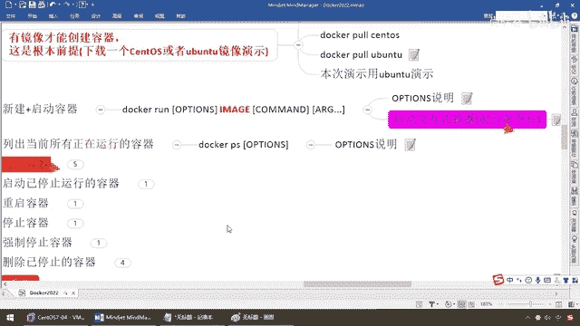
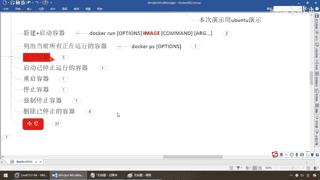

# 尚硅谷Docker实战教程（docker教程天花板） P19 - 19_容器命令B - 尚硅谷 - BV1gr4y1U7CY

來，同學們，那麼RUN命令，結合剛才所講，就給大家介紹到這。

那麼，如果你還是有不懂的，沒關係，同學們，我們現學現賣，剛才你從頭到尾是跟著楊哥，有我這個導遊帶著你過了一遍，那你說楊哥，我還想更深入的學習，這個RUN還沒有其他玩法，我要是想查點資料怎麼辦。

那麼說過了，前面說過一個HILP命令，如果你對某個命令還想進一步的了解，那麼，DOCOR，RUN，槓槓HILP，來，同學們，這個就是對於這個命令的用法和玩法，你看，我的知識來自哪，軍事官網。

軍事這些標準的API和官方要求的操作手冊，這個是不能講錯的，對吧，這些都是給大家整理好的內容，那麼假設你可以加OPTION，剛才我們說加了槓IT，那麼還可以加別的等等等等，那楊哥這個槓IT到底是什麼呢。

來，我們這兒看到，你看，是不是叫Interactive，是不是保持一種交互和交流，我們剛才是不是已經說過，那麼這個T叫TTY就是尾終端，代表著需要你主人繼續給我輸命令，我現在這個U班圖克蘇里斯特起來了。

等待著你進一步的號令，對吧，所以說我們在這兒我們可以看看我們的這個T，大家請看是不是叫TTY，那麼你看分配一個什麼，TTY一個命令函的終端窗口，好，那麼這個就是我們的RUN命令，好，那麼別著急，同學們。

還有這個D和這個大小P馬上就會見，但是OPTION前面已經說過了，最常用的這些命令，一口氣一鍋端了，給弟兄們，反正身頭也是一刀，縮頭也是一刀，早點見也是見，晚點見也是見，也別害怕了，對吧。

所以說現在你看，杠杠內幕分配名字，杠IT就是什麼，交互型的尾終端，那麼等待著命令繼續跟U班圖或者操作系統交互，就這麼回事，也沒什麼難的，那麼接下來，DockerPS我們也說過了。

那麼查看一下我們目前啟動著幾個容器實列，對吧，相當於說兩個，那麼他呢也有他的選項，那麼這些選項我們來看一下常用的有這麼幾個，A，L，N，Q，A，很簡單啊，羅列出所有正在運行的容器和歷史上運行過的。

那麼對吧，那麼現在DockerPS-A，那麼大家請看，那麼來這個呢，就說我們剛才呢羅列過，甚至有些是什麼，我刪過的，對吧，那麼來同學們請看，Hello World我們羅列過吧，PS是單前活著的。

PS-A是單前活著的加歷史上用過出現過的，就這麼簡單，那麼UP說明現在狀態，容器正在啟動，啟動了16分鐘了，OK，那麼等等，那麼這些我就不再囉嗦，那麼下面再來看，-L顯示最近創建的容器，那麼大家。

最近我們是不是創建了這個，我們的郵班圖的兩個容器實列，-L，那麼大家請看，最近的一個是哪個，是不是就是這個3699後啟動的這個，沒問題吧，也簡單，那麼-N顯示最近的N個創建過的容器，那麼-Q靜默模式。

幹嘛，只顯示什麼，容器編號，那麼來同學們我們擱到這，那麼大家請看，-PS-N，OK，那麼假設啊，我現在就是寫個1，那麼假設我不加，同學們，活著的是幾個，兩個PS，就是顯示單前正在運行的。

如果PS-N明明有兩個我就寫一個，那麼兄弟們幾個只羅列著，直按顯示什麼，一個，OK，那麼來PS-Q，那麼同學們什麼鬼，是不是只羅列container ID容器ID，這個我相信也很簡單。

更多的你自己可以查，還要譜，我只是把我日常工作中，我覺得工作中主流的常見常用的，給你整理好，其實你按照楊哥的這個腦圖，足夠你解決日常工作了，好，那麼下面我們來學一下第三組命令，那麼來。

相對於而言就簡單了，看名字你也知道，那麼退出，啟動，重啟，停止，強制停止，刪除。

不廢話，挨個過，來，兄弟們，退出。