# 尚硅谷Docker实战教程（docker教程天花板） P2 - 02_docker为什么出现 - 尚硅谷 - BV1gr4y1U7CY

各位同学大家好，我们继续通过前一讲，我们对课程大竿做了一个，基础性的介绍，那么后续我们将进入精细化的学习，一步一步带着大家把，Docker与威服实战这门课，拉通整明白，那么下面按照因材施教的原则。

这儿说一下，再次强调如果你是零基础小白，那么希望从Hello World入门，到最后变成一个熟手和高手，希望大家不要跳过，一步一步的走，一块一块的敲，跟着阳哥从零基础入门到最后的进阶片，一套打完。

但是如果你现在确实是已经，实际工作中用过Docker，对于部分的安装操作配置都OK的，那么建议你直接从高级片开始学习，不浪费你的时间，好，那么希望各位粉丝同学们，酌情参考，各取所需，那么接下来。

我们将会从基础片小白开始，带大家一步一步走，一步一步学，那么下面我们来先看一眼Docker的简介，那么熟悉阳哥风格的时候，都明白，我在教学过程当中非常注意这个方法论，一句话。

天上飞的理念必然要有落地的实现，等等等等，那么这个时候来了，又来一个新的技术了，没有阳哥你怎么学，没有上硅谷的视频你怎么学。

那么熟悉阳哥风格的。

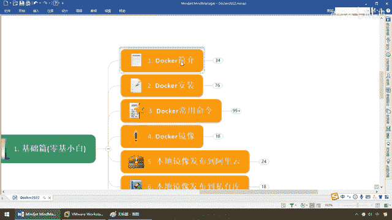

都会听过我的这样一个，算是五步的一个教学或者是学习方法，找到学习一门新技术，刷一门新技术的什么，突破口和引爆点，没有老师了，我照样能学，地球缺了谁都赚，死了我，阳哥不用吃大毛猪，OK，那么接下来。

首先一步，它是什么，对吧，阳哥你让我学Docker，何为Docker，What，是个啥，那么第二个，好处啊，解决了什么痛点，再说一把，是不是单下的主流技术，学完跳槽以后能不能展新，那么好处是什么。

能干嘛，第三一个，明白了以后，肯定是目前的安打，支架，主流技术，没什么好说，必须掌握，那么接下来，凡技术，必登官网，那么，现在下载，那么自然然，驾到本地了，安装步骤，安装过程中的，大家呢，需要熟悉。

那么最后，那么，来了，玩，去吧，也许命令，有上千个，那么，产用的命令，可能也就那，二三十个，三五十个，主流产用技术操作，我是不是必须要拿下，那么最终，好，所有技术，是从一个Hello World开始。

那么永远的，Hello World，那么今天，搞通一遍，好起来一次，那么整体看一下，OK，所以说呢，这个，基本上就是，各位同学们，要学会的，这个比学，跟着杨哥学会一般技术，更重要，我更愿意教大家。

反法论，再说一遍。

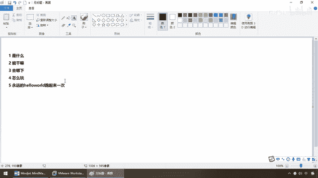

好，那么这个时候，我们就来看看，那么各位亲，Low也，那么，Talker，他到底是什么，前面我们已经说过了，请看这个图标，他像个什么，之前教学，说什么的都有，有说是瓢的，有说是菜刀的，有说是金鱼的。

等等等等，那么好，正确的，是不是，金鱼背上，坨着一群，集装箱啊，一堆一堆的集装箱，那么这个东东，是什么呢，来，我们先来，看一个东西，为什么会有，Talker 图片，好，学任何技术之前。

那么杨哥的日常方法，那么就是，我们所说的什么，AB法则，OK，那么现在，我们就来，看ABC法则，OK，那么什么AB法则呢，你学任何技术，没有杨哥了，照样可以学，那么来，我不服气，杨哥，你现在为什么。

要让我学Docker，Before，After，Andy，没有Docker之前，我现在不是活得，还好好的吗，没有这个Docker之前的话，我照样能够，调程序，系统上线，发布部署，就好比以前没有丁丁。

没有微信，我们一样办公，那么下面，我们就来看看，我们将在日常工作，和开发中，碰到的痛点，Docker。

它给我们解决了什么。

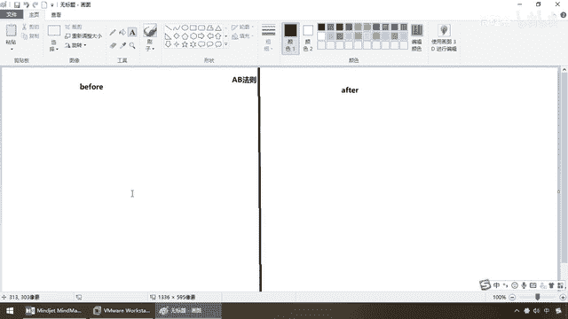

来，同学们，请看，下一个情况，第1个，大家在上归谷学习，都看过，雷锋扬老师的，上归谷古丽山城，电山项目，那么相当于说，大家用笔记本开发的时候，一定是开发环境，具有一些特定的，配置文件。

甚至系统安装软件的版本，那么，你在入职，职场，和其他工作人员，配合的时候，开发人员，你所处的配置环境，生产环境，测试环境，哎呀，你各种，挥度发布，各种生产上线，发布版本，一样，环境是各不相同的。

那么你正在开发的应用，肯定是，只，必须要依赖你，单前的配置，还要，甚至还要依赖一些，特殊的配置文件，那么你这样，企业，他自己，还拥有一套QA，以及，测试那边的，标准化的测试，和生产环境，也记这个环境。

是多套，那么，一系列，支持配置文件，将会导致，在日常工作单中，各位，开发，和，运为，发布部署的兄弟，经常，产生一个，头疼的东西。

那么就是。

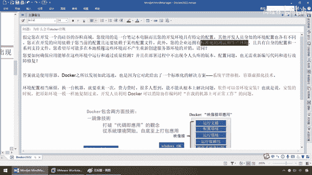

在开发的，工程师兄弟，直接会跟你说一句，干嘛，一，开发这里能跑啊，是吧，但是呢，运为呢，直接就跟你说，跑不起来，然后呢，开发又说，我这行啊，你是不是，不会部署，然后呢，麻烦了，运为也跟你签起来了。

你到底开发一堆，什么烂东西，根本跑不了，双方，唇枪舌尖，基本上，很影响，团队和谐，那为什么呢，我相信开发，没有说谎，运为，运为，运为，运为。

运为。

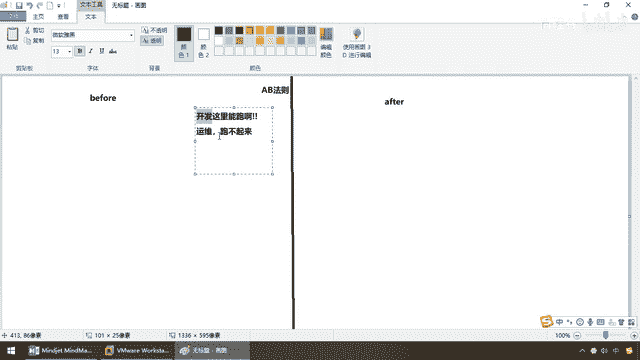

也没有说错，差距在什么地方呢，你如何确保，这些环境当中，运行和通过，这些质量检测，我的，源代码，从开发环境，移植到测试环境，再移植到，运为的生产发布环境，会不会出现，令人头疼的，版本配置问题。

那么这个时候，我们希望，平滑迁移，那么这种情况下，我们需要，使用，Docker，容器技术，那么Docker之所以，发展的这么迅速的话，因为他给出了一个，标准化的解决方案，系统平滑注意，移植，俗称。

容器虚拟化技术，好。

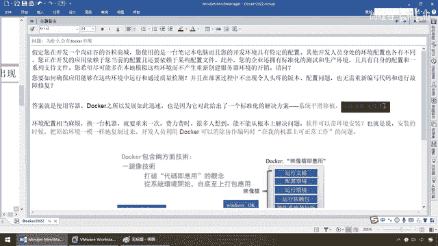

杨哥听不懂了，讲人话，我是小白，我们来，弟兄们，这是我们的尴尬，那么下面，我们来看一下，在以前，咱们怎么做事，这个时候，这边的话呢，是咱们的开发，他呢，只是，提交，原代码，对吧，挖包，打个架包，不废话。

直接呢，发给我们的运为，那么这个时候，这个兄弟呢，是运为，那么，妥了，运为也知道，开发完成了，如果他没有开发完成，他肯定不会提侧，不会提版，发布，那么这个时候运为，将会碰上一系列痛点，第一个。

假设我们的开发环境，和运为生产环境，他们，是吗，环境不一致，很多啊，加上MySQL版本，Redis，Bin，DDK，我们的，版本，最经典的，有些老系统，开发可能比较不一样，有些老系统开发可能比较不一样。

可能生产环境用的是加瓦奇，可能用一些加瓦巴的新特性，根本就没法跑，好，这是第一个，那么第二种情况，运为也很痛苦，这个时候出现，干嘛呢，装啰嗦，好，发发，上面因为这些东西跟你不一样，那么现在呢，我运为。

请你给我出一张，List清单，你是什么环境，我就这么说，OK吧，那么这样来解决这个问题，好了，那么下面我们出现了问题，开发呢，提供这么一个List，交给了我们的运为，运为照着主案，可问题开发当中。

还有一种东西，叫，拨台集群，那这个时候运为就疯了，也许我这个MySQL，是一组，一层，装两胎，我这个Redis，是三组三层，装六台，那么这个时候运为稍微，因为版本，因为环境，因为配置，装错一步。

那么可能我这个系统，就跑不起来，大家只能互相扯皮，那么这个时候的话呢，运为是非常非常痛苦的，那么开发呢，也限于你不数不起来，没有办法发布版本，测试没有办法，良好的测试，大家就只能内耗加班，好。

第三种情况，干嘛，我们再来试试，假设现在啊，我们的机器不够用了，那么现在运为需要扩容，好了，扩容完了以后，需要缩容，那这个如何弹性的发布，好，你现在Redis，是六台，三组三层，不好意思，我现在环境呢。

又吞了，兵发量大了，我需要你马上扩容，变成四组四层，瞬间要求你，起来两个实力，那么如果按照以前的安装步骤，你就是把运为杀了，它也不可能秒级别的给你起来吧，那么现在这个系统的发布，就卡在这，那么所以说。

导致这些将会出现，我们经常所说的这个东西。

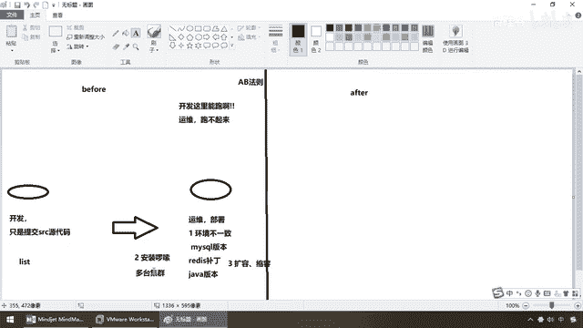

环境配置，西安当麻烦，换一台机器，就要重来一次，费力费事，那么很多人想到，我们能不能从根本上解决，软件可以带环境安装，也就说安装的时候，把原始环境一模一样的，复制过来一番。

那么开发人员就利用Docker，消除协作编码和配置时候，在我的机器上，可以正常工作的问题。

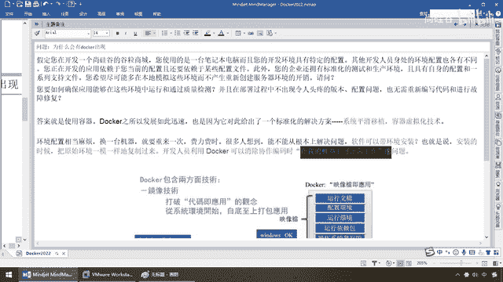

换一个环境，就挂了这样一种尴尬，那啥意思呢，好吧，结合前面这些运为的事多着呢，那么现在左边是开发，右边是运为，那么现在能不能试试，二合一一下，好，现在我们引入新的技术，来吧Docker，OK。

那么跟刚才一样，现在开发说，那么我所有的环境，配置文件，原代码，在我这块是百分之百能够，普通过的，那么我的原码，加配置文件，加环境，加版本等等等等，都是OK的，也计我的原代码，是在这些前提条件下面。

我一切OK，那么我们思考一个问题，能不能把原代码，再加配置文件环境版本等等等等，打个包，形成一个什么东西，镜像文件，大家先不要管，喷小白不要担心。

什么叫镜像。

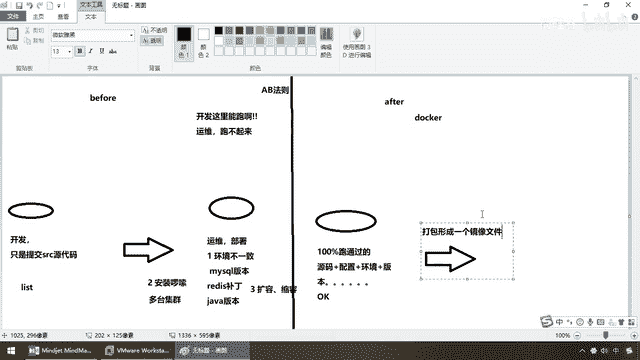

那么我们说人话，大家一定用过一个东西叫虚拟机，那么在我们创建虚拟机的时候，我们都晓得的，目前我们的SentOS，是个假的，但是它跟真的，是一模一样，为什么呀，因为在我们安装的时候，大家还记不记得。

在之前课程韩远斌老师给大家讲解，SentOS Linux的时候，安装过SentOS 7，这个时候我们是不是有个东西叫ISO，什么镜像文件，当然也叫镜像文件，所以说各位，我们现在。

既然整个SentOS 7这个操作系统。

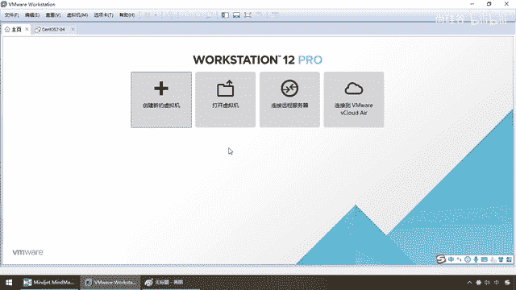

可以打成一个镜像，那么请问我们这个是不是，也可以打成一个镜像文件，那么这儿，我们让它，用一种软件，这个时候运为的兄弟，就开心了，这个黑色框框，包着全部运为的工作，那么就是我们，拖卡引擎，开。

那么这个时候，把这些东道，打包成一个镜像，然后让它跑在，刀卡上，那么这个时候，模拟出来这个环境，将会让你，开发过程当中的圆码，所跑的环境，和配置，我可以原封不动的，给你移植过来，达到了环境的匹配。

和整合，那么来，回到我们的笔记，可以看。

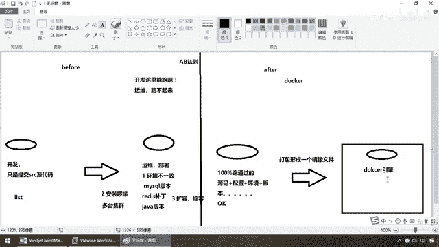

那么，Docker，它包含两方面的技术，一个，叫镜像，也就是刚才我们所说的，ISO那个文件，那么也就是我们这儿的镜像，那么第二个，我们来看一眼，以前是只叫代码，那么现在，编译以后，我们是执行应用。

不好意思，换一个环境，不能跑了，那么现在，你以前跑的是什么环境，我现在给你原封不动的，全部打包，完成，镜像，就是应用，那么这个时候，以前你只叫原代码，现在，运行文档，配置环境，运行环境，依赖的包。

操作系统，等等等等，全部打包成个镜像，就跟我们一样，就跟我们的虚拟机，刚才所说的，我们现在就给你个ISO文件，你这个，就是一个真真真正的，Sentel S7操作系统，那么，执行，不走样，完成了。

平滑移植，那么，说一个最简单的，各位同学，目前你们都住在，上贵谷，鸿福科技园附近，对吧，假设你住的是，5号楼5单元，朝北的一个，屋子，现在你找到工作以后，你需要从，餐品区，搬到朝阳区，或者海淀区。

但是你现在住的这个屋子，你住了大半年，习惯了，那么你晓得，如果你现在找到工作以后，你要搬家，你绝对不可能是，同样的小区，同样的楼层，同样的户型吧，那么这个时候，没什么好说，你要，打包，解压。

霍拉拉搬家公司，搬过去，然后呢，重新收拾，啰嗦吧，而且，一定会有丢掉一些东西，遗失一些东西吧，那么这个时候，没办法，你从，餐品搬到了朝阳，或者海淀，那么接下来，我们再上了，Docker以后。

来试试能不能有这样一种环境，我们完成了一个东西，直接，干嘛，从以前的，搬家，你晓得每次搬家都会，东西，一定会有一些，故障，一定会有一些什么，损失和损耗，迁移的过程当中，一定会产生问题。

这个就是我们运为部署，开发的麻烦，那么现在我们就想，牛逼，你找了一艘，陆地航空母舰，类似于退土机，直吧下去，一巴掌，连根基，给它搬起来，那么这个时候，就是我们所说的什么，樓，我们干嘛呢，你所在这个小区。

5号楼，5单元，5014，我把整栋楼，从餐品搬到了，你所，新公司附近的，海淀区，Brrr，树在那，那，以前你住的是，5号楼，5单元，5014，你现在搬过来以后，虽然说搬过了，但是还是整栋楼都搬了吗。

那么你当年，运行的环境，和你现在，运行的环境，从餐品到海淀，一模一样，所以说，Docker，完成的东西，就是从搬家到搬楼，规定，限死了，环境的一致，保证迁移过程当中。

打包。

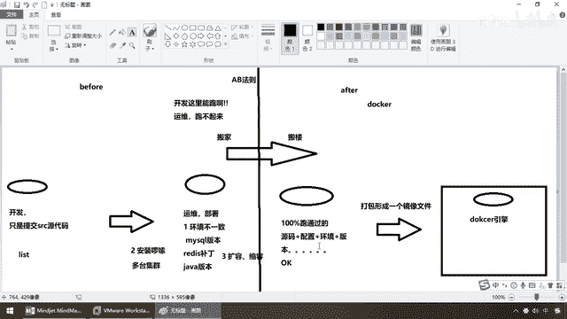

运行，不走样，这个就是它带给我们的，软件，带环境，安装，开发就再也不会说，在我的机器上可以跑，怎么到你那儿就不行了，这些废话问题，就没有了，因为你现在交的东西，除了代码以外，还有一大堆配置和环境。

我整个从搬家到搬楼，所以说，我们在这儿，之前服务器，我们要配一个应用环境，各种软件一堆砖，然后呢，电商项目一部数，Java的版本，RapidMQ的要求，MyCircuit等等等等，那么安装配置。

这些多麻烦，我们就不多说了，大家都经历过，对吧，风扬老师讲的快吐血了，累死了，很难也跨平台，那么我们在Windows 10上面，IDR就开发完了，发不到我们的Center OS，又要重新安装一套。

那么就算你不跨到系统，我们大家都试过，你的代码在你的机器上，同桌的你也跑过去，每一本环境不行，就不是不一样，所以这个移植，非常的麻烦，那么最终我们呢，做出来改变，左边是Biford，也就是我们的。

传统上，软件开发编码测试结束以后，所产出的，我现在就交了原代码，别的我不管，那么现在我们，为了让原代码这些程序，跑起来，那么开发团队和运维团队，要准备完整的，部署文件和发布流程，那么运维。

照着开发的要求，这个时候，开发需要清楚的要告诉运维，全部的配置文件，原代码和各种软体环境，即便如此啊，我们也常常发现，部署失败的情况，对吧，哪一次，交接版本切割的时候，不出点事，所以说。

Docker的出现呢，就让我们，完成，从搬家，到搬楼，不再只交一个，应用的程序，你搬家，不是只交你这个人了，连你住的整栋楼都搬过去，那么自然，我们现在呢，相当于，搬的这个过程，就是通过一种叫，镜像。

后续我们会了解，先混个眼熟，混个耳熟，将我们的各种业务系统，作业系统，进行必要的，由下而上的打个包，那么这个时候，干嘛，整栋楼搬过去，达到应用程式，跨平台的，无缝接轨，OK，那么这个就是。

Docker。

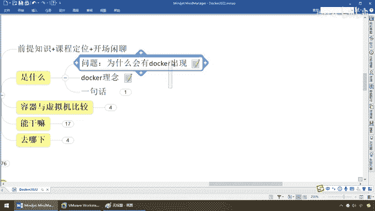

为什么出现。