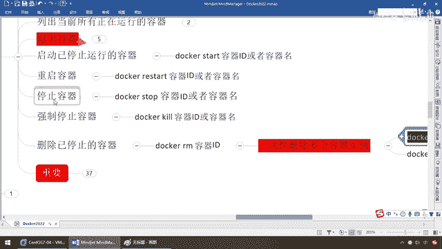

# 尚硅谷Docker实战教程（docker教程天花板） P20 - 20_容器命令C - 尚硅谷 - BV1gr4y1U7CY

好，同学们，下面我们来看一下我们的第三组，容器的停止啊，删除啊等等，不难，看意思你也应该大概猜到个七七八八，但是呢，这儿有个小知识点，就是run进去新建启动一个容器以后，它的退出机制，好，那么同学们。

回到我们这儿，我们呢，清洁一下我们的系统，docker ps，现在呢，后端没有任何一个运行者的容器实例，是空的，好了，那么docker images，那么大家请看，目前我本地呢，有三个镜像。

Ubuntu，Hello World和Redis 6。0。8，那么OK，我们呢，复习一下之前的，重新呢，来启动一下我们的Ubuntu，那么docker run-it，带需要的命令函交互的伪装端，那么。

哪一个？运行Ubuntu，哎，那么，bin bash，来，同学们，请看，再复习一下，对吧，那么这个上起了个65f4，那么第二个，docker run-it，那么如果你愿意，杠杠内幕，等于什么什么，对吧。

随便你，那么这儿呢，杨格托克了啊，那么我就不再写这个了，Ubuntu，那么，来，也是bin bash，OK，那么来看，9774，那么相当于说，我现在这儿，明显看到命令和终端都不一样吧。

这个是还在我的Santa R4这儿，这个呢，是已经跑到了两个Ubuntu的容器实例里面，那么好，再来，docker ps，那么大家请看，9774，65f4，同一个inmg，两个容器，妥了，那么接下来。

我们来看一下，退出容器是什么意思呢，来，它有两种退出方式，你首次run进去的时候，如果你用exit，run进去，exit退出，容器会停止，第二种，ctrl加p加q，你run进去，容器了，这个退出。

容器不会停止，好，区别就在这，那么同学们，请看，我现在，活生生的给大家摆在眼前的事实是，两个容器实例，我们先看，尾号是9774这个，来，大家请看，现在呢，ls，那么进去Ubuntu。

常用的linux命令，只要它有的，都能操控，当然有些它没有，可能，比如说，同学们，后面我们会说，比如说inmg，a。txt，它会说什么，command notafund，哎，理解为什么人家才是。

73兆了吧，它只加在linux内核，其他那些用不到的，通通去掉，你用不到的你自己再去改装，这个我们后面说，但是这呢，刚才有些同学来问说，哎，为什么我这个，运行成功以后有些命令我找不到，这是正确的。

你给我个面子，delkars，imgis，人家Ubuntu这个，多少，才73兆，它为什么快，它为什么小，它瘦身了，不是linux内核的，通通，不给你加载，所以说有些命令找不到，是正确的。

它的意思就是什么，我给你个最小的集合，这个是linux的核心，你需要什么你自己去，组装，慢慢的构建出你，自己的境限，那么当然这是后话，我们后面说，刚才课间的时候有同学，来问我，杨哥不对啊，怎么我运行。

这个Ubuntu有些命令执行不了，执行不了是正确的，没有就是没有，好，你们现在，回到这，不多说了，那么我们，在这呢是9774，我乱进来的，我现在用exit，一退出，大家请看，是不是从容器。

又回到了我们的send2s，那么这个时候，同学们，我们来，执行一下我们的命令，这个时候大家请看，我们刚才的，什么东西，9774，大家看，是不是9774，exit以后，怎么着，这个，容器是不是就，消失了。

能跟上，刚才是两个up哦，现在只有，一个up了，它是多少，65f4，是不是我们，当前另外一个容器，实力啊，所以说这，要注意，乱进去的话，用，exit退出，容器会停止，好吧，那么第二种情况就是。

我可能乱进去了以后，我，退出的时候，我不希望这个容器，停止，两种都有效，有些可能，整了以后的话呢，它进去以后，就是需要你停止的，那么你就用exit，退出，但是我不想停止啊，那么同学们，请看。

ctrl加p加q，大家请看，65f4，是不是也会从我们的U版图，退回到了我们的send2s，那么这个时候，同学们，我们再来看一下，怎么着，还活着呢，up，你看，名字是不是，这个，所以说，请同学们。

一定要注意，这是我们的，两种退出机制哦，好，这个呢，不多说，也很简单，那么下面，启动已经停止，运行的容器，那么，不废话，刚才你们晓得的，我们现在这个65f4，退出了以后，还活着呢，但是，刚才我们的这个。

什么东西啊，9774，是不是，退出了以后，就挂了，哎，那么现在我们来看，启动，已经停止运行的容器，那么同学们，docker，start，容器id，或者容器的名字，好，那么下面，重启，停止，前置，停止。

删除以停止的容器，打开，打开，那么，弟兄们，我认为，一看，就瞄懂了吧，OK，那么来，随便操作几个吧，那么现在啊，我们呢，直接，docker ps-n，最近两个，那么就是刚才的，你看，已经挂了这个。

是不是，就是我们的9774，好，那么现在啊，我们，要做的事情呢，是这样的，我需要把，刚才已经停掉的容器，重新启动，那么，就是start，我觉得真的很简单了，对吧，docker，start，那么来。

把我们的这个，容器id，张过去，那么同学们，load它一眼，那么，当前正在运行的docker ps，刚才是只有一个，现在，回答我是不是，你看4秒钟以前，又启动了，那么这个时候我们的9774，又回来了。

爷亲回，听懂，爷的青春又回来了，那么来，兄弟们，这些，不用我再废话了吧，restart，stop，当然这个命令，你要了解就行了，你别，乱搞，OK，好了，这三个，我认为大家的基础，都学到高级部分了，对吧。

自学一下，没问题吧，敲一下这个命令，不讲了，那么下面请看，删除已经停止的容器，好，我们，在这儿注意，什么鬼，已停止了，docker rm容器id，那么这个，我们稍微讲一下，给大家演示一下。

那么docker ps，注意，upup，人家活着呢，听懂，那么现在docker rm，注意i是删，镜像，什么意思，这个i就是，隐蔓集，明白了吧，如果，没有这个i，就说明删的是什么，容器，那么要么你加个。

容器id，要么你加个容器，名字，OK，那么当然我们说过这个，系统分配的，我就没有，写那个杠杠内幕自定义了，那么现在docker rm，那么来，同学们，刚刚，启动的，然后这手一删除，大家呢，看一下。

怎么整，不给删，错误的返回提示，消息，demo从后台的，docker引擎上，你不能，删除这个正在使用中的这个容器，就是，巴拉巴拉巴拉，这一大堆，对吧，那么它取了前面的这几位，你看3402，OK。

那么stop这个容器的话，before attempt remove，或者说什么，前置，那么意思就是，什么概念，你看rm是什么，删除什么过，已停止的容器，人家up的时候你去删。

那么docker是不是也要有一种安全，健壮性，你不能，我用着呢，你把桌子给掀了，对吧，那不合适，所以说，两种，我现在硬删，删不了，那么删不掉，那么这手，干嘛，我先给它停下来，先给它停下来以后，说明什么。

没人用了，对吧，stop，再rm，这个时候，你是可以删除的，那么docker，ps，那么大家请看，我们的974，是不是就没有了，现在，只剩下65f4了，OK，那么这个呢，就是我们的什么，其中的一个。

那么好，如果说，那么再复习，那么，start，那么你，哎呦，已经删完了，已经没有这个容器了，找不到了，那么所以说，给它恢复的话，这个容器呢，已经没有，因为我刚才把它rm了，那么来，同学们。

那么现在我的意思是，这个也是up着，我就要强制删除，那么咋整呢，那么大家，请看docker，rm，干f，那么来，同学们，刚才是id，那么现在你也可以拷贝名字，这个时候，那就是，宣桌子了。

我知道你在up着呢，那没办法，哥们，我不给面子，直接，就踢你铲子，强制删除，OK，所以说呢，这个呢，就是docker，rm，注意，有个前置，是已停止的，可以用它，没有停止的，那么需要，什么，强制删除。

加个f，那么当然，一次性的删除，多过容器实例，那么这个呢，红色，危险，指碱，不掩饰，有兴趣的同学呢，可以去试试，那么跟刚才一样，我们呢，生产上不要用，这个，咱们开玩笑的说，你不要干这些，糊涂的事，好吧。

同学们，那么现在，docker，ps，干n，那么，假设，现在这两个都已经删掉了，最近两个都没有，那么如果，有的实例的话，你看，docker，ps，干n，a，干n，q，啥意思呀，那么假如说。

干脆我就再给同学们启动一个，docker，rm，干n，it，u，buntu，也不费事，并办事，那么，来，弟兄们，那么现在，大家请看，我这儿是不是已经有一个了，那么来，什么意思呢，如果说，它这个意思是。

瘫素的组合运用，那么，docker，ps，干n，a，干n，q，那么就是，演示，当前，正在运行的，只有这个，什么，容器id号，你看，第191，第191吧，那么相当于说，这个作为一个，什么，第191。

用这个dollar，包起来，作为一个数字参数，交给前面，我让它呢，来进行什么，删除，那么这儿，有一个，算一个，如果有一堆，那么你可能删除了，就是把你，跑着的多个，多卡容器，全部给灭了，那这个手段。

是很严重的，这是一种，第二种呢，是xargs，那么这个就是什么，linux的可变参数，那么，我们都用管道符，说过了，上一个命令的，结果结，可以作为，数字参数，集在这个，xargs里面，然后让它删除。

那么相当于说，我们这么一查，那么，查到了，现在有一个，算一个，就是，只有一个id，把这个id作为数字参数，传给这个xargs，然后，执行docker，rm，命令，那么相当于说，来保证，删除干净，OK。

好，那么同学们，我这儿呢，就拿，上面这个，那么，当然，有时候你要加这个，小f，就是，强制删除，那么来，同学们，那么一看，这个命令是非常危险的，给大家演示了，你知道就行了，生产上，工作上，不要用，OK。

那么好，同学们，这个呢，就是我们关于，我们的重启停止强制。

这些呢，我相信大家呢，应该，是，妙懂。