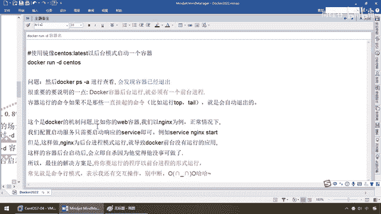
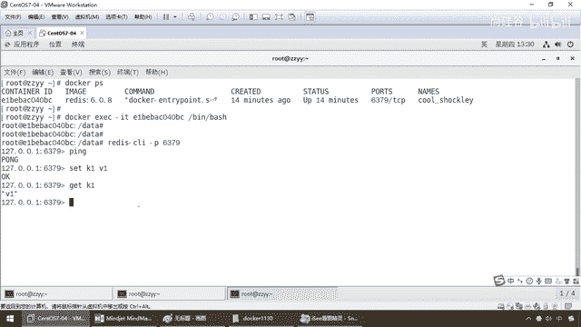

# 尚硅谷Docker实战教程（docker教程天花板） P21 - 21_容器命令D - 尚硅谷 - BV1gr4y1U7CY

好，同学们，我们继续，那么通过前面的讲解，大家请看，我本地已经被我造的，是一干二净，是吧？，后面根本没有任何活着的容器实力了，全刷光了，那么下面我们来看最后一组，什么鬼？重要，这个是非常重要的。

必须要求，大家彻底明白，再进一步加深，加细，来，同学们，请看这么一个东西，刚才我们讲了，容器的退出，软进去以后，XIT退出，和软进去以后，砍锤加P加Q去退出，对吧？，容器一个删，一个退，下面的问题是。

既然你可以退，能不能进呢？，假设这个容器实力，你现在STOP，停止容器了，然后呢，我又给它起来了，我又想重新回去，可不可以？我想反复地，进出这个容器实力面，进行干活，对吧？那比如说。

你怎么可能什么东西都是一次性吧？，哦，这个房子建好了，住一晚上，我把房子给炸了，第二次要住的时候，我再重新建楼，挖地基，从头来？不可能，所以说，干多的时候，我们可能需要一种机制，可退，可进。

不要把容器停止，这是第一步，那么，得到第一个问题，我们如何再重新进入，活动状态下的容器？，第二个，刚才呢，我们一直讲着过来以后，启动，什么。

交互式容器。

给大家介绍，GUN IT，你可别忘了，我，杨哥刚才说过了，这个D，什么东西，是不是后台运行容器，我们还没讲呢，叫什么，守护式容器，OK，非常重要，一个是容器实力的，进和退，另外，容器启动以后。

跟用户的中断交互，是前台的保留的交互式容器，还是后台的后端默认，静默形式，两种就要给大家说，所以说，在这块引出，开篇的题目以后，为什么叫，重要了，来，同学们，走起，那么下面，我们待会儿，我来说前后对比。

来，有镜像，才能创建容器，这是根本前提，本次案例的演示，我们玩一个，Redis 6。0。8，OK，那么我们为了节约时间，大家都知道，Docker，镜像下载比较慢，所以说杨哥，就提前下好。

我们Redis 6。0。8，我习惯用这个版本，没有什么特殊的意思，你要是不喜欢，你用Latis最新的也可以，不干涉大家，那么下面，我们来看一下，什么叫，启动守护式容器，好，那么同学们，意思是这样的。

在大部分，场景下面，我们希望Docker的，容器服务，是在，后台默默地运行的，就跟我们的Tomcat，启动以后，我们不希望，我们的系统下面有一个黑色的窗口，否则人家一不小心一关，Tomcat就没了。

Redis也是一样，我们是不是设置过Redis的配置文件，Demo，让它在后台启动，不要显示那个，界面，对吧，所以说，我们一般可以通过Gandi，指定容器的后台运行服务，比如说，某些，系统。

我们需要跟它交货，我们就用Gandit，我们现在给它启动以后，我们，不再需要用Linux72脚本，跟它交货，我们就通过Di，让它在后台默默地运行，就OK，好，那么同学们，请看，Docker Run。

Gandi，容器名，之前是Gandit，叫什么，交互式容器，现在叫，Gandi，这叫什么，守护式容器，一个是钱，一个是号，OK，好，一定要分清了，那么，来，Gandi什么意思呢，假设。

我们这Docker Run，Gandi，ZentOS，那么好，只不过ZentOS我们是不是换成了什么，Uban图，那么同学们。

我们给大家。

看一下，大家请看，Docker Run，Uban图，然后呢，我们这个时候，之前，我们，晓得是不是Gandit，甚至还可以，设名字，等等等等，现在我，直接Gandi，OK，但是此时，Docker PS。

有没有，不对啊，杨哥，他不返回了这个，流水号吗，这个容器ID了吗，不好意思，没有，为什么，这种叫启动，失败，一般养成习惯，只要你run了一个容器以后，最好用Docker PS。

查看一下他的状态有没有up，别到时候你着急干活，你会发现，这个金鱼背上根本就没这个集装箱，你宽宽宽的运货进去，发现，箱子没了，那么这个时候，请同学们，务必run，跟ps几乎是联合用，来。

那么这个什么意思呢，我们用Docker PS去看以后，发现容器已经退出了，是，它是曾经，也确实产生过，但是马上就退出了，为什么，回来这，很重要，就是Docker容器后台运行的时候，就必须有一个什么。

前台进程，容器运行的命令如果不是那些，挂起的命令，比如说TOP、TEL，它就会什么，那么退出，我这个是Docker的什么，机制，它本身就这么设计的，稍微有点，不大人性化，所以说，假设我们是以U盘图。

甚至是以Nginx为例，我们这样呢，run了以后，Nginx也好，或者是U盘图也罢，它会进入到后台进程模式，导致Docker前台没有运行的，应用的话，这样的容器后台，会立即什么，自杀。

它觉得没有人需要我，我不需要跟你交货，那么我启动了，干嘛，也确实反悔了，这个容器IT的流水编号，但是，没有人需要我，直接自杀，所以说呢，我觉得我无事可做，没人用，所以最佳的方案是，既然你要运行的程序。

以什么，前台进程的，形式运行，那么常见就是我们，GUN IT的命令模式，OK，那么表示我们还要有交货，你别中断，听懂了吧，所以说呢，一般而言，这样的话呢，有心，进线，它干D的话，它是不可以的。

它Docker机制需要是什么，你非要用GUN IT，来给我弄，能跟上，好，那么当然，如果你后面没有加Bash或者是Bing，Bash的话，它默认也会带一个，效脚本，那么来，同学们，LS-L，OK。

EXIT，那么来，Docker PS，OK，一套，所以说呢，在这块以后，我们再试一下，那么，用Redis来给大家演示，前台和后台的区别，来吧，第一种，IT，前台交货式，启动，那么来吧。

Docker Run GUN IT，那么，换成Redis 608，OK，那么同学们，这个呢，也不困难，那么大家请看，Docker Run，GUN IT，那么，Redis 6。0。8，那么同学们，看一下。

会出现什么效果，来，这个标志，Redis的官方的，肯定，你熟悉吧，那么这个时候，怎么着，我们现在用GUN IT，的命令给Redis启动了，但是不小心关了这个窗口，或者说，停了这个服务，是不是。

容易误伤啊，所以说我们这儿，只希望Redis作为一个后台的，服务器，启动就行了，我们更多的交货，不需要，那么你看，一不小心我按个Country C，那么怎么着，马上就退出。

我们的Docker PS这个服务，就没了，你想想，你的Redis如果，清单就被人家这样关了，还玩个屁啊，这个缓存没了，各种，击穿穿透的问题，什么都来了，所以说，这个可以启动，但是，对于Redis。

你要是，用GUN IT，前台交互，这样的话，那找死，所以说，一般而言，对于什么，像MyCircle，Redis这样，我们只希望他，后台，默默的做个服务器，哥，干嘛，深藏公与民，你默默的，启动着就行了。

所以说我们要GUN D，那么，再复习，前后，对比，来，GUN D，后台运行容器并返回，容器ID，也即启动什么，守护式容器，所以说，同学们，过来这，两相比较，给大家说清楚，那么来，弟兄们，我一点开。

Docker Run，GUN D，后台，行了，Redis，感谢，你启动着就行了，Docker PS，弟兄们，怎么着，这个手是不是代表着，我们6秒钟前，刚刚启动了，Redis这个镜像。

我得到了这么一个40BC，容器实力，那么这个就叫我们的前台，交货，这个叫我们的后台，守护，这两种，一定要搞清楚，那么，同学们，整明白这个以后，那么有些同学说，启动了以后，我怎么去，进入到这个Redis。

别着急，我们先讲镜像命令，后面我们再聊，那么大家请看，以前，来对比一下，我们来学Redis，的安装的时候，在Linux的上面，原生的安装Redis，各种GCD的配套，还要做什么，配置文件修改。

还要做什么，MAKE，MAKE INSTALL，到Docker容器了以后，直接给你一条命令，就行了，这就是容器化，技术的威力，那么，你装一台，Redis，能不能理解这个叫什么，秒级启动，那么现在。

只是一台，我还需要一台Redis呢，再执行一次，到后面，我们讲到，高级部分的时候，那么同学们，Low他一眼，怎么着，复杂安装说明的时候，那么，干嘛，安装Redis集群，Docker版的容器版的相当牛逼。

那么这个时候呢，面试题第四集的分享，这分布式存储的真实案例，这个也是阿里P7的一个考题，问你那些，Rehash之类的，那么有兴趣的同学，能坚持下来的，一定要看看，我们的高级片，好，那么这不多说了。

至于说怎么进入Redis，待会我们再说，好，那么接下来，请看，查看容器的日制，Docker Logs，容器ID，好，什么意思呢，那么大家都清楚，我现在，所有的软件都跑到了我们的Docker，容器上面。

那假设啊，金鱼背上的集装箱越来越多了，这个是Redis，下一个是MyCircle，再下一个是MangoDB，再下一个是Nginx，那假设我现在觉得我的Redis，我想看看，后台日制怎么办呢，我是不是得。

爬到金鱼背上这个集装箱里面去看，那么所以说Docker呢，也给你了，Docker Logs，然后干嘛，过来这看，来，直接，你看看，诶，这不就是刚才我们启动的那些，打印在前台的那些日制吗，现在呢。

全部给你后台，默默的保存好了，OK，那么假设你Redis出错，那么这个时候，我们就看，Docker，我要看看日制，哪个，哪个容器上的日制，用这个命令，完全可以看到，OK，好，那么这儿，顺便说一下。

你别忘了，现在的工作，基本上，干嘛，第一个，编码开发为服务，第二个，上线，部署容器化，这两个完了以后，第三，步，那么就是，时时，刻刻要监控，明白，那么你这堆，现在为什么叫DV，OPS，开发，加运为呢。

以前真的是，陈雪儿，阳哥，十年前，我干活的时候，是吧，整完加码，加码代码，一交给运为，他自己去发布，没有什么事，现在陈雪儿，是越来越累，搞到最后的话，当然，我们呢，对上，对下，对周围，基本上都要有工作。

合作的这种可能，那么慢慢的，运为也会被我们开发，人员给抢过来，除非大厂，一般的中小厂，很难因为，运行几个服务器，去专门招人，所以说做运为，的兄弟，可以做，但一定要，变成高手，一定要去大厂，普通的中小厂。

现在大家绝业成本，不再愿意养这个运为，开发工程师，让，开发直接来，EVOPS搞定，所以说这个，时时刻刻要监控，这个是什么概念呢，现在，同学们，我们现在，要监控，我们后台日志，我们是不是用，DOC。

LOG这么一个命令，那么能不能不用命令呢，什么意思，所有监控，几乎，现在都是要有什么，图形化平台，所以说，在这块，那么，弟兄们，到高级片，的时候，那么这儿我们可以有，Portana来给大家介绍，那么。

这个是DOC的非常，常用的日常图形化，监控工具，那么当然更，复杂的，欢迎大家，云原生，雷锋扬老师的K8S集群那套，也拿下来，足够你成为一个真真真真的，Devobs，开发家运为的，双料工程师，好。

那么下面这一块呢，就说，一下，那么到后面这些命令，我，都会用Portana来给大家进行，容器化的演示，就是一个界面，不用敲这些命令了，OK，那么，当然啊，学任何技术，咱们都要先从，什么，最基本的命令。

就是基本功，不许跳过，你别说，哦，那懂了，懂了，，这张刹，直接跳到后面，不可以啊，好，那么下面，查看容器是什么，内，运行的进程，那么也就是说，我们强调过了，我现在，假设啊，Docker PS。

那么这个呢，是我们的一个什么，Redis，这么说，OK，有点类似于我们的什么呢，进程，查看，我们在服务器上面的各种进程，要么是PS干EF，要不然的话，同学们，干嘛。

我们是不是还有一个东西叫Linux世界里面，有一个查看系统性能的，叫TOP命令，能跟上，OK，那么当然这个TOP，现在我演示的是什么，查看我的Sentai OS素主机，那么下面我们的问题。

我们前面强调过，这些跑起来的这个，Docker的这个容器实力，都是一个个，微小版的Linux，那么它也可以去看看，现在，这个容器里面，这个Linux的，负载情况，那么就是，Docker，TOP，来。

同学们，Low-E，怎么着，我这个，只运行着一个什么，Redis的，其他的，没有运行，那么我的这么UIT，PID，等等等等，TTY，包括，运行的时间，那么这个呢，都是一个什么，查看我们。

容器内运行的进程，那么，再来看，查看容器，内部，信息，Docker，Inspect，容器ID，那啥意思呢，那么来，同学们，再次强调，这儿，不妨我们再回到，我们的原来的一个图形，来这儿看一下。

从静像的角度看，任何一个容器实力，可以看作是一个什么，简易版的什么，Linux的，环境，所以说Linux具备的，那些东西，它都有，但是这是一种内核，级别的，最微小的，有些用不到的，它就没给你加载。

包括Root的，用户权限等等等等，所以说，一定要理解这句话，是每一个，容器实力，其实就是一个简易版的，迷你版的，缩小版的，Linux的核心运行环境，所以说，搁到这儿了以后，我们得到的，结论是什么概念呢。

那么请问，它，跟我们这个Inspect，命令，又会有哪些，影响和不一样的地方呢，那么请大家看，Docker，Inspect，好，我呢就拿这个，来看，那么这个呢，是一大堆大堆的，节程串，大家请看，网络。

网桥，IP配置，等等，等等，包括我们这，后面我们会看到，容器卷，等等等等，后面会讲，大家，来看，Command的命令，你现在是一个Redis Server，我们是不是容器，启动了一个Redis嘛，对吧。

那么来，进线，来自于哪个，Redis 6。0。8，这个是一种Jason的形式，更细致的查看，我们这个容器的个别情况。

那么现在大家对这个命令的体会。

还不深刻，后面我们到，高级片的时候，它会反复用到，尤其讲到，Docker的网络和网桥的时候，到时候我们再来说，你只需要知道，这个就像是扫一个X关，查看Docker内部的容器，好，那么接下来，同学们。

LowTip一眼，这儿有个东西叫什么，刚才我们解决了第一个问题，什么叫交互设，什么叫守护设，那么接下来，我们要解决第二个问题，怎么退，第二个，我怎么重新进，好吧，那么来，进入正在，运行的容器。

并以命令喊，交互，那么同学们，请看，我们在这儿的话，有两个命令可以重新，进入我们的Docker容器，第一个叫Dockerexec，-it容器id。

怎么着。

bin， share， bash， share，等等，好，那么同学们，LowTip一眼，我们先来看，理论，PS，假设我们这儿有个，以前有个，Sentai OS，那么在这儿，大家请看，exec是。

执行进入的意思，那么-it，交互，我原来是，一个Sentai OS，对吧，我现在退出来以后，我想重新进去，没问题，那么用，exec，那么它常用的命令，大家请看，干电，detach，是吧，是一种。

运行这个命令，是在什么，后台运行，-it是前台交互，所以说你exec，一般我们进去以后，都需要跟它重新。

交互，用it用的比较，多一些，好，那么同学们，我给大家，演示，大家请看，dk，run-it，u，bunt，ubuntu，bin，fash，没问题吧，那么大家请看，按照，我们现在ls查了一个，我在。

这个ubuntu容器实例里面了，我ctrl加p加q，我退出，dk，ps，大家看，我这儿是不是有个ubuntu的容器实例，现在什么状态，up，活着呢，但是我现在已经从集装箱，里面，ubuntu的这个容器。

退出来了，退回到了我的linux系统，里面，我又想重新进去，那么按照，我们的公式，那么大家请看一眼，docker，exec，-，help，那么来，兄弟们，干爹，是不是什么，你看run command。

in the background，是不是叫后台起到，守护式的，-i，-t，interactive，交货tti，命令尾中端，好的，那么兄弟们，请大家看，那么此时我，docker，我已经。

退出了我的ubuntu容器实例，那么现在直接拷贝，exec，注意，-it，我，过来这儿，干嘛，bin bash，还是想继续，跟咱们的ubuntu，命令含交货，一回车，请看，这个时候，咱是不是又。

重新进到了18a6这个，容器实例里面，明白了吗，好，那么这个时候，同学们，这个就是我们的。

进和退，OK，好了，那么这。

是一个最基本的，第二个，请大家看，叫什么，重新进入，还有一个命令叫，docker attach，容器id，它也可以进入，明白了吧，那么有两个，exec attach，那么这两个在面试中呢，也会，敞卡。

分别是什么意思，你工作中用哪个，为什么，来，同学们，请看，那么在这块，请大家，务必拿下来，那么上述两个，区别是这样的，attach直接进入容器，启动命令的，终端，不会启动新的，进程，那么用exit。

退出的话，会导致容器的什么，停止，但是exec，是容器中打开一个新的，终端，并且可以启动什么，新的进程，用exit退出的话，不会导致容器停止，明白，那么来，同学们，请我们呢，先来看这个。

现在我docker run，一个ubuntu，然后呢，我用，ctrl加p加q，退出，没问题，然后我又，重新进来，我们前面说过这个，是不是不会退出，对吧，我又重新，exec进来，我用exit，退出。

大家请看，怎么着，它还是。

活着的up状态，没有退出，来，同学们，我们演示，那么现在，docker ps，ubuntu这个，活着吧，那么现在，docker exec，我现在进来，并办事，没问题吧，那么，如果按照我们以前的。

那么现在我呢，ctrl加p加q，我呢，直接退出了，此时再来查看，我们docker ps，请看18a6，活着好好的，没问题，那么下面我再进来，你看18a6，我又进来了，此时我用exit，同学们，请看。

我再用docker ps，怎么着，18a6，活着好好的，也就说，基本上，我们一般，工作中，就用它，它退出的时候，不会是什么，人走，菜妙，对吧，你不吃这碗饭了，你别砸这口锅，别人还用呢，但是呢。

有些命令比较凶残，一次性，我不吃了谁也别吃了，直接把房子给点了，能跟上，所以说呢。

这个呢，就是它们俩的区别，好，那么现在docker ps，那么来，刚才exec演示完了，那么下面我们来看看，attach，怎么着，不会启动新的进程，会导致容器什么，停止，那么来，弟兄们，请看。

我run一个U版图，刚才试过了，如果ctrl加p加q，退出，没问题，那么我怎么进入呢，docker attach，容器id，那么来，docker att，attach，容器id，我现在进入U版图，来。

那么还是bin bash，加不加都OK，这个不用，那么来，这个呢，我们来看一眼，那么来，弟兄们，我们是不是，进来了，那么现在请看exec，一退出，没了，能跟上，为什么，你不能再进入一个。

已经停止的container，start it first，说明什么，attach进去以后，只要exec，退出，会导致我们的容器，stop，所以说它，不咋好，所以说同学们，工作中，请务必要用我们的什么。

exec，OK，好了，那么所以说呢，我们这样得到的结论，推荐大家，使用docker的exec命令，因为退出容器终端，不会导致容器的停止，否则的话，真的，你干完了以后，你把stop，你把这个容器实力停了。

那别人还用啊，那肯定会产生矛盾和一些，激化一些冲突，好，那么现在，我们呢，整个案例，运行着下了，docker ps，我们的U版图挂了，可别忘了，我们的redis，还启动哦，那么这个时候，同学们，我们呢。

用之前的redis容器实力进去，试试，那么来，和刚才一样，docker exec，进入到我们的容器id，那么在这，放到这，同意再给大家讲，exec-it，对吧，那么来吧，我们呢，过来，bin bash。

进来吧，现在相当于，我进到了我的一个什么，redis容器里面，好，我现在要进来以后，用redis的方式，来跟你沟通，那么大家请看，那么是不是我们redis client，gampp 6379。

那么这个时候，兄弟们，大家看，那么，pin，pwn set kz，vz get kz，弟兄们，是不是一套带走，打完收工啊，这样的话呢，慢慢的，大家就学会了在容器下，进行干活，开玩笑的说一句。

如果你把阳哥的docker学完，再去把雷锋阳老师的云原生，k8s那套学完，几乎你，应该是变成一个容器化云原生平台的，加瓦开发工程师，可能以后，在你日常工作中，你就不会再去安装，什么rabbitmq啊。

mycircle啊，这个redis啊，等等各种的一套安装，可能就是全部在容器上，开工，甚至更，更加爽的就是什么，你入职的，新公司啊，这家老板呢，也是一个容器的爱好者，可能你入职以后。

根本就不会什么。

像传统的那样，比如说，同学们都晓得啊，我们这，假设你这个做一个新员工啊，如果你是，老项目，老技术，那么可能你第一步啊，是不是给你一个gitlab，对吧，或者是，一个企业版的一个什么github。

让你什么，科隆，或者下载，公司的各种什么，文件加代码，对吧，你各种下下下，那么就是，下载，安装，贼慢不说，还不容易配置成功，那么但是现在如果你是，什么，第二家公司，新员工，那么你现在，用的是容器化。

云云山的，这样的，那么用这种新技术，可能你进去以后，干嘛，就是一切，在云端，全部，跑容器，那么可能就是，先让你过来就说，你先装个dokka，然后，这是第一步，第二步，给你一个，本开发小组，用到的，全部。

镜像，那么这个镜像，一拖到本地以后，一次性运行，那么什么都有了，OK，不会出现什么，比如说我们这个镜像，这个镜像文件，比如说我们雷锋扬的，古力山城这个，对吧，镜像文件，那么爽死你了。

你需要跑的时候可能需要，electrc search rapidmq，java8，然后呢，eq5。7等等等等，反正都打包到这个镜像文件里面，我们都跑到dokka上面，我只下载一次，给我这个镜像。

我跟所有研发，我们本项目的兄弟的版本，环境配置全是一模一样，这个就是什么，我们新技术的威力，所以说希望大家呢，还是要注意现在这个，云原山和容器化，这样一种技术趋势，那么希望大家呢，务必认真的。

打好这个基础，学完这些初级和，高级部分，好，那么大家请看，那么一般用，小d是后台启动，程序，再用exe进入，对应的容器实力干活，OK，好，它退出是不会关容器的，那么来，同学们，这个呢，就是我们的什么。

容器命令，里面非常重要的交互部分。

