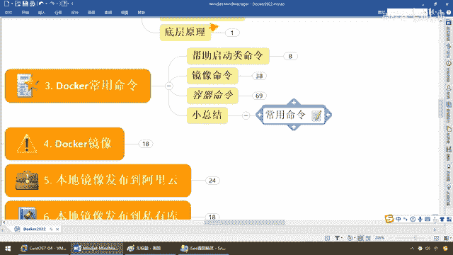

# 尚硅谷Docker实战教程（docker教程天花板） P22 - 22_容器命令E - 尚硅谷 - BV1gr4y1U7CY

下面我们来看看最后两组命令，好，那么现在我们来看一下，从容器内拷贝文件到主机上，来，什么东东，容器到主机，这什么意思啊，那么弟兄们啊，我们当然呢，都清楚，那么假设我现在U版图我起了一个容器，实力。

那么刚刚呢进去了干了一些活，我又退出来了，那么现在Docker PS活着呢，我要重新进去复习exec-it，哪个？U版图这个ID，好嘞，那么这个时候BinBash进来了，那么下面我们都知道啊。

你看我当天是在U版图的根目录下面，进入到我们的TMP临时目录下面，对吧，那么假设我touch a。txt，我新建了这么一个a。txt文件，没问题吧，我在容器内干着活，好好的，但是架不住出现意外。

比如说现在有哪个无聊的人，直接给我干了一个什么，Docker rm-f，强制把我这个容器实力删了，那么请问我现在在9a66容器室里面，所做的工作a。txt，那是不是就消失了。

因为我整个容器都被人家干翻了，对不对，直接把我是什么从根上拔起，灭门了呗，但是我里面的数据，我里面的资料很重要啊，那么我现在是不是需要一种备份啊，OK。

我需要把容器里面的重要数据。

重要内容给我弄到主机上，哎，那么这样的话，你就是删了这个容器也不怕，那么它是一种什么保险措施，所以说这个时候copy，那么我们的命令按照我们的公式，很简单，那么Docker cp copy。

容器id冒号，容器内的某个路径下面的什么东东，然后拷贝到目的主机下面的某个路径下面，那么原样拷贝过去，这么说能跟上，那么大家请看公式照着操作一下就OK了，好我们的简单的来试一下，那么现在呢。

我们呢想干的活呢，直接啊，那么假如说我现在在这个U版图的这个9a66，这个下面有一个a。txt，那么现在弟兄们我退出了，Docker ps 9a66活着呢，那么Docker copy。

那么我要把这个容器下面的按照公式怎么着，id对吧，容器id冒号，容器内的路径，冒号容器内路径，time的下面的a。txt，你要拷贝到哪啊，比如说我拷贝到阳哥主机的yuyu那个zzyy。

user这么一个路径下面，好那么弟兄们，大家呢，请看一眼，如果啊我cd我自己的这个工作空间目录，那么在这个路径下面，大家请看是不是有这个a。txt啊，OK，那么现在假设你给我把这个容器实力给我。

直接强制删除了，没关系，重要资料我是不是已经备份了，OK那么很简单照着公式操作一下就OK了，图文并报了吧，好同学们不多废话，来下面，这个比较重要，导入和导出容器，来什么概念呢，这也是备份的一种。

不过这个呢，功能更强大，刚才呢只是把容器内的某些资料拷贝出来了，那么起到了一个关键核心资料的保护，那么下面我们的问题是，我想整个镜下，来做备份的整个容器来做备份的完全可以。

大家看export和import导入导出，那么这个呢，导出容器的内容，留作为一个踏的归档文件，OK，那么对import呢，什么再从踏爆里面的内容创建一个新的文件系统，再导入成为一个镜下。

那么他们两个互为相反的逆操作命令，那么来同学们按列，docker导出容器ID，那么变成一种踏爆就行了，那么来同学们啊，现在呢我们来看看，docker ps，刚才这有个叫9a66没问题吧。

那么docker export，那么导出容器ID哪一个，就它了，OK，那么导出了以后把它导到哪，一般默认就导到单前目录下面，你叫什么名字呢，abcd。t，来同学们，那么相当于说我把这个容器。

直接就导成了这么一个踏爆，那么相当于是把整个容器备份了，它比刚才那个cp copy命令更狠，copy命令只是把一部分从容器拷贝回主机，而现在这个导出相当于什么，你把整个容器什么一锅端，是吧。

那么同学们能不能理解我们前面所说的，搬家到搬楼呢，我跟你一锅端了，没什么了不起的，那么现在我就叫abcd。t，好了那么下面，直接过来那么abcd。t。gz，OK都可以好，那么同学们啊，我们现在来试试。

那么下面呢，我们来看它，abcd。t，刚才我们那个又把它什么导进去，那么请看这有个短线叫镜像用户，镜像名，然后镜像的版本号，OK那么好了，那么同学们我们现在试试啊，假设多卡rm-f，我们一不做二普修。

我直接就把这个给删了，那么好了，我现在我只有这么一个abcd。t，那么现在同学们，dokar ps，我们这个优班图已经灰飞烟灭，没了，那么现在我们要按照公示，看看我们能不能恢复过来呢。

那么同学们请看一眼，现在呢，我们把刚才的优班图呢，打成了一个备份包叫abcd。t，那么过来，现在过来这，那么弟兄们这呢，叫abcd。t，对吧，那么dokar把他找到的东西再导进去，那么这个镜像用户。

那么你可以有一个包名，那么叫etr-gui-guo，这么说能跟上，那么镜像名字，那么假设，我们叫优班图，那么现在你的镜像版本号，那么假设我们就是什么，3。7，随便乱写一个，这么说能跟上，那么好。

如果不出意外，那么同学们请看一眼，这个时候我们是不是就把这个容器，干嘛，全部，从踏包中创建了一个新的文件系统，再导入为什么，镜像，所以说同学们，请看我们这dokar，images，什么鬼。

是不是有这个etr-gui-guo，优班图的3。7，这么一个东西，这么说，能跟上，你注意一下，刚才我们那个容器实例，我把全删掉了，灰飞烟灭了，那么现在同学们，我们，dokar，run-it。

我就来执行我的这一个仓库，容器，镜像，那么这个时候大家请看，我来执行它，什么呢，还是这么一个动作，好，进来了，现在生成了，EC6A，这个时候请大家看，cd-temp，下面我在ll，大家请看。

有没有刚才那个a。txt，这是有的，明白吧，所以说我们就把刚才的整套容器，做了一个什么，备份，然后让它形成新的镜像，又以这个镜像来重新，恢复成上一个，运行的容器实例，达到了什么，数据的千亿，和备份的。

完整一致性要求，这个呢，所以说呢，是在我们运位当中，非常常用的，copy和导入导出，那么请同学们务必掌握，好，那么接下来，我们来看一下，那么到这儿，我们容器，镜像，帮助取得的命令，给大家全部讲解完成。

日常工作中，这二三十个命令，足够你用了，那么，老规矩，理论，实操，小总结，那么下面，常用命令，那么别着急，杨哥呢，图文并茂的，给大家做了一下总结，那么，容器命令，有哪一些，你看，start。

key or stop，等等等等，有些讲过，有些没讲过，不常用的，比如说像什么暂停，这个动作的话，我们呢，也就没有深入，有兴趣同学，可以对照这张图，来进行学习和理解，那么对于我们的什么，文件系统。

DockerFire，我们还没讲的，我们后面会说，那么在，Emallet这儿，那么有哪一些命令，等等等等，那么最多的，那么同学们，全部给大家整理好了，那么你需要以后，不懂什么命令，就来这儿查。

英文看不懂，有中文，杨哥都给你翻译好了，那么来，大家看一下，我们pro，从Docker镜像语言服务器，指定镜像或仓库名，给它拉下来，那么这个呢，就不再废话了，好吧，同学们，举起反三，那么别说。

都要是要求大家的能力，我们讲了十多个命令，那么呢，大家呢，应该掌握好，Docker的常用命令，跟Docker，后续我们要进行更复杂，更加深度的学习和掌握，这些基本功，今天必须要练一下。

凡是我敲过的命令。

我做成功的案例，你务必给我动手，跑通，谢谢大家。