# 尚硅谷Docker实战教程（docker教程天花板） P23 - 23_镜像的分层概念 - 尚硅谷 - BV1gr4y1U7CY

来同学们我们继续接下来我们继续给大家讲解第四章，Docker的镜像，哎说到这儿那同学们可能有点奇怪，这两个从开简讲到这儿，你自己前调过的Docker315镜像容器。

仓库以及刚刚讲完的Docker的产用操作命令，这不刚完成吗，怎么又到镜像了，这个不会炒回锅肉，又来老生长谈吧，那么同学们前面只是粗浅的理解，这一块才是Docker镜像的底层原理，那么两个问题。

第一个同学们，所谓镜像它底前底层结合容器和操作系统，跟我们有哪些关系，那么你了不了解什么是联合文件系统，这是第一个，第二个，从开讲到现在我们都晓得，反正没有镜像的话，我们去服务器上原成拉一个。

本地软运行就OK，那么这些镜像都是我们从服务器上拉出来的，那下面我们的问题是，那么我们自己本地能不能自己做一个镜像，也提供给别人服务呢，那么看一下我们的笔记，大家请看对于我们镜像的命令，前面都讲过了。

这是不是有个Docker commit，这个我们还没说，好吧，那么所以说带着这两个问题，我们来看一下我们现在的基础知识，以及本次要讲解的底层原理，以及我们到Docker镜像的，Commit操作案例。

好那么同学们来复习一下，何为镜像，可是轻量级的可执行的独立的软件包，对吧，我们呢，把我们要运行某个软件所需要的内容，这些各种程序和依赖环境，打包好形成一个可交付的运行环境，这个里面就包含了代码。

运营时需要的库环境变量配置文件等，那么这个打包好的运行软件，运行环境就是我们的镜像，那么从开讲到现在都是我们用别人的，那么待会我们要给大家介绍，我们自己怎么做一个，对外暴露提供服务的镜像，那么可以了解。

只有通过这个镜像文件，我们才能生成Docker的容器实例，类似于家瓦中你有一个对象，OK这些呢大家都了然于胸，那么下面我们来了解第一个概念，镜像就像一个蛋糕，奶油蛋糕一样啊，里面是蛋糕，外面是奶油。

奶油上面再有水果层层堆叠出来的，所以说第一个概念先要明白，镜像是什么，第二个更深层次的理解，那么就是镜像是分层的，它为什么会分层，那么这就是我们的联合文件系统。

Union File System。

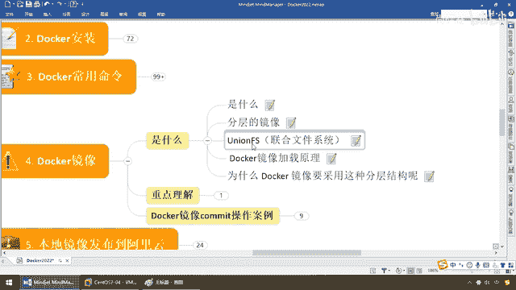

好那么下面请大家来看这么个动作，以我们的Pro从远程库拉一个，仓库里面的存在的镜像为例，下载过程当中我们可以看到，Docker的镜像好像是一层一层的在下载，同学们Docker Pro他们看它很熟悉吧。

有没有发现Pro FS这一层，OK OK拉完了拉完了等等等等等等，我们都晓得只要有这么一个流水，说明它有一层，哇我们会发现一个他们看它老复杂了，它是有好多层构成的，那么当然同学们。

我们的Docker Pro他们看它最新版，那大家请看使用最默认的版本标签，Tag latest枚价版本号，慢慢的从网站上去拉，那么这个时候同学们请留意，我们就如同这儿稍微有点慢，那么我们稍微等它一会儿。

开始下载因为他们看它还是比较大，那么这个大家可以看一下，跟我们的客建的抓图是一样，慢慢的一层一层的下载，先下完了上面的再有下面的，所以说我们给它慢慢下载，后面他们看的这个镜像我们也在用。

所以说我们得到一个结论，镜像是分层的，那么这儿我们将来说一下，镜像的底层原理联合文件系统，它是什么为什么要这么设计，以及根本性更深入的回答，Docker它的镜像架载原理为什么这么快，来同学们走吧。

联合文件系统是一种分层的，轻量级并且是高性能的文件系统，是操作系统它独有的，它支持对文件系统的修改，作为一字提交来一层一层的叠加，同时可以将不同的目录挂在到，同一个虚拟文件下面。

那么这个时候联合文件系统，是Docker镜像的基础，镜像可以通过什么分层来进行继承，基于基础镜像，那么基础镜像就有点类似于我们的什么，我们家里面的object的祖宗类，它有了一个模板一个底子以后。

可以由它制作出各种各样的具体镜像。

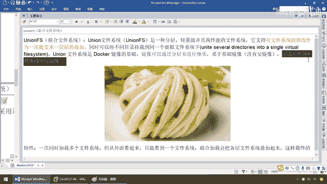

那么回到我们这儿，我们大家可以看到，以及他们看它所谓的有一句话叫，罗马不是一天建成的，那么他们看它作为一个容器，外部的容器可以跑各种的东西。

那么天生里面也带了很多小巧精妙的复杂功能。

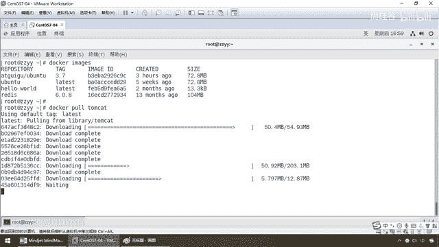

那么这一切都是一块块堆叠，所以说我们Docker来模拟他们看它，要原模原样，那么它呢，不可能一蹴而就，都是通过分层的各个子宫的模块，就像乐高搭积木一样，一块块来搭，好比我们做一个花卷一个褶子一样。

一层一层一层一层，最后多层嵌套了以后，发出这个花卷，OK，那么所以说对于Docker而言，它一次同时加载多个文件系统，但是从外面来看，就跟这个花卷这个褶子一样，有多个层吧，一层一层的，一层就是一个功能。

多个功能，多个乐高的积木块发起来这么一个花卷，我们对外暴露，只能看到一个整体，那么这个时候联合加载，会把各层文件系统堆叠加起来，这样最终的文件系统会包含，所有底层的文件和目录，每一层合在一块。

是不是就是我们这个花卷的整体，所以说联合文件系统，它就是一个分层，轻量且能够聚合的一种净下的基础，完全支持对文件系统的什么，通过一次提交来一层层堆叠，最终形成一个对外暴露的服务实体。

那么这个净下的加载原理也类似，它是这样干的，我们都明白Docker加载非常非常的快，一个容器一起动，秒装秒起，那我现在需要一个他们Cat，不用派，只要下载完了，run他们Cat，那只猫就出来了。

以前我们要各种配置，还要设置Katarina Home，那么这些为什么Docker会这么灵巧，这么快呢，你们来吧，Docker的净下实际上是由一层一层的文件系统组成，大家看这还在正在下载当中呢。

对吧200多兆稍微有点慢，那么这层好了，再发另一层一层一层一层层的小个小个小个功能模块，拼叠在一块，整个花卷给你出来，那么下面这种一层层的文件系统，就叫联合文件系统，那么对于我们联合文件系统小的以后。

我们都清楚Docker，它呢，底层有一个BootFS，那么就是跟启动BootFS，主要包含跟加载和Linux的内核。

我们都晓得前面呢。

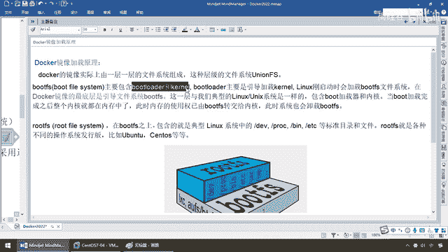

说过这句话啊，非常重要，再来复习一下，每一个容器都是一个简易版的Linux，它简在哪。

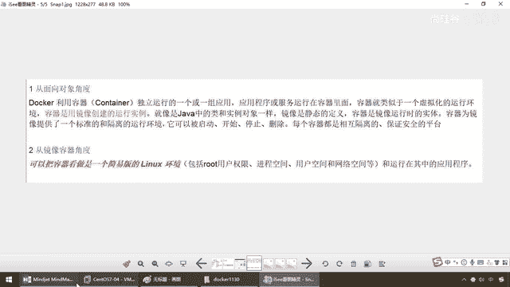

那么说明它有，怎么叫简易版的Linux，根子就在这，它包含了引导区文件系统，就跟Linux内核一样，有内核和引导，那么它呢，Bootloader就可以引导加载Linux内核。

Linux刚启动时就会去加载这个BootFS的文件系统，那么它是属于引导内核，那么引导了以后，一层一层的文件系统来驱动它，形成一个容器实例，进项发布，动员暴露服务，那么在Docker进项最底层。

就是引导文件系统。

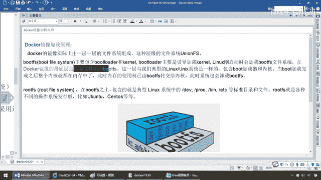

来，简易版的Linux环境，包含这些和运行在其中的运行环境。

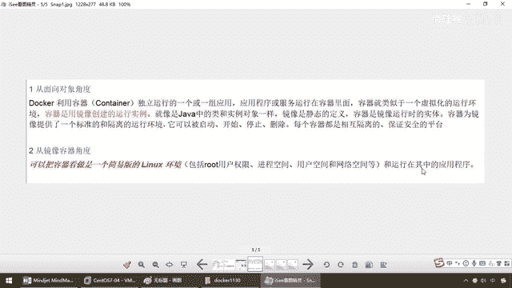

以前我们画过一个图，底层就是这个Linux，上面才是Radius的实例，那么上一层，与我们典型的Linux是一样的，包含了Boot加载器和内核，当Boot加载完了，整个内核就在内存中。

那么这个简易的Linux基础诞生了，此时内存使用权就由BootFS转交给内核，那么系统也就卸载这个，跟文件的引导系统，那么跟完了以后，我们就是什么，rootFS，你引导Linux内核启动了。

我就是一个迷你版的Linux，在这之上，我们就是有典型的Linux系统，那么这些目录，DV，PLC，BinEDC等等的标准目录配置，那么rootRF，就是不同操作系统发行版本，那么U版图啊。

Sentel OS就这么一块块来的，那么大家可以看得出，我们现在平时安装虚拟机的Sentel OS，都是多少，4。8个G，为什么Docker里面的才200MB。

因为我们只要最小的。

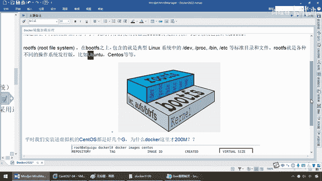

那么这个时候，同学们还记得吗，基于融气化的技术，仅包含业务所需的Runtime环境，Docker里面的Sentel OS，U版图也就是什么，170多兆，那么所以说它比较快，人家只要什么，最小的这一份。

也就是只要这个BootFS，内核和rootFS，这个就把它当做于什么，我们的基石和基础，好，那么完了以后，那么前面，我们大家说过，我再给大家演示一下，好，那么大家请看，那么现在刚刚好。

我们的Tamkart，也已经下载完成，我们Docker，Ruar-IT，U版图，那么，BinBash，我们现在运行这个，U版图的境限，生成了一个，尾号为766C的，这么一个，U版图Linux系统的。

融气实力，LS这个命令有吧，但是你看，VI A。TXT，它有没有，Command Not Fund，为什么呀，那么同学们，我们都晓得，Docker，Images，U版图，多大，才73兆币。

一个微小版的Linux系统，它为什么小，因为也就是什么，用不到的，它觉得不是非核心，非必要的，这些参数命令，统统，不卷进来，不加载，当然我体量就小了，人家只要什么，最核心的，Linux内核，OK。

所以说呢，对于一个精简的OS，RouteFS可以很小，那么，只需要包括最基本的命令，工具和程序库就可以了，那么当然了，像什么LS，它有吧。

但是那些复杂命令。

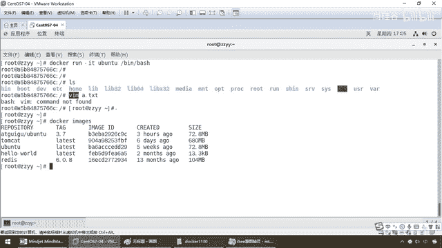

它就不给你支持，那么所以说呢，尽量的瘦身，如果到后面，你需要了，自己再去加，再去改装，那么因为，我们的这个Center，我们这个U班图，它的底层就直接附用，宿主机的内核，自己只需要提供，引导区的这个。

跟文件就行了，因此对于不同的Linux发行版，RouteFS，都是这个底子和内核是一样的，RouteFS稍微会有点差别，只不过你叫CenterS，我叫U班图。

因此不同的发行版本。

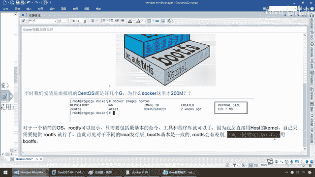

就可以是吗，公用，同一方RouteFS，这就是什么，它的根源和底层，那么为什么Docker镜像，要采用这种分层的结构呢，像一个花卷一样的，一层一层的发出来呢，那么请问，假设这层固定了，就是比如说我们。

不管是Redis，不管是TombCat，都需要某一层的功能，我就把它，叠加出来，给大家公用，那么这样的话，你就可以像乐高积木一样的，组装，你需要哪块，P哪一块，不用每次都新建，所以说，它采用分层结构。

主要是为了，干嘛，资源贡献，方便复制迁移，就是为了什么，服用，那么比如说多个镜像，都从相同的Base镜像中，构建而来，对吧，那假如说，我们现在，从官网上下载的这个Ubuntu，目前只是73兆。

功能假设这个VI，根本没有这个功能，对吧，那么我现在就想，添加这个功能，那么添加完了以后，我这个时候就可以自定义一个，含有VI编辑命令的，一个新的Ubuntu，那么我是不是只需要在，这个附类镜像上面。

做我们添加了VI功能的，这么一个新的镜像的扩展，我不用从头来吧，那么我可以继承于这个，那么这样回答我，前面这些基础镜像，是不是给大家，做好了最基本的模板啊，那么，我们大家都说，这样的话呢。

从相同的Base镜像构建而来，那么这样的话呢，Docker的宿主机，只需要在磁盘上，保留一份最基础的镜像，那么，同时我们也只需要，加载同样一份基础镜像，那么就可以为其他，所有容器服务了。

那么每一个镜像的每一层，都可以被共享，它主要就是为了完成，加载简单，资源复用，这个就是我们，镜像分层的意义，好，那么接下来，Docker的镜像层，都是什么，纸图的，镜像是纸图的，只有容器层是可写的。

那么现在，当容器启动的时候，一个新的可写层，被加载到镜像的顶部，这一层就会称为什么，容器层，容器层之下，都叫做什么。

镜像层。

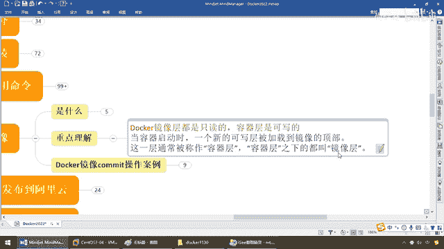

那么好，同学们，看一眼，当一个容器启动的时候，一个新的可写层，被加载到镜像的什么，顶部，我们操作所谓的容器实力，其实就是最上面这个，那么这层是容器，容器以下的都叫镜像，那么你最终对外暴露的，比方说。

这个花卷有四层，那么你肯定要吃的话，肯定是什么，从最外层开始吃吧，没有说谁不，就像我说的，吃个鸡蛋肯定是先包鸡蛋壳，你不可能隔空取物，先吃鸡蛋黄吧，对吧，那么所以说，对容器的这个改动。

你要先把鸡蛋壳给敲坏了，才能去吃鸡蛋白，才能去吃核心的鸡蛋黄，那么你对容器的改动，不论是各种增加新的一层，或者修改，都只会发生在最顶层的容器层，那么容器层是可写的，容器层下面所有的镜像。

都是纸图那么可以这么讲，我们在操作，容器下面就是我们这些内核。

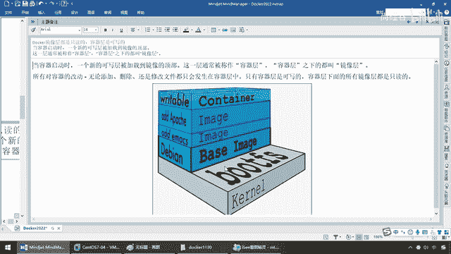

好，那么OK，在这块不烦，我们再回到我们的平台架构图。

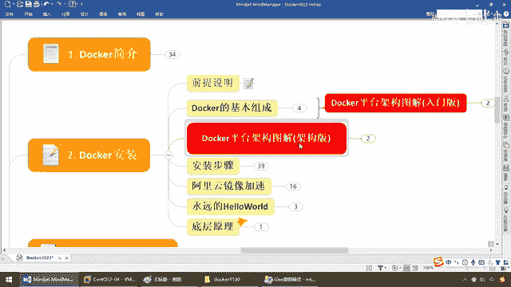

这个复杂的这个动作，同学们再理解一下，从上到下连上来以后，各种的，从拿到一个镜像，来进行驱动，加载了以后，巴拉巴拉往下走，大家请看，大家看什么，看他呢，什么动作容器，我们操作的是他。

但是他底层就是root fs，你看，layered层，这一层一层的，就是对应着我们刚才，给大家所看到的这些东西，可以这么极端的说一句，你只是操作最上面，就像你吃奶油蛋糕，你肯定是先吃奶油。

但是底下的这个，鸡蛋糕，那么都是什么，作为我们的root fs，一层一层的给你，堆叠好了，好，那么这个就是我们，Docker镜像，最重要的一个观念，记着，Docker它是分层的。

每一层的功能。

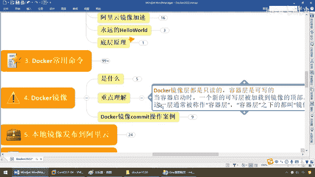

它是附用。