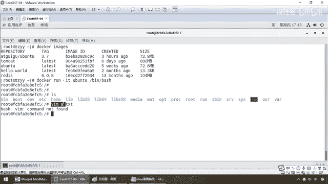
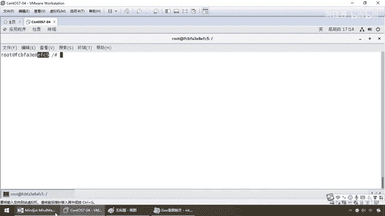
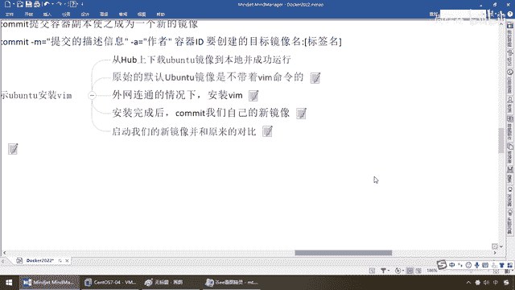
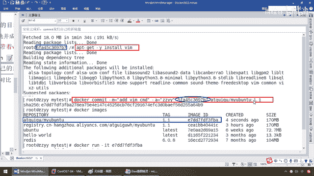

# 尚硅谷Docker实战教程（docker教程天花板） P24 - 24_commit命令上集 - 尚硅谷 - BV1gr4y1U7CY

好，同学们，完成了Docker镜像是联合文件系统，Docker镜像是分层的理念以后，那么接下来我们将会用一个案例来给大家进一步加深，那么来，同学们都清楚，我们，你看，Writeable是可写的吧。

我们操作的就是容器实例，但是容器下面都是一层一层的镜像，那么前面学过了，他为什么要这么干，我们都清楚，他干嘛，就是为了什么，保证我们程序的复用，OK，那么所以说下面我们来看一下，现在呢。

我们有个基础镜像了，叫Uban图，对吧，那么来，Docker，run-it，Uban图，那么，bin bash，OK，这个是我们从官网上，我们从阿里库上，拽下来的这么一个最精简的，最基础的基础镜像。

Uban图，那么ls这个命令，他是带着的，那么VIM A。txt，同学们有没有，command not fund，对吧，我们前面强调过，他精简，所以说他为什么快，为什么小，那些不重要，他认为不重要。

Felix内核必须的，统统给他去掉了，那么现在不好意思，假设我现在对这个Uban图里面的某个文件，我需要变更，配置文件需要修改，VIM命令我需要啊，那么所以说，在单前运行的这个容器实例上。

就是我一号GFC5这，不好意思，他没有VIM这个命令，没有怎么办，自己动手。

风一足食，所以说，我们下面就给大家讲解一下，Docker的Commit，镜像加强命令，来，Docker Commit，提交容器副本，使之成为一个新的镜像，那说人话，这个是原始官网的，Base类。

这个EFC5，是基于这个镜像，可以说，乱出来的一个容器实例，此时他并不带着，VIM，这样的编辑命令，那么现在，我想在单前镜像的基础上，不具备VIM的时候，我们自己加一个，然后，让这个容器实例。

它具备VIM这个功能，有点类似于，我们有了，这个具备了VIM功能的容器实例，我们再反向让它生成，一个新的镜像，就像加我的反射一样，那么这时候回答我，我们自己Commit出来的这个新的镜像。

是不是天生就带着了我们的，VIM的一个新加强那个Ubuntu的，镜像版本呢，好，那么这个意思，需求听懂了以后。

那么同学们请跟着我来。

来，单前是不具备的，那么我们现在让它具备，具备了以后，我们再用docker commit-m，是提交这个描述信息，对吧，就像是git commit-m一样，你本次提交的一个解释说明，一个注释。

-a是作者，我们后面就是已经具备了，新功能的这个容器在一边，我们要创建的目标镜像，Tag标签版本号等等，待会来说，那么照着公示，直接执行即可，那么下面我们来看，案例也是Ubuntu安装VIM。

那么我们现在，VIM A。txt不具备单前容器实例，我们呢，弄上来，那么首先从Ubuntu上下载，从Hub上下载的这个Ubuntu镜像，到本地并成功运行了，完成，原始默认的Ubuntu镜像。

是不带着VIM命令的，完成也给它演示了，那么现在，外网连通的情况下，我们要在单前的容器实例内部，你看，我们现在说也就在Linux上面干活了吧，我们呢，没有的话，那我们就让它有呗，怎么玩呢，来。

安装VIM，两个命令，apt-get update，那么这个是一个什么，更新我们的包管理工具，因为Ubuntu它是，一般是用apt-get，类似我们CentOS的YAM，都一样，那么同学们来，走起来。

那么在这块啊，那么让它呢，更新一下，好，我先暂停一下录屏，同学们，经过漫长的等待，如果你看到这个完成，OK，第一步结束，那么这个呢，是更新我们的包管理工具，第二步，安装我们所需要的YAM，那么来。

安装我们所需要的这个VIM命令，口误，那么来同学们，现在呢，更新了以后它稍微快一点啊，那么来，也一样，直接安装VIM，这个命令，好，那么稍微要花一点点时间，我暂停一下录屏，同学们，那么到这儿。

我们的第二个命令，也已经执行完成，OK，那么好了，执行完成以后，这个时候，大家请看，容器还是这个容器，ID没变，那么通过前面两个命令以后，VIM，a。txt，怎么样，各位同学，没问题吧，打开看。

This is the Docker，OK，保存，退出，CAT，a。txt，如何，This is Docker，那么从不支持我们的，Docker，不支持我们的VIM编辑命令，到现在。

这个Ubuntu实例里面，已经开始支持了我们的，VIM的编辑命令，那么回答我，它是不是又比之前，变强了，OK，好，那么不妨，我们退出，那么这个时候啊，我们来看一眼啊，完成这个以后，我们大家呢，继续。

安装这个VIM编辑命令以后，commit我们自己的新镜像，那么这个时候呢，你可以理解，我们现在呢，在跑着啊，Docker，你再起个终端，以前这个Ubuntu，它呢，只有73兆，并不含有VIM的编辑命令。

那么现在我们自己这个，EFC5，是不是已经含有了，那么现在，看看我们的笔记，是不是可以理解这句话，提交容器副本，使之成为一个什么，新的镜像，那么这个时候，这个新的镜像一旦形成以后。

那是不是它天生就自带了，我们的VIM的编辑命令啊，好的，那么接下来呢，我们呢，要干的活呢。

就是，安装完这个VIM以后，commit我们自己的新镜像，那么大家看一下笔记，全部下来以后，我们呢，Docker，在外面执行，commit，你看小M是一个注射，作者是谁，那么这个容器ID。

那么就是现在我们已经具备了，VIM命令的，U版图的这个容器实例ID，然后，报名，或者你取一个，镜像的名字，加个版本号。

搞定。

就这么简单，好，那么同学们。