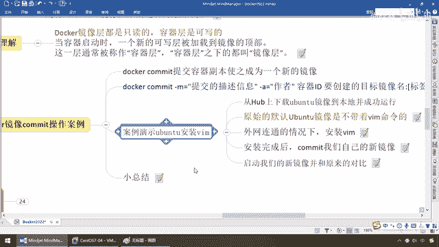
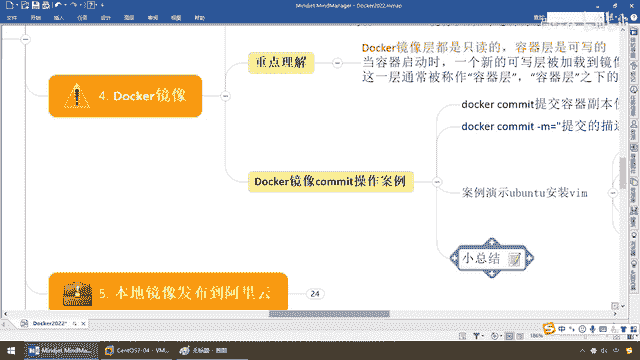

# 尚硅谷Docker实战教程（docker教程天花板） P25 - 25_commit命令下集 - 尚硅谷 - BV1gr4y1U7CY

来接下来呢我们按照我们的公式啊，就提交我们已经具备了，vim编辑命令的这个容器复奔，使之生成一个新的镜像，哎那么有点类似于是吗，我们呢重新做了一个镜像，来同学们拿过来，那么大家请看啊。

现在呢这个呢是我们原生的那个，呃，优班图，而这个呢是我们带着vim编辑功能的，新的加强版的这个优班图，好那么同学们按照公式啊，走吧，那么来吧提交的信息，那么就是我们呢，vim这个命令添加成功。

那么作者呢就是阳哥本人，好那么容器id呢，那么就是上面这一个照着公式，直接操作就行，好了，那么我们要创建的目标镜像名，和我们的标签版本名等等等等，那么就符合docker的规范，假设加个包名啊。

et归国那么买优班图，那么基本上呢，我想想啊我们的这个版本号，这次呢我们就选一个1。3，OK，那么买优班图1。3这个版本，妥了，那么来同学们请看此时返回我们这个，id流水号相当于构建成功。

那么同学们请看一眼，docker images，大家看我这是不是就有一个，et归国买优班图带着vi编辑功能的，这么一个OK吧，刚刚9秒钟前刚刚提交的，大家请看多少兆173兆，哎那么我们原生的这个。

出产默认的这个只有73兆，我只加了一个vi的这么一个功能啊，那么你看是不是变173兆了，那么结合我们前面所说的，再来反向来理解这个意思，什么鬼，以前这个base那么相当于就是我们不带。

vi编辑功能的优班图，我在上面加了一层镜像，给他加了层功能，又给他堆叠变高了，那么这个时候干嘛，我们就要明白这个分层能理解了吧，多个镜像都是相同的base镜像，那么比如说啊。

我呢还可以在这个上面再加其他功能，那么又形成新的镜像，比方说1。31。41。5，不管是1。31。41。5不同的功能，但是他们是不是均来自于同一个镜像，那么以此类推，假设以后我就不用再继承这个类了。

我直接从1。3这个版本开始继承，那么这个是不是原生的优班图，再加vi编辑命令，那么这样我们就像发一个面花卷一样，一层堆叠一层，那么我们这个镜像的功能是不是越来越强大呀，哎那么所以说呢。

他这只需要加载同一番base镜像，后面就可以为其他所有容器所服务，每一层都可以被贡献，那么来了，那么同学们完成以后我们呢，启动我们的新镜像并和原来的进行对比，好那么同学们，那么现在啊。

刀卡我们ps那么刀卡是dop，我们呢，不凡呢，先把我们的这个停掉啊，我们呢，重新来，这两个呢都停掉了，那么现在呢，我们的刀卡上面呢，没有任何容器实力，那么刀卡你卖几次了，来吧刀卡run-it。

那么Ubuntu，那么现在假设啊，我们这个是原始默认出产设置，这个大家请看vim A。txt怎么着，根本就没有没问题吧，那么退出去，那么来刀卡run-it，那么现在我们运行的呢，是这么一个对吧。

那么我们呢，直接运行我们刚刚生成的，myubuntu 1。3这个版本，那么一样的案例，大家请看，此时我们来所做的工作vim A。txt，怎么样，刚才编辑过的对吧，依旧存在，那么这个时候。

保存退出cat A。txt，this is docker和rl这个完全OK，那么所以说，我们目前新扩张的这个，容器实力，绝对要比以前功能更强大，OK吧，所以说呢这个呢，就是启动了新的镜像，和原来对比。

来，那么得到了我们的什么，ubuntu原始镜像的一种功能的加强。

那么来给大家做一下总结，在多卡当中的镜像分层这个原理，直指通过扩张现有镜像创建新的镜像，从我们单产的案例，从没有我们的vim编辑到现在有了，形成了一个新的镜像，类似于之前的用java集成一个。

base基础内，自己在按虚扩张，那么新镜像就是从base成，一层一层叠加生成的对吧，我们从官网上下载下来的这个，最原始的，也就是我们这个73兆左右的这个，ubuntu，那么就是我们左边这个，OK。

指代着最基础的内核，那么接下来我们添加了一层vim，那么后续我们还可以添加别的，那么层层堆叠了以后，是不是慢慢的，在现有镜像的基础上增加一层，那么你要么从最底层开始集成，要么又可以。

复用了以后又从这一层开始集成，那么这样的话，发花卷一样，一层还比一层高，我们的功能越来越强大，好，那么这个就是我们什么，Docker镜像分层原理和Docker制作。

镜像commit命令操作的案例。

