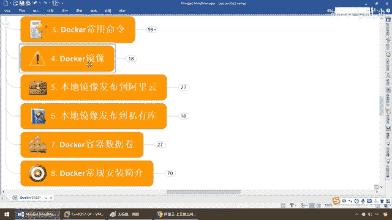
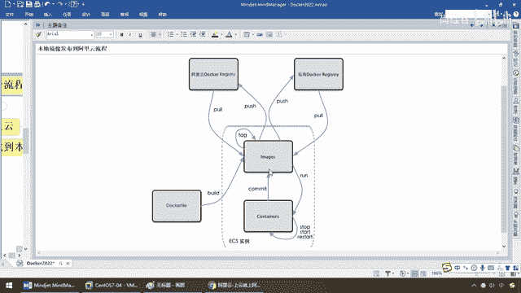
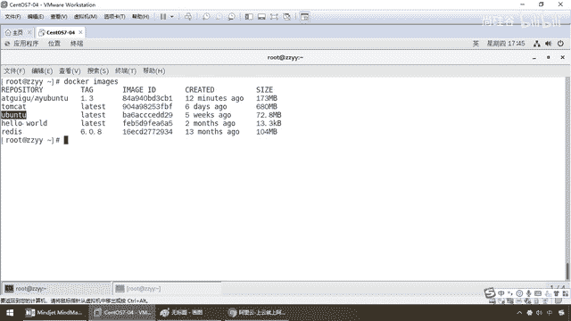
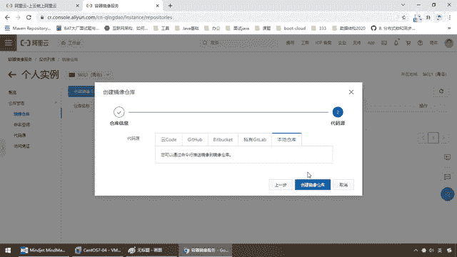
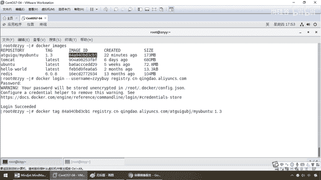
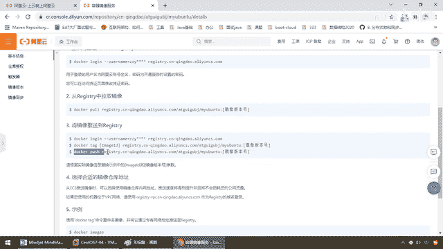
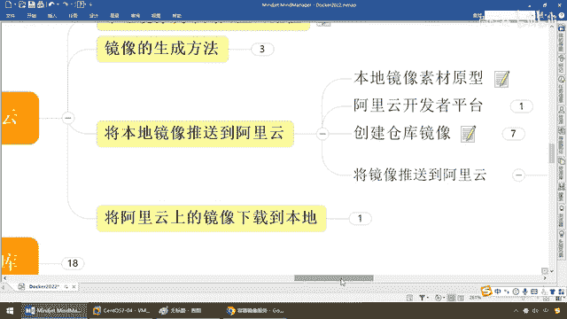

# 尚硅谷Docker实战教程（docker教程天花板） P26 - 26_本地镜像发布到阿里云 - 尚硅谷 - BV1gr4y1U7CY

好，同学们，完成了上一讲Docker镜像本地的生成，Commit命令的案例完成以后。

我们现在是不是已经在本机，已经具备了一个，Edge硅谷卖Ubuntu 1。3这么一个新版本的，Ubuntu的镜像啊，且这个功能是带有VIM，那么在这儿我们已经完成了它功能的加强。

那么接下来我们要把它发布出去，发布到阿里云上面，那么供大家使用，我们自己形成一个好东西，不能孤翻自赏吧，那么发布到组内，如果你们组内买了阿里云的服务器，那么大家从阿里云上面直接下载，那么回答我。

每个开发组的兄弟们，你们所运行全部的软件环境配置参数，是不是均一样啊，哎，假设你现在基于我来干活，你运行以后，你点开里面，100%你也是具备VIM编辑命令的，那么是不是比原生的这个要功能强大了很多，好。

那么同学们接下来我们为了，自己的镜像能够为别人所使用，我们要完成本地镜像发布到阿里云，来，同学们，它的发布流程是这样的，阿里云ECS谭信云的Docker生态如下，那么大家请自学大概十秒钟。

看看能不能看得到，我们可以看到，这儿有个Docker file，我们后面讲先不要管它，也就是说，对于我们一个镜像，它有两种方法构成，一种是用Docker file自去手工编写。

第二种用Docker commit，这个我们都说过了，那么对于我们而言，在容器里面，以前不具备VIM编辑命令，我们把它具备了。

commit提交成为一个新镜像。

然后自己也形成了一个Tag版本标签，比如说我们这儿的。

Aid硅谷买Ubuntu 1。3，对吧，那么这儿呢，死时还是在自己本地呢，那么不要孤帆自善，不吃毒食，服务管大人民群众，方便同意项目组的兄弟，那么我们呢，Push 推送到阿里云上去。

然后再把它Pull 拉下来，那么这样的话，回答我，另外一个兄弟，只要在阿里云上面，再把它拉回到本地的话，那么这个时候，它是不是可以富有你的劳动成果呀，哎，回答我，你看Git的Push，Pull。

Docker的Push，Pull，你看学通了一个以后，这些思想是不是都是相通的呀，好，那么另外还有什么，私有库，那么这儿也多说一嘴，阿里云毕竟是什么，你放到公网上，你东西在人家上面，那么假设你。

就跟我们的GitLab一样，我的源代码，我不想放到阿里那边，我还是相信我自己，那么自然而然，我们可以建私有库，这个我们下一章再讲，但是通过这张图，我们大家可以明白，就一句话，任何一个容器实力。

你自己改造功能加强以后，可以通过，Commit命令，或者是直接，在外面用Docker File，另外一种形式，构建出一个新的境限，那么这个境限，如果你想给他全组共用，方便别人，那么可以推送到。

公网的阿里云或私服的Docker库，好，那么理论明白以后，我们要看看，境下的生成方法，上一讲，我们已经介绍过，基于单线容器，创建一个新的，新功能增强的，对吧，本地Commit，这个呢，已经说过了。

那么前面刚才也说过，我呢，是用U版图做的，那么你呢，要么用U版图，要么用生态VS，单单讲解一个，我已经完成，那么家庭作业，那么大家呢，自己去做一个，OK，那么下面呢，还有一种方法呢。

是Docker File，那么他也可以生成一个新的境限，那么这个呢，我们放在高级片的时候，再给他详细的做Docker File的解析，那么在这先不再展开，好，那么我们接下来要完成的步骤。

将本地境限推送到阿里云，走，你们弟兄们，和之前的差不多，那么本地境限的素材原型，就是两个，Massentile S，或者刚才我们的，买U版图，那么我以前用的是，写的是1。1，那么这次我们写的1。3。

OK，都一样，好吧，那么同学们，这个呢，都不存在的什么，版本的这个一个问题，那么接下来，回到我们的，阿里云开发者平台，还是原来那个地址，你要是写得特别长，你就直接写个，阿里云。com，OK吧。

那么找到控制台，那么前面说过了，昨天要求大家，怎么着，那么登录成功，我自己呢，已经早就登录记了这个账号了，那么玩活以后，要找到我们的容器和镜像服务，没问题吧，那么在这，干嘛，进到我们的，有镜像工具。

你看镜像中心等等，那么主要就是，我们有两个，进入到我们个人以后，有两个东西要清楚，一个叫秘密空间，一个叫镜像仓库，好，那这是什么意思呢，同学们，我们在这了以后，选择控制台进入，那个容器镜像服务。

演示过了，选择个人实例，演示过了，也进来了，那么接下来，就像有，先要有包名，再有类名一样，它是先有秘密空间，再有仓库名称，那么你的这个镜像，体教上，其实就是把阿里云，当做了一个什么。

Docker镜像的仓库，那么，它为了方便管理，按照阿里的规矩，那么当然，它这所在地也会，检测到你最快的网络，杨哥呢，在北京华北区的，那么这个时候，请大家看，先，点开，秘密空间，类似于我们家里面。

创建一个包名，那么来吧，创建秘密空间，那么这呢，它，归国，北京，那么兄弟们，这么说，OK吧，我点，好了，创建秘密成功，那么假设啊，我们，先给它公开，到时候我们也要组内共享，都给大家呢，来来下载。

那么注意啊，这个是免费的，如果你要公司要用的话呢，你最好是付费啊，阿里云呢，现在就是让你尝尝这个功能，你觉得好朋友，那么它呢，也是极力的推自己的阿里云，那么，如果你不想被，虚拟机的这些软件所困惑。

就投个方便，花点钱买一个，好，那么这个呢，我们的秘密空间，那给大家呢，做了一步一步的解析，那么我们呢，干嘛，也做好了这个秘密空间，来这个艾特归国，北京，那么下面有秘密空间以后，第三步，干什么，仓库名称。

好了，我们的队照着过来，那么，搁到这，我们这个镜像仓库，我们就要选啊，那么创建镜像仓库，对吧，那么全部秘密空间，有没有，我们现在，也有且仅有一个，那么就是，艾特归国，那么在这个，秘密空间下面。

我们还没有，实在的镜像仓库呢，那么来吧，我们已经选了，艾特归国北京，那么你的仓库名称叫什么呢，人家说我就叫买U，班图，那么，1。3，这么说，能跟上，好，那么现在也是给他公开，那么就是在，U班图，基础上。

添加了VIM，编辑命令，那么，功能加强，我就不写了，大家懂这个意思就行了，那么后面，只要没打红心的，写不写，无所谓，那么买U班图，1。3，好，那么接下来，或者我把这个版本号去掉吧，就叫买U班图吧。

那么接下来，下一步，那么我们来看一下，选择我们的什么。

本地仓库，那么创建我们的镜像仓库，那么OK，直接过来，大家请看，来了一大堆，命令吧，那么这些呢，都是阿里云自动给你生成的脚本命令，你不用自己去是吗，编写，直接拷贝，粘贴，即可，大家请看，他告诉你。

登录阿里云，从仓库中拉镜像，这是第二个，第三个，将镜像推送到什么仓库，那么我们现在应该是，哪一个，当然是第三步，是不是要把我们本地的这个，含有，VIM编辑命令的，买U班图1。3这个版本。

推送到阿里云上面，工组内的其他兄弟使用啊，那么所以说，到这儿，我们呢，选择第三个模块，执行这三条命令，来，进入管理界面，获得脚本，那么在这，仓库镜像，管理，OK吧，那么，如果说你这，你要找不到，回到这。

那么仓库镜像来，管理和刚才的效果是一样的，那么好了，完成这些以后，我们呢，就要将本地镜像推送到，远程库阿里云，一定要保证自己网络，OK啊，那么，管理脚本界面，我们已经获得了，就这个，和这个刚才已经介绍。

那么照照我们的笔记和大杆，获得我们脚本实力，走，那么切记，上面的命令是什么，阳哥自己的啊，我脑涂给你了，你不要说，阳哥就是这么粘的，我也就这么粘，不可以啊，那么这个时候呢，酌情参考，那么，来吧，第一步。

那么大家请看，我们要完成的是什么功能呢，首先，先登录，OK，Docker Login，那么用户名，那么这是阳哥的阿里云账号，这个呢，是我自己的，那么结合我们这，你也知道，我这个时候，附用我淘宝的账号。

对吧，我们呢，就干这么一个东东，好了，那么，我们本地呢，是叫Docker Images，我们自己是叫这个名字，那么我们的第一步，那么来这吧，我们这个用户名呢，改成你自己的，阿里云开发者账号，第一步。

登录成功，搞定，那么输入命令，如果，他这，出现Success，不用说了，那么就是说明你本地，连到阿里云库，连接成功，登录成功，才可以上传，那么第二步，那么干一件什么事呢，那么结合我们公司。

就用这个Tag，那么这个呢，就是你要把哪一个，我们把这个镜像，推到我们的这个上面，你自己去设置这个，标签版本号，那么来，兄弟们，我们搁到这，这是我们执行的，官网上给我们生成的脚本，你不要去敲啊。

这个直接粘，那么呢，搁到这，同学们我们是哪一个，是不是这个镜像ID，你看人家要的镜像ID吧，这个1。3，这个就是刚刚我们完成的，带着VIM编辑器，这个命令的镜像，来，直接，粘贴，过来。

那么这个镜像版本号，那么，这一块我们多少，1。3，没问题吧，你看刚才我们建的命名，空间数叫，etq，北京，我的这个名字，就叫马尤班托，那么现在我们跟它，本地的和远程的一样，都是1。

3版本。

这是我们的第二条命令，搞定，那么第三条命令，同学们。

Push，好吧，版本1。1对应，这个我个人习惯，那么，搁到这，粘贴，那么现在Push，巴拉巴拉巴拉，这一大堆是这么生成的，那么你的版本号是多少啊，就要改一个东西叫1。3，一回车，好，那么同学们，准备。

那么各方面而言，你看，也还是100多兆，对吧，需要上传一点点时间，我先暂停一下录屏，同学们，终于上传完成，那么搁到这，和我们的笔记一样，那么在这的话呢，Push Push Push，全部呢，推送成功。

OK，那么这样就保证了我们，阿里云上面，也有了，对应的一个，一模一样的，U版图的，容器，新的镜像实例，好，那么接下来，完成这些以后，我们得验证一下，那么，我们要干一件什么事呢，将阿里云上的镜像。

下载到本地使用，那么，同学们，也一样，登录，这是什么，拉取，那么接下来我们是不是可以，从阿里云上面，拉取我们对应的，什么，镜像版本啊，好，那么现在大家请看，Docker，Images，那么来，我们这呢。

是刚才呢，是什么，上传过的动作，对吧，那么现在，我们呢，干脆呢，一不做，二不修，我们先来，做这么一个处理，我先把它，全部删掉，OK，那么就是我把本地的删掉了啊，Docker，RMI，-F，那么来。

同学们，这个时候，我们把它，删掉，好，Docker，Images，那么大家请看，没有啦，OK，那么这个时候的话呢，我们要干的活呢，来试试它，把这条命令，从阿里云上面，拉取到本地，那么，重新来过，粘贴。

我们的版本号，刚才我们小的，多少，是不是，1。3，这个版本，刚才是推送，现在是拉取，好的，那么同学们请看，拉取完成以后，Docker，Images，来，兄弟们，请看，这个是不是就是我们从，阿里云上面。

刚刚拉载下来的，这么说，没问题吧，那么来吧，直接运行它，Docker，run，-it，这是我们的，Image ID，镜像ID，Beam Bash，OK，不出意外，容器实力，生成成功，那么此时。

我们VIM，A。txt，大家请看，怎么着，刚才我们的，VIM命令是没有的，现在是不是，完整的，已经支持了呀，OK，所以说，同学们，搁到这，我们呢，完成了，我们对应的，将我们的本地参扩，推送到，阿里云。

远程的，Push，和Pull。

两个操作，那么请今天晚上，务必完成这个作业。