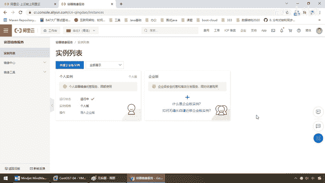
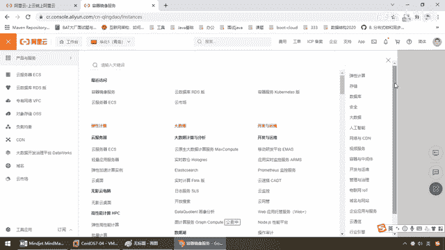
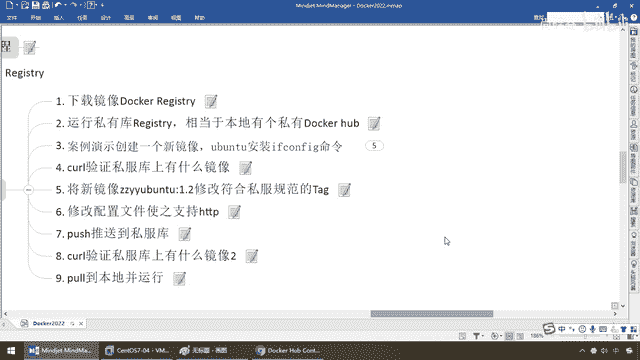

# 尚硅谷Docker实战教程（docker教程天花板） P27 - 27_docker私有库简介 - 尚硅谷 - BV1gr4y1U7CY

好，同学们，通过上面的讲解，我们已经把我们的本地镜像成功的发布到了我们阿里云的个人账户下面，OK，好，那么同学们，low眼啊，那么就是阿里云的Docker Registry。

那么刚才你已经全部的完整的走了一遍，那么这儿呢，多说一句，同学们，注意这个用户名是谁，只是你自己，因为为什么，咱们这个是免费的，什么都不到个人吧，OK，那么你推到这个上面的以后，下载啊。

各种更多的合同协作的话，需要什么吧，企业吧，懂了吧，所以说呢，买单吧，Dollar，听懂了吧，所以说呢，什么贡建生态，合作贡营，抓手币还，阿里云的这些呢，基本上大家都明白，为什么阿里的产权工资高啊。

所以说呢，这么多东西都等着对你进行收费呢，那么人家做的这些基础设施啊，对吧。

所以说呢，嘴巴上说的是主意，心里面想的都是生意，不过也没错，对吧，再删延伸，那么你想要更好，更高效简洁的服务，当然要花点费用，再次强调，刚才杨格讲的只是什么版，个人版，OK吧，那么限额使用的。

如果你要按照玩的话呢，那么你需要购买企业吧，好，那么完成上述的这些以后，那请大家今晚上也可以尝试一下，推送到自己个人的这个阿里云账户下面，对吧，那么对于我们的镜像仓库啊，你建好了这么一个，你自己呢。

命令都有了，怎么登录，怎么拉取，怎么推送，命令都有，我呢，也就不再废话，好了，那接下来呢，我们呢，完成了这个以后，那么演示过对外爆出公网，那么现在私有的将本地镜像发布到什么，私有库，那和刚才呢，差不多。

来，刚才我们是不是走了左边这个分支啊，个人账户下面的阿里云Docker Registry，那么Push Pro都演示过，如果上面你都清楚了，下面只不过换成什么，私有的什么Docker Registry。

OK，那么你不想花钱，觉得有些机密的东西，不想放到阿里云这，那自然而然你需要有自己的公司内部的私有库，好，那么下面我们来看一下，这个是个什么东西呢，叫Docker Registry，那么现在啊。

你个人账户或者个人版或企业版有这个阿里云的Docker Registry，这个没问题吧，那么下面呢，那不是还有这个HubDocker点Cum吗，这个也可以，那么同学们，这个我们强调过。

这个是不是Docker Hub各种镜像也可以放啊，那杨哥你为什么放在你的这个阿里云这个个人账户下面呢，别忘了，咱们呢，理论上你放在这个Docker Hub上面。

就跟把你们的代码放在我们的GitHub上面没有任何问题，但就有一个坑爹的，网速慢，来吧，同学们，官方呢，其实呢，他只推荐你放到这，但是中国大陆反正太慢了，且准备被阿里云取代的这种趋势不太主流。

因为毕竟我们在中国嘛，对吧，那么这个Docker Hub阿里云这样的公共镜像呢，有可能又不太方便，比如说要花费，你把东西被阿里拿捏住了，就得找你每一年涨费哦，对吧，你又不能不给，所以说。

尤其涉及一些机密的公司不想给公网，所以说我们需要创建一个本地的私人Docker Hub仓库给团队使用，基于公司内部的项目构建镜像，那么Docker Registry是官方提供的一个工具。

用于构建私有的镜像仓库，相当于把个人的或者企业版本的阿里云的这个Docker Registry或者是Docker Hub在你们公司自己搭建一套，这个呢也有必要了解一下，来，同学们，它就是这。

那么本次案例我们说清楚需求以后将带大家完成，还是将刚才那个本地镜像推送到我们的私有库这个里面，OK，那么当然这次我们也可以再做一个，好，那么来吧，同学们，首先下载镜像Docker Registry。

那么这一块拉，OK，它也是个镜像，专门用于你搭建私服版本，个人企业版的Docker Hub，OK，就在你们公司搭建这么一套，就跟我们的Maven私服一样，都这么一回事，都是一些环境类的东西，好。

那么同学们，那么我呢，为了避免这个暂停，所以说我就提前下载好了，那么来，同学们，请看一下，下载完成，那么这Docker一卖几，那么这个时候大家请看这有个Registry，OK，那么这个呢。

也是一个最新版本的，那么待会我们就要来用过它来进行完成，好，那么运行我们的私有仓库相当于本地有个私有的Docker Hub，那么在这儿这个命令稍微有点复杂，那么同学们，你照着。

先第一遍照着阳哥的脑筒去粘，本地跑通就行了，至于说它的原理，我们在下一站，可能有一个额外的知识叫容器数据卷，那么下一站再给大家讲，本来呢，是准备把这个容器卷放在中间，但是后来想想这个顺序的。

已经讲了共有的阿里云，再讲私有口，干脆一块了，反正也就是前后脚的事儿，大家没见过的东西多了，那么边看边学，不会我可以学，继续。

跟着走。

