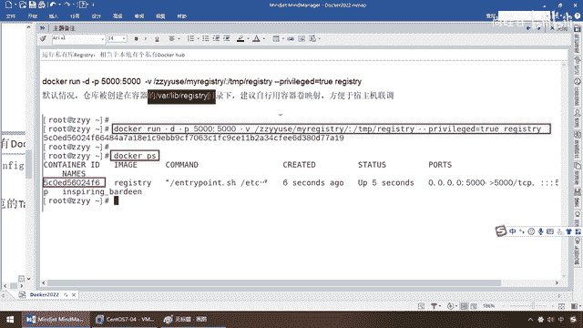
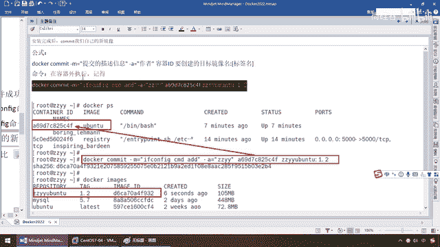
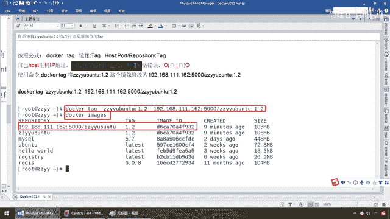
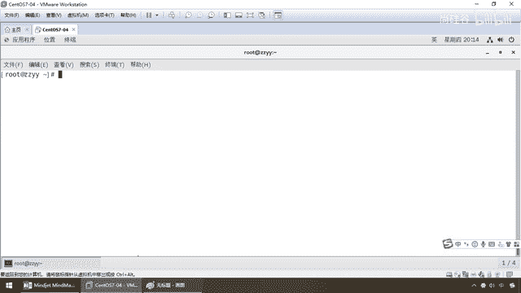
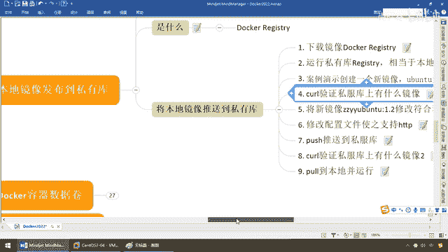

# 尚硅谷Docker实战教程（docker教程天花板） P28 - 28_新镜像推送私服库案例 - 尚硅谷 - BV1gr4y1U7CY

来同学们，那么通过前面的介绍，我们已经把这个registry拉到了本地，相当于本地呢也有一个，Docker Hub的这么一个私服库，那么这个镜像，我们现在呢已经是具备，那么我们是不是要把它软起来。

形成一个私服的容器实力，把我们本地的镜像，发送到这个上面啊，OK，那么所以说接下来，我们呢就来看一下，怎么将这个registry，这个私服库的镜像，变成容器运行起来，那么在这我们看一下它的运作命令。

Docker Hub，Gan D讲过，后台守护进程，对吧，后台运行，Gan P，50005000，诶，这个就是我们之前讲的什么，端口运设，因为啊，我们先讲完了以后，我们再回到前面的案例，来。

这有个Gan V，这个请大家暂时无视，这段代码你现在看不懂，因为我们还缺乏一个知识，叫容器数据卷，我们下一节讲，但是在这块啊，你现在呢先无视，你直接粘贴就行了，那么把这个讲通了以后，后台运行一个私服。

对应的端口运设是什么，小P，50005000，那么这个无视，那么换句话说，也只有它算是一个新东西，那么来，同学们一步一步来，一步一步给大家讲清楚，我们之前在讲这个容器命令的时候，我这有个option。

提前给大家全部看过，Gan Gan内幕，自己自定义名字，你不要，自己随机分配，Gan D看到了，后台运行容器，也即守护式容器，后台的，OK，我们用Radius做过，那么Gan IT，前台的交互设。

那么这有一个大P和一个小P，刚才我们看到我们的命令是，用的是什么，小P指定端口运设，小写的P，那么这个就相当于我们的什么，开车的手动档用小写，它主要干的活呢，小写的P主机端口运设，容器内部的端口运设。

做的事就是，比如说Gan小P 8080，然后80，它的意思就是说，如果你要来反问，我这个Docker，那么你不能碰到我的Docker，你肯定是先碰我的素主机，那么现在你先是反问到主机。

主机的8080端口，再运设进到我Docker里面的80端口，完成我们的一次通信反问，那么这个一般我们工作中，用小P，你不要用大P，大P是什么，自动档，随机给你分配的这个端口的话，有时候你容易糊涂。

所以说在这儿，我们就是一个什么，用小P指定端口运设，那么它的运设方法有很多种，一般我们只用第一个就行了，那么回到我们刚才的这段命令，意思就是说，启动我们一个Regist，私服库，这个镜像，我们已经有了。

但是我们这个容器要跑起来，怎么跑，就靠它，那么每一次容器，我们传上去这些文件，存在哪儿呢，就要存在VRlibRegister的目录下面，那么这个时候，建议自行用什么容器券印设，方便于什么素主机连条。

那么容器券的事儿，我们后面聊，我这儿是明确的写了这个容器券，你要是不写，那么相当于它是用它的默认的目录。

好，那么同学们在这儿了以后，我们来看一下，现在Regist这个私服镜像，我是有了，你卖几个没问题吧，要运行它生成一个容器，那么来同学们，一回车，OK，那么大家请看，Docker PS。

那么展现出单前正在运行的容器实例，那container ID具备，大家请看，这儿是不是有端口运设，我们用小写的P IP和主机的端口运设，左边这个是主机端口，右边这个是Docker容器实例端口。

那么我们通过5000，版本里面的5000，做一个端口运设和匹配，好，那么接下来这一步完成，那么接下来，我们再来也是创建一个新的镜像，好，还是复习我们之前的Commit命令，我们比方说。

Ubuntu安装什么，EF config命令，好了，那么这是啥意思呢，那么Docker run-it，Ubuntu，那么这个时候，Bin Bash，大家晓得的，这个Ubuntu。

是我们从网站上拉下那个最原始的，那个原生的那个，它是不具备VI命令的，对吧，那么非但不具备这个，很多命令都不具备，要不然它怎么快，它怎么小，那么所以说，前面我们演示了，VIM编辑文本编辑这个命令。

这次我们演示了EF config，查看IP的命令，那么再次强调，单前的容器实例，尾号09C1，单前这个容器，它并没有EF config这个命令，好了，那么和之前一样，干嘛。

Hub上下载的Ubuntu到竞相运行成功了，我们是不带着EF config命令的，对吧，EF config，那么单前的这个，Command not found，也找不到，所以说外网联通的前提下。

安装EF config命令并测试通过，那么和之前差不多，还是熟悉的配方，还是熟悉的味道，那么还是进行包的，一个update更新，那么之前我们更新过，这次可能就快一些，好，那么相当于在单前的09C1。

这个容器ID下面，我们要继续安装我们的EF config命令，相当于加强我们原有，Ubuntu操作系统的什么功能，好，那么在这一块的话，还是暂停一下包更新完毕，那么第二条命令，那么干嘛。

安装我们的Net Tools，那么也就是安装我们的EF config命令，那么照样执行，OK，来同学们，你看包检索完了以后，稍微会快一些，好了，那么现在完成这两步以后，刚才的09C1这个容器实例。

我们打EF config，它是Command not found，大家请看现在怎么着，是不是可以看到我容器Docker内部，它自己的IP，那么就是172。17。0。3，OK，好了。

那么现在说明我们的09C1，这个Ubuntu容器实例，自身功能又加强了，自身携带了EF config命令，好的，那么完成这个以后，那完成这个以后，和我们之前的操作步骤一样，那么是不是也要commit。

我们自己当前的09C1，具备了EF config命令的容器，让它反向再重新生成一个新的镜像，然后我们再把我们的镜像，再传到我们的仓库，仓库永远是放镜像的地方，容器它放不了，所以说在这块我们commit。

那么大家请看，还是以前是吗，我们熟悉的配方，熟悉的味道，用commit命令。

记住这是什么，在容器外执行，那么来吧，现在我在09C1这个容器里面，那么现在我退出，那么大家请看，Docker PS，那么09C1活得好好的，U版图的这个具备EF config命令的，那么来同学们。

我们执行，我们就节约时间了，因为之前我已经写过了，那么EF config命令添加了，作者还是阳哥，那么只不过现在我们的容器ID，已经改了，现在我们要提交的是09C1这个，没错。

那么现在我们给他一个新的名字，就阳哥的U版图1。2这个版本，好，那么同学们，如果不出意外，一回车，好反应过来，Docker，那么 images，那么大家请看，这是不是有个东西叫zzwy。

阳哥的U版图的这个新的镜像，那么他1。2版本，带着我们的什么EF config命令，好，那么到这了以后，我们基本上已经接近了尾声，完成了，那么启动我们的新镜像，并和原来进行一个对比，好，那么同学们。

Docker PS，那么Docker，好，我们stop，对吧，我们，这个是我们刚才commit之前的，关掉，那么现在Docker，那么images，我们是不是要有zzwy这个东东，那么大家请看。

Docker run-it，那么现在，我启动的，镜像id是它，那么binbase，走起来，那么来看看，现在是21FD这个容器，那么现在EF config，大家看是不是已经具备了，好，那么验证通过。

那么接下来就要靠它，具备这个的，我们这个镜像，我们先要把它放到我们的什么，私服库里面，OK，好的，那么，我们完成到这一步以后，大家看看，用，完成到这一步以后，接下来，我们要CURL，发一个get请求。

去验证一下，查询一下我们的私服库上，当前有哪些镜像，那么来同学们，我们回到我们的Docker，那么现在，我们要干的活，我们的需求，Docker images，那么都清楚，有这么一个zzwy。

Ubuntu 1。2版本的这个镜像，它呢，已经具备了EF config命令，是一个加强功能的Ubuntu系统，那么现在，我们后台跑这个5000号的，对外暴露服务的端口，是一个私服register。

这么一个私服仓库，那么接下来，我们是不是就要把这个镜像，推送到我们的本地私服库，那么所以说，我们是来一步步，按照我们的步骤，先验证一下，那么你看看，你们现在有没有，我们来发送一个，CURL get请求。

这些我在Cloud的，这个上面的话，给大家说过了，就相当于模拟，发了一个这个，get请求，我们来查一下，现在get请求，那么IP，我们现在是172，改一下，那么5000号端口这块，那么有哪一些服务。

就像是一个有约卡注册中心一样，一查询，发现目前怎么着，是个空的，当然了，我们没有推送任何镜像，到我们的本地私服库，那么接下来，我们呢，第一次查询，没有，我们要照做的事，那么就是要做到第五步。

将我们的新镜像，这个修改成，符合私服规范的tag，将它换个名，然后呢，推送进去，一步一步接近我们的目标，好，同学们，大家请看，公式就这样，命令叫DOCKER TAG，那么他要干的这个活呢，是这样的。

将我们本地的，zzwyu版图1。2，这个镜像文件改成为，IP加私服端口，再加我们对应的，镜像名称和tag标签版本，OK，好，那么千万不要。

张错了啊。

就是，IP啊，还有这些东西，非常容易出错，那么来，同学们，这么一弄，那么我们呢，改一下IP即可，好，一回车，那么这个时候同学们DOCKER，Images，那么大家请看，此时是不是，就已经相当于把这个。

克隆出来了一番，好吧，我们这个是本地的镜像，但是你要传到，我们的私服库上面，我们要按照，符合规范要求的，传的是这个，啊，虽然说它两个，其实本质上是一样，那么下面呢，按照它的规范形式和要求。

我们来进行传递，那么在上传之前，由于DOCKER的私服库呢，它做了安全加固，它一般默认的是不支持，这个HTTP形式的推送，我们要做一个配置，取消这个限制，那么来，同学们，那么干嘛呢。

还记不记得这个懂不懂，ETC下面的DOCKER的，demo。json，我们之前是不是配过，个人账号下面的，阿里云的加速器啊，那么不加速的话，管玩很慢，那么在，配完这个的前提下，是个Json格式。

我们要加这么一个，安全注册，告诉你，我们本机的IP，5000号端口这个私服库，它是安全的，请你介绍，注意，我以前，犯过一个非常严重的错误，我直接把这么一粘，就玩活了，忘记了，这后面有个豆号，听懂了吧。

所以说，它是Json格式啊，这个是阿里云，进线加速器，这个是取消DOCKER，默认不允许HTTP推送，进线的这种方式啊，OK，我们把这个安全加固，给它去掉，所以说在这，由于Json格式的话。

永远不要忘了，两个配置之间，有一个豆号，好，那么同学们，把这段，拷贝，内容就是它，注意IP，OK，那么来，找到我们的etc，docker demo。json，这个配置地址和文件。

那么vim etc docker demo。json，好，那么，搁到这儿了以后，同学们，直接先过来，一个，豆号，然后呢，把这段话，一粘，然后完了以后，修改我们的IP，OK，完活，就可以了，那么注意。

在这块啊。

取消这个限制以后，我们一般呢，修改完成以后，如果不生效的话，建议重新启动我们的DOCKER服务，什么意思，它什么意思呢，就是说，我查阅过一些资料，说DOCKER呢，它的新的内核以后。

可以在这块是及时生效，不用重启，但是呢，从我这个工作经验，我这种偏保守的话，只要是改了这个配置，我建议还是重启一下，好，那么有兴趣同学，你可以试试，看看重启以后不生，不重启看看它生不生效。

那么阳哥这儿呢，偏保守一点，还是改了配置，给它重新启动，那么，Restart，DOCKER，OK，那么这个时候呢，为了，因为改了这个配置，以防万一，Status，大家请看，那么现在呢，是安全和健康的。

那么好了，那么DOCKER PS，OK，那么一重启DOCKER服务以后，我们呢，也需要再运行一下，我们的私服库，因为实际生产当中，很少会重启整个DOCKER的，那还了得，对吧，所以说呢，我们呢。

完成这步以后，来，把我们的DOCKER的服务器，私服仓库5000号，重启一下，这一波，OK吧，那么大家请看，好了，那么它也应该成功运行，那么第六步也完成，那么接下来，我们要把我们的。

本地带着EF config命令的，加强版的这个UBAN图镜像，推送到我们的本地私服库，PUSH上去，那么好，那么在这块呢，它的命令呢，也就这样，OK，那么来，同学们，DOCKER，Images，那么。

DOCKER，PUSH，你推哪个，那么要推到我们私服库，要按照它的规范，几乎就是IP加端口，加我们的，镜像名称，以及我们对应的，标板的版本，一回车，走起，大家请看，是不是PUSH。

相当于到我们的这个地址，这个库，OK吧，那么，推送成功，只要出现这个，那么接下来，我们呢，玩火，这一波，第八步，和刚才一样，第二次，加个2的意思是第二次验证，看看私服库上面，有没有什么进陷，第一次。

我们发现这是什么，空的，那么一样，我们现在呢，第二次，我们来验证，搁到这，那么记得，改一下这个IP，实际情况是多少，就是多少，那么大家请看，从空的，是不是变成了，我们已经有，我们的ZZYYU版图。

这个最新的，仓库啊，OK，好了，那么接下来，第八步，玩火，那么第九步，能不能用，我们这个私服库，那么你在你们公司，那这个就好说了，只要IP端口地址是OK的，大家是不是同一小组的，小伙伴们都可以下载。

那么好，那么同学们，我们呢，Docker，Images，那么大家请看，这个，是我本地的，对吧，那么二话不说，Docker，RMI-F，一不做，二不修，对吧，我先把我本地的这个镜像，怎么着，删掉，那么来。

Docker，Images，这一波也没有了吧，那么现在说，我现在是不是要给大家验证，你PUSH成功了，那么你现在，拉下来，OK，那么好，那么这个时候，那么同学们，干脆啊，DockerRMI-F。

我再把这个也给你删掉，那么，凡是带着1。2的，统统都没有了吧，那么兄弟们，大家请看，那么这个1。3上，是刚才我们退到我，阿里云的个人账户，这是另外一回事，那么现在，我们是不是就可以来，尝试一下。

可不可以从我们的，私服库167站，把我们的U班图这个，拽下来，那么所以说，我们来直接Pull，那么，命令和刚才一样，那么DockerPull，拉哪一个呢，那么是不是就是，我们的这个192。168。

111。167冒号，那么在这块的话，是不是，ZZYY，那么我们呢，U班图冒号1。2，那么在这块，那么是不是有一个，5000的端口号，这么说，同学们没问题吧，那么尝试一下，OK，那么同学们请看。

我们现在是不是，直接从我们的私服库，拉下来了，那么再看看我们的镜像，Images，那么来，弟兄们，刚才是删掉的，现在是不是就证明，从我们的私服库，又重新换发生机了，给它拉下来，那么好了，这一块呢。

那么我们Docker，run-it，那么现在，我们的，仓库名字，就是这个，随便你啊，叫ID也行，仓库名字也行，那么呢，Bin Bash，看看能不能运行成功，大家请看，尾号C7A5，这个容器实力，搞定。

那么，EF 康Fig，大家看，有没有，那么所以说，从这儿，我们就可以什么，又获得了一个，功能的增强，可以在私服库上面，全小组共享，完成我们的什么，镜像的，传递，迁移和复制，OK，那么，从此以后。

你们的这些，什么微服务啊，自己运行好了，就打包成一个镜像，传到本公司的私服库，留新入职的兄弟来了，装个B，对吧，我们公司，一切在云端，处处是容器，都在容器下进行，云烟绅这样的开发。

甚至到后面更复杂的集群，用丰阳老师的K8S，给管理起来，那么配合，阳哥Docker的，这个基础支持，那基本上，你们就会很爽了，哎，所以说，在这块，我们呢。

就完成了我们的是吗。

将本地镜像，推送到我们私有库，相关的案例，那么请同学们，下去，练习一下。