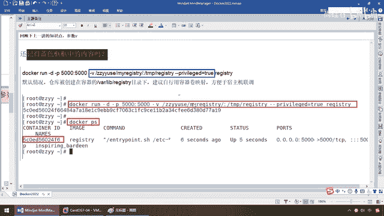
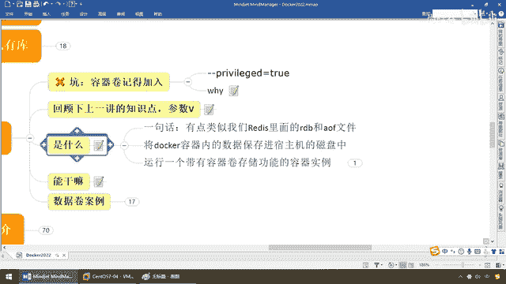

# 尚硅谷Docker实战教程（docker教程天花板） P29 - 29_容器数据卷是什么 - 尚硅谷 - BV1gr4y1U7CY

好，各位同学，大家好，请大家尽快登陆网络受课平台，并配合班主任签到，我们准备要开工了，我看了一下人数，目前因为网络的问题，可能部分同学还没有登陆，成功，我们稍微等他们一会，那么闲聊两句，各位同学。

从开始，讲到这，由于北京红服院的疫情影响，大家又封闭了，只能在家上网课，那么请同学们务必注意安全，认真学习，那么上一讲，我们从镜像到阿里云，到私有库，很多案例，很多命令，要求同学们，布置家庭作业。

能够做成功，那么希望各位同学，一定要动手，阳哥求求大家了，你光是听我讲，看我做完操作，没有用的，好吧，没登陆的同学，尽快登陆，等你名华，所以说，这块，你反正也已经封闭管理了，就在家认真学习，好吧，案例。

一定要动手做，再次强调，动手，动手，再动手，希望你少一点胡思乱想，一前在家，认真学习，OK，直白的说一句，少想想你女朋友，多想想阳哥，心中无女人，鞭马自然神，万吊心善人，抬手灭红尘，人间清醒，正前第一。

好好学习，天天向善，请大家尽快上线，登陆课堂，听懂的给我刷个666，马上开工，OK，好，那么同学们，人到的也差不多了，我们呢，开始，那本节呢，我们将给大家介绍一下，我们的，DOCA容器数据卷，好。

那么又来一个新知识点了，那么老规矩，是什么，能干什么，解决了哪些问题，我为什么要学，有什么好处，那么下面来看一眼，GO，首先，开篇名义，什么都没讲呢，先来个看，容器卷，给记到，加入一个参数，阳哥建议呢。

加，但就是有时候你不加，也没有出错，但是我一再的建议你，加上，你看我还没讲课呢，我先说个看，那么这个是什么呢，就是一个，GANGANG privilege的，等于TOO，开启权限，那啥意思呢。

如果你后面在用容器卷的时候，DOCA挂载主机目录，什么叫挂载，你就当是有一个U盘，插到你电脑主机上面，形成一个挂载，这个在Linux的，支出知识呢，韩老师都给大家讲过，不做废话，那么如果说。

我们通过DOCA的容器实力法外，出现，不能够打开的目录，说你全线被拒绝，全线不够，那么解决的办法，在，挂载的目录后面，加这么一个参数选项，Privilege，等于TOO，就OK，那么它是什么意思呢。

我们先把这个参数学会，后面的实践操作，案例单装，同学们慢慢体会，我个人建议，一定要加，就是没出这个错，你加上也没有什么问题，它没出错呢，无所谓，但是一出错，导致你程序运行不OK，那么这个是非常堪爹的。

那么因为，3。27，它的安全模块，是比以前加强了，不安全的，它把禁止，怕你影响这个系统的稳定，那么，挂载目录，就被默认为是不安全的，那么在我们的SCE Linux里面，挂载目录被禁止掉了。

我们要开启的话，我们一般用这个命令，那么扩大了容器的全线，解决挂载目录没有全线的问题，如果说你开启这个，那么你容器内，才会拥有，root的，真正的全线，我们也说过，每一个容器实例，是不是一个，迷你版的。

简洁版的linux内核系统，你开启这个，相当于说你自己，也就是个root用户，迷你版的，否则的话，容器内的root用户，只是一个普通用户全线，你看是全线不足，全线不够，所以说希望大家，把这个参数。

先了解一下，那么怎么加，加到哪，我们已经明白了，这个是一个全线扩容，保证你有root用户的，这么一个动作，那么下面，我们承上启下，上一讲，我们是不是，完成了我们的私有课，那么回顾一下，上一讲。

我们的知识点，有一个参数位，那么大家来看一下，还记不记得，蓝色框框当中的内容，这个是我们上一讲，执行过的，对吧，我故意放到前面，那么给同学们，以后工作中，你也会碰到，你没用过，没学过，没见过的，怎么办。

是卡在这，还是两个字，照打，无所谓，先屏蔽你那些不懂的，工作中，直接用，这个模拟过去，过程当中，就是你以后，去到公司里面以后，可能老佣工，给你一块参数，是你没见过的，那怎么办，不玩了，你说老佣工。

你给的不对，我没见过，所以我不用，那不可以，先干嘛，随大部队，照着走通一边，那么下面，我们说过，Docker run干地，后台运行，这个容器实力，小屁端口的映射，速度机5000，容器内5000。

5000对5000，然后通过它连上，那么这个是我们的竞相名，相当于说，起这么一个，仓私有仓库，OK，关键这个是，这段蓝色框框，就是今天我们要解决的，那么这干v，就代表要添加，自定义的容器券。

这儿有个冒号，左边的，这个叫，速主机的，路径，冒号右边的，这个叫，容器内的，路径，而这个呢，就放开全线，那么他所干的意思，就是说，我运行，启动这个容器实力以后，完成了，容器内部和速主机的，某个绝对路径。

实现了信息的共享，和互通互联，OK，那么大家请看，默认情况下，如果你不加，可不可以，可以，它呢，会被，只要加了这个v，会被创建在，vrlib registry的目录下面，但是，我们永远是建议。

自行用容器券建设，映射，方便于速主机的连条，那说穿了。

他的意思就是这样的，那么同学们呢，一定用过，这么一种东西，假如说这个是，笔记本，电脑，好，那么，上面有些重要资料，或者是一些什么，敏感数据，你需要有个备份，那弟兄们，你会干什么，在这块的话。

你是不是也会干一种东西，比如说你有一个什么，外置的，活动硬盘，对吧，或者是在这，那么就是，阿里云盘，这波，弟兄们，没问题，没问题吧，那么只要有这么一个备份，里面的数据，丢失了，没关系，重要数据。

你已经做了备份，减少损失，OK，那么一样，我们现在，所要完成的是这样的，那么下面，类似的意思，这个是我们的，Docker容器，那么假设，它里面有一些重要的数据，现在在跑在容器上，我们晓得的，不废话。

要是哪一个手欠的，是吧，Docker，Store或者是，RM-F，删除了你的一个什么，容器ID，容器ID这一删，那么你晓得了，容器里面一删的话，它里面的数据是不是就没有了，那么现在，我们诸如此类。

我们就需要有一种东西，叫什么，容器数据卷，的方式，那么，完成什么，数据的，持久化，那么对于我们的重要资料，Backup，做个备份，那么所以说，在这儿，Docker，它的意思就是说，我，可以完成一个。

容器的目录，和我们主机的目录，做一个什么，映射，好，我可以把，容器内的数据，备份，备份，加，持久化，到我们的，本地宿主机目录，那么这样的话，是不是就形成了一种，重要数据的，保护不容易丢失，所以说。

容器卷，干的，就是这么一个，映射目录以后，完成重要数据，敏感数据的，持久化备份，这么一个操作，OK，好，那么这个是主要目的，当然包含，但不限于，那么接下来，同学们，我们明白了以后，我们来看看。

它能干什么，是什么，好，那么同学们，那么，首先，有点类似于，我们Redis里面的什么，RDB和AOF，那么通过这张图，我相信大家，也应该大概明白了，我们在Redis主机里面，SATKEV。

如果我们开启了，我们的RDB和AOF，就算你Redis主机挂了，数据丢失了，我们马上是可以恢复过来，那么一样，容器内的数据，如果丢失了，被人删了，挂了，我还保分，保留了一份在主机目录上，一启动以后。

又给它重新恢复过来，都是起到这么一个动作，所以说，容器卷是什么意思呢，卷，就是一种目录，或者是文件，存在于一个和多个容器当中，由Docker挂载到容器，但是它不属于联合文件系统，听懂了吧。

它不属于容器内的，那么相当于说，可以偷机耍滑，我把里面的数据，绕过我们的联合文件系统，就是前面讲过花卷的case，传递到外面一份，找了一个第三番万元，那么用于持续的存储，或共享数据，卷设计的目的。

就是数据的持久化，完全独立于容器的生存周期，你容器死了没关系，我这个数据把它重要的备份出来，做了持久化，所以说Docker不会在容器删除时，删除其挂载的数据卷，因为这是两套系统，我这台机器死了，没关系。

备份出来了，你宿主机没死，OK，我笔记本坏了，但是我的活动硬盘还好好的，依旧可以数据恢复，那么它这个是一个非常重要的操作，所以说重点就是将Docker容器内的数据，保存进我们宿主机的磁盘当中。

以达到数据的持久化，和敏感重要数据的备份，这个就是容器数据卷。

它是什么，它能干些什么。