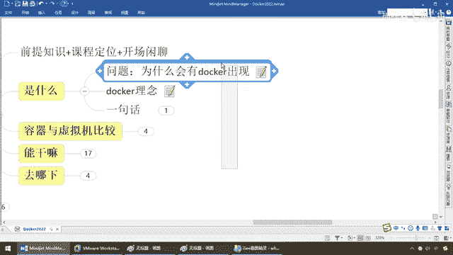
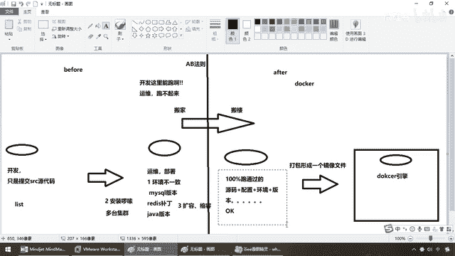
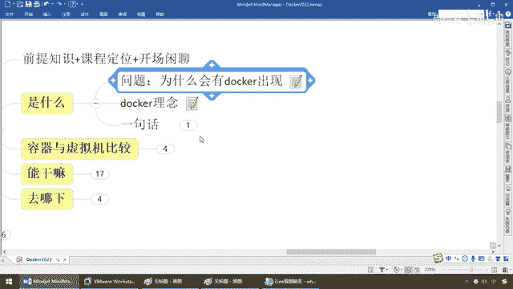
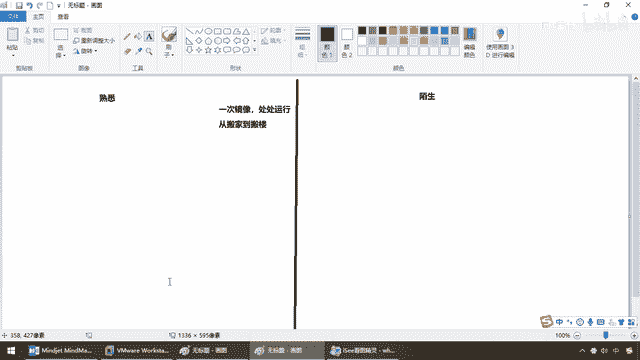
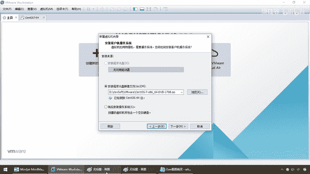
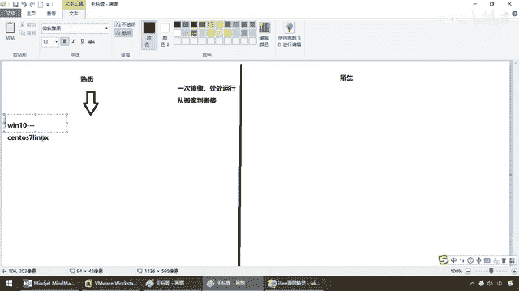
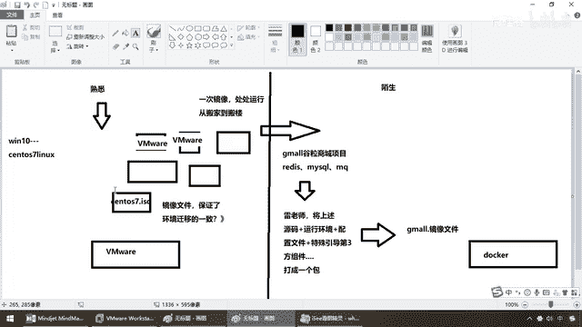
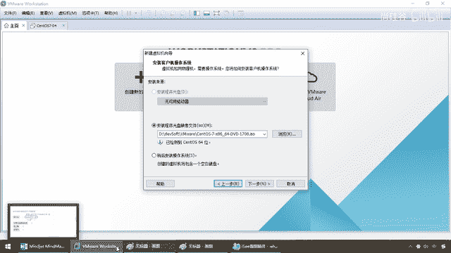
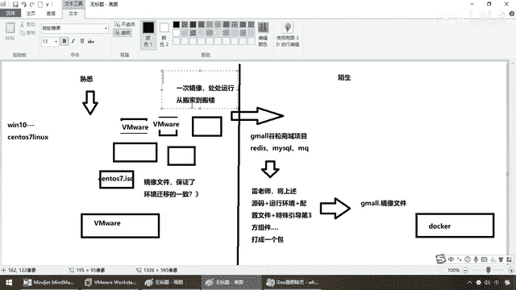

# 尚硅谷Docker实战教程（docker教程天花板） P3 - 03_docker理念简介 - 尚硅谷 - BV1gr4y1U7CY

好，同学们，我们继续，那么通过上一讲，我们明白了，Docker它为什么出现，那么，在它出现之前，出现之后，我们碰到的难题和痛点分别是什么，那么，一样，接下来，伴随着这个理念，有没有发现，开发。

慢慢地要去兼顾运为的思考问题的方式和工作维度，所以说，基于此，Docker提出了它的理念，那么，大家想一下，之前我们是不是，只提原代码，运为和开发是分开隔离的，运为兄弟，你自己按照我给你提交的代码清单。

你去装吧，结果只要一发生版本的迁移，环境的变迁，系统的变更，百分之百会或多或少出现点问题，就会导致开发那儿跑的是好好的。

运为这儿不OK，对吧，那么，所以说，这个时候，我们想一下，直接把开发的，能够跑的环境。

打包成一个镜像，直接发布给运为，然后让你一气呵成，我这儿是这个环境能跑，那么你把我能跑的环境代码，打个包，发布成一个镜像文件，放到你那边Docker上，一样的去跑，百分之百能够，复现所有的运行效果。

我们就解决了环境迁移，移植版本的这样的痛点，那么，我们呢，基于此，我们就形成了。

Docker这门技术，它所产生的一个理念，那么来吧，各位同学，我们呢，老规矩，还是拿同学们熟悉的，慢慢的给大家讲，你们陌生的，那么对于，林技厨小白同学，继续理解Docker的理念，它的优点和好处，那么。

先说结论，一句话，它就是一次镜像，然后呢，复处运行，从搬家，跑，搬楼，好，先说结论，待会一点点解释，我们分总，三班府，跟着走，首先，同学们，以前我住在5号楼，5单元501室，住的好好的。

找到工作以后要搬家了，我重新搬家以后，找一个离公司近的屋子，进去住的朝向，户型，小区环境，专修等等，肯定和我以前的不一样，那么我为了保证它一样，我直接整栋楼搬过来，还是住5号楼，5单元501室。

那么这个时候，百分之百，系统迁移，功能复现，平滑移植，OK？，那么，所以说呢，在这一块。

同学们，我们先来看，一样的理念，大家所熟悉的，来，弟兄们，在之前，我们在学Linux的时候，由于要装双系统，因为大家学习，基本上都是Windows系统，屏幕共享等等，Linux有些支持的是不大好的。

所以说，我们都是Windows系统，作为你们的学习平台，那么有一天，我们需要学习Linux，那么这个时候。

同学们。

想一下，那么在这一块的时候，是不是我们的诉求已经变了，是不是从Win10系统，建议到我们的Zentral，OS，Cinux，兄弟们，没问题吧，那么这个时候是不是发生了版本的偏见，那么好，现在。

韩英斌老师之前给大家讲Linux的时候，每位同学的，笔记本，有的是华为的，有的是IBM，有的是联想的，它都不一样的，它运行的Linux，安装的过程当中，一定会出各种问题，那么我怎么保证。

所有的Linux，它都一样的，在进行，环境迁移的时候，都OK呢，那这个时候的话呢。

我相信大家呢，一定，会被要求装一个软件叫WinMaware。

这个是不是我们的虚拟机啊，那么好，现在，意思就是说，我们这一个下面，WinMaware，没问题吧，我要保证，所有人的Zentral，OS7，Linux环境，跟韩英斌老师的都一样，不发生一点偏见，那么好。

我们现在完成的就是，只有一份，镜像文件，来，那么同学们，你们也要知道，这个时候，韩老师是不是给过大家，一个东西叫Zentral，OS7，这么一点，ASO，一个镜像文件，没问题吧，那么请大家看。

回到各位同学，你们的学习环境，只要每一位同学，OK，你们都跟我，装了一样的软件，那么这个软件就是我们的WinMaware，OK，那么这个时候，我们在同样的WinMaware上面，没问题吧。

运行同一个ASO，镜像文件，那么大家告诉我，这样的话，是不是保证了，环境，间移的一致，OK，没有这个问题了，所以说，这样的话呢，我们是在之前里面的一个初心，那么Docker，更狠，把它发扬官大。

思想都是相通的，那么所以说，现在，以我们这边而言，我们的需求，比方说，做了雷逢扬老师的武力删成，项目，你晓得的各种各样的软件，我的妈呀，Radius， MyCircle，FarmQ，等等等等，那么好了。

有位同学你们自己都开发过吧，痛不痛苦，不用我多说了，当然啊，一定认真做雷逢扬老师的，电商项目，工作中会用的，那么下面这个问题，就是同桌的你，你们两个互换源代码去跑，因为环境一变更，是不是大家就不OK。

所以说，这个时候，我们就会再写，假设，现在这堆东西，那么就是我们的雷逢扬老师，他，所完成的作品，就是这个，雷逢扬老师，的基案，闪烁，源码，运行环境，加配置文件，加，特殊，引导的第三方组件，等等等等。

全部打成一个包，那么这个包，同学们请注意，就是我们这儿，类似于centros7。iso的一个，镜像文件，假如说，逢扬老师，给他打个包，那么这个时候叫，第二，那么这个时候，镜像文件，没问题吧，简单一说。

只要在这种，前提条件的环境下面，逢扬老师的源代码，百分之百可以跑得通，那么为了保证大家，都一样，我们也不废话了，发布过去，给测试测试，我开发是什么环境，你运为你测试环境都一样，那么此时有镜像文件了。

那么跟下面这个理念，是一样的，左边，我们这儿，右边，我们这儿，相当于我们又换了一个，软件，这个软件，就是我们的，那么所以说，那么吧，好。

同一份。

centros7。iso，镜像文件，那么保证了，所有同学的。

centros7，装的都是一样的，那么同理，我们的docker这个，软件，每一位同学都装了docker，这个引擎，docker这个软件，跑同一份古力山城镜像文件，你们运行起来，是不是，不会再有环境迁移。

配置文件丢失了，版本不一致了，这样啰嗦，的问题，因为我们把，所有问题都给它，归一，给它划成，一个整体，就叫一个镜像文件，对外暴露，你掉这个，镜像文件，跑出来的效果，百分之百都一样，好比一个模子。

里面刻出来的，所以说，这个就是一次镜像，处处运行，从搬家，到搬楼，这个就是，docker最重要的理念。

OK。