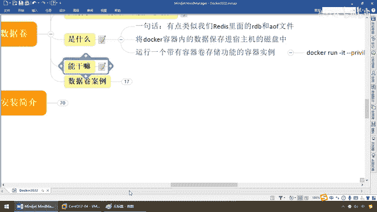
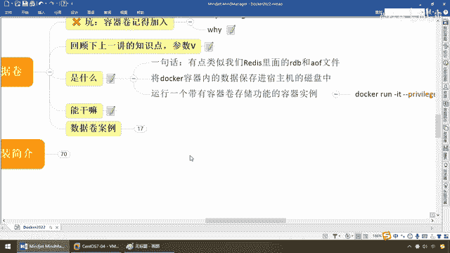

# 尚硅谷Docker实战教程（docker教程天花板） P30 - 30_容器数据卷能干嘛 - 尚硅谷 - BV1gr4y1U7CY

好，同学们，接下来我们就要来看如何运行一个带有容器券存储功能的容器实例呢？，那么我们已经明白，它能解决的问题就是将Docker容器内的数据保存进宿主机的磁盘当中以达到重要资料和数据的备份。

那么它按照公式我们这么来，Docker Run运行一个容器实例，，Gun IT，假设后台交货或者是前台显示，随你，那么现在我们打开权限，Gun V，完成宿主机的绝对路径的目录，冒号，映射的意思。

映射到我们容器内实例的某个目录，完成两者的联通，实现数据的共享和存储，那么容器内目录的产生的重要数据我们就可以存进这个地方，OK？，好，那么最后是我们要运行哪一个境限？。

那么本次我们还是以Ubuntu Linux系统为例，好的，那么说一天到一万，它所要完成的东东就是，突然有一天容器挂了，那么里面的重要数据你可以拿出来，已经备份进主机了，那么即便你这块被删掉了，消失了。

无所谓，数据是最重要的。

那么有点类似于我们内存里面的数据一断电就没有了，但是我们要把它保存进活动硬盘，保存在Masks里面，达到数据持久化的功能，所以说呢，我们呢，习惯将运用与运行的环境打包成镜像，对吧。

这个镜像一转以后就会形成容器实例，那么现在容器里面产生的重要数据我们需要持久化进行备份的，那么如果容器中产生数据你不备份的话，那么容器实例被删掉或者自动停机了，那么这个时候怎么着，重要数据是不是就没了。

所以说在Dotter里面我们使用容器卷来达到类似的功能和目的，那么来看看它的特点，可以在容器之间贡献和重用数据，后面我们会介绍，这个功能也还是挺不错啊，贡献和重用是什么，容器卷里面支撑什么。

容器卷里面的继承，有点类似于，我这个笔记本店呢，这有个活动硬盘，在外面我可以再接一个硬盘，那么再达到数据的传递和备份，好，再来，容器卷中的更改可以直接实时生效，就是说我在这儿容器里面写的东西。

马上可以实时同步到我的主机目录上，那就不用什么所谓的什么定时备份，还要手工的备份，它自动化的，它的同步率非常高，那么这样就是你写一点我就有一点，相当于学霸写了个作业，学渣马上去抄。

那么他考多少分你也考多少分，OK，那么这个呢，是什么，实时生效，很爽，那么这样顺便复习一下，同学们，我们前面是不是讲过Docker的常用命令，在这块的时候我们是不是说过两个，第一个。

容器内的重要资料可以拷贝到文件主机上，我们用Docker CP，第二个，导入和导出整个容器，对吧，那么现在呢，容器卷呢，功能和这个有点类似，但又不完全相同，但是呢，比这两个更牛逼。

那你看你Docker CP是不是要人工手动的来进行拷贝和指定，它这个不用了，你现在就是你写一条，我马上也就给你备份，所以说它的实施率非常高，爽，那么最后，那么容器卷中的更改，不会包含在竞相的更新单中。

那么容器卷的生命周期一直提到没人用，我一直知道，OK，所以说呢，它功能还是非常强大，那么接下来，兄弟们，按理说话。

跟着我走。

