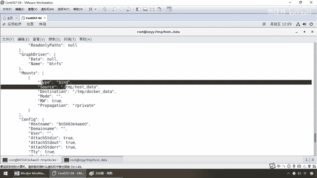
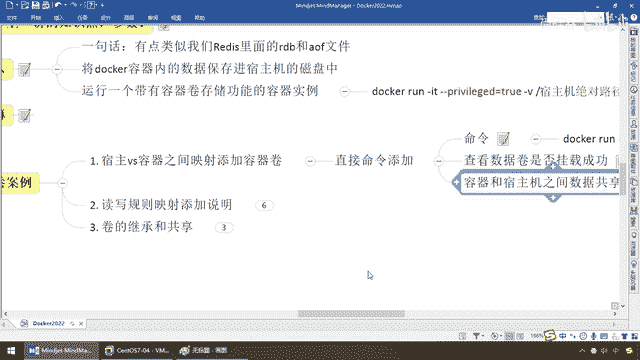

# 尚硅谷Docker实战教程（docker教程天花板） P31 - 31_容器卷和主机互通互联 - 尚硅谷 - BV1gr4y1U7CY

好，同学们，接下来给大家说一下容器券的案例，走，先看第一个，宿主机和容器内，他们之间映射添加容器券，实现了什么，我们的数据的共享实时同步，好，那么同学们，按照我们的公式直接命令添加，走。

现在Docker Run，就这个，上一讲已经说过了，重要的是这儿，干v说明我相当于挂了一个硬盘在外部，宿主机的绝对路径映射到容器内的某个目录加某个镜像面，那么大家看一眼。

那么现在Docker Run就走这么一个，就OK，好，那么在这儿，笔记上都给大家详细的说明，再次强调，你有我的脑图，管身管牙，管杀管脉，是阳哥的风格，你就是粘，你也能够粘成功，OK，好，那么所以说。

兄弟们，我们来看一下这块应该怎么玩，这块应该怎么写呢，那么第一个，我们不烦就拿着公式，这块我们节约点时间，不废话，那么，走一个，Docker Run，这些都OK，那么宿主机的目录，假如说。

我们就把它绑定在Tempt下面，我们这儿有个主机Date，这个就是代表宿主机的，那么容器内呢，我们也晓得U版图启动了以后，也是一个迷你版的内核版的Linux，它也会有Tempt路径，对不对。

那么Tempt我们这儿呢，就写一个什么，Docker Date是容器内产生的，这么说，能跟上，那么我们的这个镜像名呢，我们这儿，杠杠，内幕就等于U1，那么U，版图，兄弟们，这一波OK吧，那么来，听好。

那么我现在Linux的目录下面，有没有这个目录呢，没有，没有什么意思啊，没有的话，Docker的这个命令会给你自建这个容器的路径的目录，OK，那么Tempt下面，如果没有hostData。

我可以给你自己新建，当然啊，权限你要放开，允许有什么，写的权限，好，那么下面，兄弟们，Low也，那么这个杠杠，Name，U1，那么说明什么，我们是不是自定义了一个名字叫U1，好，兄弟们，一回车，OK。

那么大家请看，生成容器成功，那么现在，我们按照我们的要求，单前进入到这个U1图U1，这个Linux操作系统里面，我在哪儿，跟路径下，那么CD，Tempt在CD，大家看。

这儿是不是有个Docker Date，OK，那么ls，大家看，现在下面是不是什么都没有啊，那么请看，我们的操作，我们要干的活儿，说过了，Docker容器里面产生了一些数据，那么可以。

备份映射到我们主机的目录，那么相当于说，如果我现在在这个路径下面，产生了一些内容，自然会被同步输送到我们主机的这个路径，这个目录下面，那么来，请大家看，我们不妨这么干，Touch，假设，这个是什么。

我们容器内的就叫DockerIn。txt，这么说，能跟上，大家请看，ls，那么现在相当于说，我在容器内里面，在这个容器下面，我们已经有了这么一个文件，好，过，那么现在呢，回到我们的CDTempt下面。

然后我主机的数据下面，大家看一下，之前Tempt是根本就没有这个目录的，没有它可以给你新建，这个命令是非常方便的，那么这个时候，同学们请看，ls，大家请看，是不是DockerIn。txt，这么说。

没问题吧，那么来，兄弟们，假设，我现在呢，直接呢，在主机这儿，再建一个，那么Touch，比方说host，In。txt，这个呢，是在主机上建的，这么说，兄弟们，没问题吧，好，建成功以后，回到这儿。

请同学们看一下ls-l，大家看，那是不是主机上建的，也被同步过来，Docker上建的，也被同步回去，那么来，兄弟们，他们这两个，是不是文件就同步一致了呀，这个就是他要完成的内容，那么好，假设。

我现在再来，Echo，那么HelloDocker，那么A。txt，ls-l，大家请看，我这儿是不是有个A。txt，在哪儿建的，是不是在Docker里面建的，那么Cat，A。txt，大家请看。

HelloDocker，没问题吧，那么一样，现在ls-l，大家看，你容器内写了，我这儿是不是也有啊，那么来Cat，直接vi吧，vi，A。txt，兄弟们，请看，这个是不是HelloDocker，那么这儿。

我写一个HelloHostUpdate，主机也变更了，那么这个时候，保存，退出，主机上A。txt，大家看，HelloHost修改，没问题吧，那么在我们Docker容器里面，Cat，A。txt，A。

txt，大家请看，主机修改的，我是不是也能获得，所以说，这个我们就可以看到，完成了我们的什么，最重要的，竟然Docker容器内的数据，保存进了，素主机的，磁盘当中，而且实现了，同样的路径下面。

映射路径下面，你写我读，我写你读，实现了，双方的互通有无，好，那么接下来，通过这个案例介绍，说明我们挂载成功，那么现在，同学们，别着急，那么请看Docker PS，那么大家请看。

这个是不是我们刚刚运行的，U1，没问题吧，我们这个是用了一个什么，自定义的一个名字，那么现在我们来看一下，理解一下这个挂载，和复习一下我们前面的命令，查看数据卷，是否挂载成功，你怎么挂的挂在哪了。

就是我想单独看看，你挂在哪了，好，那么这个时候别忘了，我们前面是不是讲过一个命令，叫Docker Inspect，OK，那么这个时候给出我们的，容器ID，这个呢是，前面我们提过一嘴，没有深入的学习。

为什么，没有案例讲不清楚的，那么它呢，相当于是照一个X光片，可以把这个容器内部的，各种重要版本和属性信息，以JSON TOR的形式，给你暴露，那么大家请看，在这我们讲过一个东西，叫Monks。

是不是挂载，那它的意思是什么，Type什么类型，板定型的，你怎么板的，圆，就是我们宿主机的是，Temper路径下面的host data，目的就是我们的什么，Docker里面的，你看是不是Temper。

Docker，以后就通过它来看看，你板了一些什么样的。

路径和目录，好，那么这样顺便提一嘴，随着我们案例的丰富，和到后面的加钱，这个V可以有多个，也就是一个V就是板定一组，比如说这个我们是板定了，日制的目录，下面板定的是什么，配置的目录。

再下面板定的是数据的目录，这个V可以挂载多个，你一个笔记本电脑，是不是可以挂多个活动硬盘，所以说我们这只是入门级别，给你玩了第一个，让你知道了，数据卷挂载成功，好那么同学们请看，Docker。

Inspect，容器的ID，大家请看，目的，源头，他们两个怎么挂的，好，我们最后，容器和宿主机之间，数据共享，我们已经看到了，好那么双方你来我往，不管怎么写，都可以互相的影响到对方，这么说同学们。

OK吧，那么接下来我们就要问一个问题了，假设现在，我们已经完成了双方的，数据的互通有无，备份和互相显，我这写了你这收得到，我这写了你这也收得到，那么下面我们的问题是，弟兄们，假设这哥们停了呢。

好我们来演示一下，那么大家请看，这是什么，host在主机侧，没问题吧，那么来，兄弟们这是在哪，是不是在容器内，OK那么现在，杨哥干一件事，退出来刀槛PS，那么刀槛，stop了，听懂了吧。

我直接把这个容器，给你停了，OK，好现在容器是停了，没问题吧，那么现在我在这个主机这，假设啊，我TouchC。txt，没问题吧，我这可是在容器停了的前提下，我自己在主机这，我又做了修改，OK。

那么下面我的问题是，大家思考一下，那么我这刀槛，start，我又把我的这个容器，启动回来了，OK，再重新进去，那么这个时候请大家看刀槛，exec-it，我们就是这个容器实列，那么下面的是binbash。

进去，cd，temp，然后呢，docker，这个路径，我的问题是，刚才是我已经挂了，OK，我现在呢，在你挂了以后，我主机上写了个C。txt，我的问题是，现在你容器又恢复过来，苏醒了，你们觉得这个数据。

会不会同步回来，大家思考一下，觉得会的，给我扣个0，不会的给我扣个0，我先暂停录屏，录口，这个时候ls，打起，ls干l，怎么着，没有，你看，所以说这个时候就是，完成了什么，宿主机和我们容器卷。

两个数据的什么，双线藤，互通有物，这块非常重要，OK，那么这一块呢，也给大家看了，docker修改，主机同步获得，主机修改，docker同步获得，容器stop了，主机修改，docker再重启回来以后。

看看数据呢，也能够成功同步，OK，那么来，兄弟们，这一块呢，都给大家演示完成，这个就是我们第一个，和容器间。

实现了容器卷的挂载。

和我们相关的数据备份。