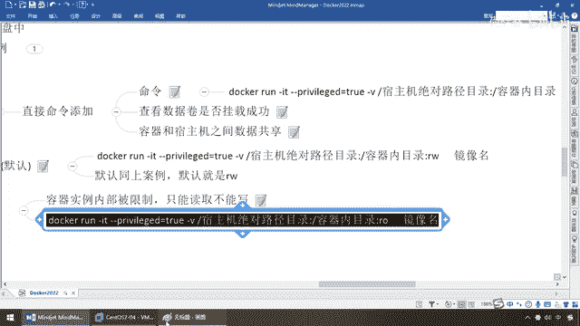

# 尚硅谷Docker实战教程（docker教程天花板） P32 - 32_容器卷ro和rw读写规则 - 尚硅谷 - BV1gr4y1U7CY

好，同学们，通过上一讲我们明白了，Docker可以通过容器数据卷，干v代映射目录的方式完成容器内的数据，迁移到我们的主机，也可以实现主机编写同步给我们的容器，那么实现了Docker容器。

通过容器卷的方式和主机互通有无，互读互写完成了重要数据的备份和持久化，那么接下来我们进入到我们的第二步更加深入的学习，了解一下容器卷的读写规则以及映射添加说明，那么什么意思呢？，首先。

刚才我们的演示已经说过了，也给大家看过，主机写，容器知道，容器写，主机知道，双方可以双向的互通有无，也就是说我们上一件是这么写的，其实用的是默认规则，什么叫默认规则呢？。

就是同时支持读和写两个操作互通有无，上一步的操作其实而言，你就是没写，相当于同样的命令拿过来，在容器内目录后面加了一个东西叫RW，意思就是容器内的目录是可读可写，read和write。

那么我们上面的案例默认就是可读可写的，那么刚才的演示大家都已经看到了，但是有时候呢，说不定你可能有这样的诉求，我只能让容器里面的东西是只读的，我需要把主机上的传给你，那么此时的话呢。

我们要求是容器实力内部要被限制，只能读取不能写，相当于要把RW的读写权限改成read only只读权限，这是一种什么，它的内部的一种限制和保护措施，我们大家了解一下。

就是限制容器内只能读不能写。

那么方法呢，就加这么一个，干嘛？read only，能跟上？，那么大家请看此时的时候，我如果非要在容器内部去写，比如说touch c。txt，在容器内建这么一个c。txt的文件。

马上就告诉你read only file system，不好意思啊，你容器内已经被限制了，只能去读不能去写，OK，那么ro就等于read only，如果宿主机写入的内容，那么这个容器是可以被同步的。

容器内可以读取，也就是说它限制是限制谁，容器没有限宿主机，好，那么同学们我们来看一下这个案例，那么走起，那么和刚才一样啊。

路径啊什么的都没什么问题。

那么我重新退出，来，这边的话呢是Docker PS，好，那么Docker stop，我呢，轻轻，或者也不说这个吧，那直接RM再复习一下，那么此时哦，你要么删容器ID，要么是不是删它的名字。

我就直接把它给它删掉，那么现在大家请看Docker，Docker PS，没有运行的了吧。

那么公式拷贝过来，那么走起，和之前的一样。

那么同学们run，干IT，那么宿主机的绝对路径，对吧，比方说myDocker干U，OK，那么这个时候呢，容器内的目录，那么假设我们叫TempU，OK，read only，那么镜像名字，那么同学们。

干干内幕，注意，你要写等于U2，没问题，你不加这个等号，写个U2，再写个U班图，没问题，兄弟们，入客，OK，所以说加不加这个等号，都可以，由得你啊，后面你要是不加，由于U班图呢，比较智能。

它可以默认的也是需要的，OK，当然呢，你加个bin，bash或者bash完全可以，好，那么同学们，现在请大家看一眼啊，我们干脆呢先从主机上来演示，那么cd myDockerU，这么一个路径，那么pwd。

大家请看，现在下面什么都没有吧，我现在呢，先干什么一事，在单前myDockerU这个素主机下面，touch a。txt，我新建了一个文件，然后干脆我再加点东西吧，a。txt，那么host update。

主机修改的，妥了吧，那么下面我们来看看，在我们U2这个容器实力内部，看看它有什么，那么单前是这个，那么cd times下面也是U吧，随便找一个路径，OK，LS，兄弟们，请看是不是有a。txt。

那么接下来，同学们，look我cat a。txt，能不能查看，你看111host update，没问题吧，但是此时我容器内部，就是在单前路径下面，我被限制了，我只能是read only。

不信邪touch b。txt，一回车，请看read only file system，那么这个时候什么，容器内是会被限制的，但是主机是什么，可读可写，它不会被限制，所以说在这儿，请大家看。

素主机写入的内容，可以同步给容器，容器可以读取到，验证成功，但是如果你容器被加了这么一个，read only，你想去写东西，同步给素主机，那就不可以了，所以说在这块，请大家注意这个权限，一般。

看你的需求，我们默认都是可读可写，OK，好，那么同学们，这个就是我们容器券的第二个案例，添加读写规则。

以及可读可写和只读双方的区别。

