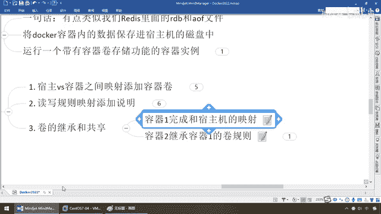
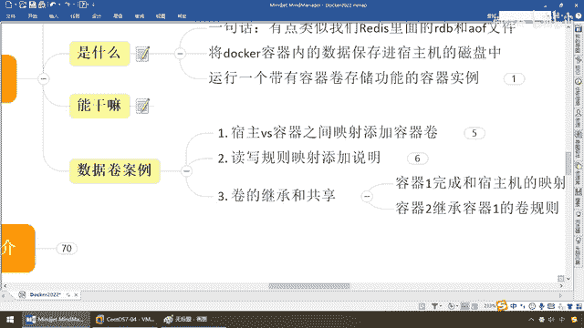

# 尚硅谷Docker实战教程（docker教程天花板） P33 - 33_容器卷之间的继承 - 尚硅谷 - BV1gr4y1U7CY

好，同学们，我们继续，接下来我们讲一下容器券的第三个案例，券的继承和贡献，一说继承，不用说了，你要懂，对吧，家娃里面的一蹭子，那么我继承某个某个类，对吧，那么你父类有的通用规则，我子类全盘接纳，来吧。

案例说话一看就懂了，这个不难，第一步，容器一件，完成和宿主机的映射，好，那么同学们，为了保证，大家的清晰和了解。

我这呢。

U1，U2，主机，明白吧，那么请大家看，现在我主机呢在卖刀槛U这个路径下面，那么里面呢，空空如一，什么都没有，我重新来，OK，那么大家请看啊，刀槛PS啊，什么实力都没有，干干净净的做一个，那么来。

弟兄们，直接运行，那么现在呢，我这呢还是和刚才一样啊，你看，买刀槛U，宿主机的目录，挂了一个V，那么TEMPT U，那么注意，这个没有什么等号，加不加都可以，这是U1，那么到后面，假设啊。

你就是再想加这个Bin Bash，也可以，U版图它本身也会反馈给你一个伪中端，你加不加都可以，你在这，大家请看，我添加，没问题吧，那么CDA TEMPT U，代表这个U版图这个意思啊，U1。

那么现在我们在U1这个实力下面，尾号CABD，那么大家看，挨了挨了，怎么着，什么都没有吧，那么现在，我，Touch，注意啊，我这可没有加，READ ONLY，那么代表默认的是RW，读写都可以。

那么Touch，U1，Date，。txt，OK吧，那么弟兄们，那么现在就说明什么，我在单前路径下面，容器内部建了一个U1Date。txt，那么回到我的主机，挨了挨了，有没有，U1Date。txt。

那么这个是我们之前讲过的，实现了U1，跟素主机互通有误，对吧，那么来嘛，Touch，怎么着，是不是我们的host。txt，我主机上也建一个，那么弟兄们，走起，那么是不是主机上建的也来了，好。

这个都是我们前面讲过的，再复习一下，不困难，那么下面我们的问题是，你要看，第一步完成以后，我们要实现，容器2，U2，U版图2，继承，容器1的，卷规则，那么这个时候，我们就要学一个，新的指标参数。

和配置选项，那么这个就是，Values，From，相当于Java的Extend，继承，那么顺便提一嘴，我们这个干v，它的全名，就是这个，卷的意思，OK，那么来，同学们，走起，回到这，我们呢。

回到我们的U2，那么大家请看啊，那么我的副类叫哪一个，是不是叫UZ，那么相当于前面这些命令，不废话了，之前都讲过，对吧，注意这两个干，你们你这个卷，就是你自己U2，你继承谁，我继承U1，OK，那么来吧。

随便写，都，哎想怎么写都随便你啦，加不加等号，或者后面加不加，OK，兄弟们过来，U2，那么此时，请大家看一下，我们CD，Temper，U，OK，你看，我是不是也有，注意，U1是什么样，也什么样。

那么大家请看，ls-l，怎么着，是不是继承过来了，主机上，和UZ的操作，我都有，那么来，同学们，我Touch，urdate。txt，一回车，那么来，同学们，ls-l，我在U2，单前，对吧，那么是不是有。

主机修改过的，U1修改过的，U2新建的，没错吧，那么大家请看，我现在主机，来了，LOOK，主机的，U2的，那么我现在，直接过来，怎么着，U1，ls-l，大家请看，是不是主机的，U1的，U2的，统统都有。

那么这样，这样就实现了什么，我们之间的，容器的共享，和什么，数据的，互相传递，好，那么这个就是，我们容器券之间的，什么，继承，好，那么接下来，同学们，不凡，我们退出，我们自己的什么，U1。

那么现在我U1，已经没了，大家请看，我后台活动，是不是只有U2，那么下面我们的问题是，U2，我这个DA已经没了，停了，它跟主机，会是什么情况呢，我们呢，不给出结论，请同学们思考，待会我们做试验看。

讨论一下，我先暂停一下录屏，首先，我现在呢，还是主机，那么主机的话呢，我直接就是什么，Touch，host2。txt，我再一次，那么U2呢，那么大家请看，它会因为DA没了，自己也就挂了吗，那么这个时候。

同学们请看，LS干啥了，怎么着，host2。txt，照样有，OK，U1和U2，是两个不同的容器，我U2，继承的是你U1的，这个挂载的路径的规则，我们两个是独立的，那么你死了，跟我没什么关系。

我U2活蹦乱跳，活得好好的呢，那么来，同学们，Touch，我再一次，同学们Touch，U2，datev2。txt，第二次修改，我们来看看我们跟主机，来，大家请看，是不是U2datev2，第二次修改。

照样OK，这么说，能跟上，好的，那么现在呢，我们呢，刀卡ps-n，那么最近两个，那么大家请看，这个是不是我们的U1，我们现在是不是，已经退出状态，那么现在你U1死了，你U2和主机又干了一票。

那么我的问题是，我如果U1又上位，又恢复回来了，你们觉得，还有没有那些数据，我们来看一下，刀卡，start，U1，起来，那么，复习，刀卡exec-it，那么U1，bin bash，进去了以后，cd。

temp，-uls-l，大家请看，12345，12345，是不是妥妥淡淡，U1U2，又续接上了，OK，那么相当于，一个主机上面，挂了两个硬盘，谁死都无所谓，一主二从了，那么到时候，苏醒过来以后。

又实现数据的是吗，通透，传达和传递，好，那么同学们，这个就是我们容器数据卷，第一个，宿主和容器卷，通过挂载，数据贡献，第二个，是读写，还是止读，第三个，容器卷的继承和贡献，请同学们。

务必动手。

操作一下这个案例。