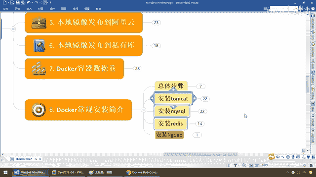
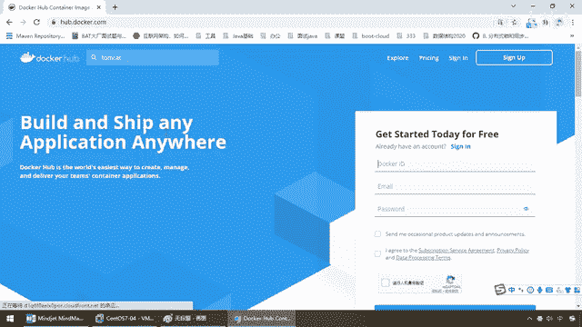
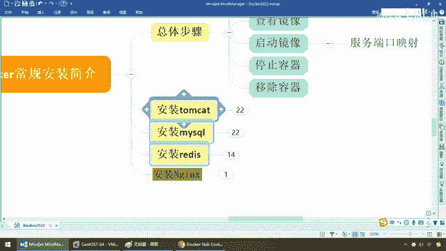

# 尚硅谷Docker实战教程（docker教程天花板） P34 - 34_docker上安装常用软件说明 - 尚硅谷 - BV1gr4y1U7CY

好，同学们，我们继续，接下来我们将给大家介绍基础片的最后一章，在 Docker 下日常开发常规软件的安装，比如说在 Docker 下面安装。

Redis、MyCircle、Nginx、Tamaket、Rabbit MQ、Elasticsearch、Kafka等等等等，一大堆大家在加8E站里面能够用到的这些各种传件软件，那么我们不可能全部罗列。

所以说，说一下总体步骤，那么根据举一反三的原则，我觉得呢，教了大家这几个常见常用的，那么后续都是如法炮制。

照葫芦画瓢，不难啊，那么好，那么大家来看一下啊，就说之前，那么大家开发了一个微服务，对吧，那么在这块儿而言的话呢，我们需要去连接各种各样的软件，那么大家都试过了，是吧，比如说。

这个呢是我们的MyCircle，这个呢是我们的Redis，OK，那这个呢，比方说我们的Rabbit MQ，OK，等等等等，不一而足，那么也就说一个服务，连多个，第一个。

每一种软件的安装配置和方法都不一样吧，MyCircle，RPM安装，Redis，可能需要改个Redis 抗复配置文件，它的安装命令，大家都用过，Make and Making Store。

那么Rabbit MQ也不一样，那么现在我们呢，能不能实现这样的一种方式，微服务呢，根据我们现在所见，容器虚拟化技术已经是目前的主流，你今天要个MyCircle，明天要个Redis。

后天要Rabbit MQ，各种安装配置都不一样，运为人员也挺麻烦，那么在这儿，我们加一层，红色框就是我们Docker，一，所有软件都跑在容器引擎上面，第二个，安装软件的方法和步骤被大大简化。

比如说我们前面所学过的Docker，Pool，镜像，对吧，那么这个时候呢，只需要你有镜像来了以后，而且是已经在官网上给你打包好的，你现在要运行，要安装一个软件，那么来吧，DockerRabbit。

MyCircle，OK，那么一样，接下来，DockerRabbit，Redis，OK，一样，DockerRabbit，Rabbit MQ，那么，同学们，Low In，这个时候的话呢。

是不是我们的各种安装软件运为的步骤，就被统一了，我只需要抓一个，反正Docker就行了，别的我不管，那么这样的话呢，使我们的微服务，直接呢，连Docker容器实力即可，那么当然。

到后面我们学到高级片的Compress，更狠，连微服务也打成一个镜像，那么在这块干嘛，相当于说一个全家桶，微服也打进去，那么全是镜像，镜像，镜像，那么变成容器，容器，容器，大家呢，互通有胡，四通八达。

完成了我们整体的什么，集群容器化的部署，那么上K8A4，统一管理起来，OK，云原生的基础就来了，好，那么同学们，那么接下来，我们将对日常步骤给大家说一个，首先总体步骤怎么安装，这些常用软件呢，来吧。

这么几步，搜，拉，查，起，停，一，讲完了，OK，那么这个呢，就是我们的总体步骤，一看名字，我相信，首先。

我们先去Docker Hub上面去搜一下。

有没有这个镜像，有的话拉下来，搜索命令，search，拉取，pro，查看Docker images某个具体的镜像，起到Docker run，当然，前面讲过是不是小屁端口映射，比方说，他们k8拉下来了。

8080，8080，那么最后用完了，停止容器，离出容器，OK，这个镜像形成了容器，那么就是这么几个步骤，所以说各位亲，这个常规的安装非常重要，我们把这几个，作为日常经典必备的加码程序的，开发软件。

给大家在Docker下安装一下，做一下案例，顺便来看一下有哪些坑在等着你。

