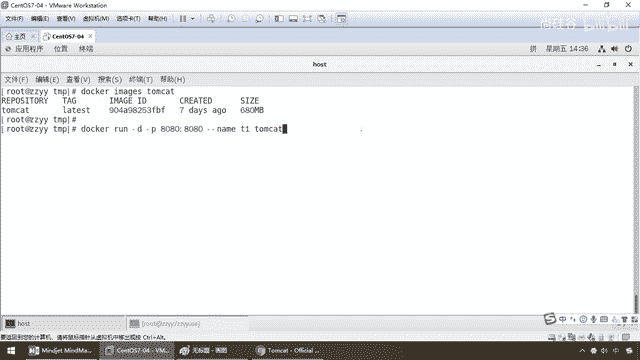

# 尚硅谷Docker实战教程（docker教程天花板） P35 - 35_tomcat安装上集 - 尚硅谷 - BV1gr4y1U7CY

好，同学们，接下来我们不妨就按照总体步骤来给大家从头到尾的走一遍，那么在开始之前，大家都知道，什么设斥，搜索，拉取，查看，其实这三个命令只是步骤上说明，其实而言我们是不是直接从run前面介绍过。

run的话本地有，直接运行，本地没有是不是远程上搜，拉，OK，所以说我们在这还是先按照标准的带大家走一遍，然后后续我们就越装越熟悉，直接从run开始，好，那么同学们，他们kate，那不用多说了吧。

加把长选最熟悉的东东，那么来吧，首先dockerhub上面查找一个他们kate，我先严格的按照这么一个步骤，就是有点规范吧，官网上推进的步骤也是这么回事，那么首先我要去找他们kate，那么怎么找呢。

dockerhub他们kate，OK，一回车，那么兄弟们，大家请看，一般我们选第一条嘛，点赞数最多的，是吧，下载数最多的，那么来，官方认证过的，这个他们kate，那么目前是最新版，那么官网上有没有，有。

搜得到，那么是不是拉下来，那么那些命令哪来的，就来自于这，那么点一下复制，直接执行就行了，拉到他们kate本地，由于洋哥为了讲课，那么节约时间就已经提前下载好了，所以说大家看。

这是我们最新的latest他们kate，多少帐，680，OK，那么来看看官网的介绍，那么几乎呢，他呢，什么是他们kate，这就不多说了，该怎么用，怎么写，那么人家呢，都给你说的清清楚楚。

你对哪个镜像有怀疑，就从这开始找，但是呢，注意，我们没有从这下，我们配了阿里云加速器，从国内去下，从他这下600多兆，长期超时，断开连接，好，那么这跟大家说一声，所以说这个去色尺一下。

那么这个时候大家请看，你不管是官网色尺，还是我们的命令去色尺，都能看，那么来，找到了以后，是不是该拉，命令就是他，那么来，兄弟们，在拉的过程当中，我们都说过，镜像是分层的。

那么他们kate作为一个复杂的组件，那么自然而然也有很多层构成，那么还记不记得我们以前讲过的联合文件系统那个花卷，对吧，一层一层层层的，叠加的，好，那么这是我们的第二步，拉取，第三步。

查看一下是否拉取到我们的他们kate，那么来，同学们，docker images，他们kate，没问题吧，如果不写，那么就是罗列出本地全部的镜像，如果写了，那么就是是谁，就是谁，现在加了一个wild。

是吗，我们的镜像名字叫他们kate，查询出来，只有他们kate，好，那么这是我们第三步，第四步，使用他们kate镜像创建容器实力，那么回到我们刚才这，是不是变成没有什么他们kate的安装了。

直接就是docker run，不像以前的话还要设置什么Katarina home，还要启动他们kate等等等等，直接走docker，那么好，同学们，来到我们第四步，那么docker run-it是交货。

干d是后台，这个不多说了，那么小p固定写死，8080，一般而言我们都是用小p固定写死，那么小写主机端口，冒号映射到容器内部的容器端口，大写，那么就是随机分配。

那么好像从开简到现在还没有给大家演示过这个大写，那么我们节约时间，大家可以自己下去试一下，我不单场操作，我把笔记给大家看一下。

你就明白了。

无非就是什么，run干大p他们kate，你看我没有写小p8080，没有指定，那么这个时候我们大家都清楚，他们kate它呢也是跑在容器上的一个具体实例，它自己的端口是8080。

但是主机的端口就会被系统的随机分配，那么这个时候外部的端口，这是内部的端口，说明完成了什么，大p的编写就是32768，这个外部的主机端口映射到docker容器里面的，他们kate端口8080。

那么如果我们要反问的时候，你就不再是什么localhost 8080。

而是变成了localhost 32768，就这么点区别，好，那么it是尾中端交互式操作，d是后台启动，那么这个呢，随便你用哪一个前台还是后台都可以，好，那么接下来我们来实行一下。

我们运行一下我们的他们kate走起，那么现在呢，很简单啊，那么同学们，我们就来跑一下，那么docker run干d我们的小p8080映射8080，好，干干内幕，我叫他们kate一键。

那么下面我就他们kate，没问题吧，相当于说，我以8080端口映射为他们kate，服务器名字容器名字叫t1，好，那么如果说不出意外，我们这只要让他们kate起动。

我们能够起来反弯到那只猫就ok。

