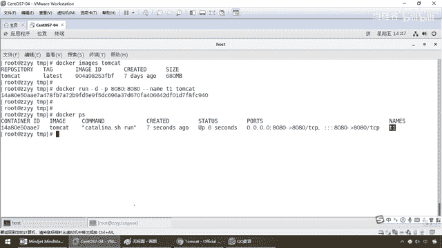
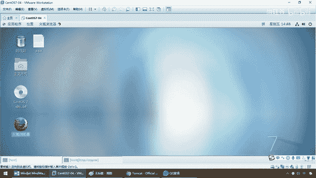
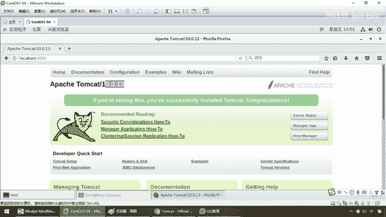
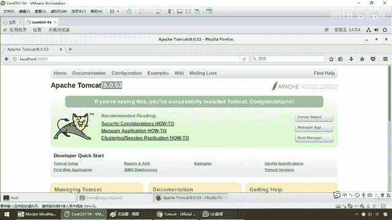

# 尚硅谷Docker实战教程（docker教程天花板） P36 - 36_tomcat安装下集 - 尚硅谷 - BV1gr4y1U7CY

我们呢，一直行一下看一眼，OK，同学们，返回我们的容器ID，相当于流水编号，那么docker，ps，老规矩，是不是大家可以看一下，尾号，A117，A117前面这几位，OK吧，那么容器ID给你返回了。

那么他们看它，你看它的脚本的话呢，是katarina。sh，对吧，就跟我们以前写的那个binbase一回事，那么下面8080端口，那么服务器名字叫T1，代表他们kat机，好了。

那么说明什么。

我们他们kat成功启动，那么接下来，我们来loy。

来看看我们反问首页，在linux里面可不可以成功，那么localhost，对吧，那么这个时候是不是我们的8080一回车，呦，404未找到，那麻烦了，怎么着，杨哥，打脸了吧，你个傻逼，你看没有。

他们kat装不成，装不好，直接呢，看不到这只猫，404报错，这是为什么呢，好，那么同学们，我们呢，loy，首先啊，在这块是因为他们kat，最新版本以后，对于我们这个首页的反问，发生了一些改变。

这种情况下是正常的，那么下面请看我解释和说明，第一个，最后呢，反问的报道是404，那么大家都清楚，只要你他们kat安装成功了，100%localhost 8080是不是那只猫出来了，现在这种没有。

这是为什么呢，第一种，可能没有映射端口，或者没有关闭反火墙，那么这个呢，也是一种可能，但是大家都晓得啊，我们这块的话呢，反火墙呢，早就已经是关闭，而且端口的话，8080都可以，那么下面我们呢，就来看看。

docker exec-it进去到我们的容器里面，来，然后呢，binbash，大家请看，现在登录的是user，local他们kat，单前这个目录，那么在这的话呢，注意，一般我们都晓得，如果他们kat。

你要想看到那只猫，是不是应该是warp app s文件夹下面啊，那么请看，这个说什么，是个D，我们找不到，它现在的话是由warp app s的，那么cd，warp，app s，然后ls，干l，怎么着。

里面是个0，啥都没有，所以说，新版的他们kat，它已经给它换掉了，明白了吧，所以说呢，在这块以后，我们需要，做一下处理，很多初学者都会发现，这个官网上不都写了吧，docker，拉他们kat，然后呢。

拉下来进行run他们kat，就应该能访问到啊，怎么我首页访问呢，是个404，经常有初学者呢，爆这种bug，爆这种坑，所以说呢，在这块，我们呢，做一下修改，它不是没有，rm，干r，warp app s。

那么大家请看，我们呢，把这个删掉，听懂了吧，ls，干l了，那么现在只剩下它这一个了，它真正有获的是这个，所以说，mv，warp app s，那么把它改成warp，app s，改成这么一个，相当于。

把以前那个konda，warp app s，删掉，它真真真正有获的，现在是在这个名字，又把它改名，改回成warp app s，OK，那么来，同学们ls，干l，那么大家请看，现在是不是只有它了，那么此时。

我们在我们的linux主机上面，相当于说我的docker，是装到这嘛，对吧，我这启动以后，我直接就在什么，linux里面访问，那么localhost 8080，那么大家看一下，如果不出意外，我们这只猫。

是不是就出来了，那么大家请看，我的最新版多少，他们ket10了，OK，那么所以说，在这块，那么请同学们，务必要了解这个konda，尤其是，零基础小白，初学者，不是你的命令操作统，是它，哎呀。

发神经一样的，也不知道为什么，我也没有细查。

它为什么把这个文件名，给它文件夹了，给它干空了，非要做一个这样的修改，那么所以说，我们需要把这个目录，换成它，那么请大家按照笔记，那么我们可以看到，那么刚才我们看到了，全部成功启动，进去看一下，记着。

进去以后，所有的docker容器实例，其本质而言，均是一个什么，迷你版的，精简版的，内核版的一个linux，然后我们在linux下面，进行操作，那么大家请看，把这个删除并修改，那么好，此时，我们呢。

就可以看到，猫呢，能够正常访问，那么好，同学们，在这块，我们呢，离开，那么docker，ps，那么，docker，那么我们直接，stop，tj，OK，把这个停掉，然后呢，我们呢，直接把它删掉，rm。

-f，我们的tomcat，tj，把它去掉了，docker，ps，OK，那么杨哥，你要干些什么事呢，那么请大家告诉我，你们觉得，如果用这个最新版的，这个tomcat，10。0。13，我们虽然说。

访问成功了，麻不麻烦，明明我们就希望是什么，装个tomcat以后，跑起来，能够看到首页，还要让我改，里面那些东西，但是现在的最新版的话呢，给我，抱这么一个，不友好，所以我这呢，多说一句，能不能免修改版。

我们不要用最新的，因为他们看他，10，真的我们用不到，这么最新的，对吧，他们看的7都够用了，8也够用，所以说呢，在这块，那么请大家呢，跟着我来，下载这么一个，镜像，装了GDK的，GDK8。

然后他们看着8，这么一个，OK，那么不废话，那么兄弟们，我们来看一下，不用拉了，OK我们都晓得，如果run本地没有，他会自动去拉，相当于run内部，就包含了pro这个，好，那么现在呢，我们来看看。

我要干一件什么事呢，来，同学们，我呢，已经提前下好了，这个镜像能跟上，那么来，给他快一点，那么现在我们呢，这个内幕呢，已经呢，变成了就是什么，Mytomcat8了，OK，应该这个名字，OK吧，一切顺利。

你看，Docker PS，那来，这儿有个叫什么，Mytomcat8，OK，那么来，这个时候，同学们请看一眼，刚才的，Tomcat最新版，10这个版本，我们首页，是Boss04错的，我做了一下修改。

才能看到，那么现在呢，我刷新一下，这个版本，大家请看，8。0。53，根本就不用去做，那些无聊的修改，所以说，我个人在使用过程当中的话，我可能是喜欢用，这个Tomcat，好吧，不用去干那些事，那当然。

如果你要下最新版的话呢，担心这个猫，出不来的话呢，可以用上述的步骤，进行修改，好，那么同学们，这个就是我们需要，给大家呢，做一个详细说明的地方，初学者，有个Tomcat。

首页打不开的坑。

那么用这两种方法，来详细说明。