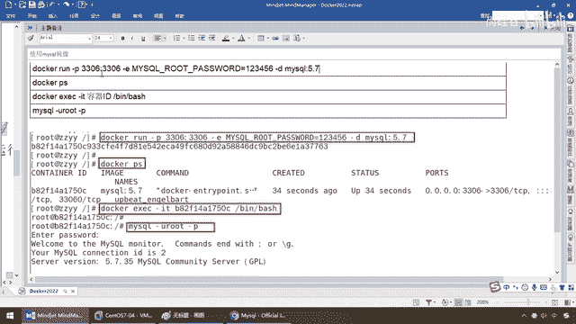
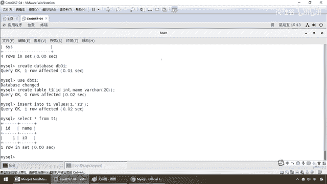
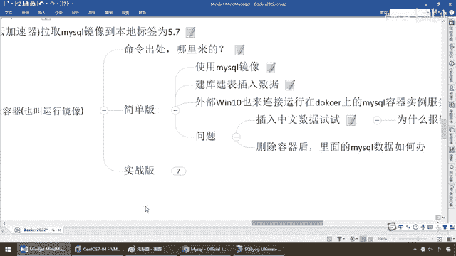

# 尚硅谷Docker实战教程（docker教程天花板） P37 - 37_mysql安装上集 - 尚硅谷 - BV1gr4y1U7CY

好，同学们，我们继续通过上一讲，我们给大家说了一下他们ket这个坛，很多初学者在docker上面安装他们ket，首次安装也会觉得这个不应该很难，学到这了，拉下了一个镜下，run起来。

那么如果说dockerps后台有实力了，也启动成功了，一localhost 8080去反问，这只猫就看不到，还觉得自己是不是命令敲错了，或者环境有问题，其结果都不是，是因为他最新版的他们ket。

已经改了路径地址，需要大家做一下路径删除处理，或者是用其他版本，我们这个坛就给大家填充了以后，希望大家尽量学习上节约时间，少走弯路，给大家可以学到更多的东西，很多初学者都碰上这个坑，我们在这统一说一下。

好，那么同学们，他们ket这只猫我们就料理到这，接下来我们来说一下mycircle，不用多说了，mycircle也肯定是所有开发工程师所需要连的数据库，那么它的安装有多繁琐，不用我废话。

你看docker全部统一起来，run mycircle，run redis，run rabbitmq，run他们ket，都是docker run，来一个容器实列，你连过来就可以了。

那么相当于大大简化了我们的安装开发步骤，那么好，同学们，老规矩，还是那些步骤，先去查查有没有，然后呢，有的话呢，拉下来，查查，拉了，对吧，那么第一个，docker search mycircle。

那么命令是这么操作，那如果你要登陆官网，那么来吧搜一下mycircle，有没有，有，官网认证过的，命令拉下来，OK，不写标签，最新版，写了，你写的具体是多少，就是多少，那么大家请看我这儿是最新版。

那么我们本次呢，以5。7为例，那么来，我们给大家演示一下，冒号5。7拉下来，OK，那么我呢，还是和刚才一样，那么这只猫先关掉，也是给大家呢，先提前拉好了。

那么docker images mycircle 5。7，那么大家请看，448兆，OK，节约时间，我们呢，一口气给它讲下来，那么有这个镜像了，那么自然然，是不是又是开启容器了，那么来吧，同学们。

使用mycircle 5。7镜像，创建容器，也叫什么，运行镜像，那么这些呢，不废话，那么这儿多说一句，这些命令哪来的，那么在这儿，同学们，一定要学会看官网，只看这个是不够的，那么往下呢，那么大家告诉你。

你看，描述reviews，tax，那么最新版是到多少，然后呢，8，OK，我们本次用的是5。7，好了，那么在这块的时候，我们的命令来自于哪儿呢，大家请看，quick reference，快速的索引。

对答案进行一个介绍，那么什么是mycircle，这个呢，当然你不用搞了，how to use this in myz，怎么用这个镜像，我们都是看完官网以后，有权威的答案了以后，才敢给同学们聊两句。

那么开启一个mycircle的服务器实例，那么大家请看，docker run，杠杠内幕，好，取了一个镜像的别名，然后呢，这个镜像跑起来以后，给它的容器起了这么一个别名，好，干ye，ye的意思是什么意思。

environment，是环境的意思，它告诉你，你mycircle，你看root密码设置多少，那么你自己写一个密码，干ye后台启动，mycircle，那么版本标签号5。7，OK。

连接到我们的mycircle用命令，然后呢，你又怎么进来，然后呢，各种命令，那么在这儿，除了有上面的命令的话。

它告诉你可以通过docker state deployee或者是docker compress，那么容器编排，那么写这么一个编排文件，也能启动我们的什么mycircle容器，那么当然了，在这儿呢。

大家带着大家来看一下官网，至于说什么docker compress这些东东的话，大家别着急，后面的话，专门有一张在等着你呢，也是不好学，OK，那么阳哥的料呢，不但暖心，而且营养跟着走，好，同学们。

请坚持，从头刷到尾，你保证能够从入门到熟悉，好了，那么现在呢，我们给大家说清楚这些命令来自于哪，你就放心大胆地执行，均来自于官网，那么来吧，我们来看看我们的mycircle该怎么运行，那么，来，简单版。

初学者先过来这儿，使用mycircle镜像，完了以后，这个镜像启动了mycircle实例，那么当然我们要连上去，是不是，键库键表插数据，然后mycircle内部可以反问了，那么到最后呢。

我们在外面windows10用一个什么ivkit的连接工具，去连接部署在Docker的容器实例，看看行不行，那么最后我们来看看，我们会碰上哪些坑，有哪些问题，好，那么兄弟们，走起。

第一个使用mycircle镜像，那么这个命令，刚才官网上说过了，我们就不再废话。

好吧，过来这儿，过来这儿，过来，以脉节镜像是有的，那么有了以后，我们直接来执行，那么大家请看run，干D，mycircle5。7，那么3306，那么这儿注意，重叠，我这儿Docker这儿3306。

映射3306，没问题，但是在Linux服务器上，很多初学者他自己Linux本身也装了mycircle，听懂了吧，相当于说，他在Linux服务器上装过mycircle，且这个mycircle是启动的。

所以说有可能在用Docker之前，你的mycircle3306端口就已经被占用了，所以说建议大家，ps-gantt-e4-grip-mycircle。

看看你Linux服务器本身有没有mycircle实力启动着，也计先看一下3306端口是否被占用过，好，那么大家请看，我这儿Linux下面根本没有mycircle，所以说我可以放心大胆的使用3306。

那么在这儿run端口映射E，用户root密码的话是123456，那么来这儿一回车，OK，那么同学们，老规矩，只要run了以后，马上标准性的动作，集有机械，DockerPS看看我们的有没有启动成功，OK。

好，那么这个时候的话，同学们，我们走起，那么第二步，Docker exec-it，那么来吧，隔到这儿，进入我们的这个容器实力里面，那么bin bash，OK，进来了，那么进到这个容器实力里面以后。

它现在是个什么容器，mycircle5。7，那么一按，连进来，mycircleroot，root，userroot密码，干屁，好，123456，我们前面是不是配置过，OK，那么现在这儿，同学们请看。

我们成功通过mycircle5。7这个镜像运行了一个实力，exec进入到了这个实力，然后单做我们的mycircle进行操作，好，那么其他就跟mycircle原模原样，那么来，兄弟们。

show database，来，兄弟们，默认就这四个，没问题吧，那么来吧，create database db0e，弟兄们，没问题吧，user db0e，OK，那么接下来呢。

create table t1，那么来吧，id int，那么name，vacha，OK，兄弟们，没问题吧，那么insert int t1，values，那么来吧，t1，3，OK。

select scene from t1，一套带走，打完收工，那么现在可以证明，我们的读写操作在我们容器版的mycircle里面，完全OK，好，那么接下来，隔到这儿，我们当然这些步骤呢。

都带着大家进行过操作了，那么同学们呢，也不用担心，你照着脑涂沾都行，我这块的话呢，也已经一步一步带着大家完成，那么接下来，件库件表插数据也完成了，那么完了以后，现在呢，你自己high是没问题了。

那么接下来，那么ifconfig，我的ip是多少啊，我现在是167，对吧，那么相当于说，我在Linux服务器上面就有了一个容器版的。

Docker Mycircle，那么好，那么接下来，回到我们这儿，我就试试用我们的工具能不能连接上，那么192。168。111。167，root密码是这个，那么端口3306，好，那么同学们。

我们测试一下连接，大家请看，连接成功，Mycircle 5。7，正是5。7。36最新版本，那么好，我连接上去，那么不改变存储细节，那么大家请看，我现在Docker实例上面，件的这个DB连接是不是就有了。

那么好，这儿有个表，TZ，那么这个时候，我们呢，直接，Select scene from TZ，我们也查询一下，兄弟们，没问题吧，OK，那么在这儿，假设啊，insert into TZ values。

那么这是2，那么我们的理事，OK，那么直接插入，没问题吧，那么再查询，站3理事，有了吧，那么自然然在这块儿执行一下，有了吧，站3理事，OK，没问题，那么也就说什么，我们从外面用客服端软件连上来，也OK。

接下来，我们来试试，再插入一条，那么好，这个时候呢，我们的3号记录，此时我将其修改为中文，OK，那么这个时候，我们就插玩5，好，暴托，直接是不正确的strip，8888这个，对于这个。

CORRAM NAME，etc，那么怎么着，哇，杨哥，跟你学太费劲了，处处是坑，是吧，你个傻逼，刚才装他们看他装不好，MyCircle又挂了，你到底干些什么，你看，那么同学们你们觉得到底有没有错呢。

如果说插不进去，对吧，前面怎么证明，前面这些东西是什么，所以说得到一个问题是什么，是不是在Docker容器下安装MyCircle这些东西，他有些坑啊，比如说这就是大家日常常见的。

MyCircleDocker容器实例里面的中文乱码，这个一定要注意，所以说兄弟们问题来了，插入中文试了以后，大家请看，是不是报这个，那么为什么报错，因为Docker上默认字符及编码，你没有修正。

那么所以说兄弟们，我们来执行一下，在这个容器里面我们执行，那么走起来，大家看是不是全是拉丁啊，那么来，一样啊，你这连上来，你不管是在哪执行啊，都可以，跑到这儿，弟兄们，你在外面都一样，OK，那但是，哎。

杨哥为什么这是UTF8，为什么我要在这个里面执行呢，因为这个小海豚这个工具，给什么，我们自动改成了，但是注意，Database字符是多少，是UTF8还是拉丁，你自己要分清楚，不要以这个来看。

要以这个来看，听懂，很多人呢直接执行了以后，在里面直接说，没错啊，是UTF8了，不，因为这个工具我们做过设置，他自动会把一些什么科普端，设成UTF8，但是服务器上面，大家请看，全是拉丁，明白了吗。

所以说在这块，我们要进行，后续的补充和修正，这个是一个什么，非常重点的内容，否则你用刀槛，跑买这个数据库，一插全是中文乱嘛，急的你是什么，抓耳挠心的很难受，那这是第一个问题，第二个问题，兄弟们。

我们的命令现在执行的是什么，就这么一个，那你告诉我，我现在，有没有用一种技术叫容器数据卷，好我现在，张三李四我插入了，那么现在如果我手欠，我把这个容器实力给干掉了，那么你没有加容器数据卷。

你的数据根本没有从容器的备份到宿主机上面，你一删除，那个回答我，乱码这个问题嘛，了不起，后面我们再说，那你现在数据都被人家干翻了，那兄弟们，你这个时候你责任就大了，这个就很恐怖的现象出现了。

那么这个是什么，删除容器以后，里面的买CQ数据你怎么办，那么是不是容器删除，你还有什么了，什么都没有了，只能是删容器到跑路了，好那么同学们，我们现在，退出，退出对吧，刀卡，PS，那么来有这个。

如果就像我刚才所说的刀卡，RM，干F，拿个人手欠，就把你的这个数据库，给删掉了，粘贴这个容器实力，一回车强制删除，好，刀卡PS，什么都没了，那么你告诉我，刚才我们查过的这两条记录，是不是也就没有了。

那么这个数据损失的责任，你该怎么，补充和完成，所以说兄弟们，千万不要觉得，简单拉个MyCircle，启动一下就完了，这什么版，简单版，很多同学学了以后就是，哎呀，拉下来，乱起来，完了，不是这样的。

中文乱码，还有商库的备份，你是需要搞定的，所以我们下面介绍实战版。

