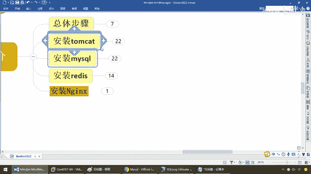

# 尚硅谷Docker实战教程（docker教程天花板） P38 - 38_mysql安装下集 - 尚硅谷 - BV1gr4y1U7CY

好，同学们，我们继续，那么通过前面入门级别简单版的讲解，我们虽然说用Docker安装成功了MySQL，但是呢，还会要面对一些实际的问题，中文乱码以及数据的备份和敏感数据的迁移，那么下面就说明什么，一。

你要解决中文乱码，二，MySQL，包括后面啊，像我们这些重要软件，什么Redis安装，必须要挂我们的什么啊，容器，数据卷，OK，保证你的这些数据，实力删掉了，可以在数据机上或者其他地方留存一半。

否则你这个真的很麻烦啊，别到时候嘛，本来想轻松的，结果，直接就是什么，把数据库，把你们公司的重要核心资产给干没了，这个时候你说吧，你去坐牢的话呢，你是你自己去，还是我们送你去，OK，好，那么同学们。

过来吧，接下来呢，我们来看看实战版，来，重新兴建我们这个MySQL的容器实力，此时的这个命令，就不像我们第一次啊，这么简单了，那么大家请看，第一次的是不是很简单，那么现在，来吧，兄弟们，我们呢，直接呢。

来对比着，来看一眼，干脆拿过来吧还是，第一次简单版的，就是刀铐上跑起来的一个，MySQL的容器实力，没什么用，是运行成功了，工作绝对不能用，那么接下来呢，我们来看一眼，此时，我们要用这么一个命令。

不要害怕啊，这个命令呢，也没什么了不起的，说通了就懂了，来，Docker Run，干地，后台运行，干屁，3306，这个Privilege，是吗，容器，数据卷的，是吗，全线，全线开启，还记不记得。

当初的时候，杨哥说过一句话，我说挂容器数据卷，物质一个V，可以挂，可以挂多个，OK，那么来，同学们，大家呢，看一下，我觉得给大家三秒钟也应该看明白什么意思了，和以前，也没什么太大的差别。

你懂得原理和本质以后，都这么回事，那么他这儿说明什么，我挂了三个卷，那么分别是什么，宿主机帐有一个，zzyy user，这个下面有MySQL的日制，数据，还有什么，配置。

那么如果说我们现在在Docker里面，所编写的数据，是不是就可以实时同步回我们的宿主机，那么你哪怕你Docker挂了，还是在我宿主机上面留存一半，这个就是我们容器数据卷最重要的功能之一，那么来，接下来。

密码，杠杠内幕叫MySQL版本号，还是5。7，OK，所以说和之前的就是多加了这些数据卷，那么当然了，还有个重点是什么，看付，怎么着，是不是要修改我们的，MySQL的配置文件，解决中文乱码这个问题。

那么最终还有一个什么，查看日制的，这三个，几乎是标配了，请同学们直接站，OK，好了，那么这儿我们就不再一个个的写了，那么对于，我们当前这个路径，我们已经准备好了，好，那么同学们来吧，OK。

那么Docker PS，完了以后，我们运行的服务器就叫，MySQL，对吧，那么5。7这个版本第一步我们完成，好，那么接下来我们要干一件什么事呢，新建MyDirCNF，然后通过容器卷同步给MySQL实验。

解决我们的什么，中文乱码问题先解决第一个问题，我们干的活是这样的，那么现在我们都晓得了，通过这一段命令已经完成了我们的什么，本地的这个配置，已经搞定了我们容器之间，连路的打通，那么我们在这儿。

MySQL，CNF这个路径下面，你看我们这儿是不是就MySQL，CNF这个路径下面，好，别过来，那么来吧，CD，这里的这儿制作，也行，LS，L，大家请看，现在下面是不是什么都没有。

那么怎么来解决这个中文乱码这个第一个问题呢，那么新建MyDirCNF并在里面输入如下内容，好，VIM，MyDirCNF，那么大家都晓得啊，这个呢是MySQL的标配的配置文件，那么意思就是说我们客服端。

干了这么一个，那么现在插入，过来，这个你不要去手敲啊这种配置类的，直接粘就行了，那保证什么意思啊，客服端，MySQL服务器端，他们的自服机编码都是什么，UTF-8，好，隔到这儿了以后，那么兄弟们保存。

退出，这一步完成，那么好，我们现在呢，一就CAT，MyDirCNF，那么大家请看，查阅了一遍，和我们的笔记是不是一样，我们已经把我们的配置搞定了，那么接下来呢，重新启动MySQL容器。

再重新进入并查看自服机，为什么，因为我们刚才启动容器，是保证我们这个MySQL服务器，链路，连掏，卷，形成，那么由于我们改了MySQL配置文件，为了保证我们的，运行效果的正确，我们建议什么，改完以后。

重启一下我们的，MySQL容器实例，所以说隔到这儿，那么兄弟们，Docker，PS，那么Docker restart，OK，MySQL，因为我的容器的，服务器的名字，容器实例的名字。

是不是就叫这个MySQL，来，兄弟们，重启成功，那么接下来，我们干嘛，进去，这个时候，我们再试试，键表键扩，我们能不能解决，好的，隔到这儿了以后，Docker exec，然后呢，-it，MySQL。

那么，bin bash，进来，那么MySQL，root用户，密码，OK吧，那么来啦，弟兄们，再次强调，不要以这个为准，客户端说的不算，我们永远在服务器上，里后在Docker服务器上，我们来执行一下。

这条命令，这个时候同学们，看一眼，是不是UTF-8，已经全部改回来了，OK，那么来吧，弟兄们，我们就已经明白，那么貌似这儿，就可以解决我们的什么，中文乱码问题，当然我们现在呢，大胆假设，小心求证。

再新建新库键表，查读中文试试，好，那么同学们，我们继续，那么现在，show，database，还是这几个，重新来，那么，create，database，那么DB，零接，弟兄们OK吧，UseDB，零接。

OK吧，那么，create table，te这张表，那么跟刚才一样，id int类型，名字，vacha类型，好，回车，那么现在，insert int，te，values，那么现在，站3，那么来。

弟兄们OK吧，那么我们现在呢，直接来执行一下，我们的，select1，OK，站3没问题吧，那么刚才，跑步通道，玩5，我们现在来试一下，怎么样，为我们意涵受到影响，再查询一次，怎么着，玩5中文乱码问题。

彻底解决，OK，那么在这儿，那么弟兄们，select新，from t1，大家请看，站3，玩5，可以了吧，所以说这个是非常重要的操作步骤，否则你就是刀块上面跑的容器，各种中文乱码的问题，各种配置问题。

烦死你的会，那个数据都是错的，好，那么同学们，在这儿，我们就完成了我们的，是吗，中文乱码，解决这个问题，那么接下来，得到我们的结论，之前DB是无效的，修改字符集操作，看到我们的配置文件了吗。

慢一点看付那个，注意改完以后，请你重启MSQ服务器实验，然后，之后的DB，重启了以后才有效，你别改了以后，不好意思，在改我，修改之前，那些DB，通通都是无效的，一定是改完并重启以后，新建的DB，才有效。

OK，那么结论，刀块你安装完MSQ，并乱出容器实例以后，建议，请你先修改完字符集编码以后，你在新建MSQ的，库表查数据，一定要在服务器上执行，我们的什么，字符集检测。

相关的client端和database，最重要是这两个，是UTF-8了，才OK，不要拿这个客服工具，来做参考，OK，好，那么这个呢，就是我们解决中原乱码，以及我们日常实战当中，需要给大家说清楚的一件事。

那么第二个事，防止删除容器以后，里面的MSQ数据库，你该怎么办呢，那么来，同学们，回到我们的这个什么，ZY user这个路径下面，ls-l，大家请看，我这儿是有MSQ这个文件夹，cd，MSQ，好。

pwd，现在，大家请看，配置，数据，日制，好，那么现在如果宿主机上，是有的，那么下面呢，我们就来玩一些，狠的东西了，那么来，Docker PS，我现在这个MSQ，是不是在这儿好端端的呢。

那么下面我们的问题是，不是停的问题啊，Docker stop，不是停的问题，是有无聊的人手欠，直接给你删了，来，弟兄们，没问题吧，那么现在就是你这个Docker容器，里面是死了，那么里面的数据。

当然也就没了，那么现在我们的问题是，如果你重新启动，回来，这个里面的数据，会不会重新写回进，我们的MSQ容器里面，达到数据备份和安全一致，有效性，那么来吧，我们再启动，我们的MSQ。

刚才那个是已经删掉了啊，Docker RM-F，我们把MSQ删掉，大家请看，No such container，这个容器已经删掉了，我们再来一个全新的，OK，一回车，好了，那么Docker PS。

大家请看，我们的MSQ，又有了吧，那么现在，Docker，执行，进入我们的MSQ，Bin Bash，走起，MSQ-U，Root-P，那么，3456，进来，那么现在直接User，什么，DB01，OK。

有没有，你看Database，Change，完成了吧，那么Select，Sync Pro，什么T1这张表，兄弟们，詹三玩五，照样在，所以说，日常的工作当中，这个容器卷是一定要挂的。

你就是把容器实力给我删了，只要我保存在，对应的宿主机上面，你重新启动容器以后，我依旧能够什么，把数据，给你拿回来，这样才能保证，数据的不丢失，这个时候，你的数据安全性，才能得到加过，请同学们。

务必了解这两个问题，所以说，这个就是我们在，用Docker，进行MSQ安装以后，实战过程当中，所需要面对的，最主要的两个问题，1，中文落马，2，实力删除以后，数据依旧要存在，OK，好，那么同学们。

大家呢，下去试一下，日后Docker安装MSQ，TimeCat等等，那么就以，杨哥所做的案例，作为一个参考。

避免大家少走弯路，OK。