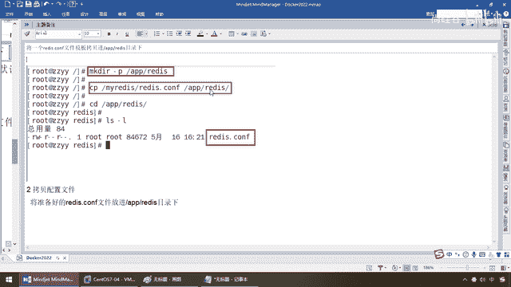
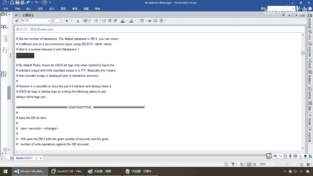

# 尚硅谷Docker实战教程（docker教程天花板） P39 - 39_redis常规安装 - 尚硅谷 - BV1gr4y1U7CY

好，各位同学，我们继续，通过前面的讲解，我们已经完成了，在Docker容器实力化实战的过程当中，对于Tamaket、MyCircle安装所需要注意的一些细节和问题，很多坑，好吧。

那么接下来我们来看一下Android Redis，那么在没安装之前，大家觉得它会简单吗？，还是也就是说拉个镜像Docker1就像这儿的，搞定，那么我们会有一些哪些特殊的要求，或者需要注意的开发细节呢？。

所以说，各位同学，千万不要相信什么，所谓的简简单单才是真，实际工作当中都是复复杂杂才是真，好了，那么同学们，我们也说到这儿了。

不烦我们直入主题吧。

Docker对于镜像容器什么，不再废话，肯定是已经先提前拉下来，本地已经有了，跑起来，Docker，如果杠IT，那么杠P，对吧，那么直接还是后台交互吧，那么这一块是不是就是我们的6379，6379。

弟兄们没问题吧，那么这儿Redis 6。0。8这一波，OK，好了，那么Docker PS成功启动，那么Docker直接进去，那么来吧，哎，搁到这儿，OK，那么进到我们的Redis实力了。

Redis Client，连上来，SET K1， V1， GET K1，OK，打完收购，一套带走，哎呀，这个原来Docker安装一个Redis这么简单，五秒钟讲完，就这条命令，然后呢，直接过来。

你觉得真这么简单，大家还需要掏钱来上硅谷学习吗，对吧，所以说实际工作中真不是这样，如果真这么简单，不用开这么二课，大家全部查一下就OK了，那么下面我们的问题是，对于Redis而言，和刚才一样，弟兄们。

如果我现在这个容器实力删掉了，你这个里面存的K1， V1，又在哪，那么是不是也同样要加容器数据券啊，第二个问题，Redis你别忘了，还有Redis Conf，它有这么个配置文件的。

如果我现在针对我的配置文件，做了一些修改，我希望你这个Redis的Docker容器实力能够感应到，达成我特殊的一些要求，你如何修改，所以说我们这也依旧要处理，我们对应，Redis的一些配置和诉求。

比如说Redis配置文件的指定运行，好，那么同学们，老规矩啊，为了怕后续干扰，直接先删除，那么对于我们这个容器实力，先给它干掉，好了，那么Docker PS后面什么都没有了，那么接下来我们来看看。

第一个，拉过来，过，入门级别的命令刚刚演示过，过，那么强调过了，你现在容器被干掉了，就跟刚才我们所执行的命令，对吧，那么Redis里面存的刚才那个K1呢，那个Key关键值怎么办。

那么所以说必须得有容器券，那么这加这个不废话，那么兄弟们，我们要干的活呢，是这样的一个情况，首先我们目前对于Redis的使用而言，一定要指定我们的什么配置文件，那么好，弟兄们PWDAPP Redis。

就是作为我们Docker Redis容器的一个什么，宿主机的目录，待会儿容器券挂载，就通过它跟Docker容器来进行交货，那么在这儿呢不烦了，我们先在宿主机下面新建目录，APP Redis，那么阳哥呢。

因为之前讲过背国客的话呢，都已经建好了，就Make DR干屁，那么APP下面建那个Redis的目录，这一步完成，那么接下来我们需要干一件什么事呢，就是指定我们自己的Redis 康复文件，不要用它默认的。

因为后续我们一定会修改这个Redis的配置文件，那么比如说，建一个Redis 康复文件的模板，就是你从Redis的机器上面找一台，拷贝进来，那么来同学们，新建APP Redis目录建好了，Copy。

比如说以前阳哥在这台机器上装过Redis，就把Redis。conf这个配置文件拷贝到。

单前目录下面，这一波能跟上，OK，那么拷贝了以后，那么同学们请看我这相当于ls-l，我这个下面就有一个Redis。conf，这个配置文件，那么这个就是我们大家日常学习Redis，常见常用的东东。

那么Redis。conf，那么大家请看，这个配置文件大家比较熟悉吧，你随便找一台Redis服务器，给它拷贝过来就行了，这么说能跟上，好了，那么但是你说我没转Redis我拷不到啊，那么这个时候请大家看。

默认出厂的原始Redis。conf，那么阳哥也已经给你拷贝了一半，真不行，就vi新建一个把这段一站就OK了，因为你们机器上在讲，Docker之前已经学过这个Redis了。

从Redis的这个上面拷贝一个文件，这个不难上传上来就OK了，那么好，那么在我们的这个目录下面，拷贝完了以后，这是什么，出厂默认的，我们要在我们APP Redis。

就是要提供给Docker容器实力用这个下面，要修改成我们自定记的，那么注意改一些哪些呢，有这四个，现在在这个路级下面修改我们Redis。conf，同学们，我们过来这啊。

就是我们的这个APP Redis目录下面，修改我们Redis。conf这个配置文件，就是我们自定记的这个，来，首先你要不要密码，可选，我这图层上我就没有开启这个选项，无密码，但是注意刷成红色的是必须。

第一个允许Redis的外地连接，OK，在这块注掉板定127。0。0。1，那么这个时候呢，同学们，请看一眼啊，我们找一下，那么在这块的话呢，板定127。0。0。1这个给我把它什么，注掉。

这是第一步必须要干的啊，第二步，后台启动把这个设置成no，那这个不解释了，将原来的yes改成no，OK，那么来同学们，我们在这，在这块也要把这个给我注掉，OK，那板定这个动作呢给它注掉，那么来。

我们呢直接往下走，demo这货给我把它从yes改成no，改成no 请看默认的话，Redis不是作为一个demo的话，用yes，OK，如果你需要我们把它改成no，这是我们的什么，第三步，好。

那么一定要改啊，将这个yes注视起来或者是改成no，否则，你不改成no的话，刀块run会和后台这个地参数冲突，导致容器呢一直启动失败，好，第四步，Redis持久化，那么这个呢你可开可不开，这个是个什么。

核选项，好，那么当然啊，如果说你还是不放心，这一步也可以给它加上，那么外面要是连接我们这个刀块上面，Redis把这个保护模式，给它关闭，选择no，OK，好了，那么在这块我们呢，修改完了，我们的，对应的。

这个路径下面的，Redis。conf，我们这个是谁，宿主机上面的，那么待会是不是用宿主机上的，同步进我们的Redis。conf里面，完成我们的，配置修改啊，好，那么现在呢，兄弟们，真正真正的，我们。

需要给大家讲解和运行的，是这一条，是这条命令，兄弟们，跟着走，来，和刚才一样，别着急啊，对着看，刀块软干屁，那么，6379，以前叫3306，那么来，刚刚那模MyR23，我给我的容器起了个别名。

那么这个是我们的权限，来吧，干v挂了一个，干v挂了两个，干d，好，那么来，同学们请看，这个就是一个什么，配置，你看，我们这叫App Redis下面，这个路径下面，是不是有个Redis。

conf这个配置文件，这是我们宿主机的，那么映射到了以后，我们是不是Redis。etc下面，那么就相当于说什么，可以遥控容器内的Redis。conf配置，那么大家再来看，这是我宿主机下面。

Redis的什么，数据，那么你，哪个手切呢，把我们的Docker的容器干掉了，我们在宿主机上，也能够有一份留存备份，因为它在这，已经完成了宿主机，和我们Docker容器实力的路径映射，好，那么大家看。

干d后台启动，启动谁，哪个镜像，Redis 6。0。8，注意，此时，就变了，我Redis Server的服务的启动，告诉你，请你去读取，容器内etc Redis Redis。conf，这个配置文件。

那么这个配置文件，是不是被我们映射成了，宿主机的这个动不动，那么相当于说我改了宿主机，就同步到这，同步到这以后，是不是让Redis再去，读容器内部，已经被，修改过的，那么这样是不是读到了。

我们自己的配置，好，那么同学们，别忘了，那么以前这，是什么，什么所谓的，Bin Bash，不再是了，现在是变成什么，Redis Server了，OK，好，那么同学们，在这块，那么请大家注意。

其实都是一些什么，命令级的操作，都一样，好，那么来这，拷贝完成以后，我们直接运行，我们的软件，开工，好了，老规矩，只要run了以后，马上Docker PS，来看看我们的，MyRedis 3。

我这随便起了个名字，My23，有没有成功启动，好，那么兄弟们，如果成功启动了以后，我们现在是不是，第一次有Redis Client，连接上来，那么来吧，我们呢，Docker，exec-id my23。

好，这个时候我们是Bin Bash，进去，进去以后，Redis Client，OK，那么来，弟兄们，我们呢，现在来看一眼，SET K1，不不不，SET K1，位积，OK吧，GET K1，一切顺利。

没问题吧，那么现在我们，用这个命令搞定，那么你可能说，那和刚才那个没什么区别，别忘了，我们现在要连，我们现在要给大家演示的是什么，请证明，该Docker启动，使用了我们自己指定的配置文件，能理解了吗。

所以说同学们，我们刚才呢，都晓得，默认出厂的原始，这个Redis的config的话，那么大家都清楚，它的database是几个。

是不是16个。

好，那么现在啊，兄弟们，我如果说select0到15，就是16，如果我把脚标，换成15，它OK吧，那么大家请看，是从0号库换成15号库，那么假设，我现在把它换成10号库，可不可以，没有任何问题。

那么假设，我现在如果把它换成18号，会不会错，当然会爆是吧，超超过范围，那么接下来什么意思呢，我怎么给大家证明，我们读到了自己的配置呢，那么现在，请同学们注意，我干的话。

是不是把这个database默认16个库，改成10个，那么现在你要是再写15的话，是不是就一定会爆，类似于这样的错啊，哎，通过这样来向大家证明，我们修改了我们的配置文件，是生效的，好，那么同学们退出。

OK，那么现在dalkarps没问题吧，mine23依旧在这没有重启好端端的呢，那么接下来，我们要干些什么事呢，那么回到我们的这个配置文件，修改前的时候，我们大家请看select15没问题。

因为修改之前默认的是不是16个库，OK的，好，那么这样修改后，那么来吧，对于我们在宿主机这个路径下面，修改database12，那么容器数据卷，容器宿主机的修改就会同步给dalkarps容器里面。

这样是不是相当于，通过改它，同步给了它，那么让重启以后，看看我们的redis容器实力会不会生效，好，那么同学们，在单前路径下面，那么vm redis，config。

那么找到我们的什么database16个库，对吧，那么我们找找，来database16，那么现在呢，我把它改成多少，10，刚才写15是可以的，那么现在如果改成10了以后，它生效的话，我们写15。

是不是不OK，好，那么兄弟们，那么dalkar restart，那么现在是不是，myr3，重启以后，dalkarps，没问题吧，一秒钟以前刚刚启动的，OK，那么现在dalkar exec-it连哪啊。

连myr3连到这个容器里面进去，那么并办事，要求你呢，跟它脚本操作，那么redis-collect连接起来，那么来，getkj，兄弟们有危机没问题吧，好，那么接下来这个问题，我们来看看，select3。

没问题吧，0号库换成3号库，那么现在如果是15呢，不好意思，错误的DB脚标已经超出范围了，哎，那么说明什么，我们自己可以指定容器内redis的配置文件，这个工作中你是肯定用得到的。

你不可能什么都用默认的，好，我们这呢，给大家做了一个演示和说明，好，那么第二次连上来以后，我们可以看得出，10以内选9可以的，如果是15马上就报错了，OK吧，好，那么来，兄弟们。

我们这个就是我们完成了redis的安装，好，那么大差不差，兄弟们，我们对于redis的讲解就到这，那么这样说一个题外话，为什么这个图标跟以前的不一样呢，那么我教了大家三个。

你们能不能自己学一下NGINX，我就是媒体啊，你也应该知道，是不是dokkar1，GAMD，GAMD系列8080，NGINX，然后呢，拉下来就行了，这不很简单吗，当然，它呢，很简单，但是呢，我们呢。

高级片，我用Portainer到后面，给大家演示一下，怎么避免这些繁琐的命令，我们直接是不是可以在这张dokkar的，轻量级的可视化工具，Portainer以后，用这种图形化的工具，给大家指指点点。

就可以安装完成这些实例，OK，好，那么同学们，我们基础片就讲到这，后续我们进入高级片，我们再给大家说一些，其他的技术，好，感谢大家的聆听。

基础片我们告一段落。