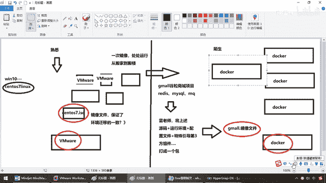
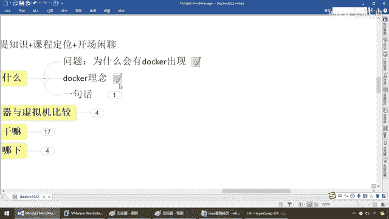
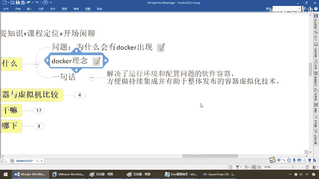

# 尚硅谷Docker实战教程（docker教程天花板） P4 - 04_docker是什么 - 尚硅谷 - BV1gr4y1U7CY

来同学们我们继续那么搁到这儿，我相信大家应该明白Docker的理念，那么按照对标的原则，那么大家都清楚，我们的WinWare相当于说就是我们的Docker，我们的SentOS机镜像文件。

相当于我们的古丽山城的镜像文件，那么在上面多个WinWare虚拟机跑同一方镜像文件，那么得到安装出来的SentOS操作系统是不是一定是一样，那么同理我们这儿也可以获得。

那么多个Docker引擎多个Docker，那么他们也是跑同一方镜像文件，那么怎么着，是不是跑出来的效果也肯定是跟雷逢阳老师的一模一样，那么再来一个，那怎么着，没问题，也让他装载同一份古丽山城的镜像文件。

效果一样接着奏乐接着舞，OK，那么所以说这个就是Docker的理念，总之我们能达成的效果，那么就是全场动作必须跟我整齐划一，来左边跟我一起划跳龙，右边划一道彩虹接着奏乐接着舞。

大家都一样。

所以说这个就是Docker带给我们的方便和灵活，那么所以说我们来看看。

Docker首先他是基于构语言实现的一种云开源的项目，他的主要目标很牛逼，而且人家也确实落地实现了，构建专载运行任何应用在任何环境，那么通过对应用组建的，什么，封装分发部署运行周期生命周期的这种管理。

使得你的这个用户应用，以及运行环境能够做到一次镜像，处处运行，能理解，那么最终我们就完成了，我们的版本上线，避免了因为配置环境不一样，版本缺失，第三方引入包的依赖不同导致的各种发布上线的错误。

那么你看构建，好，你现在开发完成了，依赖于哪些环境，给我打包成一个盒子里面，对吧，然后净下专载运行到我们Docker容器引擎上面，然后各种运行，各种环境搞定。

那么所以说Docker其实也是Linux容器技术的一种落地实现，后面我们会讲这个容器，那么Docker，它在这个基础上发布起来，将这个应用打包成镜像，OK，这一大堆应用打包成一个古丽山城的镜像。

通过镜像成为运行在Docker容器上面的一个实例，那么大家请看，我们在这块以后是不是Docker，这头大金，这个引擎，对吧，拖着各种各样的也许是Redis Nginx，你的一个一个的微服务。

大家拼成一份，那么完成以后，Docker容器在任何操作系统上，都是一致的，那么我们强调过，这个ISO镜像文件，只有一份，尤其也仅有一份，多个虚拟器软件，虚拟出来的ISO文件。

专的SentOS 7Linux操作系统，都一样，所以说，这个就实现了跨平台跨服务器，只需要一次配置好这个环境，换到别的机器上，就可以一键部署好，大大减化了我们的开发操作，那么得到我们最终的结论，一句话。

Docker它的出现，就是为了解决，运行环境和配置问题的一种，软件容器技术，可以方便地做，持续集成，有助于整体发布的。

容器虚拟化技术。

这个就是Docker。