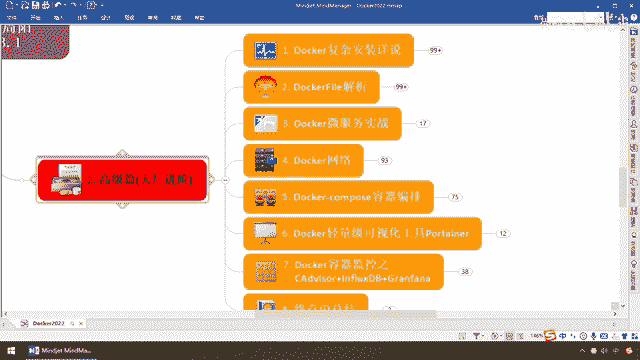

# 尚硅谷Docker实战教程（docker教程天花板） P40 - 40_高级篇简介 - 尚硅谷 - BV1gr4y1U7CY

各位同学，大家好，我们继续，通过前面的讲解，我们终于完成了我们的基础片，对于我们的从零基础，从Hello World到现在，第八章Docker的常规安装，到这儿算是我们单机版的Docker。

日常的命令常用的操作，你应该是OK了，那么换句话说，应该是从零基础到入门上手了，那么接下来我们呢，继续上路，还要继续攀爬直屎的高峰，那么来到我们的高阶片，我们这儿给大家说一下，第一个，前面的命令。

请务必动手操作熟练，做完前面的案例了以后，咱们再来，第二个，到了高级片的话，你肯定会碰到一些坑，那么希望大家呢，硬着头皮，一点点去抠，一点点去琢磨，我的环境和你的环境，尤其有些网络的话，它要连到外网。

可能在做的过程当中不见得会顺利，但是还是请同学们呢，继续呢，把这硬骨头呢，砍下来，增强自己的核心竞争力，那么对于我们的Docker复杂安装，那么这块呢，我们主要是讲解，片集群，对吧，你起一个，简单。

我让你起八个呢，好，你能不能一键生成，很多个容器实力呢，我们Docker Compose给你搞定，那么接下来，我们这份课的初衷叫什么，Docker与微服务，好，那么我们用Spring Boot。

Spring Cloud，完成了一个微服务了以后，怎么把它变成一个新的镜像，哎，然后由这个镜像，怎么让它跑到金鱼背上面，跑到Docker引擎上面，那么所以说，只要有必要了解一下，Docker File。

和我们的微服务，那么最后我们来看一下网络，由于目前啊，容器集群化，也是一个趋势，几乎是主流了，那么现在你对于你金鱼背上的，一个一个集专厦，一个一个容器实力，你要让他们互联互通，通信顺产。

自然要做网络的规划，那么我们需要对Docker的网络，host，bridge，None，自定义，container等等，这五大网络模式，都要做一个全面的介绍，最终，我们都启动了这些微服务。

那么就像我们Spring Cloud里面的，Hasrix豪猪哥一样，那么Docker也需要有轻量级的，和重量级的，键实化手段和工具，当然你除了这两种，你可以用其他第三方的，都可以啊。

你比如说我们的Portana，之前这些命令，我们玩了基本功，到了Portana的话，直接可以什么，在图形上点点，戳戳就OK，还记得我前面有一张，就我前面说过，Nginx我是不是没转，用命令。

大家现在自己用命令也能转上，但是我们在Portana，再给大家进行一下演示，完了以后，如果你觉得这个还不过瘾，那么可以上，类似于我们分布实时制，情细IoT相关的，Docker容器监控CIG。

那么也就是CADeviser和InfluxDB，和Graph，OK，所以说，高级片还是有很多东西，非常适合大家在工作中展开运用，甚至某些模板和文件，大家照着脑涂留着，去到公司里面以后，直接粘就OK了。

好，那么同学们，高级片也希望大家能够，摆齿干头，更进一步。

再接再厉，跟着阳哥继续往前开，OK。