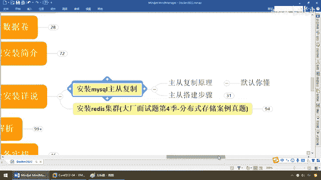
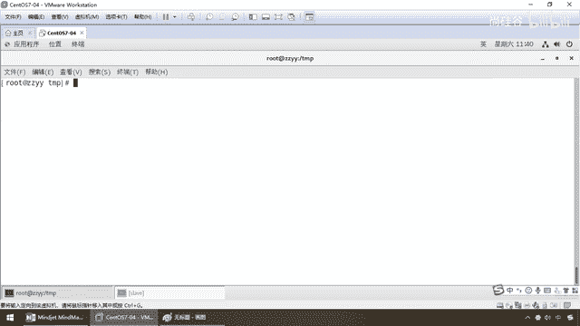
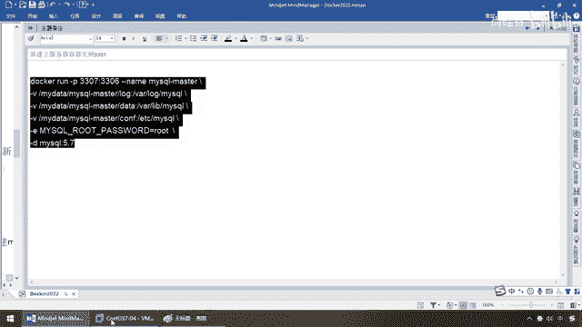
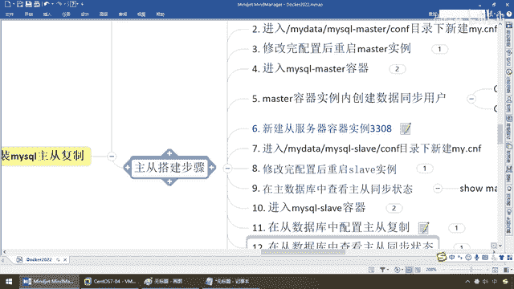

# 尚硅谷Docker实战教程（docker教程天花板） P41 - 41_mysql主从复制docker版 - 尚硅谷 - BV1gr4y1U7CY

好，同学们，我们接着聊，上一讲我们对高级片的一些相关知识做了一下说明，那么现在我们正式进入我们的第一章，Docker容器下面的复杂安装说明，那什么意思呢？，上一讲我们对Docker下的常规安装啊。

就是基于容器的单机版的，装个Tomcat、MyCircle、Redis的步骤，以及各种配置细节和各种坑，都给大家做了一下说明，那么搁到这儿，你假设现在呢，自娱自乐自嗨。

自己的威服连到单机容器上的这些中间件上面，做一下相应的开发，这是没有任何问题了，那么几乎到这儿应该是入门了，但是呢，面对着大产更高的要求，以及面对着未来的趋势，我们都说过这句话。

你今天的优势会被明天的趋势所取代，一句话，一切在云端，K8S、Dockers这样容器化的技术你是逃不了的，那么对于我们一些复杂配置安装，也需要在容器下面给大家进行进一步的深入的讲解和说明，那么来。

看两个案例，第一个，先说第一个，安装MySQL的主从复制，那么大家呢，都晓得，我们在MySQL里面绝对不可能用单机的，你在生产上在日常工作中，不要说是大产，就是中产、小产，只要你们是一些核心业务。

最经典的配置，一主一从嘛，对吧，也不用从机太多，因为它有一个主从的这个不同复，你从机太多跟不上，也是导致数据出错，所以说，基本上呢，默认我去调研以后，大家产用的都是一主一从。

一般中小产不大可能出现主机和从机都同时坏了，什么机房失火呀，电线被老鼠咬了，对吧，等等等等，咱们那些不扯，那么所以说，我们有必要了解一下，基于容器化技术，Docker下安装MySQL的一主一从，来。

兄弟们。

搁到这，首先主从复制的原理，由于到高级片，原理这个东西，怎么着，默认你懂，为什么，因为在上归谷的高阶学习部分，MySQL高级这个课程讲过，那不说别的，就是2016年，我就讲MySQL高级了，详细的讲过。

MySQL主从复制的原理，binlog，也就是我们的二斤之日志，或者也叫归档日志，和中级日志，双方的互相读写，这些原理，不废话了，那么有兴趣的同学可以去看一下，那么我们直接本次的重点，干嘛。

是不是主要就是Docker，所以说主要是给大家演示，在Docker融系化技术的框架下，如何把我们原来的主动配置，在Docker下再搭建一次，来看看，方不方便，那么中间有哪些坑，同学们需要注意，好。

那么同学们，再次啰嗦，强调一句，请务必一定要动手，啊，不用了，说，这个，阳哥，感谢你提供的帮助什么什么的，不用了，动手，那么希望大家呢，我都清楚，我把脑托给你，你就是沾，你都能沾成功，但是你不动手。

神仙也教不了你，OK，好，那么同学们，来，主从复制必然而然，一主一从，那么大家请看，3307，什么，主服务器，3308，什么，从服务器，好，那么相当于说，最终的需求就是3307，插入一条。

那么基本上3308能够收到一条，完成了这个主从复制，那么来吧，我们来看看，基于我们的Docker，我们呢，如何来完成我们的主从复制。

相关的操作。

第一步，请大家看一下，我们的命令，由于前面已经都讲过这样类似的命令，我先不讲，给大家十秒钟，我暂停下录屏，先看一下，这是说的是什么，同学们，RUN，小P3307，映射到3306，这边，速度机，这边。

Docker里面，MyCircle，真真真正跑起来的，容器内部的端口，好，容器实力的名字，MyCircle Master，3个V，刮了3个，我们前面讲过，干V是什么意思，对吧，容器数据卷，经典的。

基本上都是这三个套路，日制，数据，配置，那么根据我们的，前面的讲解，是不是在速度机上，对配置文件的修改，可以同步进我们的，MyCircle，Docker容器实力，那么干1是环境。

root用户的密码是root，那么版本MyCircle 5。7，所以说，兄弟们，不废话，那么第一波。

我们呢，先直接执行，这个命令，那，按照我们的，规范，配置和原则，说过，肌肉记忆，一定转了以后，一定先执行一下Docker PS，看看这个UP，有没有起来，对应的，我们的映射，正不正确，3307。

映射3306，如果能看到这，且看到我们自定义的别名，证明，MyCircle Master，成功启动，第一步，完成，走，那么接下来第二步，同学们请看，进入，MyData，MyCircle Master。

看服目录下，新建，My。CNF，就是MyCircle配置文件，前面讲过了，日知，数据，看服，一定是我们用宿主机的，就可以来影响，我们容器内部的，OK，不多废话，那么命令呢，就是它，对吧，那么。

图个省事吧，那么把这个呢，目录，粘下来，那么CD，搁到这，那么来，兄弟们，这个下面，是不是什么都没有啊，那么目前，我们的第二步，是要在单前路径下面，做一个，能够影响，Docker容器。

实力内部的MyCircle的配置，好，搁到这了以后，VIM，My。conf，那么内容呢，是哪一些呢，就这些，我们先给它粘过来，这个你不要去写，阳哥都给你写好了，你直接粘贴就行了，那么来，特别容易写错。

My点，配置类的东西，我们呢，直接手工粘贴就行了，像什么，Application点，XML，什么泡沫，亚摩那些配置文件，同学们，那么这，My点CNF，直接，我们呢，插入，OK，那么先，保存退出。

让它重新显示了以后，我们再来大概说一下，首先，MyCircleD，OK，那么对于我们的，My点，conf，这个配置文件，相当于给它加了配置，那么第二个，Server ID，101，同一局网中需要维系。

那么代表101，Server ID，那么你一定要定义一个什么，主机吧，对吧，然后呢，指定不需要同步的数据库的名称，那么忽略的，那么假设叫MyCircle，因为我们MyCircle刚刚安装完了以后。

是不是有一个MyCircle库，这个我们不需要，这是它系统默认出厂自带的，我们用不着，那么第二个，开启日制功能，那么Login，那么也就是我们的binlog，然后呢，每一行都给大家做了一个详细的说明。

日制使用的大小，然后呢，我们的混合日制，是混合型的，还是Date还是肉型的，那么来，过滤，清理的日制，因为binlog日制太多的话，我们呢，也设定一个，比如说7天的话，给它清理，那么这个呢。

是跳过主从复制中遇到的一些错误，那么避免Slaver被复制中断，那么这个时候主要是1062和1032，那么这个呢，不能错过，你了解就行，但是一些什么主见重复的，我们可以给它跳过。

实诞的来增加我们的容错性，好，那么同学们，这个呢，保存退出，我们完成了我们主机下面相关的配置，OK，好，那么再次强调，我们强调过，小细节和规矩，良好的工程经验，你在宿主机上，通过容器券，改了我们的配置。

传导给我们刀槛内部的容器，我们是要重启的，听懂了吧，但是我们还没改完，后面我们再重启，我们只是这提醒一下大家，好，那么来，修改完配置以后，重启Master实列，你看没问题吧，所以说兄弟们直接过来，来。

OK，MyCircle，Master，注意，不废话，一定要亲自看到这个名字，且这是UP，那么能够重启，说明我们的配置文件啊，各方面，对吧，语法上应该没有什么太大的错误，好，那么有问题后面我们再说。

因为这个配的话呢，我们要一步一步非常小心，那么第四步，进入MyCircle Master容器，那么干什么呢，进来了以后，我们来看看能不能登录成功，好，那么现在，Docker PS。

那么Docker EXEC-IT，那么这个时候是不是就是我们的，MyCircle Master主机，那么，bin，bash，MyCircle，root，GAMP，root，show data，base。

那么来，我们前面强调过，MyCircle默认了以后，它是不是带着一些库，这个MyCircle库我们刚才是不是说过，怎么着，不需要同步的数据库名称啊，哎，这些呢，不是我们的，好，那么这样的提一嘴。

那么进来了以后，我们要干嘛，MyCircle的Master主机上，容器实力内创建数据的同步用户，那么来看看我们的命令，这个以前我们也讲过，对吧，我们创建一个用户叫Slaver，那么因为啊。

我们现在要做的是什么，主从复制啊，那你主从复制的话，我主机上的数据，你不可能说外面随便来个人就来掏吧，那么所以说我是不是要授权，我要建立一个什么，可信任的用户，那么我们这儿干的活就说。

现在创建个用户Slaver，然后呢，可以用123塑料来登录我这个主机，给你授予这些权限来拿到对应的数据，哎，这个呢是MyCircle安全加固的一个意思啊，那么你不能说来个人。

就可以把我主机上MyCircle的数据给偷，偷走，好，这是第一波，那么第二波，是什么，授权，那么说不穿了，第一步就是建立一个用户，第二步是给这个用户，授一下权限，那么你可以做哪些，相应的读写操作，好。

那么这个呢是我们的第五波，那么第五步完成以后，暂时主机，3307，暂告一段落，那么接下来，请看一下我们的第六波，新建重复器3308，好，命令和刚才的差不多，端口变成3308，追加映射3306。

名字叫Slaver，OK，三口V，OK，不废话，那么这个呢一看就应该明白，那么来吧，搁到我们的Slaver，重机这边，老规矩，肌肉记忆，只要转了马上，PS一定要看到UP，且我们对应的别名。

或者我们的container ID，好，那么这个时候我们的第六波完成，那么下面请看第七步，大家请看，还是熟悉的配方，还是熟悉的味道，这么说能跟上，那么我们进到我们的这个，conv目录下面。

那么你也晓得的，干嘛，是不是vim卖点看服对应的操作，那么现在，CD，过来吧，那么大家请看，现在下面什么都没有吧，vim卖点CNF这一波，没问题吧，那么卖点CNF，vim卖点CNF，不要配错。

那么和刚才一样，老规矩先给他拷贝，然后呢，我们呢，直接，粘贴，那么这些复杂的，你不要自己去写啊，你张扬个的老图就行了，那么来，兄弟们，大致讲解一下，同样的还是给circuit服务端，后端来配置。

相应的设置，subit ID主动复制，101是主机，102默认就是重机，绝对不允许，重复啊，这个会出错的，千万不要那个糊涂了，那么，不需要同步的是哪一个，那么这开启二进指功能，事务的大小和之前差不多。

去掉1062的主动复制的，这个主件复制的错误，那么来，这，什么，同机是不是有个东西叫中计日知啊，这个呢，原来在讲，原理上讲过，那么呢，写金子的二进日知，那么sliver默认是什么，只是读，写。

master，就稍微全线犯的严格一点，那么read only我们要把它打开，设置同机只认为读，OK，好，那么，兄弟们，如果没什么问题，这一波搞定，那么现在呢，我们呢，也已经完成我们的第七步，那么接下来。

我们呢，第八步，修改完配置后，重启sliver实例，对吧，那么要把我们的这个，也要重启一下，专门啊，这个是sliver这边的，那么老规矩，docker ps，我们大家请看，两秒钟之前刚刚重启的。

那么说明我们的配置，应该是ok的，好，那么在主，数据库中查看主从同步的状态，那么这个时候请看，soul master status，来吧，那么弟兄们，回到我们的主，现在注意啊，这个主的话，我是在主机的。

mycircle容器实例内部，那么我现在执行这条circle，那么大家请看，我们的binlog日志，因为我们一般是不是做那个，电山山城吗，对吧，那么mybinlog，01001，position617。

那么它呢，忽略不要去，迁移，复制哪个库，是mycircle那个等等等等，那么说明我们的文件名，和我们的一个刻度，对吧，从617，这个呢，开始往后读，往后写，好，那么这个呢，是我们的第九步，那么第十步。

进到我们的，mycircle，slaver的容器里面，那么和刚才的，一回事，那么来，同学们，docker，exec-it，谁呀，我们现在去的是，铜机，那么，来到铜机以后，进去，binbash，来。

mycircle，root，gampp，root，OK，那么现在，成功进入了我们的什么，mycircle，slaver，slaver容器实例里面，是docker上面的，那么好，第十步，完成，那么兄弟们。

在第十一步，在，谁，你看，11，12，13，都是谁，从从从，千万不要搞错，每一步都要小心，在从数据库中，配置什么，主从复制，那么来，弟兄们，怎么配置呢，公设，如下，我现在是不是进入到了我的从，服务器。

那么，我要change master to master，什么，什么概念，因为现在，左边这个是主，右边这个是从，我们两个是各自独立的，我没有拜拜马头，没有认认老大的，我这个叫slaver。

只是阳哥自己人为的定义，人家还没服软的，怎么服软，change master to master host，告诉你，从现在，现在给你找了个老大，那么这个老大的宿主机IP是多少，那么具体你自己是多少。

就是多少，OK，那么根据，你过去拜老大的话，要有个，价帖吧，那么这个时候老大刚才做了个权限认证，你呢，叫slaver，用户是密码的，123456，那么端考试去反问3307，我们强调过吗，07是主。

08是master，那么然后大家请看，在这一块，more mycircle bin 001，more mycircle bin 001，OK吧，617，然后呢，master的连接重式，等等配置一个30。

这个没问题，那么现在，主从复制的命令参数说明，那么这一块，那么弟兄们，怎么着都给大家呢，安排的明明白白，清楚了吧，为什么我们前面要先在主机上执行一下这个，主要是拿到这个刻度，这个非常非常的重要。

那么弟兄们，你们对应着主机件端口，用户名，密码，文件，然后呢，从哪个位置开始，然后呢，失败重式时间间隔30秒钟，OK，应该是跟你说的明明白白了吧，那么主机件，主数据库的IP，那么现在呢，我们呢，隔到这。

兄弟们，我们呢直接，ifconfig是多少就是多少，OK吧，那么大家请看，找1S33，我现在是不是，111。167，这台机器，这台IP，好吗，那么来了，隔到这儿，同学们请看，那么现在呢，注意我在哪。

在从数据库中，配置主从复制，好，那么从数据库中，这段给它章过来，那么，我们接下来呢，为了避免啊，先提前改好啊，别到时候呢它执行出错，那么我们的IP就是，192。168。111。167，OK。

那么在这块的话呢，我们呢，192。168。111。167，没有任何问题，那么，直接拿过来，在我们的从机站，OK，那么在从机站，执行这一大段，配置，OK，好，那么同学们，我们的第11步完成，那么接下来。

请看第12步，在从数据库中，查看主从同步的状态，那么我们现在只是拜了码头，那么有没有进行数据的传输呢，哎，这个呢，只是大家见了个面认识了，但是还没有实际的交易呢，那么现在请看我们的第12步，来。

show sliver，注意，我这写了两种方法啊，故意的，show master status，这个叫show sliver status，哎，能理解，这个是什么，他们两种的，不同的读取格式啊。

故意给同学们，写在这，都给同学们看一眼，那么，以前我这写了以后，大家请看，是不是从左到右，横着的抽链一张表格，那么现在如果我像这样呢，干个记呢，就是数着的，相当于一个什么，kv键值对，这么说，能跟上。

那么大家请看啊，这个参数你可加可不加，加了的话就会是一种形式，像hashmap一样，kv kv kv，左是k，右是v，好，那么现在，怎么着，我们，主要查看主从的同步状态，主要是看什么呀，来，兄弟们。

主要是看，同机的io running，circle running，no no说明什么，还没开始呢，因为主机上都还没给他，写过任何东西吗，对吧，那么所以说，在这，那么同学们，从，笔记到我们的对应的。

实例配置，no no说明还没开始，好，那么第12步完成，那么兄弟们，继续，第13步，在同数据库中，开启主从同步，哎，第一个，那边的老大，要给我创建用户，允许我过去，可以去取，给我授权，第二步。

我自己要同意，去什么，接收，所以说，在这，在同数据库中，开启主从同步，start，slava，ok，那么确定，哥们，实锤了，你呢，就是我们的什么，同数据库了，start，slava，ok，那么来，搞定。

那么开始呢，同意接收，那么第14步，查看，同数据库状态，有没有发生同步，那么来，start以后，short slava，还是这个，如果在这，前面的两个，no no，变成，yes yes，那么说明什么。

链路打通，那么，万事俱备，只欠东风，那么来，同学们，如果不出意外，那么兄弟们，这是不是两个，yes yes，ok，那么切记啊，没有执行这个命令之前，前面我们的是什么，两个，no no，ok。

那么执行完了以后，这块变成了两个，yes yes，好了，那么，第14步，完成，那么接下来，主同复制测试，那么主机，新建库，使用库，新建表，插数据，ok，那么，重机，使用库，查看记录，重机主要是读嘛。

好了，那么现在呢，弟兄们，完成这个以后，对吧，我，create data base，那么，db，0e，ok吧，user db，0e，ok吧，那么现在，create table，那么假设 t1，这张表。

那么，我要干的一个什么呢，id，int，name，wacha，那么来，兄弟们，这一波，ok吧，那么，insert，intent t1，values，那么这，一键，粘三，ok，那么，select新。

from，我们直接过来，t1，这张表，那么在我们左边，主机这台机器，1号记录，粘三，完全成功，ok，那么接下来，不废话，重要的是，重机，那么主从复制，主机有了，重机，能不能，顺利的，迅捷的，读取出来。

那么，老规矩，刚才的重机是什么都没有，那么如果说你现在主机，已经有了，那我是不是也要是，先使用这个库，来执行一下，user db0e，兄弟们，这么说，能跟上，这个没问题啊，你看，database。

前面是一个警告，不用管它，database，签记，说明我已经用了，这个什么，db0e，都不用收table，直接select新，from t1，兄弟们，有没有，ok，那么大家请看，这个时候。

是不是就完成了我们的，主从复制啊，所以说，这个呢，就是我们对应的，从容器这个角度，完成了我们的，一主一从的，MySQL主从搭配，这个在生产中，是实际要用到的，那么请同学们，务必掌握，好。

这个案例就讲到这，大家动手。

练习一下。