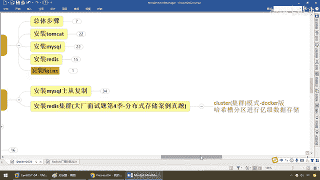
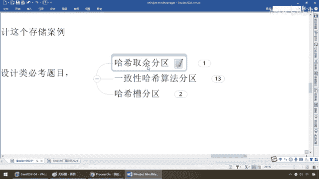
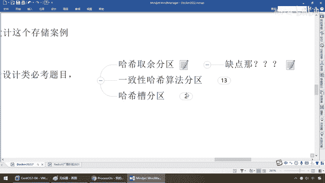

# 尚硅谷Docker实战教程（docker教程天花板） P42 - 42_分布式存储之哈希取余算法 - 尚硅谷 - BV1gr4y1U7CY

各位同学，大家好，我们继续，那么接下来我们给大家演示一下，大场面实体第四季的一个分布式存储案例的一个真实案例，主要是给大家分享和讲解，加深基于Docker容器下面三主三从集群环境的搭建。

以及扩容和缩容的演示，这个非常重要的案例请同学们务必掌握，第一点，你先看看基础片Docker下Android Redis，和高阶片Docker集群下面Android Redis集群，他们两者的难度。

请做一个对比，你看看你自己想深入到哪个层次，第二个，请多啰嗦一句，目前现在面试，由于阳哥在山鬼谷执教也已经五六年了，很多弟子找份工作没什么问题，现在都在慢慢的努力，准备去冲击大产。

再大产的又准备从P6升P7，都在持续默默努力着，其实说白了，网络上说的那些什么坦评什么什么什么的，可能，现实环境中努力起来真的是一个比一个狠，听懂了吧，至少阳哥的这一波认识的这一波弟子。

没有一个选择坦评，都觉得什么，疏到用时翻很少，钱到月底不够花，那么这个时候的话呢，你对于三五年工作经验的人你去冲击大产，一看你的简历，也知道你有，35工作经验，说难听点默认潜规则。

没有个月薪25k或者30k，甚至更高是请不起你的，那么自然然他要求问的就不再是那些简单的八股文，比如5年工作经验你来应聘一个，阿里P6或者P6加，他不会再考你什么Hustle Map底层是些啥，这些。

说白了考，初级选手的题目了，但是他考的会更难，那么可能考你的是什么，你过往项目的，技术亮点和你，工程经验，尤其是一些什么，复杂的，场景案例设计题目，说白了就是什么。

来了要能干活我们不是找一堆小镇做题家你又不是什么干毕业一年工作经验以内，看看你基础知识扎不扎实学习能力强不强，在这块的话。

同学们来看一下。

集群模式，Docker版本，按照哈希曹分区，这样一种算法来进行一级数据的存储，如果说你，应聘K8S，Docker，Divorce这样的高端岗位，一定会问你你在容器环境下面你是怎么做的，好。

那么同学们来看这么一个面试题，一到两页甚至更多一条数据需要缓存，请问如何设计，这个存储案例，我暂停下录屏同学们可以思考一下，你看啊比如说字节抖音的这样的，观看流水，转站记录。

包括你的浏览记录大数据后他在做着分析呢，那可能每个人，成千上万的用户汇总起来以后有些数据是需要缓存的，那么这样的话，你怎么办，你怎么可能说我给你台买Circle，插，反正插个两一条把分库分表等等的。

别想了一句话，张嘴他就知道你有没有了，这种问题不用多废话，单机单台完全不可能，肯定是分布式存储，那么请问你有Radius如何落地，那么兄弟们一样，单机单一台Radius扛不扛得住。

当然扛不住了扛不住怎么办，那是不是分而治之，只能是多台来扛啊，所以说上述，这样的问题，上述这样的问题啊就是阿里亚腾讯这样的，大客户，那么对于，工程案例和产品设计的必考期末，那么对于这种，分布式存储。

那么一般业界有三种解决方案，那么兄弟们，阳哥三板斧理论时操小总结，那么所以说弟兄们，先听理论，这是你面试的谈资，OK我们强调过你干什么事情你跟面试官聊需要有谈资，大家都很忙。

你别过去我就试着玩我面试着玩大产都有黑名单管理系统，你要么现在不要去大产面试，要么就认认真真做准备，别跳了一般的工作没什么太大意思就照着大产打，那么所以说你要做至少是什么，三到六个月的精心准备。

不要觉得我过去面试玩，成了我就去，不成了就算，如果是这样，你这次面试，准备的不充分，基础支持不扎实，像阿里呀美团啊自己呀他有内部的招聘系统，记录下了你，这次的，表现那么你下次，你想在那面成功就有点难了。

同学们，所以说，干嘛，一般，别出手，出手，别一般，就这个意思，好那么还是请大家做一下扎实细致的认真准备和积累，那么现在，请同学们理论，听完了以后我们再做十套，那么然后咱们呢，再来做总结，那么这个。

是可以跟面试官聊聊的，你又三五年工作经验了你做过什么配过什么，有没有一些亮点，啥都拿不出来还是只会说，增伤改差，还要自己黑自己，程序而主要是，CV工程师什么呢，那是你，不代表别人，所以说希望各位同学们。

还是什么人往高处走，水往低处流，加油来，大家请看，对于这样的分布式存储，我们的理论依据，有哪一些，那么你把这三个给面试官说一下，至少认为，理论支持扎实，那么可以可以这么理解，小产，中产，大产，OK。

难度和复杂度一个比一个高，来，第一种，我们前面强调过了，数据很多需要缓存，单机不可能，那么肯定是分布式存储，那么分布式存储的话你这个数据怎么落，假设分布式那么肯定是什么，多台。

那么多台的话假设有123456，不管是三台，还是六台，那么假设来个数据了你是放到一号机还是放到三号机还是放到二号机，这是犯，第二个读的时候你，之前是放在二号机你能不能保证下次读的时候也从二号机读出来。

这个就是根本，所以说我们，第一种情况，方法，哈西取余塑。

进行分剧，那么来，同学们，我们来看看啊，现在呢我们在，Redis，来做缓存这是必然的了，那么现在就变成什么，一级的这样的存储，那么假设，我们有个key，SETK1，V1，那么。

丢到这Redis里面这三台，机器上面，放哪台呢，你要拿什么算法呢，那么来吧，两一条数据假设啊，两一个key V，我们单机不行是必须要有分布式锁，分布式，那么JR社我们三台机器构成了一个，集群。

那么用户每次读写操作都是要根据一个公式啊比如说哈西，这个Redis这个key过来了，根据某种哈西算法，去取余，机器的台塑求个余塑，那么计算出这个哈西值用来决定他映射到，哪一台比如0就是这台，1就是这台。

2就是这台012，你怎么存的，我怎么取的，因为Redis里面这个key一般是不重复的，你用同样一套哈西算法，那么你取到的这个余塑，存进去是放在零号机，下次我来取的时候，取出来也是从零号机，那么这样。

干嘛，绝对正确，听懂了吧，这个哈西取余是一般，最通用最常用的，OK，那么接下来的问题是他的优点是什么呢，简单粗暴，直接有效，只需要预估好规划好截填，你是三台构成机群还是六台构成机群，随便，都能保证。

撑一段时间，使用哈西算法让固定的一部分请求，写和读都落在同一台服务器上面，这样每台服务器，固定的处理一部分请求，并维护这些请求，比如说，假设一一条数据，3 4 3的比例。

前3000万中间4000万后3000万，咱们就在这了，那么这样的话呢是不是就起到了负载均衡，和风而治之的作用，那么，兄弟们，思考一下，他有什么缺点，好给大家10秒钟，简单的就是最好的，没错。

那么但是别忘了，他还有没有什么缺点呢，我们现在能撑下来，除以几，是不是集群的总台数，那么下面我们的问题是，假设这个集群，某一台机器他挂了，他去除以3，没了实际已经变成2了，那这个时候兄弟们。

是不是有点天下大乱啊，哎那么来吧，可以看一眼，还是刚才这个取法，我们的问题是，原来规划好的节点，进行了扩容和塑容就比较麻烦喽，不管扩缩每次数据，变道，都会有变道，那么映射关系就需要重新进行计算。

那么这个时候在服务器，各速不变的情况下，我们需要扩容或者是，故障停机的情况下那么原来取模的公式就发生变化了，以前固定写死就三台机器，那么现在假设你变成四台，或者是六台，那么这个余数是不是就。

不一样了这个分母就变了，那么好这扩那么说呢，那么假设他变成了，两台了呢，那么此时地址经过取的计算结果，将会发生很大变化，那么以前放到这的，可能就放到别的了，那么根据公式获取的方式，就变得不可控。

由于某个，机器淡机了，底层这个台速的变化将会导致哈希奇鱼的数据，全部重新洗牌，那么这个，就是我们什么，不利于在大产用的，因为大产你免不了要对，集群机器，破缩容，你这个哈希奇鱼这个，分母数是一定会变动的。

OK那么所以说同学们，这个是其中一个方法，但是呢，我们小产用用可以大中产，OK那么第一种算法，就是我们的是吗，分母式存储的理论依据。

哈希奇鱼。

