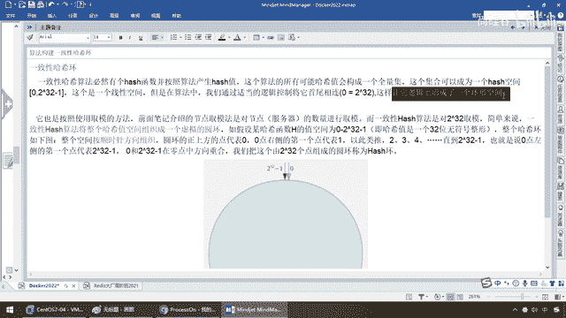
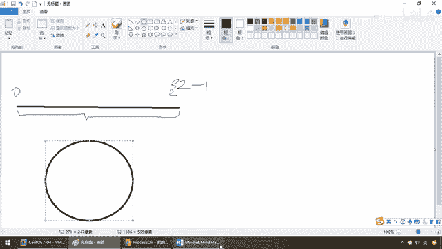
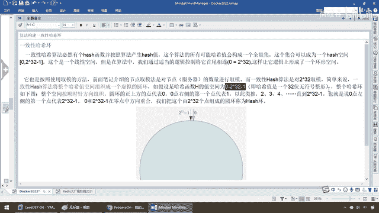
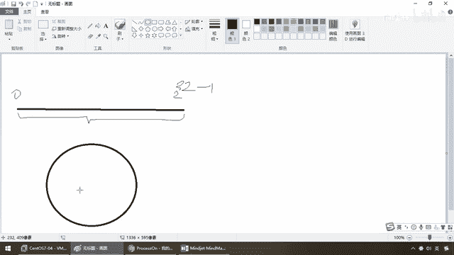
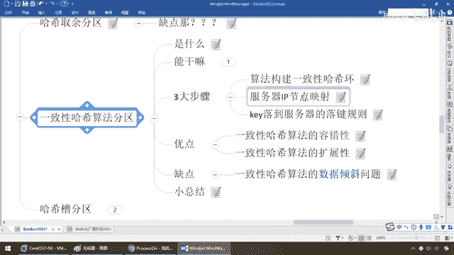

# 尚硅谷Docker实战教程（docker教程天花板） P43 - 43_分布式存储之一致性哈希算法 - 尚硅谷 - BV1gr4y1U7CY

好同学们我们继续接下来给大家介绍一下分布式存储思想的第二种算法，一致性哈希算法来进行我们的分区，那么通过上一讲我们都晓得底层的这个分母不是固定的写死的，它有可能扩有可能缩有可能淡击有可能固斩。

那只要这个底子一变化就会导致我们哈希区全部数据要重新洗牌，这个呢是有些安全隐患的，那么接下来我们进一步来看一下一致性哈希算法，那么首先它是什么，来它那是不行了啊，97年就有麻省理工学院提出来的。

它的设计目标就是为了解决分布式缓存数据的变动和映射问题，某个机器淡击了，对吧，分母数量改变了，自然取决就不ok了，那么这样的话呢，我们之前的映射规则就会发生一些改变，我们为了解决这个问题。

我们往前走一步，一致性哈希算法，来来看看它能解决些什么呢，提出一致性哈希的解决方案，目的是当服务器的各所发生变动的时候，尽量减少影响到客服端和服务器端之间的映射关系，那么一般啊，一致性哈希算法。

这种呢有三大步骤，第一个，用算法构建一个一致性哈希环，待会我们说啊，第二个服务器IP，那么你构建这个环了以后，相当于说，你后面按照IP的节点可以映射落到这个环上面，然后这个Key再落到服务器的。

产生一个落件的规则，好，那么现在，不担心，一步一步给大家说，来，弟兄们，什么叫一致性哈希环啊，一致性哈希算法必然有个哈希函数，并按照算法产生一个哈希值，对吧。

那么这个算法的所有可能哈希值就会构成一个全量的集合，比如说你某个算法，它能产生的数据，从0到多少多少多少，它肯定会有一个上限，那么这些全部给它收集起来，我们这个集合就可以形成一个哈希空间。

那么根据我们的算法，它的大小是0到2的32次翻减1，那么这是一个线性的空间，但是在算法当中，我们通过实弹的逻辑控制将它首尾相连。

这样就让它的逻辑上形成一个环形空间。

那什么意思呢，就说现在，以前你的区间范围，比如说这就是0到我们的2的32次翻，对吧，那么，完了以后，现在，这个呢就是个全量集合，没问题吧，那么现在呢，我们把这圈呢，给它沽起来，让它呢，从一个素组一样的。

从0到这个最大集，让它形成一个环，OK，那么这个是第一步，那么为什么要这么做，待会我们聊，就是减轻底层机器态速变动以后，我们的映射和分配规则。

那么来。

同学们，走吧，我们按照，我们也是按照，使用取决这个方法，我们上一个算法的话，介绍的节点的取决是对节点服务器的数量进行取决，对吧，比如说3台就是3，6台就是6，而一致性哈奇的算法是对2到32次翻。

那么简单来说就是，一致性哈奇算法将整个哈奇值的空间，组织成了一个虚拟的圆环，从坦平到圆圈，OK，再次强调这句话，以前我们是对机器的数量，这个机器数量是会变化的，可能3台，可能6台，可能8台，可能10台。

但是一致性哈奇算法，底子2到32次翻，那么这样的算法来了以后，会变成一个全量级，那么现在，我们某个哈奇值，它的空间，就是从0到这个。

那么整个哈奇环就会像这样。

就像杨格画的，从这儿构成个圈。

那么这个时候，你所有的集合，都在这个圈圈里面，一宽天下，一览无余，一碗打尽，那么圆环的正上方的点就代表是0，右边第一个就是，1就跟一个中一样的，01234567一直到2到32次翻，减击，也就是说从0点。

左侧的第一个也代表，是吗，2到3424翻减1，这个最大值，这个是最小，0，转一圈，最大的就是大，那么在0和2到33-1的0点中，方向重合，我们就把这个由2到32次翻的点，组成的圆环就称为哈奇环。

那么现在就是，我不管你底子怎么变，反正我取余的固定了，2到32次翻，好，这是第一步，我们构建了一个环，换句话说什么，你就把它当做一口锅，你不管怎么映射，你下面怎么变，再大的饼大不过捞它的锅，对吧。

都在这个全量级的范围里面了，那么好，第一步，第二步，服务器IP节点的映射，那么你有这个环了，你得落到哪吧，对吧，那么所以说，我们在这呢，走起来，既然集群中的各个IP节点，映射到环上的某一个位置。

那么就是节点映射，来吧，当各个服务器使用我们的一种哈奇算法，会得到一个哈奇值，那么具体可以选择服务器的IP线，或者主机，作为你是，按照IP还是主机名，作为关键字进行哈奇，那么这样每台机器都能确定。

在哈奇环上的落点位置，假设啊，四个节点ABCD，那么现在，ABCD，经过我们按照IP地址进行哈奇，计算，那么使用IP地址，哈奇环后的空间，是这样的落点，假设节点A，通过这个算法得到一个值，那么OK。

它呢就在这，又得到一个值，在这，在这，在这，那么是不是像，一块手表，一个钟一样的，反正每一个节点，一定所有一天24小时，无非就是转一圈，转两圈，都在这个圆盘上，OK，那么他们的什么，节点映射。

就在这个环上面，好，那么下面，key落到服务器的，落件规则，是这样的，当我们需要存储一个KB建设对，我们首先计算出，key的哈奇池，我们刚才已经看到了啊，那些机器的节点，已经在这了，明白了吧，那么现在。

哈奇拿来key，ABCD四台机器，都落在这个2的32，三番减1的这个环上面了，那么机器落了以后，就是节点，1234ABCD，那么现在来个key，比如说KE，将这个key，使用一个哈奇，来算一下。

那么由于它跟我们落点，机器那个哈奇函数，就是这个，是一样的，那么算出的哈奇池，必然也会落到这个环上面，那么最后，我们得到的结论是，从此环，顺时针，往前走，第一台遇到的，机器，就是它应该落点的位置。

首次出去，就是它的真爱，那么这个时候，请大家看，假设，节点A，是某个机器，通过这个哈奇，我落到这，那么现在这个key，来了，它的数据，叫obj，假设这个key，就叫A，那么现在通过，一样的这个哈奇算法。

请看，这个key，A，通过这个哈奇函数，我落到环上的这，干嘛，沿此位置，顺时针走，遇到的第一个，那么好，说明什么，我这个key，落到环的这，往前顺时针走，碰到的第一个，就是我的真爱，结，node A。

就是落在1号服务器上面，存进去，那么这样的话，ABCD，4个key，4个数据对线，经过西安通的哈奇计算方法以后，在黄空间上面的位置以下，根据一致性哈奇算法，A会被定位到，node A。

B会定位到node B，C，往前走顺时针，会定位到C，D落到这，往前顺时针走，碰到D，那么这样是不是就让他们，有序的，落到了4台服务器上面，那么我们的key，就有着落了，好，所以说，这个就是我们的什么。

三个步骤，那么，一致性哈奇环，映射，最后是落件规则，OK，那么来同学们，来看一下，一致性哈奇算法，它的优点和缺点，比起上面这个好在哪，又会产生什么问题，我们要进一步的优化，首先优点，一致性哈奇算法。

它解决了哈奇其余的，容错性和扩张性的问题，大家请看，现在根据我们的落点，就是落下来以后，顺时针往前走，遇到的第一台就是我的真爱，我就存进去，那么现在假设，我们出现这么一个问题，假设，C。

Node C这个节点，淡机了，所以下面这个，那么此时可以看到，我们当然希望你淡机以后，就是所谓的什么，谁的锅谁背，你C淡机了，别影响ABD这三台，那么好，现在呢，只有，我们那就不会受到影响。

对吧ABD这三台，那么，这台死了，假设我这个Key，这个C落到这，如果你以前活着，我应该落到C帐，可是你现在，已经挂了，我应该怎么办，同学们，我继续往前走，已经没有C了，我再继续往前顺势针走。

遇到的我的什么，第一个遇到的服务器，是D，那么所以说C，对象被重新定位到D，那么一般的，我们在一致性哈奇算法中，如果一台服务器不可用了，则受到影响的数据，仅仅是此服务器，到其环空间中的前一台。

就是说C淡机了，假设这，走不通，这台受影响，和，沿着什么逆时针方向，新走遇到的第一台服务器，就是，只会假设我这台死了，只会影响这一段，我往前走，C死了，顺势针，是不是，这，那么我的逆时针方向。

后面是不是B，那么也就是说，BC这段，就存不进去了，为什么，因为这个区间C没有了，那么是不是从BC变成了BD，这个区间了，能理解，所以说同学们请看，只会影响这一段，区间上的数据，其他是不会受到影响的。

所以说，简单来说就是，C挂了，受影响的只是，BC之间的数据，说C，假设我落到这，C挂了，往前走，是不是C，往后逆时针方向，是不是B，所以说，只会影响，BC这一段，其他不会影响，那么由于已经没有C了。

按照我们的一致性哈希算法的规矩，遇到C，是吧，干嘛，此处不留爷，自有留爷处，我往前走，还是顺时针，那么我遇到的，第一个就是就变成D了，那么所以说，这些数据会转移移动到D上面存储。

那么这个就是他第一个优点，有容错性，第二个，干嘛，扩张性，那么我们说过了，现在ABCD，四台，那假设你扩容要变成，六台呢，八台呢，十台呢，那么这个数据就怎么扩呢，那么来吧，弟兄们请看，假设数据量增加了。

按照我们这个图，需要增加一台节点，比如说第五台机器，X，X的位置，刚好根据我们的哈希算法算了以后，就在AB之间，我这个机器，就会落到这，那么，那么受到影响的也就是，A到X，OK，那么这个时候我们需要把。

A到X的路距，重新落到X之上，就OK了，不会导致哈希取约，全部重新洗牌，听懂了吧，那么比如说啊兄弟们啊，我这又加一台机器了，以前是什么，我落到这段，怎么着，我可能往前存，是存到B，那么现在又多了台X。

那不就是什么，我呢，直接遇到的我第一台，干嘛，落到X上面，就完活，明白了吗，那么X加到这，那么以前遇到的第一个，就从B变成了我们的什么，X，好，那么这个呢就是，一致性哈希算法的，扩张性，貌似到这。

都挺爽，那么它的缺点是什么呢，有一个它难以解决，一致性哈希算法的，数据倾斜问题，那么来，为什么说，小厂用这个就够了，小厂不用上这个，什么意思，你的数据量没那么大，没到那么大的话，你不用上那么十多台。

对吧，又不是像京东那种体量，美团那种体量，那么对于一致性哈希算法，如果你机器比较少，不要用这种算法，理由，你很难解决，数据倾斜的问题，那么弟兄们，请看，是这样的，如果节点太少，非常容易会导致。

节点分布不均匀，造成数据倾斜，那比如说，兄弟们，A B两个节点，好，落到这，那么假设某种算法，它落到这，B 往前走，顺势帧遇到的第一个，我存在B，但是假设，这一段以外的，都是往前走遇到的。

是不是都只会存到A呀，那么被缓存的对象，大部分会集中在，一台机器上面，那么这样就会导致，A 特别重，B 特别轻，你看，我如果落到这，顺势帧往前走，遇到的第一台，我就存进去，那么这就是A，落到这也是A。

只有落到A B之间的，会存到B，那么这样会导致，这两个，头皱，矫情，非常的不稳定，所以说，这个就是一致性，哈希算法，它的优点和缺点，相比于哈希取余，增强了容错性和扩展性，好，那么总结一下，那么。

为了在节点数目发生改变时，尽可能少的迁移数据，我们将所有节点，按，首尾相接，放在一个哈希环上面，那每个Key在计算哈希后，会顺势帧找到，临近的存储节点，就第一次，放进去，那么当有节点加入和退出时。

仅仅影响该节点在哈希环上，顺势帧节点，相邻的这种后续两个节点，OK，前面我们都说过，那么优点，加入和删除节点，只影响哈希环中，顺势帧方向的相邻节点，对其他节点无感，缺点，分布和节点的位置有关系，如果。

不是太均匀的话，会达到那种，头重脚轻的感觉，那么所以说兄弟们，在这儿如果只有两台机器什么的，就不要玩什么，一致性哈希算法，OK，好，那么这个理论知识。

主要就是这三步。

哈希环，节点影响和落件规则。