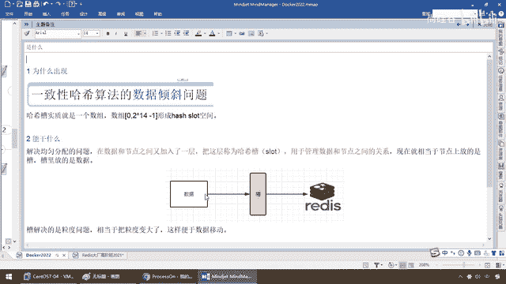
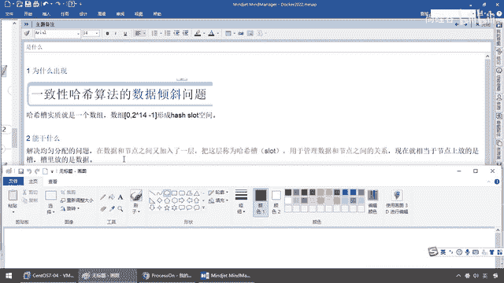
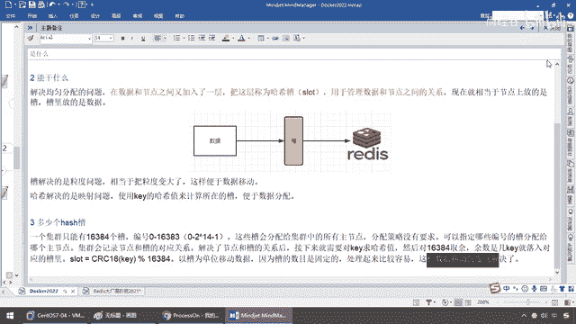
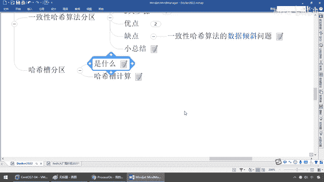
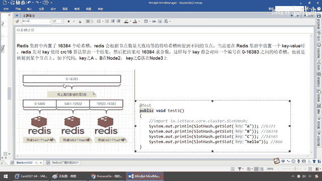
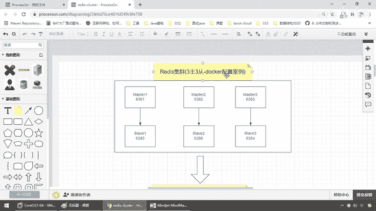

# 尚硅谷Docker实战教程（docker教程天花板） P44 - 44_分布式存储之哈希槽算法 - 尚硅谷 - BV1gr4y1U7CY

好 同学们 我们继续，哈希取义算法的缺点，我们说过了节点映射 数据变动 容易出错，那么一致性哈希算法，那么它的缺点我们也说过了，数据倾斜问题，那么所以说我们来到我们第三种算法，哈希槽分区。

这个是大产常用 几乎是标配了，也就说难听点，你去面试的时候，起码要给人家转一个哈希槽分区这么一个算法，代表你知道 这个在什么，你的软件跟我们匹配 认知是一致的，让你进去干个活的话，人家跟你说个。

你看一下那个slot槽点上是多少什么的，你听都听不懂，那就麻烦了，所以说 来 兄弟们，哈希槽分区，走起。

首先 它为什么会出现，那么在这儿呢，我们遮挡一下，一致性哈希算法，是它的上一个算法，它有数据倾斜的这个问题，那么 同学们，我们呢，哈希槽它实质上呢，就是一个素组。

素组是0到2的十次范剪接形成一个哈希槽空间，诶 你不刚说从32嘛，怎么变14了，这什么意思啊，来吧，它能干一些什么呢，它是来解决均匀分配的问题，在上面的一个tom点上面，又加了一个补丁，完美解决。

在数据和节点之间，加了一层，把这层称为哈希槽slot，用于管理数据和节点之间的关系，现在就相当于节点上放的是个槽，槽里面放的还是数据。

是啥意思呢。

有点像我们的代理模式啊，大家是不是干过这么一种东西，就是service层，调一个dao接口，然后呢，从你的数据增伤改差，反正你数据一个接口，dao接口，增伤改差四大操作，无复落到增，落到伤，落到改。

落到差，后面可能有一百条记录，一万条记录，都是一个mycircle，那么一样，他在数据和radis之间的分配上，干了个槽，相当于找了个中介代理，我，这个槽啊，他解决的是力度问题，你不用那么多机器都去找。

你就找我这就行了，相当于把力度变大，翻变数据移到，假设以前有八台radis，我要找八台，现在我就找一个槽，好，那么哈希解决了映射啊，kb进制的映射，那么他，用来计算，你所对应要落在槽位，便于数据分配。

那这什么意思呢，那同学们，请听我来解释，首先有多少个哈希槽，一个集群只能有16384个槽，编号是0到16383，所以说刚好是0到243-1，那杨哥你这个知识哪来的，听着。

我们这现在要配的是radis的集群，部署在多卡容器上，那么radis的集群，默认就是16384个槽，这个不是我胡说的，由于今天我们主要是讲的是，多卡，那么对于这个问题，你感兴趣的同学，那么请来参加杨哥。

大产学院的radis，我在这给你说过经典的东东，这个不是我说的，是radis之父安蒂雷斯的回答，为什么radis集群最大的槽数，是16384个，那么，弟兄们，请看，这是别人的题位，OK，那么。

安蒂雷斯的radis的，它跌，原因如下，那么这两个，radis集群，并没有使用一致性哈希，而是引入了哈希槽的概念，哎，再次强调啊，我们目前解决分布式存储，都是用radis，那么radis就，落地。

那么就是用哈希槽，因为radis集群最多是有16384个哈希槽，每个key通过cns16这种教研算法以后，对16384取谋，那么也就是之前，我们的上一种算法是2的32次番，而这个呢是2的14次番。

就可以了，那么集群的每一个节点，负责一部分的哈希槽位，那么为什么它的槽位是16384呢，因为，cns16它这个算法，哈希值有16位的，它可以产生6553个值，换句话说它的值明明是可以分布在。

6553位的时候，那么作者，他在做mod运算的时候，为什么不用这个6556，而直接选择，16384呢，那么16384是不是2的14次番，那么，弟兄们，这是为什么呢，说明如下，来。

但是我们来解决看过radis底层，4++的，C源的源码，是这样的，安迪雷斯的回答是这样，主要是保证心跳翻变，和数据传输的，达到最大化，那么他的这两个原因，我给大家做过详细的讲解在大厂办，由于我们这儿。

是Docker，我这儿就跟你说一个，他这儿，这两个参数，啊，看，完了以后，他这要的是，radis的集群，是不可能超过1000个的，听懂了吧，那么如果曹位，是6556，那么发送心跳的时候。

消息头达到会8K，这样的心跳包，会过于盘大，所以说集群节点越多的时候，心跳包的消息体内，携带的数据越多，超过1000个，就会导致网络用度，所以，radis作者，安迪雷斯就建议。

radis集群节点数量超过，不要超过，1000个，1000个以内的radis集群，16384个曹位就够用了，没有必要拓展到6535个，OK，那么这个呢，也就是我们的什么。

曹位和Bitmap映射的一些相当的关系，在这儿，我就呢，只是给告诉大家，一个简单的一个概述，这个是，安迪雷斯，radis支付所规定的，至于说这些圆码的解读，大厂办，我们再见，那么现在我就不展开。

怕弟兄们头晕，我们杀回来，你就记着，我这个曹位，一个集群，干嘛，就是节点不超过，1000个节点，听懂了吧，16384个曹位，够了，只有它小，我们在数据传输的时候，这个头，它才能够达到最佳的，多少。

不要达到8kb，哎6kb左右，就够了，所以说它这儿给你做了精确的计算，那么，搁到这儿了以后，我们呢，就明白，这些曹会分配给集群中的，所有主节点，你只需要就像一个代理，你找我这个曹，我后面给你找代理。

好比有点类似是什么，有点类似我们的反向代理，数据过来了，找到这个曹位，它呢相当于我们的移动电话10086，分配一个作息，存进去给你提供服务，那么分配策略没有要求，可以指定给哪些编号的曹。

分配给哪个主节点，集群会记录，节点和曹位对应关系，解决了节点服务器节点，Rotis节点和曹位关系，那么接下来就需要对key求哈希值，然后说穿了，就是对16384，作为分模取余数，余数是几。

这个key就通过这个曹，落到对应的服务器上面，那么这个曹位，就这么个公式，以曹位单位来移动数据，那么因为曹的数目是固定的，你怎么变都无所谓，处理起来就比较容易，这样数据移动的天衣问题。

数据倾斜问题就获得了解决。

那么来同学们不要慌，继续给大家加强。

那么这个哈希草的计算是这样的，来，Rotis的集群，内置了16384个哈希草，作者说了，绝对够用了，那么现在Rotis会根据节点，大致均等的将哈希草，映射到不同的节点，上面这个是0到16386。

我们的曹位分配，就这么多，OK，那么16384是不是0到16383，对吧，但需要在Rotis集群中，翻到一个KeyV建设队的时候，我们先对Key使用CSC16，算法的一个结果。

然后把这个结果对16384求决，那么这样每个Key就会对应，编号在这个落在这个之间，也就是映射到某个节点上，比如说兄弟们请看，我既然上面的数据就砍成了三段，假设啊，我们有三台机器，反正这个曹位就这么多。

不会超过1000个节点，那么现在16383除以3分配，这三个砍成三段，如果是0到5460，就放在第一个Rotis节点，如果说第二个节点就放在这，如果说是10923到16383，根据曹位算出来以后在这。

我就给我落到这个节点，OK，你后面就是扩容，再来三台，反正我们也是来分这个动作，后续我们会讲扩所种，那么同学们请看，根据我们的加碼代码，当然这个它用Latest的这个。

Spring Boot跟Rotis整合以后，它有这个类，sort hash点 get sort，那么就是分配这个hash到曹位，比如说我的Key叫A，这个A通过这种算法算出来以后是，6373。

那么过来看，进到这儿通过这一行这个算法，Key是A，value假设是V1，那么6373，对应在这儿，这个Key A将会不会存在这台机器，10374存在这台机器，那么如果是C。

那么14503就存在这台机器，那么大家告诉我，这样是不是按照某种算法，通过这个曹位该怎么存，该怎么取一对应。

那么我们就固定了16384个。

好，那么这个就是我们哈希曹的计算，那么后续，我们的三主三从的Redis，容器化的扩缩容配置案例，那么我们也就在哈希曹的基础上，来进行Redis集群的扩容和缩容，以及相应的配置，那么同学们可以看一下。

都给大家做了详细的说明，这个案例，还是需要同学们花点心思，那么所有的内容都给大家画好了，那么假设，哈希取余，然后一致性哈希，然后，最后我们哈希曹怎么过来的，砍成三段，那么接下来，我们就要用10套理论。

10套小总结，Redis集群三主三从，Docker，Redis Cluster给大家进行配置和讲解。

好，请同学们继续。