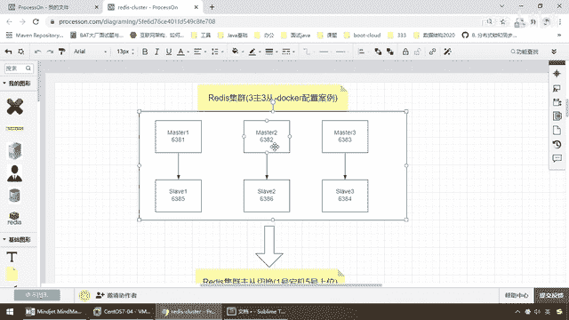
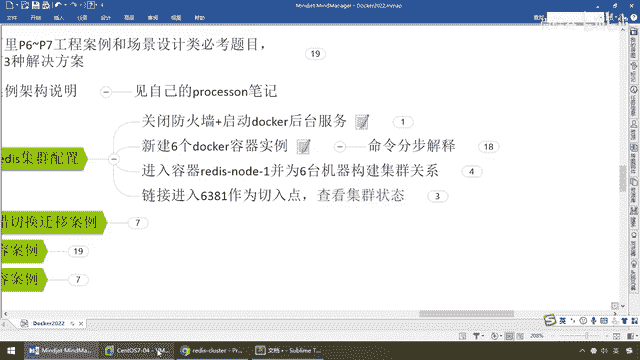
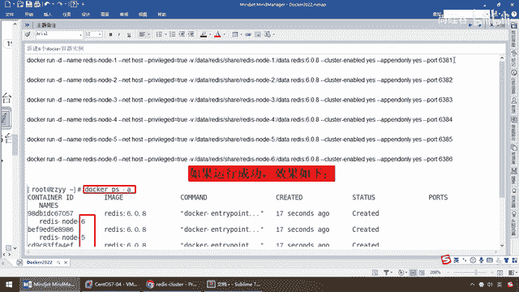
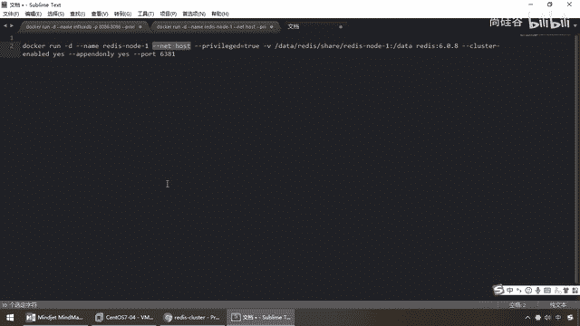
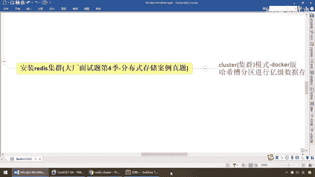

# 尚硅谷Docker实战教程（docker教程天花板） P45 - 45_3主3从redis集群配置上集 - 尚硅谷 - BV1gr4y1U7CY

各位同学，大家好，我们继续，那么通过前面的讲解，对于这样的异级分布式缓存系统，我们已经明白了，业内主要是通过哈希取异，一致性哈希算法，哈希槽分区这三种思想，那么尤其大产，几乎都是用哈希槽分区。

这个你是逃不了的，所以说我们有必要从理论学习完成以后，进入我们的第二版安抚，动手，识它，那杨哥别废话，敲代码，给我派一个出来我看看，什么阔梭容啊，什么哈希槽啊，只听你讲了理论。

天上飞的理念必然有落地的实现，整一个，兄弟们，走起，理论时操小总结，第二版抚，来，马上开工一个，三组三层，Redis集群扩充容案例配置，那么相应的架构我给大家已经做在了Process-on这个软件上面。

那么对于这个东西，这个软件我们已经说过了，那么大家自己也开通一下，如果愿意的话，还是不错，好，不废话，那么下面Redis集群，来，接下来我们要给大家演示的是Redis集群。

配在容器上Docker版的三组三层的案例，那么它的步骤呢有很多，那么希望大家呢跟着我呢走下来，然后彻彻底底整明白这个到底是个啥，那么下面，这儿有个黑框框，那么对外就是我们Docker容器。

那么如果别人来反问，就是到这个黑框框这，它里面是有六台机器分别是三组一组一层，一组一层一组一层，两两配对，一比一的比例，那么假设六台分别是端口，6381，8283，8485，86，那么好。

我们起了六台Docker容器实力以后，并且让他们两两配对，一组一层的挂载以后，1到底挂的是谁，具体看它分配，那么以我本次的案例，假设图上这个，那么假设1号机是主，63855号机就是从，2号机是主。

6号机就是从，依次累吞。

好，那么接下来我们开始我们相关的配置，那么第一个，三组三层Raditz集群案例，那么先搭起这个框架，后面再演示扩塑容，第一步，关闭防火前，启动Docker的后台服务，你们班有同学来问我，杨哥。

我出现了这么一个错，哪不对，当时给我气的我拿着脑袋想赚钱了，听懂了吧，这是你Docker服务没起来，听到啊，那么所以说第一波，给我把这个弄上来，兄弟们，没问题吧，好，第二步。

要新建6个Docker容器实力，相当于一瞬间要求你秒级别的起6个Raditz服务，起6个Raditz容器，那么这儿同学们。

你可以看得出。

如果机器比较少的时候，那么弟兄们呢，都不会感觉到容器和宿主机串的安装有什么区别，如果像现在碰上了大规模的扩塑容，秒级的响应，又快又好，轻便简洁，如果以前我们一台机器上，一台Linux的实力上面。

装一个Raditz，我要起6台，你可想而知，6个虚拟机启动起来，这得有多费事，但是现在Docker呢，就给我们提供了一种什么，瞬间的秒级别的启动方式，瞬间可达，所以说，各位同学。

这款Docker是真的是非常爽的，那么希望大家务必掌握这个技术，那么下面，新建6个Docker容器实力的命令，就是我们以前学过的，那么来，我们先看效果，如果运行成功了，直接是123456。

分别是名字叫Raditz Node，OK，那么好，我们一条一条的来过。

来，同学们，走起，大家呢，先看个眼熟，我先暂停下录屏，应该大差不差的，应该整得懂吧，学到高级片这个技术的话，应该这些基础命令前面都讲过了，首先Docker Run，运行一个容器实力。

后台名字就叫Raditz Node E，OK，这有个新的没见过的Net Host，阳哥这什么鬼，请大家暂时先无视这个命令和参数。

我们先用后面学，那这个东东呢，我们将会在后面这个章节，在高级片的Docker网络会和大家介绍一下什么主机网络呀，Bridge，网桥什么之类的，现在呢，请大家先无视。

你就当。

声通活泼，先照着用就行了，这个不重要，接下来这个，不废话吧，开启全线，很熟悉吧，相当于这个宿主机的绝对路径下面，对应着我们容器内部的实力的数据存储是这个，那么我们启动的服务，镜像是Raditz 6。0。

8，注意，唯一有一个新的就是Cluster Enable Yes，是否开启集群，那么这一块我们要开启，按照我们的架构图，是不是六台机器，两两配对呀，好，那么接下来，AOF Opened Only。

给它打开，然后端口号是6381，兄弟们，一串走下来，应该没问题吧，听得懂的，给我扣个6，OK，好，那么感谢大家，那么接下来，我们呢，就一口气直接过来，来，兄弟们，直接回车，回车，回车，回车，回车，回车。

回车，OK，就完了，这样的话呢，我们就启动了六台Raditz实力，大家请看一下，是不是123456，没问题吧，那么所以说，按照我的脑涂笔记，理解了以后，这些脚本和这些命令，你直接粘一下，就能成功。

也不难，那么同学们，如果你还是不懂，哎呀，杨哥就怕大家不明白，每一步，我都给大家进行了讲解，可以了吧，每个参数是什么意思，OK，除了这个，我们后面讲，这块你先照着用就行了，其他我觉得学到这。

应该没什么问题了，OK，咱们呢，过，刚才已经详细的讲过了，那么这块，屏幕上大家应该看一遍，也应该明白每个命令是什么意思，不再浪费时间，那么下面，重要的是，给你们建起来了以后，兄弟们。

你告诉我这几台机器123456，按照我们两两配对的原则，哪三台是Master，哪三台是Slaver，谁是主，谁是主，现在答案是不知道，我们根本还没做这步呢，他们现在六台机器都是平等的，不分彼此。

不分主头，所以说我们现在要对它，对六台机器的关系，构建主同机制，完成一个集群的整体，然后呢，我们呢，首先以一台机器为例，先进入，那么来，Docker EXEC-IT，现在呢，我们就进入一号机来操作。

不一定要进一号机啊，那么这个时候呢，兄弟们呢，随便你啊，并办事，好，兄弟们，我们进来了吧，那么现在，进来到这儿了以后，我们要开始构建主同关系，来，就一句话，进入Docker容器后，执行下面这个命令。

注意，这儿有个真实IP，那么相当于，全部的黑色部分，你一看就懂，重要的是它，好，那么同学们，我们来研究一下这条命令，那么上面的执行过了，删掉，那么首先，Redis Client，进入到容器里面以后，来。

我们是不是用Redis Client进入到我们的，Redis 容器实例内部，然后呢，这个命令是，构建集群，那么现在，192。168。111。147，那么，不好意思啊，现在阳哥的真实IP，IF。

Config，啊，抱歉啊，这是在容器里面，它不支持，那么这样打开，IF，Config，我是多少，应该是，111。167，那么这个时候，我们是不是就需要把我们的，全部的，有147的地方，换成了我们的。

多少，是不是，167，OK，那么，弟兄们，我们现在呢，群换IP地址就对了，那么根据我们的，启动和刚才我们的讲解，我们都清楚，我们的机器是不是就是，这个下面的6381，2，3，4，5，6，共机理台机器。

说的是这个，你看，Cluster的集群的，他们的关联是一，1比1的意思，那么，这儿有，代表的是，为每一个MASTER，创建一个Celeron节点，刚好从1到6，那么，对半分，那么就是，一组一组。

一组一组，一组一组，一一匹配，总共三组，OK，那么来，弟兄们，我们在这儿呢，就执行并构建，这么一个环境。

请看我的命令。