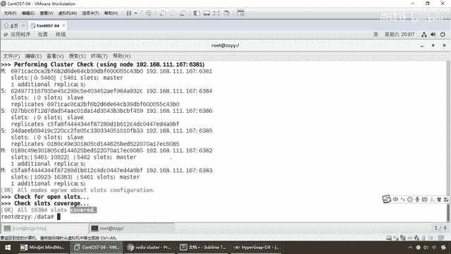
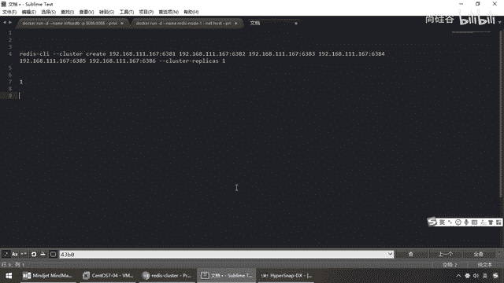

# 尚硅谷Docker实战教程（docker教程天花板） P46 - 46_3主3从redis集群配置中集 - 尚硅谷 - BV1gr4y1U7CY

看一下这个命令的执行效果。

来同学们请看，一执行完以后，相当于我在一号机，redis client，进行集群的构建，然后将集群两两配对，怎么样，是不是哈西槽，分配了，对这6个节点进行分配，请看它的槽位，master几个机器。

0 1 2，那么分别是0到5460，5461到10922，10923到16383。

那么同学们，按照我们的架构设计的大纲，是不是就已经变成了这样，前面已经讲过这个理论，redis的最多16384个槽。

那么分别是脚标。

从0到16383，砍成三段，那么来兄弟们，0到5460，0到5460，546110922，546110922，没问题吧，那么来告诉你，开始添加，对应的应受关系，那么，他们之间，主从如何分配。

尝试着智能化的是吗，对于从计的分配，OK，那么现在巴拉巴拉，这大堆，他，希望你，你如果看到上面的配置，如果你同意的话，请打个yes，好，同学们在这儿，非常的重要，我们开始进行哈西槽的分配了。

这是所有一级流量系统，分布式缓缓存的，最终的，底层的基础知识，好，yes，那么，等待着加入OK，那么如果说没有问题，你能看到这儿，16384个哈西槽，全部覆盖并分配完成，达到这儿，算搞定，那么来兄弟们。

和我们的笔迹一模一样，没问题吧，也出现了，好，那么在在这儿，我们为了避免，后续来回折腾，我们在那抓个图，来同学们，看一眼，我们这儿至少得到第一步，我们的槽位分配是正确的，那么大家请看，一组，两组三组。

那么现在剩下的，篮框以外的是不是全是层，那么在这儿，我们可以看到，主的话多少，6381，没问题吧，那么来，这儿呢，6382，这儿呢，6383，这么说，OK吧，那么123，就作为了三个主机，好的。

那么接下来请看，84，86，85，85作为了，我们相应的，从机，这一波没问题吧，弟兄们，应该是清清楚楚的，大家呢，分别而言的话，是应该是。

没有任何。

疑问了吧，到这一步，那么折腾到这儿了以后，我们一切OK，三组三从搞定，好了，那么接下来，我们呢，以6381这台机器作为切入点，来查看一下集群状态，那么在集群里面，我们的操作命令，有两个比较重要，一个。

叫ClusterInfo，一个叫ClusterNotes，查看集群信息，和本集群有哪些节点，以及他们各自的状态，他们怎么构成了这么一个集群环境，那么下面我们以6381，作为切入点，查看集群状态，那么来。

兄弟们，Redis Client Gump C，注意默认是6379，对吧，现在已经变成了我们的什么，6381，那么Redis，Gump Client，Gump C，6381，OK，那么，Cluster。

Info，来兄弟们，请看，总共曹位，多少分配的16384，全部分配完毕吧，请看已经知道的节点，几个，是不是6个节点，这一波，兄弟们，没问题吧，对于集群的情况，人家给你说的清清楚楚，那么接下来。

再来一个命令，那么Cluster，Notes，来，弟兄们，在这个就比较重要，那么他就完完整整的告诉你了，比如说，我们，Sleva，Sleva，Sleva是哪三台，123，是哪三个，这么说，能跟上，好了。

那么对于我们的，了解来看了以后，我们呢，这些信息，我们到这儿，基本上是已经完成了，三组三层的相关的配置，但是有一个重要的，请大家务必了解，第一个，我们都清楚，81，你看，myself说明我现在登录的。

是不是81，他是Master。

二是Master，三是Master，这个好说，那么现在变成是，123。

这三台机器是Master，OK，问题是，谁，挂在谁下面了，那么1，按照我原来的笔记，和我们的案例的所做的，请大家先看笔记，我们再看实际，一号机下面，是6381的端口，它挂的是谁，五号机，你怎么知道。

大家请看我原来做的笔记，现在我这个是不是，6381，它的尾号是多少，37EB5，那么大家请看，五号机，它叫942F，它挂在哪，挂在37EB5，这么说能跟上，说明一号机下面，挂的是五号机，哎我前面第一步。

我已经说过，我们连两匹配以后，它内部打散了以后，怎么分配，自己决定，那么可能一下面，挂的是五，也有可能一下面，挂的是四，或者是其他机器，OK，所以说，按照我们的理论，没问题，实际情况，每一次的案例。

它不一定，大家请看，现在我们一号机，我们登录了，Myself Master，它是多少，43B0，大家请看，43B0，谁，是不是我们的多少，6384，也就说932C这台，它是挂在43B0下面。

所以说现在我们，一号机，就是6381，我自己尾号是43B0，43B0在这，对着谁，是6384。

所以说一号机，它对应的，本次我们实际的案例，它是SLAVER，也就是一下面，挂了，四，它这次的分配。

和我们原先，上一步，我以前做过的案例的分配，发生了一点，稍微的改变，当然这也是正确的，听懂了吧，它分多少就是多少，好，那么继续来，请看二号机，多少，6085，我们再找6085，它是谁。

它是我们的6385，这么说，能跟上，那么所以说，也就说二号机，现在6085，它是二号机，二号机，它收的小弟是。

6385。

这台机器，那么也就说，2对应着5，那么自然而然，3对应着几，说都不用说，那是不是应该是我们的6号机了，对吧，那么大家请看，自己叫6386，我挂在哪一个下面，A9BF，大家请看A9BF。

是不是我们的6383，3号机，所以说同学们，搁到这儿，我们看到了，以后就要先明白，以6381作为切入点，查看了集训的状态，和他们的主宠挂载关系。

那么到这儿。