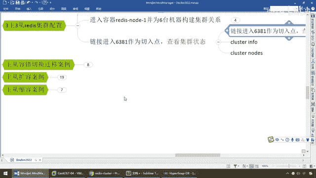
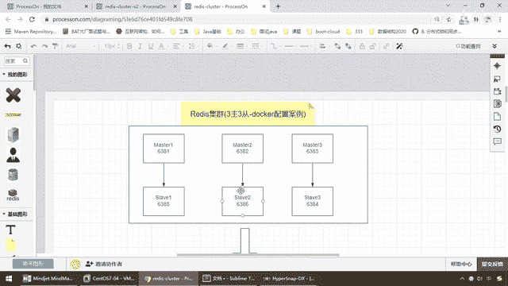
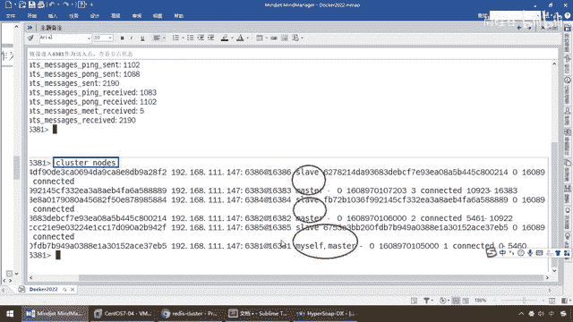
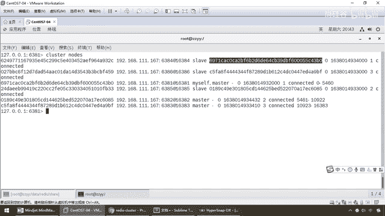
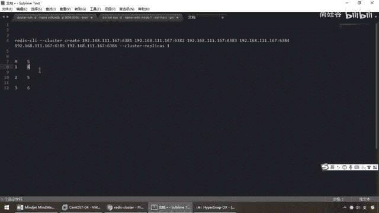
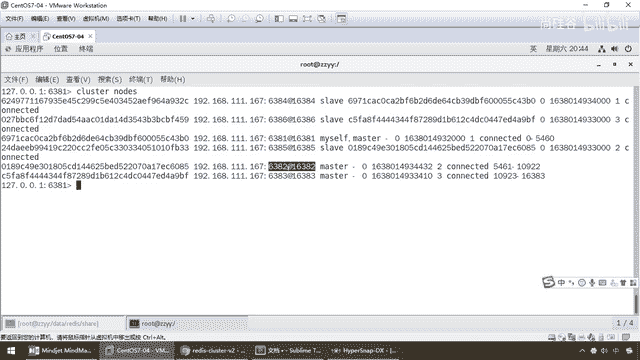
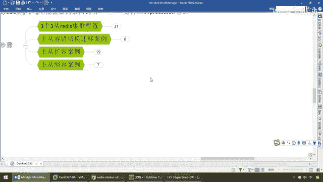

# 尚硅谷Docker实战教程（docker教程天花板） P47 - 47_3主3从redis集群配置下集 - 尚硅谷 - BV1gr4y1U7CY

好，同学们，大家好，我们继续。

那么即使到目前我们已经完成一个，Docker启动了6个容器实例，并且搭建好了基于Docker容器化下的Redis集群，三组三重，那么按照我们现在脑图上的笔记，1号机挂的是5，2号机挂的是6。

3号机挂的是4，OK，但是注意，我前面强调过，我们在做集群分配的时候，他们两两匹配具体的分配，每次都不一样。

具体情况要具体分析。

如果按照这个笔记换以前，我们看一下我以前的笔记，我们现在是6381登录1号机，Myself，对吧，我呢是715，那么大家请看5号机，他的意思说5号机6385，Sleva属于谁，715。

所以说以前他的一种分配，我以某一次作为一个案例，明确的说明，1号机下面挂的是5号机。

所以说在这1号机，下面挂的是5号机，这个没错，内部的随机分配，分给谁就是谁，好，那么现在呢，我们实际情况，现在的现场教学，大家请看，我依旧用6381登录上来，对吧，我6381，我是多少，43B0。

那么现在我们找一下，我们的4号机，大家请看，我是6384，4号机，我1号Sleva，我挂在谁下面，隶属于谁。

43B0。

所以说目前而言，我们是1号机，本次案例实际情况，挂的是4号机。

这么说能跟上，所以说我再强调一遍，不然到后面的话，让同学们晕了，那就不打好了，那么为了避免同学们发晕，那么刚才下课的时候，我以这个图，重新做了一个拷败，以我们现场的案例为主，那么过来，你们大家请看。

现在是不是完成了，1号机下面挂的是4号机，那么弟兄们请看，现在，4号机是不是隶属于43B0这台机器，那么43B0，是不是我们的1号机，没问题吧，那么请看2号机，它是6085，那么2号机，我们大家。

请看一下，现在是不是6385，那么5号机，隶属于6085，6085是不是我们的2号机。

这么说能跟上我的老大，所以说相当于说，按照本次案例的实际情况，1号机挂的是4号机，2号机挂的是5号机，3号机下面挂的是6号机，123456，OK，把这个给大家强调清楚，那么这个我们就不用了，以这个为主。

以实际情况的分配，好吧，那么现在，同学们，我们走起，大家看，你看6号机是不是挂在，A9BF，那么A9BF，是不是我们的3号机，兄弟们，没问题吧，那么3号机下面就挂着6号机，好，那么在这块交代清楚。

前因后果以后，我们完成了我们的第一个案例，三主三从，Redis集群配置，那么接下来，就要来演示一下。

好的。