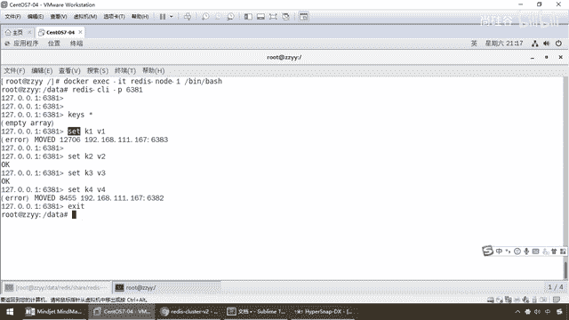

# 尚硅谷Docker实战教程（docker教程天花板） P48 - 48_redis集群读写error说明 - 尚硅谷 - BV1gr4y1U7CY

好，各位同学，大家好，我们继续，那么接下来我们要给大家演示，第二个案例，主从容错，切换迁移的案例，按照我们最新的实际情况，我们已经搭建了基于Docker容器的三组三重的Redis集群，那么分别确认好了。

123是Master，456是Slaver，各自各回各家各找各妈，他们名下是怎么挂的，好，那么第一步，我们这个架子先搭起来，搭台，唱戏，台字已经搭出来了。

那么接下来我们基于三组三重的Redis集群来看一下这个案例，主要是有两个，第一个，数据读写存储，第二个，容错切换迁移，那啥意思呢？，先说第一个，那么我们现在，往这个集群里面，SATK1位移了以后。

能不能整个集群共享数据，对吧，该有的都要有，而且我们的要求是什么？，我们现在用的是Redis的Cluster集群，人家用的是哈希槽，那么你这个槽位是被分成三段的，这三段是不是代表三个主机？。

那么到底你这个key进来了以后存在哪，然后他们又怎么在集群里面数据的传递和共享呢？，这是第一步，那么第二步，那么同学们，按照我们实际情况，本次的案例，1号机6381，Master他挂的小弟。

SLAVA是6384，4号机，那么现在我们的问题是，如果Master挡机了，4号机会不会补位？，也计主从主从，主机挡了，从机要求能够补位，好，那么同学们，这个就是我们的需求，听清楚，整明白以后。

我们按照我们现在配置的一线实际情况，开始进行我们案例的演示，DockerPS6台机器搞定，那么接下来请看，启动6台6G构成的集群，并通过ECC进入，那么老规矩，我个人习惯，我们还是先进1号机，对吧。

RedisNode1，然后呢，Beam Bash，OK，那么Redis连上了，RedisClientGAMP6381，注写不写默认是6379，现在我们是集群环境了，那么注写，你先告诉我。

这个命令是不是连上我们6381，这个机器都是最熟悉的命令，那么下面，那么同学们请看一下Kiss心，有没有，空不到，没有任何东西，现在我登录是6381，对吧，那么现在的话，同学们请看，我们用最简单的命令。

SETK1，V1，那么大家觉得能不能够存储进去，好，一回车，哎呦，告诉我，Move12706，6383，这什么意思啊，那SETK1存不进去，这，好笑了，SETK1V1最基础的Redis命令。

这是为什么呢，注意，两个问题，我们现在的存储，它是前面有个哈希槽了，给你分了个段，0到5460的，还记不记得我们之前抓了这张图，我们现在6381，人家只管多少，0到5460，这么说，能跟上，那么。

按照它内部的哈希算法，兄弟，你这个KC，它给你算的槽位，已经，超过了5460的话，存不进去，那，杨哥你这个集群的配搭还有什么用，我连一台机器，我现在连的，是不是不应该是连某一个具体的机器。

而是要连的是整个集群的，同意吧，那么你现在弄上去了以后，我的数据根本存不进去啊，下面的，别的能不能存呢，哎，K2有戏，那么K3呢，哎，也有戏，好嘞，K4呢，又挂了，那么它来，在挂的过程当中，它会告诉你。

错误，错误，move的移动，给了你一个编号，有没有发现好像这两个号啊，我们先猜测，貌似是不是大过了这个5460，都高过了我们一号机的槽位范围，我到5460，你如果高过我的，那不好意思啊，该找谁你去找谁。

那么要求你能够进行，槽位的分配，但是，由于你现在用的是这样的连接方式，就导致一部分数据，存取失败，那什么意思啊，记着，Radius Client，连上单机这样的命令，没错，但是现在兄弟们。

我们是什么环境了，是不是集群环境了，所以说我们要加一个参数，防止路由失效，加参数干C，代表是以集群Cluster的形式，去连接我们的Radius集群，不能够用这个单机版的命令，OK，所以说就会。

如果你非要用单机版的命令，看到了，有些Key根本存不进去，好，那么兄弟们。

退出，那么叨 peptic。