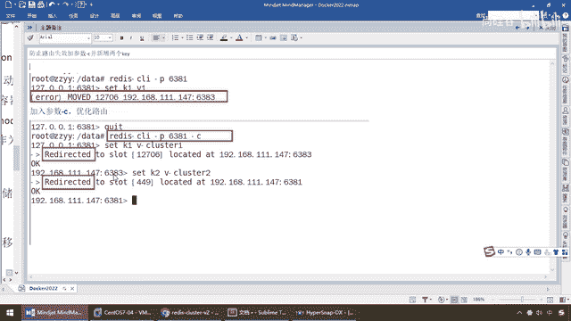
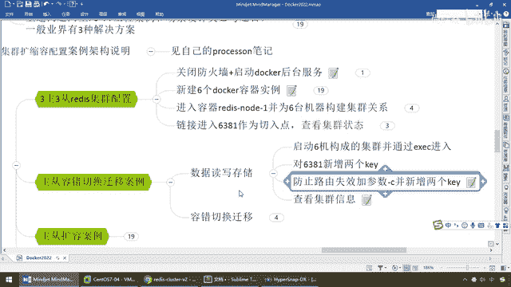

# 尚硅谷Docker实战教程（docker教程天花板） P49 - 49_redis集群读写路由增强正确案例 - 尚硅谷 - BV1gr4y1U7CY

来同学们我们呢看一下啊，那么我们重新来，docker ps，好，六个都启动，好好的exec-it redis，node1，binbash，好了，进来了以后。

以前我们强调过redis-client-p6381，我们这个连的是什么，单击翻是连进来的，对吧，刚才犯了什么样的错误，error，我们都见过了，那么为了避免这个情况，兄弟们我们要加个c，代表我们是什么。

现在，我们要用的是集群环境连接，好，那么这个时候同学们请看一下，来，6381，那么来吧，我先flash，我把刚才那些数据全部清空，我们重新来，好，此时大家请看，我现在就加了个参数c，和刚才单击版的。

和集群环实连接，区别就是加不加这个参数c，那么现在弄过来以后，set k1 k1，请大家看一眼，什么情况，redirect2，slot槽位12706，那么得到了证明，刚才为什么存，我们的1号机存不进去。

就是因为k1，它的范围，多少，我们的猜测，12706，高过了我的最高能力范围，不好意思，存不进去，把我按扰，所以说大家来看一下，之前是不是set k1位接，12706，你看，由于你是单击连接。

它有个什么move，12706，我检测到了，是谁，应该在6383，3号机的这个master上面，请你跳转过去，但由于你是单击连的，我跳不过去，所以说move失败，所以说我们现在加参数c，优化路由。

大家请看细节，redirect是不是叫重定向的意思，请看重点，我现在连的是6381，你这个k1，按照哈希，它内部的csc16的那些哈希算法，算了以后，它得到的是12706，我由于是c集群翻式。

我可以成功跳转到6383，6383绝对在我的接受范围以内，但是注意同学们，现在我的脚本，这儿是6383，现在去跳转到多少了，这儿是6381。

现在去redirect跳转到了多少。

6383，哎，所以说同学们请看，812了8383，那么现在我们再试试啊，set k2 v2，怎么着，499什么意思啊，哎，不同的k，有不同的槽位对应范围，又跳回到了6381，这么说能跟上好。

那么set k3 v3，好，如果说将将好在我范围以内，我就不用跳转，那么set k4 v4，兄弟们，请看，k4 v4 key是多少，8455，8455是多少，是不是在这个范围之间。

又给我跳转到了2号机器，6382，明白，所以说，这个就是我们的什么，数据读写存储。

那么来。