# 尚硅谷Docker实战教程（docker教程天花板） P5 - 05_传统虚拟机和容器的对比 - 尚硅谷 - BV1gr4y1U7CY

好，同学们，我们继续，那么通过前面我们已经明白了，Docker的理念以及，它出现以后解决的问题和痛点，那么接下来，我们慢慢的要深入，Docker的原理和，它的一些概念，不是一删了，就教大家安装。

学一大堆，简单的操作命令，那这个时候的话，你只是学会了，一些正确的操作，那么这个时候，你很难成为，一个真正真正的，云原先，下面的Devops，开发工程师，OK，那么至于说这些概念是什么，我们后面聊。

那么下面，我们先来扯一道面试题，请问，容器和虚拟机，有什么不同，谈谈，两者的比较，这些概念，希望大家呢，，含实自己的基础以后，我们，从第二章开始，会带着大家，进行实际的，案例的，编码和操作工作。

但是一开始，咱们先把这些理念整明白，初学入门，扎好马步，稳步向前走，那么首先啊，那么同学们，看一下，容器发展简实，在没有刀砍的时候，那么大家什么情况下，听到了，容器这个概念，那么我相信，在之前大家一定。

学过一个技术叫Sprint，老师是不是经常念到这个东西，叫Sprint容器，那么请问那个Sprint容器。

它犯的是些什么东西。

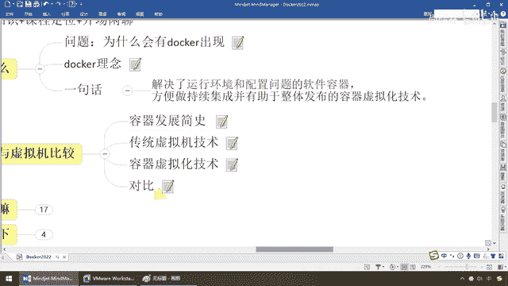

我们对比着来理解，还来学习，是不是我们的一个一个的病啊，对吧，我们通过，依赖注入，还有我们的什么，IOC啊，AOP啊等等，让这个容器呢，里面的各个病，达成业务，功能小搬手，完成我们的工作，那么一样。

既然是容器，对吧，它一定要装个什么，那么来看看，同学们，我们，结合，前面Docker的，理念，来看看，走，对于我们容器安装和构建，它的发展是这样的，刚开始，放在词别上，然后，放在一些卡态机，上面，然后。

再到我们的虚拟机，现在，到了我们的Docker，那么Docker上面，根据前面的介绍，它呢，又能犯一些什么东东呢，那么同学们，看一下，静态的外部网站，用户的数据库，前端，消息中间键对列，以及动态数据圆。

等等，Docker，几乎能够把前面通通，替代，那么现在，我们要明白，Docker，它首先是一种容器虚拟化，技术，我在开发，环境，把我能够运行的，圆码，配置，第三方依赖的插件，扔到，集装箱里面，然后。

运送的时候，拉出去，跑到Docker上面，运行，你箱子里面装了什么，打开的时候，依旧是什么，仅仅有条依法运行，不会进去的时候，装支帽，出来的时候，跳出来支压，那么这个，不大可能，所以呢，我们这样。

有必要了解。

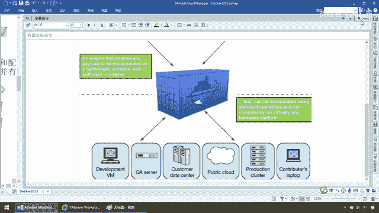

传统的虚拟机，也就是大家所学过的VMware，和我们现在要讲的，容器虚拟化技术，诶，他们两者，到底有什么样的关联，来，同学们，看一眼，虚拟机，VM，那么就是带，环境安装的一种解决方案。

Docker是基于它，更进一步，更清洁，更，简洁的一套操作解决方案，那么首先，大家请看，先回到我们的VMware，那么首先，在一种操作系统里面，运行另外一种操作系统，不废话。

大家从上规股。

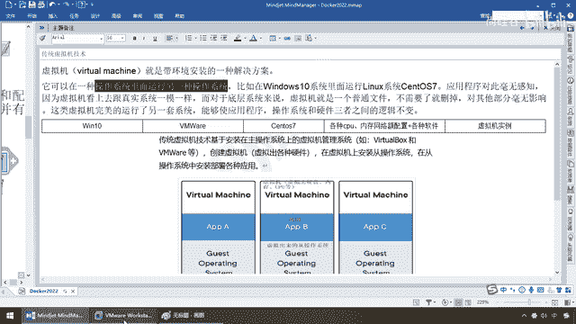

教学，我们在Windows，下面工作，专了Sentenris，学Linux，那么现在是不是。

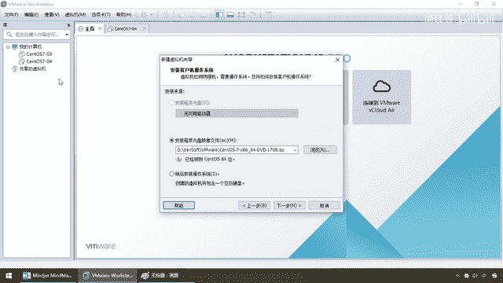

Win10上面，可以操作，Linux，OK，那么，对于我们这个，操作系统而言呢，对此呢，是没有什么感知的，因为虚拟机看上去，和真的一模一样，那么对于，我们的底层系统来说，虚拟机只不过是，一个普通文件。

不需要了，删掉，其他部分，不影响，那么这类虚拟机，就完美的模拟了另外一套操作系统，能够在应用程序，操作系统和硬件，三者之间，达到平衡，的逻辑不变，那么，结合，我们目前已掌握的知识，虚拟机上面。

装我们的Sentenris 7，那么这样的话呢，Win10操作系统，是大家的基本盘，你在上面，装了一个虚拟机软件，你模拟出了一个什么呢，那么我们，装了一个Iso，镜像文件，对吧。

模拟我们的Sentenris 7操作系统，在这个操作系统实例上面，我们完成了各种CPU内存网络的，配置啊，申请硬盘空间，安装软件等等等等，最终，启动一个虚拟机实例，那么现在大家都清楚啊，我现在相当于说。

三号机，四号机，是不是两台Sentenris 7啊，OK，那么所以说，我们传统虚拟机，它是安装在，主操作系统上面的，那么这一大堆，模拟虚拟出各种硬件，注意，喊什么，硬件，那么我就问一嘴，硬件大不大，来。

在虚拟机上面，安装从操作系统，Win10上面，装虚拟机，又装了个从操作系统，Sentenris 7，学习Linux，那么这个呢，都是大家所熟悉的，那么所以说，我们这儿就可以看到，字底向上，我们呢。

这个是我们的基础设备，个人电脑，在这儿，Hyperverse，那么相当于我们的VB，或者VM，虚拟机的软件，那么在这个虚拟机软件，读进去，我们的ISO镜像，文件，模拟出一个一个的，什么啊，操作，系统。

那么这个时候，请看，A，B，C，假设，这是一个U版图，这是一个什么，Sentenris，这个呢，是一个红帽Linux，那么三个不同的，操作系统，那么是不是虚拟出来的，从操作系统，我们在这个每一个实例。

上面，又进行我们的安装，配置，OK，那么，这个就是我们原先的一套，那么大家想一下，这套，是可以解决，我们的什么问题，带环境安装，这样的，一种软件解决方案，那么请问，它的透明点是什么，好，那么思考一下。

给大家10秒钟，我先暂停一下，首先，缺点，以下三个，资源占用多，容于。

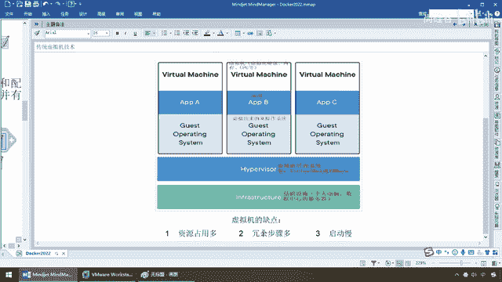

步骤多，启动慢，那么同学们，都用过，如果我要启动一个，虚拟机实例的话，从我点到最后弹出登录，界面，输入用户名和密码，坦白讲，每个三五分钟，下不来，贼慢，这是第一个，第二个，大家，想一下。

这么一个ISO文件，它是模拟了整套操作系统，从内核，硬件，软件，确确实实带环境，安装了，绝对没有任何问题，但这个呢。

太猛了。

基本上，非常大，所以说，这个时候，就会导致，你一个虚拟机一开，又慢，占用资源又多，所以说一般，家瓦兄弟，如果到后面，又开了，虚拟机，又开了idea，再做微服务的编码，没有个16G的内存，是跑不动的。

所以说，这是它的三个明显，缺点，那么接下来，我们来看看，有这个痛点以后，我们就思考，我现在，传统的话，比方说，SENTA，OS7，对吧，我跑在一个虚拟机上面，假设，这是A，好了，那么现在，我们来看看。

BC，假设我就是三台，虚拟机，我就三台，SENTAOS7，没问题，确实是，环境啊，什么都弄过来了。

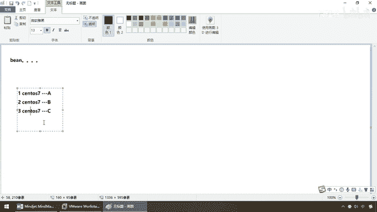

可是这个7上面啊，比如说我现在启动它，我上面跑一个，RADIUS，我启动它，我上面呢，跑一个，MY CIRCLE，这个时候大家想一个问题，我们可不可以在这儿省点功夫，偷街，耍滑一下，如果我们有一种。

思想，是RADIUS，B是MY CIRCLE，C是MangoDB，那么现在，确实是三个不同的，软件实力，但是他们都跑在，一台，SENTAOS7上面，我是不是可以节约，很多资源和成本，那么换句话说，如果。

我可以附用，一个SENTAOS7，那么在这个上面，同时跑ABC，不要再启动另外，两个，最小巧的，Linux，必须的内核，支撑我的软件，那么这样，是不是就可以，步子比较轻，负担比较小，启动比较快啊。

那么基于此。

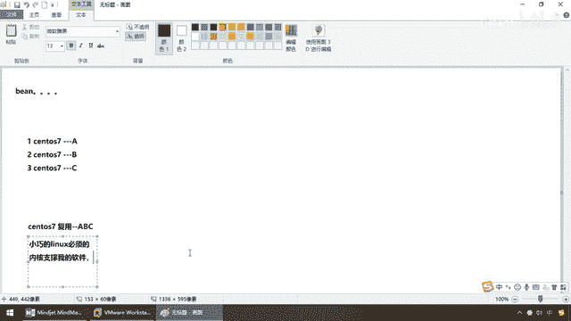

容器虚拟化，那么解决到，就是传统虚拟机的痛点，它这么玩，大家请看，由于前面我们说过虚拟机存在的，缺点，Linux，想了一个招，叫LXC，俗称Linux的，容器，那么它呢，与系统其他部分隔离开的。

一系列进程，从另外一个进向运行，并由该，进向提供支持进程所需的什么，全部文件，那么容器提供进向就包含了，应用所依赖的全部内容，那么整个过程，从开发到测试，它都具备了一致性和一致性，什么意思啊，说人话。

在这块，小巧的Linux所必须支撑的，内核，我尽量少的加载，用得到的我加载，那么其效果就是，Linux的容器它不必要，模拟一个完整的操作系统，那么现在前面我们传统的虚拟机，来一个实例就是整个操作系统。

给你搬过来，不管你用得到用不到的，一锅全给你上，那么现在，我只想运行一个什么，跑在Linux环境下的，Radius实例，那么这样的话呢，我们呢，就可以用，容器这种技术，将软件运行所需要的。

所有资源打包成，一个隔离的容器当中，那么这个时候，我不再需要捆绑一整套，的操作系统，那么只需要，该软件工作所必要的，库和资源，也就是我这所说的，最小的Linux。

所需要的环境。

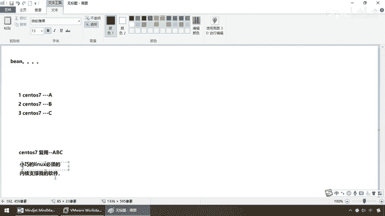

那么这样系统会变得，轻量，并且部署在，任何环境中，软件都能，始终的如一运行，那么大家请看，和前面的不一样，这个还是，我们的笔记本硬件，这个呢是我们的Windows 10操作系统，大家请看，我没有在什么。

捉啊，虚拟机，我装一个Docker，在Docker上面，格进行什么，隔离，我们大家，够用这么一块Docker引擎，你在上面，这个就是那头金鱼，拖着一个一个的集装箱，Redis、MangoDB等等。

那么这样的话，我变得，小巧而轻量，换句话说，Docker容器是在操作，系统的层面上实现了虚拟化，直接，你看这两个字，怎么着，复用本地主机的操作，系统，而传统的虚拟机，是在硬件层面实现虚拟化。

你大方面的整个给我端了，那么所以说，传统虚拟机相比，Docker的优势体现在，轻量及速度快，占用，资源系统少，那么最终。

两个。

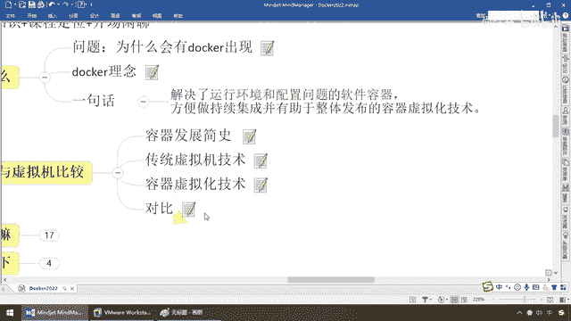

可以做一个对比，对于我们的，虚拟机而言，比较大，Docker，比较小，对于它的，启动速度而言，这个比较慢，这个飞快，对于它的，复杂度而言，虚拟机，用得到，用不到的整套操作系统，给你模拟出来。

而Docker，只需要你给我所需的那个，最小内核，能运行起，这个软件的就够了，其他的多的我不要，所以说，他们两者，传统虚拟机，虚拟出一套硬件及操作，系统，然后它运行的是，一个完整的操作系统，在。

系统上面再运行所需的，应用程序，Redis， MyCircle，等等，而容器呢，Docker呢，就一条大金鱼，上面一个一个的容器实列，MyCircle， Redis， Nginx，等等等等，直接运行于。

宿主机的内核。

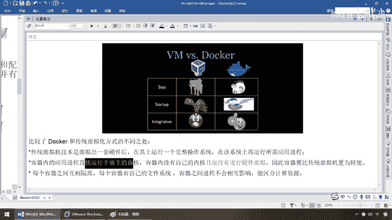

那么相当于我这，是不是，就完成了一种东西叫，复用啊，那么OK。

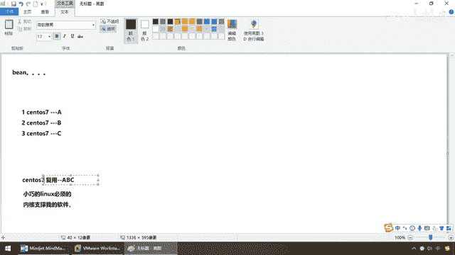

容器内没有自己内核，且没有进行硬件虚拟，百分之百是不是要比上面，传统的，要轻量很多，因此，容器要比传统虚拟机，更为轻便，那么每个容器，之间互相隔离，集装箱嘛，肯定是隔离的，每个容器有自己的一套。

文件系统，我们之间，不会互相影响，虽然说Redis，MangoDB， Nginx都装在，同一条金鱼背上，都在，同一个Docker引擎上运行，我们是隔离的，不会相互影响，能够区分计算资源，OK，所以说。

这个就是我们容器和。

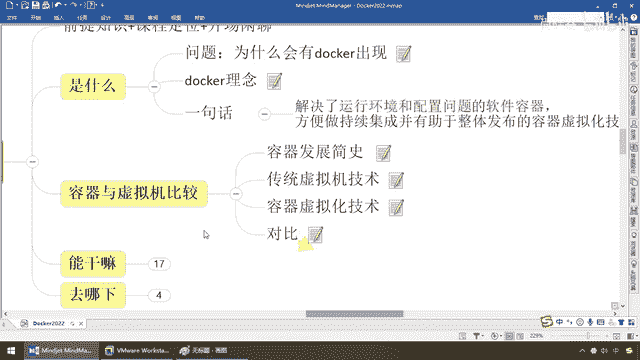

传统虚拟机相关的比较。