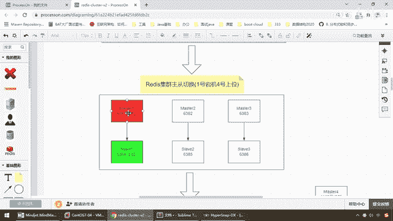

# 尚硅谷Docker实战教程（docker教程天花板） P50 - 50_查看集群信息cluster check - 尚硅谷 - BV1gr4y1U7CY

那么来我们继续数据读写存储，我们知道了加繁指路由失效加参数c搞定以后，我们下面来学一个查看集群信息状态的另外一个参数命令，这个呢不难，主要是来查看我们check检查一下我们的集群。

主要是对这个参数来进行一个讲解，因为我们后面会用的到来同学们，我们这换成自己真实ip那么六七来吧，那么现在redisclient那么cluster check集群检查，我们以6381你换别的机器也行啊。

来兄弟们，大家请看一下，我们现在这个机器是不是告诉你一个集群的情况，那么共有4个key在3个master主机上面，那么我们是不是三主三从，那么根据我们的槽位4个key，比如说在这个上面6381有两个。

83有一个82有一个，好那么又重新获得了那么目前的集群检查的情况，这个场所后面我们会用得到，所以说提前给大家说一下，那么非常清晰的告诉你master三个slaver三个。

那么现在6381master槽位范围是这个，好它呢添加了一个负值者就是跟随者，那么大家请看尾号，6381它的尾号是多少43B0，那么我们可以看看我们的一号级本次的实际情况是4号级，对吧。

我们前面已经说过了，1按照我们的实际情况来说，本次案例1下面挂的是4，那么现在呢这个是4号，那么它呢复制于从属于我们的43B0，谁就是这个一号级。

OK好那么这呢不难来主要是来说一下cluster check，那么根据我们的笔记，那么大家可以看得出，只要你以这个来连接啊，你现在呢集群对外暴露是个整体吗，你连任何一台机器只要是存取好的。

那么这四个key任何一台机器都可以读得到，那么OK，所以说这个呢就是我们查看集群情况cluster check，好那么接下来我们来玩一下重点是吧，是不是要看看，redis集群的主同切换。

你备了那么多master，那么你只要master还在的时候，从机没法上位啊，那么按照我们现在的要求，那么是不是要给大家演示。

一号机如果断机了。

我们4号机能不能够上位，好同学们我们来看一下这个案例。