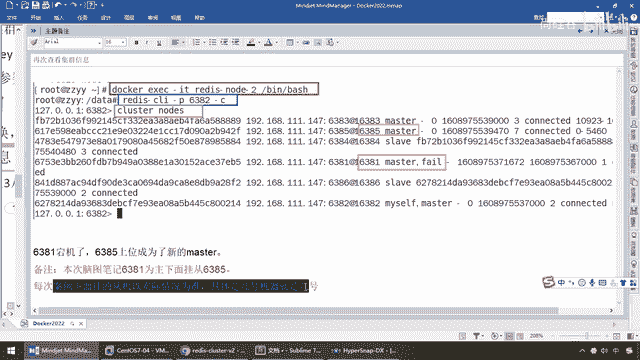
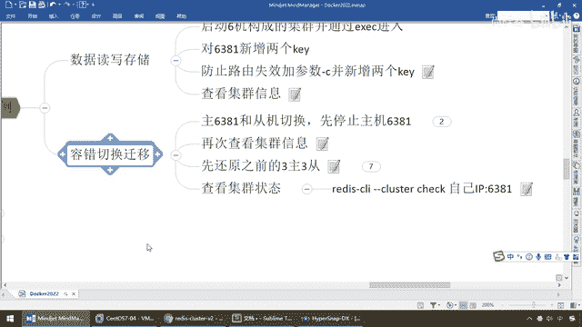

# 尚硅谷Docker实战教程（docker教程天花板） P51 - 51_主从容错切换迁移 - 尚硅谷 - BV1gr4y1U7CY

好，同学们，接下来我们要演示一下主从容错的切换迁移，那么结合我们本次的实际情况，那么我们redis集群的主从切换，那么说简单的一句话就是，6381，stop，我把它刷了，它停机了。

那么6384的作为重机应该能够上位，那么再次强调具体分配情况，一号机下面挂的是谁，你以你实际情况为准，不见得会跟我的笔记一样，好，那么同学们，那么第一个，我们现在把主机6381停掉。

看看我们的6384会不会上位，来，现在我们在6381上面，Cluster Notice，6381，我现在登录的点是6381，带这个myself，ok吧，那么6381，它是43b0，我兄弟。

也就是我的奴隶是6384，你看6384，slaver隶属于43b0，43b0是不是就是我们的6381，ok吧，那么好了，我们现在我先退出去一下，那么Docker PS，我们的每一台机器都活着好好的。

那么Docker，stop，那么Redis Node，Ganji，给它停掉，那么相当于说，是不是我们的6381就停掉了，那么稍微停一会，因为它有一个什么，主机发心跳的这么一个过程，过了一会以后。

从机才能上位，ok好，那么等了一会以后，正常情况下，我们现在的6381就是Node1号，这个节点，已经淡机了，所以说我们现在不凡的，以2号作为突破口，那么直接进来，那么Redis Node 2。

bash，ok，那么Redis Client，Ganji，6382，Ganji，以集群的方式连接，那么好，同学们，这个时候请大家看，那么我们还是用，Cluster，Nodes一回车，这个时候。

我们大家请看一下，123456还是六个节点，活着的只有五个，但是明显的看到了，是吗，我们的6381原来是Master，怎么着，是不是已经sliver了，但是我们的6384呢，大家请看，我们两边对比。

以前6384是不是叫sliver，没问题吧，6384，sliver，但是现在呢，随着我们6381挂了，现在6384上位，是不是Master，所以说呢，这个时候，我们就完成了我们的什么，集群迁移的故障。

你的三主三从一般而言，够用了，我个人觉得一般的你的应用，极端情况下，不用多废话，咱们另聊，但是一般而言，你的公司业务是够了，那么这儿我们可以获得，清晰的可以看到，怎么着，我们的6384已经上位，OK。

那么来，对照着我们的脑图笔记，那么在这儿，我们已经和我们的笔记，是一样的，只不过我们这儿说了，以笔记上而言，6381但接，那么上位的是6385，那是我上一次的案例，OK，本次的脑图是6381为主。

下面挂的是从击，6385，我每次案例下面挂的从击，以实际情况为准，具体几号就是几号，OK。

所以说我们这次，我们明确的给大家证明了，6381这个主机Fail了，对应到，6384马上就上位，OK，好，那么现在，getk1，getk2，getk3，getk4，来，兄弟们，你死了一台，无所谓。

我们那个集群还健壮着呢，之前要存过四个key，1234是不是均能够，正常的取出来呀，好，那么这个呢，就是我们的是吧，集群，他目前的一个状态，那么接下来我们就来来看看，同学们猜测一下，如果现在呢。

6381又回来了，那么请问，你们觉得他们的主同关系，会有变化吗，那么第一种啊，6384继续当老大，不好意思啊，之前你离职了，不然我变成，新的master以后，一直是master。

你这个6381给我当小弟去，你们两个，攻守异位了，那么第二种，人情事故，对吧，江湖上，是人情事故，不是打打杀杀，哎老领导6381又回来了，那么我6384，乖乖的，又退位了，又变成重机了，哎。

那么大家思考一下，我们将要面对的问题，和状态是什么呀，我先暂停下录屏，你看看他们的主同关系变化，1号机和4号机会怎么样，刚才大家呢，讨论了一下，我们继续，那么现在啊，我们呢，cluster，机长。

6381，死了，上位的是6384，OK在这，等着，那么现在，我刀砍，PS，兄弟们，1号机是不是没，活回来啊，那么现在呢，我们来看看，来我们呢，先把我们的，6381，活回来，启动回来，看看他，是什么状态。

那么刀砍，start，那么，redis，node，干1，哎，6381，1号机，老领导，又回来了，那么看看，江湖格局和势力，会有什么变化，好的，那么稍微，等他一会啊，那么刀砍，PS，你看，之前只有5个。

现在1号机，又回来了，那么在执行之前啊，就是执行这个启动命令之前，我们说的好好的，6381，是死了，那么，6384，是master，那么现在又是什么情况呢，大家请看，6381，回来以后怎么着。

你还是slava，6384，还是master，这么说，能跟上，哎，那么，再等他一会，大家请看，6381，还是slava，6384，还是master，听到，那么不好意思啊，论字排杯，你，出去了以后。

即便回来了，你现在呢，继续排号，OK，没有恢复，来，那么同学们，不知道你猜对没有，那么接下来我们要来进行这样啊，那么实际情况呢，如果他恢复了以后，那么同学们，我们在监控系统上，我们会发现，那么这样呢。

按照我们的架构设计，我们还是希望恢复原状，1号机是主机，6384，是从机，这么说，能跟上，哎，所以说呢，按照我们的步骤，我们呢，先把6384给停掉，当然啊，按照我以前的笔记，从其实6385强调过了。

实际情况为准，那么所以说，我们现在呢，干我们的第二步，刀砍，radius，no，那么把6384，4号机，我们干什么，先给他，停掉一下，这么说，能跟上，好的，那么现在呢，妥了，停了一会呢。

我们相当于说是什么，就给6381一个什么，上位的机会，好，那么同学们，我们来看一下他，有没有，看，等了一会，看我执行，怎么着，6381，刚才是sliver，对吧，现在请看，6384，master，死了。

有没有发现，6381，又重新上位了，这么说，能跟上，哎，所以说呢，他这个主从关系，由这个集群内部的规矩，给他控制着，好，那么现在，我们呢，再把6384，重新起回来，稍微等他一会，那么现在，大家请看。

我们现在呢，是，通过8。2登录，一步步的来，刚才的6384，我们故意把他杀了，所以说呢，他作为主机，顶位的这个主机，失败了，那么现在，大家请看，6381，回来了，6381，回来了，6384。

又变成了自己的什么，一切干嘛，诸神归位，按部就班，来，所以说，同学们，我们现在呢，就已经，演示完成了他的容错，故障牵挤，好，那么我们在这块，我们呢，就可以得到，再来查看一下，我们，直接，集群的状态。

167，来，兄弟们，和之前的一模一样，4个k，还是在3台主机上面，没有丢数据，然后，请看，6381，主机吧，6383，主机吧，6382，主机吧，123，还是主机，那么，64，那么4号机，请看，我隶属于。

43B0，隶属于多少，43B0，那么是不是又回到了，我们原来的，案例设计，和我们的架构，缓存设计，哎，一切照旧，所以说，刚才这个案例，就是我们，容器环境下面，容错切换的，相关故障的演示。

那么演示了故障转移，主存恢复，那么，各方面而言，最终我们的数据，都不会受到影响，除非你死绝了，否则6台机器，全挂了，那，不大可能，好。

那么同学们。

这个容错，我们就给大家说到这。