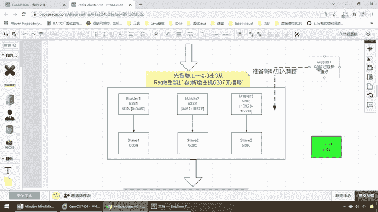
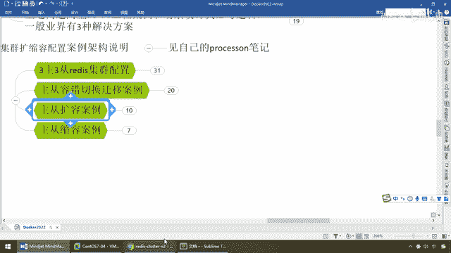

# 尚硅谷Docker实战教程（docker教程天花板） P52 - 52_主从扩容需求分析 - 尚硅谷 - BV1gr4y1U7CY

好 同学们 我们继续 下一例，我们完成了主从容错，切换迁移的案例转换，那么按照我们的架构图，6381淡机了，演示过6384能够成功上位，然后通过我们一系列操作，给大家验证了谁上谁下，最后我们有手工的。

让它恢复成我们的原始架构图，还是6381是主机，6384是从机，那么现在大家看一下，我们如果执行cluster notice，那么复习一下这个环境，6381 master 6384 sliver。

这么说 OK吧，那么这些谁主谁从，我们就不再啰嗦了，那么现在对应着这张图搞定，那接下来，我们要看一个新的案例，主从扩容，这个非常重要，那么有扩容也有什么，缩容这两个案例，务必掌握，说难听点。

阿里云的E4ES谈性云，类似的各大产的，就是这样的思想，那么它底层怎么做的，在这给大家演示，来 现在呢，假设我们的一级流量系统，高并发全部都上来了，三台缓存，我们说的三台，就是三台master。

三主三从这样，就是这个大框框，这个大集群也扛不住了，那兄弟们不够用了怎么办，扩容啊，那么再找兄弟 对吧，再加小弟进去，那么此时我们先说一下，我们的需求，第一个，恢复了上一步，我们还是，一号机6381。

一挂4二挂5三挂6，没问题，那么现在呢，我们想增加三主三从，变成四主四从，来我们的诉求是，又来一台新机器，现在扛不住了嘛，六台机器你扛不住了，我们上八台，再来第四组一组一从，那么就是6387。

想加入这个集群，然后呢，6388也加入这个集群，并且6388作为sliver，挂在四号机6387下面，这是我们的第二步，那么第三步。

我们出现一个问题。

你加进来好加，可别忘了，现在我们用的是什么，分不是存储缓存，我们用的哈西槽，以前是三主三槽，三台master，每个人的分段，已经搞定了，那么大家都已经占了这个排位，那么你现在又来了，第四个6387主机。

然后呢，又来一个6388从机，又加了一槽，加进来好加，可是问题这些槽位，该怎么分配呢，这个又涉及到什么样的算法，分多少过去呢，那么是大家按比例给他，还是又重新AA，按人头评分呢。

那么这个是我们的第二个问题，好，那么所以说，在这块以后，我们涉及到我们槽位的变更，和星机的加盟，那么来第三步，我们来看一下，他的槽位集群扩容以后，新增主机6387，作为第四个master，会有槽位。

那么在这，我们来看一下这个槽位的变化，待会给大家演示了，那么最后一步，我们才需要怎么着，将我们的从机，挂载上去，然后最终完成了一个，四主四从的，新的，Docker Redis缓存集群，那么这种情况下。

这种扩松容案例，你是需要在简历上写进去，面试中能说代表你见过，那么面试官考你的时候，主要就是考你，哈希槽的重新分配，好，那么同学们，这个就是我们这道题目的，需求，先给大家说明白一下。

那么从三主三从。

马上就要进一步的复杂化，变成四主四从。