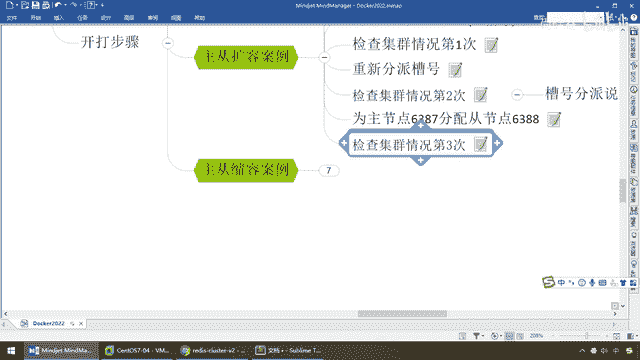

# 尚硅谷Docker实战教程（docker教程天花板） P53 - 53_主从扩容案例演示 - 尚硅谷 - BV1gr4y1U7CY

来同学们，那么现在主从扩容的需求分析，我们已经说完了，那么接下来我们按照我们的笔记，将要做一个案例演示，来吧，那么来第一步，那么是不是要新增主机6387，那么当然主要这个观点是两步，第一个新增机器。

第二个槽位分配，那么现在我们是不是要把6387，按照我们的设想设计，是不是要作为一个第四台新的主机加盟，所以说在这块我们走，我们的方法是这样的，新建6387 6388两个节点，新建后启动查看是否几个。

8个节点，那么和以前的是一模一样，那么来兄弟们，到这儿，我们不妨先退出一下，那么，Docker PS，Docker 123456，这一波没什么问题吧，那么好，那么现在我们直接6387启动，那么再来。

我们完了以后是不是6388，带给他，启动，兄弟们，可以吧，那么Docker PS，Low In，那么是不是1234，5678，8台机器，那么准备待会我们扩容了以后，是不是扩成四主四从啊，好。

朝着我们目标，往前走，第一步完成，那么第二步，相当于说我们6387，现在已经加进来了，但是请告诉我，我只是起了一台实力，它现在跟我这个集群有关系吗，没有呢，我这还是虚线的，听懂，所以说，在这块的话。

我们呢，直接进入到我们的7号机，里面，OK，那么这些命令呢，就不再敲了，那么，既然新增的6387节点，注意现在，我只是启动了一个容器实力，6387，并没有，真真真正，加入这个集群。

且也没有被分配到槽位呢，那么它作为，第三步，现在我们准备，既然它，目前的空巢状态，要作为一个master节点，先完成第一步。

加入这个原集群集体。

相当于说我先入档，OK，好，那么同学们，请看命令，此时我们学一个新的参数，将新增的6387，作为新的master节点，要去加入这个集群，那么这有一个，colasta add node。

加入作为一个新的集群节点，那么这，自己的实际IP，这个动作就不废话，那么来，弟兄们，现在，我们来看一下，那么6387，就是我们的，新入伙的兄弟，相当于有点类似于，后面是6381，那么说白了。

我添加节点的模式，6387对标，6381，那么也就说，87是新加盟的兄弟，81是原来的老大，那么相当于说，就是原来集群节点里面的领路人，那么我们这么写，就相当于6387，去拜拜6381的码头。

从而找到组织，加入集群，这么说，OK，那么再次强调，我现在登录的是什么，6387，7号机，那么作为一个什么。

集群，Master节点，加弱，好了，那么在这，我们呢，写过了，这个IP的话，那么就是，我们的，167。

167，OK，那么来，兄弟们，保证这个环境，都是OK的，那么到这了以后，我们弟兄们，直接运行，来，兄弟们，请看一眼，现在尝试添加，167，6387，托我们的集群，到6381这一块，那么大家请看。

目前而言的话，我们直接已经发现，一个新的节点，正确的加入，这么说，能跟上，OK，就这么简单，所以说，检查开放的槽位，检查槽位的变更等等，所有的，6387的槽位节点，都已经变换成功，这么说，能跟上，好。

那么兄弟们，到这一步，添加节点成功，好了，但是你可能会说，可是我看的还是三个，还是三个，没有四主四从，别着急，再来，那么先检查集群的情况，第一次，那么大家看，这个命令，弟兄们，不见过了吧，跟着走，出现。

我这都是绿色，OK的，有错的会红色，新的节点，已经正确的添加成功，那么6387是进来了，但是我们来看看，哎，这一块的话，来，check，那么192。168。111。167，写为你的真实IP，那么这个。

集群，cluster check这个命令，前面我们说过，那么来，一回车，兄弟们，请看一眼，现在，1，2，3，4，没问题吧，那么大家请看，6387，是不是已经起过来，作为一个新的节点，加盟了。

加盟了从原来的三台主机，现在用这个命令检查出来，那么来，等他加入一下，那么来，大家请看，上面这个，我们见过了，那么现在再来检查，这个集群的情况，那么兄弟们请看，是不是变成了，1，2，3，7，这么说。

能跟上，那么现在是不是已经有四台机器了，哎，那么获得这个以后，我们会发现，这有个0，slots，0，slivers，什么的，暂时没有槽位，这么说，兄弟们，能跟上，好了，那么，我是加入了，6387。

但是不好意思，我现在是里面既没有数据，也没有被分配到槽位，相当于说，哥们，你现在加入我们公司了，还在使用期，没转正，没办法给你槽位，还没给你分配电脑呢，OK，好了，那么现在一步一步来，搁到这儿。

完了以后，我们现在要干嘛，重新分配槽号，那么这个时候，我们得到了我们之前所说过的这句话，第四台机器过来了，总的只有0到16383，也就是16384个，那么以前分成三段，5461，归你，5462归他。

5461归他，几乎是均等的分成了三方，那么来了第四方，他会怎么分呢，是重新打算，大家除以4，A，还是说，各自匀一点，或者有其他算法呢，那么大家请看一下，他是怎么做的，那么接下来，我们来到了这一步。

需要重新分配槽号。

那么来学一个重要的参数命令，那么就是，Ray Shard，类似于什么，重新哈希分配槽号，那么来，弟兄们，搁到这儿了以后，我们呢，就以6381上面这三台MASTER主机的集群，来进行分配，那么来，这个呢。

请看一下，执行，那么分配了以后，我们来看看我们执行的效果，那么在这个，主要就是对我们的集群进行，Ray Hashi。

相当于重新哈希槽位。

重新分配，那么来，弟兄们，搁到这儿，那么我们真实IP是167，这台机器，此时我已回车，那么弟兄们，请大家看啊，那么这呢，所有的16384上一步的命令啊，是分配完了，那么现在呢。

你要进行Ray Hashi，那么大家请看，他会给你展现啊，那么先找到我们的，什么，第四台主机MASTER，6387，现在是多少，是0，还没有分配成功呢，准备重新洗牌了，那么他告诉你，槽位分段。

你看一号机，是多少，那么再来看，三号机，占了多少，二号机占了多少，那么下面他的问题是，How many slots do you want to move，那么也就是你准备怎么分，那么现在是不是要。

加了这个参数，就声明新的集群节点进来，一定要注意，新的节点进入到新的集群，进入到原有的集群，一定要重新洗牌，那么怎么个洗法，from 1 to 16384吗，那么这个时候，兄弟们怎么写，来吧，算起打开。

那么大家请看，16384，最均等的第四台机器，除了4096，是不是大家AA啊，那么所以说，我们这儿就填一个，我们这儿写好的多少，4096，这么说能跟上，就是默认大家AA，4096，都有这么多个槽位。

四个人来分，啊，好，那么What is the removed node ID，那么也就说你要分配，给谁，那么现在，receiving OK，那么这个就是谁来接受，那么出现，此时啊就是说，我们这三个。

分了以后要给谁，要给新机器，6387，那么在这儿，你看尾号是1451，1451，也就说这个node ID，一定要填，6387，新加入机器的这个，真实的，比本次案例的ID，OK这个node ID。

相当于说，我们要分给谁，分给6387，那么它的，节点ID编号是多少，2731，2731，OK那么这个时候，同学们一回车，好，那么下面他再问你，两个参数，是我还是他，那么这儿我们直接选择，我们的我，OK。

那么前面强调过了，为什么是4096，因为16384，注意注意，不是全部的，是只要4台Master，除以4刚好是4096，我们这儿全部分配，好，哦，一回车，大家请看，那么呢，要不要继续，Yes，那么OK。

那么重新洗牌，这个槽位就发生了变化，重新给大家分配，那么大家请看，到最后，它的槽位变化会是什么样，那么大家，留言16384个，我们就等他一会儿，那么在这儿，我们先回到我们的笔记，那么大家请看，哦。

那么就开始，慢慢的分配，分配完了以后，那么和刚才一样，第二次集群情情况的检查，那么又是什么，Cluster Check，好，在这块，你看，基本上已经全部分配完毕了，好的，那么同学们，大家想一下。

他的分配情况，是怎么样的呢，来，开始执行这个，我们熟悉的命令，那么在这块是，这个中文乱码的话，你不用管，笔记上是真实IP地址，那么在这儿，还是那样的192。168。111。167，好，同学们一回车。

此时请大家看，6381，哎，变了，发现什么情况，没有分配之前，三台机器的时候，6381号机是0到5460，听到，但是现在请大家看，我们真实案例是多少，1365到5460，哎，好，那么在这块，我们继续。

我们只看主机，从此不看，第一组6381，第二组6382，又发现，6827到10922，6827到10922，好，好像是什么，右边的区间范围没变，对吧，16383，你看16383，但是前面的好像都什么。

切了一点，这个时候，我们找到我们的6387，请大家看，它出现了一种什么情况，1364，5461到6826，10923到12287，同学们，发现了一个什么问题，那么请告诉我，是四个人平分呢。

还是说前上面三家，每个人云了一点，给他共计凑成了4096个槽位啊，哎，同学们，请大家看，在这块。

按照我们的架构图，我们会发现，那么现在，6384，做6387，作为第四台master，加盟进来了，我们也重新分配了，蕊哈系的槽位，这个时候我们会发现，是前三个，每个人云了一点，过来给我，我。

有你们三个人的，共同构成了，多少个，4096个槽位，这么说，能跟上，所以说，他这三段，共计是4096，但，不是重新宣桌子，重新分配，而是每家给我云了一点，那么这个就是他聪明的地方，和好处，理由如下。

曹号的分派说明，第一个，为什么6387，是三个新的区间，你看123，这是我以前，老的笔记，和我们这次分派一样的，你看是不是三段构成，有三个人分配，那么这个是说什么，是三个新的区间，以前的，还是连续。

那么因为啊，你要宣桌子重新分配，成本太高了，以前有些key已经存到这个，哈希群里面了，你再重新分配，我们要重新，调整，那么干脆，前三家，63818283，三家各自云出来一部分，从这三块，每一块寡一点。

都去划圆，三个旧节点，分别云出，1364个坑位，给新节点，6387，所以说我们在这就会发现，每个人都云这么一点，三个，1364，那么加起来，大致就是我们的，4096个槽位，听懂了吧。

所以说一定要跟面时光回答，他不是从零开始分配，是前面那波，每个人云一点，然后呢，让我可以跟上大部队，那么，我跟你们一样，都是有什么，409640964096，4096个槽位，我们不是，宣桌子重新分配。

是前三家，每个人给我云一点，OK，好，那么下面这个呢，槽号分配情况，我们给大家说清楚，那么最后，为主节点，6387，分配重节点，6388，那么现在是不是，我，6387，有了这三段的槽位。

那么我也有4096个槽号了，那么，Master Sliver一组一层，我在6387下面，要挂一个，Sliver 6388，好，那么兄弟们，你们搁到这，新的命令，也不难，就是Cluster。

Add Node，那么这一块，弟兄们，过来这儿，执行啊。

和刚才的一样，你们，到这儿，那么现在我们就是，多少，真实IP是不是167，那么，大家请看啊，稍微有点不一样，它这个意思是，Ready Client集群挂节点，那么就是，6388，要挂在，6387下面。

那么Cluster Sliver，就是Cluster Master ID主页，这个就是真实的，6387的编号。

按照自己的实际情况。

那么得到我们这儿，我们6387是多少啊，6387是作为第四台Master。

我的编号是2731，那么这个时候，弟兄们，我们就把它，纠正，那么，这块，我们呢，就把它，拿下来，那么，简单一说，我们就把，6388作为Sliver，挂在6387主机下面。

我们集群的Master ID是多少，编号是这个，这个编号，是2731，那么它是谁，2731就是我们第四台Master，6387，好。

我觉得应该是。

讲得很清楚了，那么来，同学们，每一步，认真细致，文妥可靠的，带大家来，希望一次性配置成功，OK，那么来，兄弟们，一回车，来，请看，发送了，Cluster，这个，88，To make a join，这个。

OK，那么所以说，配置节点，那么，挂在了，6387下面，一切，安好，这么说，能跟上，那么来，最后，第三次，我们来看一下，那么，现在，我们是不是又来检查这个啊，你这儿连的是，8G 828384都可以。

我这儿故意写一个别的，省的同学们说，我整天就去找，8G是不是有什么特殊要求，没有，你现在对外暴露，就是一个整体的集群，四台Master，你找谁都行，OK，那么来，兄弟们，此时我们一回车，大家可以看得出。

1，2，3，4，请问是不是4个Master，没问题吧，1，2，3，4，请问是不是4个Slaver，没有任何问题吧，这么说，OK，那么所以说，现在我们就，完成了，跟我们的脑涂，一致一样的东西。

3个Master，抱歉，4个Master，4个Slaver，四主四从，那么回到我们这儿，我们可以看到，大家请看，那，4个key在4台Master上面，我们那个key，以前做的案例，是不是key。

key2，key1，key4，那么现在，1，2，3，7，作为我们的什么，新的Master，每个人下面，挂了一个Slaver，完全正确，那么找到我们的什么，6387，那么它的尾号是2731。

那么找到我们的6388，那么明确的告诉你，6388，你看，挂在是不是，尾号2731，那么就是我们的6387，那么隔到这儿，完成了我们的是吗，从3主3从，正常的扩容到了，4主4从，好，同学们。

这些才是真真真正的，一级流量系统，集群压力环境下面的。

扩缩容案例的演示，那么希望大家务必掌握。