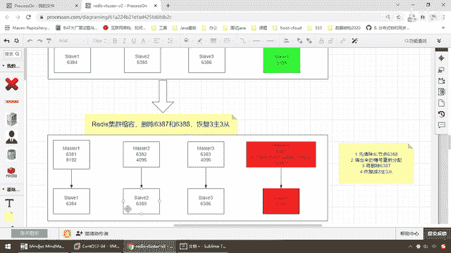

# 尚硅谷Docker实战教程（docker教程天花板） P54 - 54_主从缩容需求分析 - 尚硅谷 - BV1gr4y1U7CY

各位同学，大家好，我们继续，上一讲我们给大家说了一下主从扩容，那么现在我们已经获得了一个四主四从的相关案例，1、2、3、4，没错吧，1、2、3、4，OK了，那么就是4个master，4个slaver。

4主四从，搞定，那么通过我们的笔记，我们已经明白了，新增了从机6388，全部挂载成功，且槽位分配到位，OK，那么现在33变44，下面反向操作，我们现在的流量高峰上来了，三主三从扛不住，扩容到四主四从。

问题是这个流量拨风又下去了，那我们是不是有扩，叫有缩呀，对吧，那么所以说我们现在要演示的是缩容的案例，好，那么老规矩，先说需求分析，再说案例演示，那么来，这是扩，那么现在87作为第四台主机。

88作为第四台slaver，一主一从挂上去，那么对外黑框框，作为一个Docker容器化的Redis分布式缓存集群，搞定，那么下面我们觉得呢，没有那么大的流量了，不用这么高，还是恢复成三主三从。

那么现在我们叫什么，集群缩容，要删掉6387和6388，恢复成三主三从，可以扩，可以缩，那下面我们来分析一下，我们会要碰到的问题，第一个，扩的时候，槽位节点要重新洗牌，利益格局被打破。

大家都要分给我一点，那么我现在被删掉了，假设我要缩回去了，那么我的槽位是不是又要面临着一次重新分配，那么大家觉得这次分配的时候，应该怎么个分配法，是物归原主，原路返回，这是一种可不可以，第二种还是说。

哎呀，干脆集万千宠爱余一生都给某一台机器，这个可不可以，好，这是我们第一个问题，还的时候，归还的时候槽位节点又该如何分配，第二个问题，Master Sliver，你们觉得是先删6387还是先删6388。

那么大家思考一下，OK，好，我们先暂停一下录屏，那么弟兄们，我们来看一眼，这个最后就是我们的笔记，那么这不妨一个大案直接说明白一下，首先只能是先从从鸡山，因为Master他是负责写的。

写机器有可能会分配到我这的时候，你把它干掉了，不打好，我们最保险稳妥的方法，那么先删除6388，从鸡第四台，干掉，清出来的槽号再重新分配，我得还给前三个兄弟嘛，再删除6387，那么最后恢复成我们原有的。

缩回去，删除三层，好，那么同学们，我们来看一下这个案例。

应该怎么做，好，那么需求分析，咱们就先到这儿。